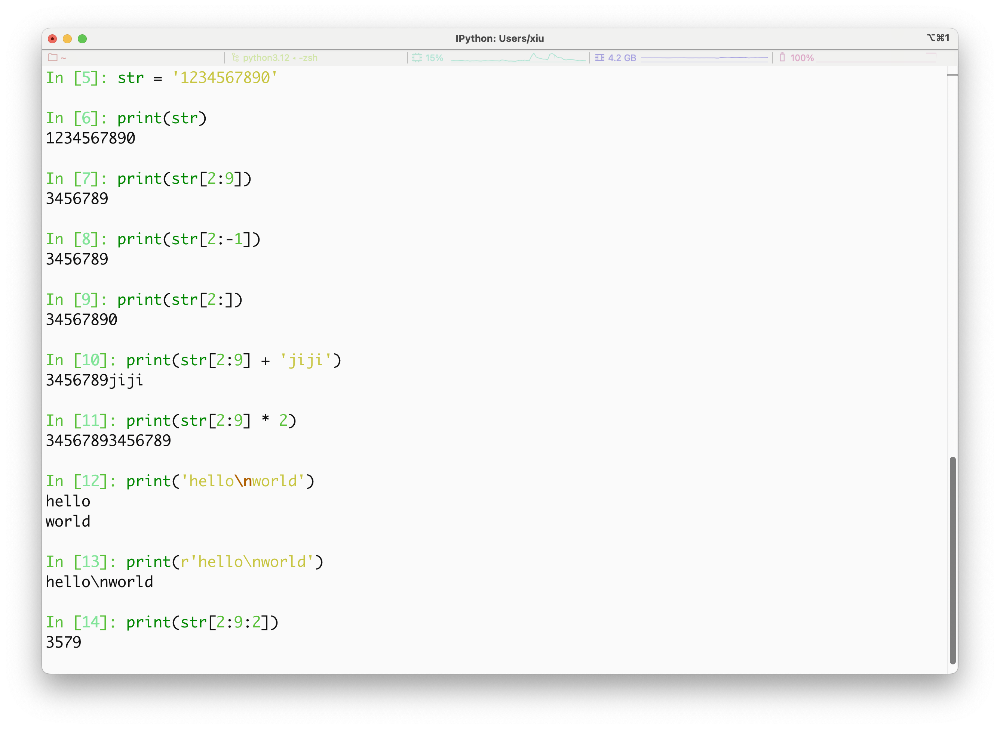

# Python 概述
## 环境
建议使用conda
## 数字(Number)类型
python中数字有四种类型：整数、布尔型、浮点数和复数。

- int (整数), 如 1, 只有一种整数类型 int，表示为长整型，没有 python2 中的 Long。
- bool (布尔), 如 True。
- float (浮点数), 如 1.23、3E-2
- complex (复数) - 复数由实部和虚部组成，形式为 a + bj，其中 a 是实部，b 是虚部，j 表示虚数单位。如 1 + 2j、 1.1 + 2.2j

## 字符串(String)
- Python 中单引号 ' 和双引号 " 使用完全相同。
- 使用三引号(''' 或 """)可以指定一个多行字符串。
转义符 \。
- 反斜杠可以用来转义，使用 r 可以让反斜杠不发生转义。 如 r"this is a line with \n" 则 \n 会显示，并不是换行。
- 按字面意义级联字符串，如 "this " "is " "string" 会被自动转换为 this is string。
- 字符串可以用 + 运算符连接在一起，用 * 运算符重复。
- Python 中的字符串有两种索引方式，从左往右以 0 开始，从右往左以 -1 开始。
- Python 中的字符串不能改变。
- Python 没有单独的字符类型，一个字符就是长度为 1 的字符串。
- 字符串切片 str[start:end]，其中 start（包含）是切片开始的索引，end（不包含）是切片结束的索引。
- 字符串的切片可以加上步长参数 step，语法格式如下：str[start:end:step]



## print 输出
print 默认输出是换行的，如果要实现不换行需要在变量末尾加上 end=""：
```python
#!/usr/bin/python3
 
x="a"
y="b"
# 换行输出
print( x )
print( y )
 
print('---------')
# 不换行输出
print( x, end=" " )
print( y, end=" " )
print()
```

```text
a
b
---------
a b
```

## import 与 from...import
在 python 用 import 或者 from...import 来导入相应的模块。

将整个模块(somemodule)导入，格式为： import somemodule

从某个模块中导入某个函数,格式为： from somemodule import somefunction

从某个模块中导入多个函数,格式为： from somemodule import firstfunc, secondfunc, thirdfunc

将某个模块中的全部函数导入，格式为： from somemodule import *

!!! note "导入 sys 模块"
    import sys
    print('================Python import mode==========================')
    print ('命令行参数为:')
    for i in sys.argv:
        print (i)
    print ('\n python 路径为',sys.path)

!!! note "导入 sys 模块的 argv,path 成员"
    from sys import argv,path  #  导入特定的成员
 
    print('================python from import===================================')
    print('path:',path) # 因为已经导入path成员，所以此处引用时不需要加sys.path

!!! Warning "import sys 和 from sys import * 的区别"
    `import sys` 和 `from sys import *` 之间的区别主要在于两者导入模块的方式和使用时的命名方式：

    1. **`import sys`**:  
  
    - 导入整个 `sys` 模块。 
    - 使用时必须带上模块的前缀 `sys`。例如：`sys.argv`。    
    - 适合在代码中避免命名冲突的情况，因为所有 `sys` 模块中的内容都要通过 `sys.` 来引用。   

    ```python
    import sys
    print(sys.argv)
    ```

    2. **`from sys import *`**:
     - 导入 `sys` 模块中的所有公有成员（不包括以 `_` 开头的私有成员），并将这些成员直接引入当前的命名空间。
     - 使用时不需要模块前缀，直接使用 `argv` 等成员。 例如：`argv`。
     - 可能导致命名冲突，尤其是当多个模块中有相同的成员名称时。

    ```python
    from sys import *
    print(argv)
    ```

    **总结**：  
    - `import sys` 更安全，避免命名冲突。   
    - `from sys import *` 更简便，但可能导致命名冲突，通常不推荐在大型项目或库中使用。