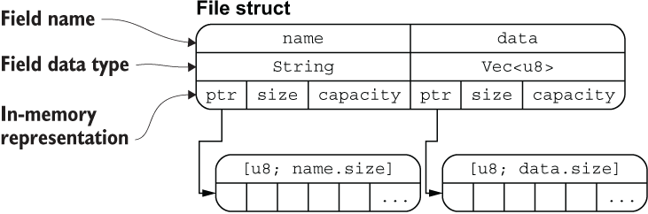
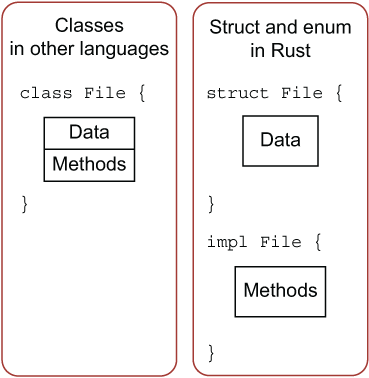

# 基础入门

## 2.1 变量绑定与解构

### 变量绑定

```rust
let a = "hello world";
```

这里就涉及 Rust 最核心的原则——所有权，简单来讲，任何内存对象都是有主人的，而且一般情况下完全属于它的主人，绑定就是把这个对象绑定给一个变量，让这个变量成为它的主人。


### 变量的可变性

Rust 语言中，变量可以是可变的也可以是不可变的。将本身无需改变的变量声明为不可变在运行期会避免一些多余的 runtime 检查，实现性能上的提升。

Rust 的变量在默认情况下是不可变的。前文提到，这是 Rust 团队为我们精心设计的语言特性之一，让我们编写的代码更安全，性能也更好。可以通过 mut 关键字让变量变为可变的，让设计更灵活。在 Rust 中，可变性很简单，只要在变量名前加一个 mut 即可。

```rust
fn main() {
    let x = 5;
    println!("x = {}", x);
    x = 6;                  // error!
    let mut y = 6;
    println!("y = {}", y);
    y = 7;
    println!("y = {}", y);
}
```

选择可变还是不可变，更多的还是取决于你的使用场景，例如不可变可以带来安全性，但是丧失了灵活性和性能（如果你要改变，就要重新创建一个新的变量，这里涉及到内存对象的再分配）。而可变变量最大的好处就是使用上的灵活性和性能上的提升。

例如，在使用大型数据结构或者热点代码路径（被大量频繁调用）的情形下，在同一内存位置更新实例可能比复制并返回新分配的实例要更快。使用较小的数据结构时，通常创建新的实例并以更具函数式的风格来编写程序，可能会更容易理解，所以值得以较低的性能开销来确保代码清晰。

### 用下划线开头忽略未使用的变量

```rust
let _x = 5;
```

这是告诉 Rust 这里的变量目前是不会使用的，让编译器不要警告。

也可以通过声明实现：

```rust
#[allow(unused_variables)]
fn main() {
    let x = 1; 
}
```

### 变量解构

let 表达式不仅仅用于变量的绑定，还能进行复杂变量的解构：从一个相对复杂的变量中，匹配出该变量的一部分内容。

```rust
fn main() {
    let (a, mut b): (bool,bool) = (true, false);
    // a = true,不可变; b = false，可变
    println!("a = {:?}, b = {:?}", a, b);

    b = true;
    assert_eq!(a, b);
}
```

#### 解构式赋值

```rust
struct Struct {
    e: i32
}

fn main() {
    let (a, b, c, d, e);

    (a, b) = (1, 2);
    [c, .., d, _] = [1, 2, 3, 4, 5];
    Struct { e, .. } = Struct { e: 5 };

    assert_eq!([1, 2, 1, 4, 5], [a, b, c, d, e]);
}
```

这段代码展示了 Rust 中 **解构赋值（destructuring assignment）** 的多种写法，包括：

* 元组解构
* 数组解构（带 `..`）
* 结构体解构（带 `..`）
* 占位符 `_` 的用法


1. 元组解构赋值

    ```rust
    (a, b) = (1, 2);
    ```

    这是元组解构：将 `(1, 2)` 赋值给 `a = 1`、`b = 2`。


2. 数组解构赋值（带 `..`）

    ```rust
    [c, .., d, _] = [1, 2, 3, 4, 5];
    ```

    这一句使用了数组模式匹配：

    * `[c, .., d, _]` 表示：

    * `c` 是第一个元素
    * `..` 忽略中间若干个元素
    * `d` 是倒数第二个
    * `_` 忽略最后一个（常用于忽略变量）

    对应赋值 `[1, 2, 3, 4, 5]`：


3. 结构体解构赋值（带 `..`）

    ```rust
    Struct { e, .. } = Struct { e: 5 };
    ```

    这是结构体解构的一种写法，表示：

    * 只取出字段 `e`，并赋值给变量 `e`；
    * `..` 表示**忽略其他字段**（尽管这里没别的字段，但 `..` 是必须的语法）。

    所以 `e = 5`


| 解构类型  | 写法                 | 含义                           |
| ----- | ------------------ | ---------------------------- |
| 元组解构  | `(a, b) = (1, 2)`  | 将元组元素分别赋值                    |
| 数组解构  | `[c, .., d, _]`    | 开头 `c`，结尾前一个 `d`，最后一个 `_` 忽略 |
| 结构体解构 | `Struct { e, .. }` | 提取字段 `e`，忽略其余字段              |
| `_`   | 占位符                | 忽略一个值不绑定变量                   |
| `..`  | 展开/忽略其余部分          | 适用于数组和结构体                    |


### 变量和常量之间的差异

- 常量不允许使用 mut。常量不仅仅默认不可变，而且自始至终不可变，因为常量在编译完成后，已经确定它的值。
- 常量使用 const 关键字而不是 let 关键字来声明，并且值的类型必须标注。

下面是一个常量声明的例子，其常量名为 MAX_POINTS，值设置为 100,000。（Rust 常量的命名约定是全部字母都使用大写，并使用下划线分隔单词，另外对数字字面量可插入下划线以提高可读性）：

```rust
const MAX_POINTS: u32 = 100_000;
```

常量可以在任意作用域内声明，包括全局作用域，在声明的作用域内，常量在程序运行的整个过程中都有效。对于需要在多处代码共享一个不可变的值时非常有用，例如游戏中允许玩家赚取的最大点数或光速。

!!! note
    在实际使用中，最好将程序中用到的硬编码值都声明为常量，对于代码后续的维护有莫大的帮助。如果将来需要更改硬编码的值，你也只需要在代码中更改一处即可。

### 变量遮蔽

Rust 允许声明相同的变量名，在后面声明的变量会遮蔽掉前面声明的。

```rust
fn main() {
    let x = 5;
    // 在main函数的作用域内对之前的x进行遮蔽
    let x = x + 1;

    {
        // 在当前的花括号作用域内，对之前的x进行遮蔽
        let x = x * 2;
        println!("The value of x in the inner scope is: {}", x);
    }

    println!("The value of x is: {}", x);
}
```

这和 mut 变量的使用是不同的，第二个 let 生成了完全不同的新变量，两个变量只是恰好拥有同样的名称，涉及一次**内存对象的再分配** ，而 mut 声明的变量，可以修改同一个内存地址上的值，并不会发生内存对象的再分配，性能要更好。

变量遮蔽的用处在于，如果你在某个作用域内无需再使用之前的变量（在被遮蔽后，无法再访问到之前的同名变量），就可以重复的使用变量名字，而不用绞尽脑汁去想更多的名字。

## 2.2 基本类型

Rust 每个值都有其确切的数据类型，总的来说可以分为两类：**基本类型**和**复合类型**。 基本类型意味着它们往往是一个最小化原子类型，无法解构为其它类型（一般意义上来说），由以下组成：

- 数值类型：有符号整数 (i8, i16, i32, i64, isize)、 无符号整数 (u8, u16, u32, u64, usize) 、浮点数 (f32, f64)、以及有理数、复数
- 字符串：字符串字面量和字符串切片 &str
- 布尔类型：true 和 false
- 字符类型：表示单个 Unicode 字符，存储为 4 个字节
- 单元类型：即 () ，其唯一的值也是 ()

#### 类型推导及标注

Rust 是一门静态类型语言，也就是编译器必须在编译期知道我们所有变量的类型，但这不意味着你需要为每个变量指定类型，因为 Rust 编译器很聪明，它可以**根据变量的值和上下文中的使用方式来自动推导出变量的类型**，同时编译器也不够聪明，在某些情况下，它无法推导出变量类型，需要手动去给予一个类型标注。

```rust
#![allow(unused)]
fn main() {
let guess = "42".parse().expect("Not a number!");
}
```

.parse() 是一个泛型方法，它的行为取决于你期望它解析成什么类型。虽然 "42" 是字符串（&str 类型），但 Rust 标准库中有许多类型（比如 i32、f64 等）都为 .parse() 提供了实现 —— 只要你告诉它“我要解析成什么”。

这段代码的目的是将字符串 "42" 进行解析，而编译器在这里无法推导出我们想要的类型：整数？浮点数？字符串？因此编译器会报错。

```rust
#![allow(unused)]
fn main() {
let guess: i32 = "42".parse().expect("Not a number!");
}
```

### 2.2.1 数值类型

#### 整数类型

| 长度         | 有符号类型 | 无符号类型 |
|--------------|------------|------------|
| 8 位         | `i8`       | `u8`       |
| 16 位        | `i16`      | `u16`      |
| 32 位        | `i32`      | `u32`      |
| 64 位        | `i64`      | `u64`      |
| 128 位       | `i128`     | `u128`     |
| 视架构而定    | `isize`    | `usize`    |


isize 和 usize 类型取决于程序运行的计算机 CPU 类型： 若 CPU 是 32 位的，则这两个类型是 32 位的，同理，若 CPU 是 64 位，那么它们则是 64 位。

整型字面量可以用下表的形式书写：

| 数字字面量	| 示例        |
|--------------|------------|
| 十进制         | 98_222       |
| 十六进制        | 0xff     |
| 八进制       | 0o77     |
| 二进制        | 0b1111_0000     |
| 字节 (仅限于 u8)  | b'A'     |


**整型溢出**

假设有一个 u8 ，它可以存放从 0 到 255 的值。那么当你将其修改为范围之外的值，比如 256，则会发生整型溢出。关于这一行为 Rust 有一些有趣的规则：当在 debug 模式编译时，Rust 会检查整型溢出，若存在这些问题，则使程序在编译时 panic(崩溃,Rust 使用这个术语来表明程序因错误而退出)。

在当使用 --release 参数进行 release 模式构建时，Rust 不检测溢出。相反，当检测到整型溢出时，Rust 会按照补码循环溢出（two’s complement wrapping）的规则处理。简而言之，大于该类型最大值的数值会被补码转换成该类型能够支持的对应数字的最小值。比如在 u8 的情况下，256 变成 0，257 变成 1，依此类推。程序不会 panic，但是该变量的值可能不是你期望的值。依赖这种默认行为的代码都应该被认为是错误的代码。
    
**注意，这里只适用于运行时溢出（runtime overflow），不适用于字面值溢出（literal overflow）！**
```rust
let a: u8 = 256; // 错误：256 是超出 u8 范围的字面值
```

**这是编译期字面量溢出，Rust 在编译阶段就能确定这个错误，因此它不管你是 debug 模式还是 release 模式，都会直接拒绝编译。**
```rust
    fn get_val() -> u8 {
        255
    }

    fn main() {
        let a = get_val();
        let b = a + 1;  // debug 模式下 panic，release 模式下 wrap
        println!("{}", b);
    }
```

要显式处理可能的溢出，可以使用标准库针对原始数字类型提供的这些方法：

- 使用 wrapping_* 方法在所有模式下都按照补码循环溢出规则处理，例如 wrapping_add
- 如果使用 checked_* 方法时发生溢出，则返回 None 值
- 使用 overflowing_* 方法返回该值和一个指示是否存在溢出的布尔值
- 使用 saturating_* 方法，可以限定计算后的结果不超过目标类型的最大值或低于最小值，例如:
    ```rust
        assert_eq!(100u8.saturating_add(1), 101);
        assert_eq!(u8::MAX.saturating_add(127), u8::MAX);
    ```

下面是一个演示wrapping_*方法的示例：


```rust
    fn main() {
        let a : u8 = 255;
        let b = a.wrapping_add(20);
        println!("{}", b);  // 19
    }
```

#### 浮点类型

Rust 中浮点类型数字也有两种基本类型： f32 和 f64，分别为 32 位和 64 位大小。默认浮点类型是 f64，在现代的 CPU 中它的速度与 f32 几乎相同，但精度更高。

浮点数根据 [IEEE-754 标准](https://note.xiu-zju.me/courses/jz/3/3/#35-floating-point-numbers)实现。f32 类型是单精度浮点型，f64 为双精度。


**浮点数陷阱**

浮点数由于底层格式的特殊性，导致了如果在使用浮点数时不够谨慎，就可能造成危险，有两个原因：

- **浮点数往往是你想要数字的近似表达** 浮点数类型是基于二进制实现的，但是我们想要计算的数字往往是基于十进制，例如 0.1 在二进制上并不存在精确的表达形式，但是在十进制上就存在。这种不匹配性导致一定的歧义性，更多的，虽然浮点数能代表真实的数值，但是由于底层格式问题，它往往受限于定长的浮点数精度，如果你想要表达完全精准的真实数字，只有使用无限精度的浮点数才行

- **浮点数在某些特性上是反直觉的** 例如大家都会觉得浮点数可以进行比较，对吧？是的，它们确实可以使用 >，>= 等进行比较，但是在某些场景下，这种直觉上的比较特性反而会害了你。因为 f32 ， f64 上的比较运算实现的是 std::cmp::PartialEq 特征(类似其他语言的接口)，但是并没有实现 std::cmp::Eq 特征，但是后者在其它数值类型上都有定义，说了这么多，可能大家还是云里雾里，用一个例子来举例：

!!! example "例子"
    Rust 的 HashMap 数据结构，是一个 KV 类型的 Hash Map 实现，它对于 K 没有特定类型的限制，但是要求能用作 K 的类型必须实现了 std::cmp::Eq 特征，因此这意味着你无法使用浮点数作为 HashMap 的 Key，来存储键值对，但是作为对比，Rust 的整数类型、字符串类型、布尔类型都实现了该特征，因此可以作为 HashMap 的 Key。

为了避免上面说的两个陷阱，你需要遵守以下准则：

- 避免在浮点数上测试相等性
- 当结果在数学上可能存在未定义时，需要格外的小心


#### NaN

对于数学上未定义的结果，例如对负数取平方根 -42.1.sqrt() ，会产生一个特殊的结果：Rust 的浮点数类型使用 NaN (not a number) 来处理这些情况。

所有跟 NaN 交互的操作，都会返回一个 NaN，而且 NaN 不能用来比较。出于防御性编程的考虑，可以使用 is_nan() 等方法，可以用来判断一个数值是否是 NaN 。

> 有点像数据库的空值？

#### 数字运算

符合直觉。

#### 位运算

符合直觉。

对于移位运算，Rust 会检查它是否超出该整型的位数范围，如果超出，则会报错 overflow。比如，一个 8 位的整型，如果试图移位 8 位，就会报错，但如果移位 7 位就不会。Rust 这样做的理由也很简单，如果移位太多，那么这个移位后的数字就是全 0 或者全 1，所以移位操作不如直接写 0 或者 -1，这很可能意味着这里的代码是有问题的。需要注意的是，不论 debug 模式还是 release 模式，Rust 都会检查溢出。

```rust
fn main() {
   let a: u8 = 255;
   let b = a>>7; // ok
   let b = a<<7; // ok
   let b = a>>8; // overflow
   let b = a<<8; // overflow
}
```

#### 序列（range）
Rust 提供了一个非常简洁的方式，用来生成连续的数值，例如 1..5，生成从 1 到 4 的连续数字，不包含 5 ；1..=5，生成从 1 到 5 的连续数字，包含 5，它的用途很简单，常常用于循环中：

```rust
for i in 1..=5 {
    println!("{}",i);
}
```

序列只允许用于数字或字符类型，原因是：它们可以连续，同时编译器在编译期可以检查该序列是否为空，字符和数字值是 Rust 中仅有的可以用于判断是否为空的类型。如下是一个使用字符类型序列的例子：

```rust
for i in 'a'..='z' {
    println!("{}",i);
}
```


```rust
use std::ops::{Range, RangeInclusive};
fn main() {
    assert_eq!((1..5), Range{ start: 1, end: 5 });
    assert_eq!((1..=5), RangeInclusive::new(1, 5));
}
```

#### 使用 As 完成类型转换
Rust 中可以使用 As 来完成一个类型到另一个类型的转换，其最常用于将原始类型转换为其他原始类型，但是它也可以完成诸如将指针转换为地址、地址转换为指针以及将指针转换为其他指针等功能。

#### 有理数和复数

Rust 的标准库相比其它语言，准入门槛较高，因此有理数和复数并未包含在标准库中：

- 有理数和复数
- 任意大小的整数和任意精度的浮点数
- 固定精度的十进制小数，常用于货币相关的场景

按照以下步骤来引入 `num` 库：

1. 创建新工程 `cargo new complex-num && cd complex-num`
2. 在 `Cargo.toml` 中的 `[dependencies]` 下添加一行 `num = "0.4.0"`
3. 将 `src/main.rs` 文件中的 `main` 函数替换为下面的代码
4. 运行 `cargo run`

```rust
use num::complex::Complex;

 fn main() {
   let a = Complex { re: 2.1, im: -1.2 };
   let b = Complex::new(11.1, 22.2);
   let result = a + b;

   println!("{} + {}i", result.re, result.im)
 }
```

#### 总结

之前提到了过 Rust 的数值类型和运算跟其他语言较为相似，但是实际上，除了语法上的不同之外，还是存在一些差异点：

- **Rust 拥有相当多的数值类型**. 因此你需要熟悉这些类型所占用的字节数，这样就知道该类型允许的大小范围以及你选择的类型是否能表达负数
- **类型转换必须是显式的**. Rust 永远也不会偷偷把你的 16bit 整数转换成 32bit 整数
- **Rust 的数值上可以使用方法**. 例如你可以用以下方法来将 `13.14` 取整：`13.14_f32.round()`，在这里我们使用了类型后缀，因为编译器需要知道 `13.14` 的具体类型

### 2.2.2 字符、布尔、单元类型

#### 字符类型

**所有的 Unicode 值**都可以作为 Rust 字符，包括单个的中文、日文、韩文、emoji 表情符号等等，都是合法的字符类型。Unicode 值的范围从 U+0000 ~ U+D7FF 和 U+E000 ~ U+10FFFF。由于 Unicode 都是 4 个字节编码，因此字符类型也是占用 4 个字节。Rust 的字符只能用 '' 来表示， "" 是留给字符串的。

#### 布尔类型

true 和 false。布尔值占用内存的大小为 1 个字节。

#### 单元类型

() 是 Rust 中“无返回值”的标志，它本身是一个合法的类型，叫“单元类型”，并且它只有一个值，那就是 () 本身。

Rust 是强类型语言，一切都有类型。就算你什么都不返回，编译器也要给它一个“类型”来标注：这时候用的就是 () 类型。

可以把它看作 Rust 中的“空值的显式表达”，不像 C/C++ 里直接忽略返回值，也不像 Java 用 void。

!!! note "应用"
    可以用 () 作为 map 的值，表示我们不关注具体的值，只关注 key。可以作为一个值用来占位，但是完全不占用任何内存。


### 2.2.3 语句与表达式

Rust 的函数体是由一系列语句组成，最后由一个表达式来返回值，例如：

```rust
fn add_with_extra(x: i32, y: i32) -> i32 {
    let x = x + 1; // 语句
    let y = y + 5; // 语句
    x + y // 表达式
}
```

语句会执行一些操作但是不会返回一个值，而表达式会在求值后返回一个值，因此在上述函数体的三行代码中，前两行是语句，最后一行是表达式。

#### 语句

语句完成了具体的操作，但是并没有返回值。例如 let 语句。

#### 表达式

表达式会进行求值，然后返回一个值。例如 5 + 6，在求值后，返回值 11，因此它就是一条表达式。

表达式可以成为语句的一部分，例如 let y = 6 中，6 就是一个表达式，它在求值后返回一个值 6（有些反直觉，但是确实是表达式）。

调用一个函数是表达式，因为会返回一个值，调用宏也是表达式，用花括号包裹最终返回一个值的语句块也是表达式，总之，能返回值，它就是表达式。

```rust
fn main() {
    let y = {
        let x = 3;
        x + 1
    };
    println!("The value of y is {}.", y);
}
```

表达式不能包含分号。这一点非常重要，一旦你在表达式后加上分号，它就会变成一条语句，再也不会返回一个值!

最后，表达式如果不返回任何值，会隐式地返回一个 () 。

### 2.2.4 函数


- 函数名和变量名使用蛇形命名法(snake case)，例如 fn add_two() {}
- 函数的位置可以随便放，Rust 不关心我们在哪里定义了函数，只要有定义即可
- 每个函数参数都需要标注类型

#### 永不返回的发散函数

当用 ! 作函数返回类型的时候，表示该函数永不返回( diverging functions )，特别的，这种语法往往用做会导致程序崩溃的函数。

- 这个函数永远不会返回正常的值
- 也就是说，它**要么 panic，要么无限循环，要么退出程序**

```rust
fn dead_end() -> ! {
    panic!("穷途末路！");
}
```

```rust
fn forever() -> ! {
    loop {
        println!("我永远在这！");
    }
}
```

!!! warning "关于 return"
    ```rust
    fn plus_or_minus(x: i32) -> i32 {
        if x > 5 {
            x - 5 //  这个是一个表达式，但 `if` 没有 else 分支
        }
        x + 5
    }
    ```
    这里编译器会报错，这是因为 if 是表达式而不是语句，需要有返回值。这里 if 没有写 else 分支，Rust 需要知道这个 if 的整体值是什么，但如果条件不成立，它该返回什么？没写 else，它就默认返回 ()（unit）。所以实际上代码会变成：
    ```rust
    let tmp = if x > 5 {
        x - 5   // i32
    } else {
        ()      // unit
    };
    ```
    就报错了：i32 和 () 不匹配。所以我们需要 return 来提前返回。


## 2.3 所有权与借用

### 2.3.1 所有权

Rust 通过所有权来管理内存，编译器在编译时会根据一系列规则进行检查。对于程序运行期，不会有任何性能上的损失。

#### 栈(Stack)与堆(Heap)

栈和堆的核心目标就是为程序在运行时提供可供使用的内存空间。

**栈**

后进先出。栈中的所有数据都必须占用已知且固定大小的内存空间，假设数据大小是未知的，那么在取出数据时，你将无法取到你想要的数据。

**堆**

与栈不同，对于大小未知或者可能变化的数据，我们需要将它存储在堆上。当向堆上放入数据时，需要请求一定大小的内存空间。操作系统在堆的某处找到一块足够大的空位，把它标记为已使用，并返回一个表示该位置地址的指针，该过程被称为在堆上分配内存，有时简称为 “分配”(allocating)。接着，该指针会被推入栈中，因为指针的大小是已知且固定的，在后续使用过程中，你将通过栈中的指针，来获取数据在堆上的实际内存位置，进而访问该数据。由上可知，堆是一种缺乏组织的数据结构。

**性能比较**

在栈上分配内存比在堆上分配内存要快，因为入栈时操作系统无需进行函数调用（或更慢的系统调用）来分配新的空间，只需要将新数据放入栈顶即可。相比之下，在堆上分配内存则需要更多的工作，这是因为操作系统必须首先找到一块足够存放数据的内存空间，接着做一些记录为下一次分配做准备，如果当前进程分配的内存页不足时，还需要进行系统调用来申请更多内存。 

**所有权与堆栈**

当你的代码调用一个函数时，传递给函数的参数（包括可能指向堆上数据的指针和函数的局部变量）依次被压入栈中，当函数调用结束时，这些值将被从栈中按照相反的顺序依次移除。

因为堆上的数据缺乏组织，因此跟踪这些数据何时分配和释放是非常重要的，否则堆上的数据将产生内存泄漏 —— 这些数据将永远无法被回收。这就是 Rust 所有权系统为我们提供的强大保障。

#### 所有权原则

- Rust 中每一个值都被一个变量所拥有，该变量被称为值的所有者
- 一个值同时只能被一个变量所拥有，或者说一个值只能拥有一个所有者
- 当所有者（变量）离开作用域范围时，这个值将被丢弃(drop)

#### 变量绑定背后的数据交互

**转移所有权**

先来看一段代码：

```rust
let x = 5;
let y = x;
```

这段代码**并没有发生所有权的转移**，原因很简单： 代码首先将 5 绑定到变量 x，接着拷贝 x 的值赋给 y，最终 x 和 y 都等于 5，因为整数是 Rust 基本数据类型，是固定大小的简单值，因此这两个值都是通过自动拷贝的方式来赋值的，都被存在栈中，完全无需在堆上分配内存。

整个过程中的赋值都是通过值拷贝的方式完成（发生在栈中），因此并不需要所有权转移。

!!! warning "疑问"
    可能有同学会有疑问：这种拷贝不消耗性能吗？实际上，这种栈上的数据足够简单，而且拷贝非常非常快，只需要复制一个整数大小（i32，4 个字节）的内存即可，因此在这种情况下，拷贝的速度远比在堆上创建内存来得快的多。实际上，上一章我们讲到的 Rust 基本类型都是通过自动拷贝的方式来赋值的，就像上面代码一样。

但是当涉及到非基本类型（不是储存在栈上）的时候，这里就不能自动拷贝，例如存放在堆上的 String。

实际上， String 类型是一个复杂类型，由存储在栈中的**堆指针**、**字符串长度**、**字符串容量**共同组成，其中堆指针是最重要的，它指向了真实存储字符串内容的堆内存。容量是堆内存分配空间的大小，长度是目前已经使用的大小。

```rust
let s1 = String::from("hello");
let s2 = s1;
```

Rust 这样解决问题：当 s1 被赋予 s2 后，Rust 认为 s1 **不再有效**，因此也无需在 s1 离开作用域后 drop 任何东西，这就是把所有权从 s1 转移给了 s2，**s1 在被赋予 s2 后就马上失效了**。

**clone 深拷贝**

Rust 永远也不会自动创建数据的 “深拷贝”。因此，任何自动的复制都不是深拷贝，可以被认为对运行时性能影响较小。

如果我们确实需要深度复制 String 中堆上的数据，而不仅仅是栈上的数据，可以使用一个叫做 clone 的方法。

```rust
let s1 = String::from("hello");
let s2 = s1.clone();

println!("s1 = {}, s2 = {}", s1, s2);
```

如果代码性能无关紧要，例如初始化程序时或者在某段时间只会执行寥寥数次时，你可以使用 clone 来简化编程。但是对于执行较为频繁的代码（热点路径），使用 clone 会极大的降低程序性能，需要小心使用！

!!! note "热点路径"
    热点路径 = 程序运行中频繁执行的核心代码段，影响整体性能的“热点”。
    在这些地方，clone 代价大、应谨慎使用；非热点路径中可以放心使用 clone 来提升代码可读性和开发效率。

**copy 浅拷贝**

浅拷贝只发生在栈上，因此性能很高，在日常编程中，浅拷贝无处不在。

像整型这样的基本类型在编译时是已知大小的，会被存储在**栈**上，所以拷贝其实际的值是快速的。这意味着没有理由在创建变量 y 后使 x 无效（x、y 都仍然有效）。换句话说，这里没有深浅拷贝的区别，因此这里调用 clone 并不会与通常的浅拷贝有什么不同，我们可以不用管它（可以理解成在栈上做了深拷贝）。

这里可以给出一个通用的规则：**任何基本类型的组合**可以 Copy ，**不需要分配内存或某种形式资源的类型**是可以 Copy 的。如下是一些 Copy 的类型：

- 所有整数类型，比如 u32
- 布尔类型，bool，它的值是 true 和 false
- 所有浮点数类型，比如 f64
- 字符类型，char
- 元组，当且仅当其包含的类型也都是 Copy 的时候。比如，(i32, i32) 是 Copy 的，但 (i32, String) 就不是
- 不可变引用 &T 。但是注意：**可变引用** &mut T 是不可以 Copy的

#### 函数的传值与返回

```rust
fn main() {
    let s = String::from("hello");  // s 进入作用域

    takes_ownership(s);             // s 的值移动到函数里 ...
                                    // ... 所以到这里不再有效
    println!("{}", s);              // error!

    let x = 5;                      // x 进入作用域

    makes_copy(x);                  // x 应该移动函数里，
                                    // 但 i32 是 Copy 的，所以在后面可继续使用 x

} // 这里, x 先移出了作用域，然后是 s。但因为 s 的值已被移走，
  // 所以不会有特殊操作

fn takes_ownership(some_string: String) { // some_string 进入作用域
    println!("{}", some_string);
} // 这里，some_string 移出作用域并调用 `drop` 方法。占用的内存被释放

fn makes_copy(some_integer: i32) { // some_integer 进入作用域
    println!("{}", some_integer);
} // 这里，some_integer 移出作用域。不会有特殊操作
```

所有权很强大，避免了内存的不安全性，但是也带来了一个新麻烦：**总是把一个值传来传去来使用它**。传入一个函数，很可能还要从该函数传出去，结果就是语言表达变得非常啰嗦，幸运的是，Rust 提供了新功能解决这个问题。

### 2.3.2 引用与借用

#### 引用与解引用

常规引用是一个指针类型，指向了对象存储的内存地址。

```rust
fn main() {
    let x = 5;
    let y = &x;
    assert_eq!(x, 5);
    assert_eq!(*y, 5);
}
```

#### 不可变引用

& 符号即是引用，它们允许你使用值，但是不获取所有权。


正如变量默认不可变一样，引用指向的值默认也是不可变的，没事，来一起看看如何解决这个问题。

#### 可变引用

```rust
fn main() {
    let mut s = String::from("Hello, world!");
    change_string(&mut s);
    println!("{}", s);
}

fn change_string(s: &mut String) {
    s.push_str(" from Rust!");
}
```

!!! info
    这是可以直接调用 some_string.push_str(...) 的原因是：Rust 在方法调用中会自动解引用（类似 C++ 的 -> 语法糖）。所以 some_string.push_str(...) 实际上等价于 (*some_string).push_str(...)。这种自动解引用叫做**自动引用与解引用**（Deref coercion）。

**1. 同一作用域，特定数据只能有一个可变引用！**

这种限制的好处就是使 Rust 在编译期就避免数据竞争，数据竞争可由以下行为造成：

- 两个或更多的指针同时访问同一数据
- 至少有一个指针被用来写入数据
- 没有同步数据访问的机制

**2. 可变引用与不可变引用不能同时存在！**

多个不可变借用被允许是因为没有人会去试图修改数据，每个人都只读这一份数据而不做修改，因此不用担心数据被污染。

!!! quote "用一个很形象的例子来说明这两个原则"
    

!!! bug "错误代码赏析"
    ```rust
    #[allow(unused_variables)]
    fn main() {
        let s: &str = "Hello, World!"; // ① s 是 *不可变* 的字符串切片
        let r = &s;                    // ② r 是对 s 的 *不可变借用*
        let r1 = &mut s;               // ③ 试图对同一个 s 进行 *可变借用*
        r1.push_str(" This is a mutable reference."); // ④ push_str 并不适用于 &str
    }
    ```

    | # | 问题                                       | 出错原因                                  |
    | - | ---------------------------------------- | ------------------------------------- |
    | 1 | `s` 本身没有用 `mut` 声明                       | 不能把一个 **不可变绑定** 再拿去做 `&mut` 借用。       |
    | 2 | 已经有 `r = &s` 的 **不可变借用**                 | 按借用规则：同一时刻要么若干个不可变借用，要么一个可变借用，二者不能并存。 |
    | 3 | `&mut s` 的类型其实是 `&mut &str`              | 只是把“指针变量”本身设为可变，**并不能** 修改字符串内容。      |
    | 4 | `push_str` 只在 `String`/`&mut String` 上可用 | `&str`（字符串切片）是只读视图，没有 `push_str` 方法。  |

**NLL**

```rust
fn main() {
   let mut s = String::from("hello");

    let r1 = &s;
    let r2 = &s;
    println!("{} and {}", r1, r2);
    // 新编译器中，r1,r2作用域在这里结束

    let r3 = &mut s;
    println!("{}", r3);
} // 老编译器中，r1、r2、r3作用域在这里结束
  // 新编译器中，r3作用域在这里结束
```

对于这种编译器优化行为，Rust 专门起了一个名字 —— Non-Lexical Lifetimes(NLL)，专门用于找到某个引用在作用域(})结束前就不再被使用的代码位置。

虽然这种借用错误有的时候会让我们很郁闷，但是你只要想想这是 Rust 提前帮你发现了潜在的 BUG，其实就开心了，虽然减慢了开发速度，但是从长期来看，大幅减少了后续开发和运维成本。

#### 垂悬引用

悬垂引用也叫做悬垂指针，意思为指针指向某个值后，这个值被释放掉了，而指针仍然存在，其指向的内存可能不存在任何值或已被其它变量重新使用。在 Rust 中编译器可以确保引用永远也不会变成悬垂状态：当你获取数据的引用后，编译器可以确保数据不会在引用结束前被释放，要想释放数据，必须先停止其引用的使用。

## 2.4 复合类型

### 2.4.1 字符串与切片

尤其要区分 String 和 &str ！

#### 切片

对于字符串而言，切片就是对 String 类型中某一部分的引用。
（这里我们说的切片指的是切片的引用）

```rust
let s = String::("hello, world!");
let hello = &s[0..5];
let world = &s[6..11];
```

创造切片：左闭右开区间。


!!! warning "注意"
    在对字符串使用切片语法时需要格外小心，切片的索引必须落在字符之间的边界位置，也就是 UTF-8 字符的边界，例如中文在 UTF-8 中占用三个字节，下面的代码就会崩溃：

    ```rust
    fn main() {
        let s = "中国人";
        let a = &s[0..2];
        println!("{}",a);
    }   
    ```

    因为我们只取 s 字符串的前两个字节，但是本例中每个汉字占用三个字节，因此没有落在边界处，也就是连 **中** 字都取不完整，此时程序会直接崩溃退出，如果改成 &s[0..3]，则可以正常通过编译。 


在 Rust 中，直接使用切片类型（如 [i32] 或 str）会导致编译错误，这是因为切片是 ​​动态大小类型（DST, Dynamically Sized Types）​​，而 Rust 的编译期内存安全规则要求所有类型必须有已知的固定大小。

切片本质​​：切片是对连续内存数据的视图（如数组的一部分或字符串的一部分），其长度在编译时未知。

- [i32]：表示一个长度不确定的 i32 序列。
- str：表示一个长度不确定的 UTF-8 字节序列。

​​问题​​：Rust 需要在编译期知道类型的大小（例如栈分配、结构体布局等），但切片的长度是运行时确定的，无法静态推断。

切片的引用（如 &[i32]）是一个 ​​胖指针（fat pointer），包含：

- ​指针​​：指向切片数据的起始地址。
- ​长度​​：切片的元素数量（运行时已知）。

这样，&[i32] 的大小是固定的（通常为 2 个 usize，即指针 + 长度），编译器可以处理它。切片的第一个字是指向数据的指针，第二个字是切片的长度。字的大小取决于处理器架构，例如在 x86-64 上，字的大小是 64 位也就是 8 个字节，那么一个切片引用就是 16 个字节大小。

#### 字符串

字符串是由字符组成的连续集合。但是我们提到过，Rust 中的字符是 Unicode 类型，因此每个字符占据 4 个字节内存空间，但是在字符串中不一样，字符串是 UTF-8 编码，也就是字符串中的字符所占的字节数是变化的(1 - 4)，这样有助于大幅降低字符串所占用的内存空间。

str 类型是硬编码进可执行文件，也无法被修改，但是 String 则是一个可增长、可改变且具有所有权的 UTF-8 编码字符串，当 Rust 用户提到字符串时，往往指的就是 String 类型和 &str 字符串切片类型，这两个类型都是** UTF-8 编码**。

#### String 与 &str 的转换
在之前的代码中，已经见到好几种从 &str 类型生成 String 类型的操作：
```rust
String::from("hello,world")
"hello,world".to_string()
```

那么如何将 String 类型转为 &str 类型呢？答案很简单，取引用即可：

```rust
fn main() {
    let s = String::from("hello,world!");
    say_hello(&s);
    say_hello(&s[..]);
    say_hello(s.as_str());
}

fn say_hello(s: &str) {
    println!("{}",s);
}
```

#### 字符串索引

Rust 中不可以通过索引的方式访问子串。

字符串的底层的数据存储格式实际上是[ u8 ]，一个字节数组。

```rust
let hello = String::from("中国人");
```

如果问你该字符串多长，你可能会说 3，但是实际上是 9 个字节的长度，因为大部分常用汉字在 UTF-8 中的长度是 3 个字节，因此这种情况下对 hello 进行索引，访问 &hello[0] 没有任何意义，因为你取不到 中 这个字符，而是取到了这个字符三个字节中的第一个字节，这是一个非常奇怪而且难以理解的返回值。

还有一个原因导致了 Rust 不允许去索引字符串：因为索引操作，我们总是期望它的性能表现是 O(1)，然而对于 String 类型来说，无法保证这一点，因为 Rust 可能需要从 0 开始去遍历字符串来定位合法的字符。

#### 操作字符串

**追加**

```rust
fn main() {
    let mut s = String::from("Hello ");

    s.push_str("rust");
    println!("追加字符串 push_str() -> {}", s);

    s.push('!');
    println!("追加字符 push() -> {}", s);
}
```

```plaintext
追加字符串 push_str() -> Hello rust
追加字符 push() -> Hello rust!
```

**插入**

需要传入两个参数，第一个参数是字符（串）插入位置的索引，第二个参数是要插入的字符（串），索引从 0 开始计数，如果越界则会发生错误。

```rust
fn main() {
    let mut s = String::from("Hello rust!");
    s.insert(5, ',');
    println!("插入字符 insert() -> {}", s);
    s.insert_str(6, " I like");
    println!("插入字符串 insert_str() -> {}", s);
}
```

```plaintext
插入字符 insert() -> Hello, rust!
插入字符串 insert_str() -> Hello, I like rust!
```

**替换**

1. replace

该方法可适用于 String 和 &str 类型。replace() 方法接收两个参数，第一个参数是要被替换的字符串，第二个参数是新的字符串。该方法会替换所有匹配到的字符串。**该方法是返回一个新的字符串，而不是操作原来的字符串。**

```rust
fn main() {
    let string_replace = String::from("I like rust. Learning rust is my favorite!");
    let new_string_replace = string_replace.replace("rust", "RUST");
    dbg!(new_string_replace);
}
```

2. replacen

该方法可适用于 String 和 &str 类型。replacen() 方法接收三个参数，前两个参数与 replace() 方法一样，第三个参数则表示替换的个数。**该方法是返回一个新的字符串，而不是操作原来的字符串。**

```rust
fn main() {
    let string_replace = "I like rust. Learning rust is my favorite!";
    let new_string_replacen = string_replace.replacen("rust", "RUST", 1);
    dbg!(new_string_replacen);
}
```

3. replace_range

该方法仅适用于 String 类型。replace_range 接收两个参数，第一个参数是要替换字符串的范围（Range），第二个参数是新的字符串。**该方法是直接操作原来的字符串，不会返回新的字符串。**该方法需要使用 mut 关键字修饰。

```rust
fn main() {
    let mut string_replace_range = String::from("I like rust!");
    string_replace_range.replace_range(7..8, "R");
    dbg!(string_replace_range);
}
```

**删除**

与字符串删除相关的方法有 4 个，它们分别是 pop()，remove()，truncate()，clear()。这四个方法**仅适用于 String 类型**。

1. pop —— 删除并返回字符串的最后一个字符

该方法是**直接操作原来的字符串。但是存在返回值，其返回值是一个 Option 类型**，如果字符串为空，则返回 None。

```rust
fn main() {
    let mut string_pop = String::from("rust pop 中文!");
    let p1 = string_pop.pop();
    let p2 = string_pop.pop();
    dbg!(p1);
    dbg!(p2);
    dbg!(string_pop);
}
```

代码运行结果：

```plaintext
p1 = Some(
   '!',
)
p2 = Some(
   '文',
)
string_pop = "rust pop 中"
```

2. remove —— 删除并返回字符串中指定位置的字符

该方法是**直接操作原来的字符串。但是存在返回值，其返回值是删除位置的字符串**，只接收一个参数，表示该字符起始索引位置。remove() 方法是按照**字节**来处理字符串的，如果参数所给的位置不是合法的字符边界，则会发生错误。

示例代码如下：

```rust
fn main() {
    let mut string_remove = String::from("测试remove方法");
    println!(
        "string_remove 占 {} 个字节",
        std::mem::size_of_val(string_remove.as_str())
    );
    // 删除第一个汉字
    string_remove.remove(0);
    // 下面代码会发生错误
    // string_remove.remove(1);
    // 直接删除第二个汉字
    // string_remove.remove(3);
    dbg!(string_remove);
}
```


代码运行结果：

```plaintext
string_remove 占 18 个字节
string_remove = "试remove方法"
```

3. truncate —— 删除字符串中从指定位置开始到结尾的全部字符

该方法是**直接操作原来的字符串。无返回值。**该方法 truncate() 方法是按照字节来处理字符串的，如果参数所给的位置不是合法的字符边界，则会发生错误。

示例代码如下：

```rust
fn main() {
    let mut string_truncate = String::from("测试truncate");
    string_truncate.truncate(3);
    dbg!(string_truncate);
}
```

代码运行结果：

```plaintext
string_truncate = "测"
```

4. clear —— 清空字符串

该方法是**直接操作原来的字符串**。调用后，删除字符串中的所有字符，相当于 truncate() 方法参数为 0 的时候。

示例代码如下：

```rust
fn main() {
    let mut string_clear = String::from("string clear");
    string_clear.clear();
    dbg!(string_clear);
}
```
代码运行结果：

```plaintext
string_clear = ""
```

**连接**

1. 使用 + 或者 += 连接字符串

使用 + 或者 += 连接字符串，要求右边的参数必须为字符串的**切片引用（Slice）类型**。其实当调用 + 的操作符时，相当于调用了 std::string 标准库中的 add() 方法，这里 add() 方法的第二个参数是一个引用的类型。因此我们在使用 + 时， 必须传递切片引用类型。不能直接传递 String 类型。+ 是**返回一个新的字符串**，所以变量声明可以不需要 mut 关键字修饰。

示例代码如下：

```rust
fn main() {
    let string_append = String::from("hello ");
    let string_rust = String::from("rust");
    // &string_rust会自动解引用为&str
    let result = string_append + &string_rust;
    let mut result = result + "!"; // `result + "!"` 中的 `result` 是不可变的
    result += "!!!";

    println!("连接字符串 + -> {}", result);
}
```

!!! info "对于 add 函数的探讨"
    ```rust
    fn main() {
        let s1 = String::from("hello,");
        let s2 = String::from("world!");

        let s3 = s1 + &s2;

        println!("{}", s3); // ✅ 输出: hello,world!
        // println!("{}", s1); // ❌ 编译错误，s1 已被 move
        println!("{}", s2); // ✅ 正常，s2 仍然可以使用
    }
    ```

    Rust 中的 String + &str 运算本质上是一个函数调用：

    ```rust
    impl Add<&str> for String {
        type Output = String;

        fn add(mut self, rhs: &str) -> String {
            self.push_str(rhs);
            self
        }
    }
    ```
    也就是说，s1 + &s2 会被转化成：

    ```rust
    s1.add(&s2)
    ```

    - s1：被 按值传入，所以它的所有权被转移；
    - &s2：是 不可变借用，不转移所有权；

#### 字符串转义

我们可以通过转义的方式 \ 输出 ASCII 和 Unicode 字符。

```rust
fn main() {
    // 通过 \ + 字符的十六进制表示，转义输出一个字符
    let byte_escape = "I'm writing \x52\x75\x73\x74!";
    println!("What are you doing\x3F (\\x3F means ?) {}", byte_escape);

    // \u 可以输出一个 unicode 字符
    let unicode_codepoint = "\u{211D}";
    let character_name = "\"DOUBLE-STRUCK CAPITAL R\"";

    println!(
        "Unicode character {} (U+211D) is called {}",
        unicode_codepoint, character_name
    );

    // 换行了也会保持之前的字符串格式
    // 使用\忽略换行符
    let long_string = "String literals
                        can span multiple lines.
                        The linebreak and indentation here ->\
                        <- can be escaped too!";
    println!("{}", long_string);
}
```

```rust
fn main() {
    println!("{}", "hello \\x52\\x75\\x73\\x74");
    let raw_str = r"Escapes don't work here: \x3F \u{211D}";
    println!("{}", raw_str);

    // 如果字符串包含双引号，可以在开头和结尾加 #
    let quotes = r#"And then I said: "There is no escape!""#;
    println!("{}", quotes);

    // 如果字符串中包含 # 号，可以在开头和结尾加多个 # 号，最多加255个，只需保证与字符串中连续 # 号的个数不超过开头和结尾的 # 号的个数即可
    let longer_delimiter = r###"A string with "# in it. And even "##!"###;
    println!("{}", longer_delimiter);
}
```

#### 操作 UTF-8 字符串

**字符**

如果你想要以 Unicode 字符的方式遍历字符串，最好的办法是使用 chars 方法，例如：

```rust
for c in "中国人".chars() {
    println!("{}", c);
}```
输出如下
```plaintext
中
国
人
```

**字节**

这种方式是返回字符串的底层字节数组表现形式：

```rust
for b in "中国人".bytes() {
    println!("{}", b);
}
```
输出如下：

```plaintext
228
184
173
229
155
189
228
186
186
```

**获取子串**

想要准确的从 UTF-8 字符串中获取子串是较为复杂的事情，例如想要从 `holla中国人नमस्ते` 这种变长的字符串中取出某一个子串，使用标准库你是做不到的。 你需要在 crates.io 上搜索 utf8 来寻找想要的功能。

可以考虑尝试下这个库：utf8_slice。

#### 字符串深度剖析
那么问题来了，为啥 String 可变，而字符串字面值 str 却不可以？

就字符串字面值来说，我们在编译时就知道其内容，最终字面值文本被直接硬编码进可执行文件中，这使得字符串字面值快速且高效，这主要得益于字符串字面值的不可变性。不幸的是，我们不能为了获得这种性能，而把每一个在编译时大小未知的文本都放进内存中（你也做不到！），因为有的字符串是在程序运行的过程中动态生成的。

对于 String 类型，为了支持一个可变、可增长的文本片段，需要在堆上分配一块在编译时未知大小的内存来存放内容，这些都是在程序运行时完成的：

- 首先向操作系统请求内存来存放 String 对象
- 在使用完成后，将内存释放，归还给操作系统

其中第一部分由 String::from 完成，它创建了一个全新的 String。

重点来了，到了第二部分，就是百家齐放的环节，在有垃圾回收 GC 的语言中，GC 来负责标记并清除这些不再使用的内存对象，这个过程都是自动完成，无需开发者关心，非常简单好用；但是在无 GC 的语言中，需要开发者手动去释放这些内存对象，就像创建对象需要通过编写代码来完成一样，未能正确释放对象造成的后果简直不可估量。

对于 Rust 而言，安全和性能是写到骨子里的核心特性，如果使用 GC，那么会牺牲性能；如果使用手动管理内存，那么会牺牲安全，这该怎么办？为此，Rust 的开发者想出了一个无比惊艳的办法：变量在离开作用域后，就自动释放其占用的内存：

```rust
{
    let s = String::from("hello"); // 从此处起，s 是有效的

    // 使用 s
}                                  // 此作用域已结束，
                                   // s 不再有效，内存被释放
```

与其它系统编程语言的 free 函数相同，Rust 也提供了一个释放内存的函数： drop，但是不同的是，其它语言要手动调用 free 来释放每一个变量占用的内存，而 Rust 则在变量离开作用域时，自动调用 drop 函数：上面代码中，Rust 在结尾的 } 处自动调用 drop。

其实，在 C++ 中，也有这种概念：Resource Acquisition Is Initialization (RAII)。如果你使用过 RAII 模式的话应该对 Rust 的 drop 函数并不陌生。

### 2.4.2 元组

```rust
fn main() {
    let tup: (i32, f64, u8) = (500, 6.4, 1);
}
```

#### 用 . 来访问元组

```rust
fn main() {
    let x: (i32, f64, u8) = (500, 6.4, 1);

    let five_hundred = x.0;

    let six_point_four = x.1;

    let one = x.2;
}
```

### 2.4.3 结构体

#### 结构体基本语法

```rust
struct User {
    active: bool,
    username: String,
    email: String,
    sign_in_count: u64,
}
```

必须要将结构体实例声明为可变的，才能修改其中的字段，Rust 不支持将某个结构体某个字段标记为可变。

```rust
fn build_user(email: String, username: String) -> User {
    User {
        email,
        username,
        active: true,
        sign_in_count: 1,
    }
}
```

如上所示，当函数参数和结构体字段同名时，可以直接使用缩略的方式进行初始化。

```rust
  let user2 = User {
        email: String::from("another@example.com"),
        ..user1
    };
```

此时 user1 中的 username 字段已经没了，因为到了 user2，所有权发生了转变。

#### 结构体的内存排列



#### 元素结构体

结构体必须要有名称，但是结构体的字段可以没有名称，这种结构体长得很像元组，因此被称为元组结构体。

```rust
    struct Color(i32, i32, i32);
    struct Point(i32, i32, i32);

    let black = Color(0, 0, 0);
    let origin = Point(0, 0, 0);
```

#### 单元结构体

如果定义一个类型，但是不关心这个类型的具体内容，只关心他的行为时，就可以使用单元结构体：

```rust
struct AlwaysEqual;

let subject = AlwaysEqual;

// 我们不关心 AlwaysEqual 的字段数据，只关心它的行为，因此将它声明为单元结构体，然后再为它实现某个特征
impl SomeTrait for AlwaysEqual {

}
```

具体来说：

```rust
struct Dog;

trait Animal {
    fn speak(&self);
}

impl Animal for Dog {
    fn speak(&self) {
        println!("汪！");
    }
}
```

> Dog 是一只狗，它实现了 Animal 这个 trait，因此它可以“speak”

- Rust 中的 trait 相当于 C++ 的抽象类。
- 而单元结构体（struct Unit;）是一个“空的类”。

```rust
struct Unit;

trait SomeTrait {
    fn say_hello(&self);  // 定义一个“行为”
}

impl SomeTrait for Unit {
    fn say_hello(&self) {
        println!("Hello from Unit!");
    }
}

fn do_something_with_unit(u: impl SomeTrait) {
    u.say_hello();  // 调用 trait 中定义的行为
}

fn main() {
    let u = Unit;
    do_something_with_unit(u);
}
```

**明明 u 是 Unit 类型，为什么函数参数要写成 u: impl SomeTrait，而不是直接写 u: Unit 或 u: struct？**


```rust
fn do_something_with_unit(u: impl SomeTrait)
```

的意思是：

> “我不关心 `u` 是什么具体类型，我只关心它实现了 `SomeTrait` 这个行为接口。”

也就是说，**这个函数可以接收任何实现了 `SomeTrait` 的类型**，而不仅仅是 `Unit`。

**✅ `u: Unit`**

```rust
fn do_something_with_unit(u: Unit)
```

这个写法明确规定：**只能传入 `Unit` 类型的值**。即使有另一个类型也实现了 `SomeTrait`，也不能传进来。

---

**✅ `u: impl SomeTrait`**

```rust
fn do_something_with_unit(u: impl SomeTrait)
```

这个写法表示：

> **只要这个类型实现了 `SomeTrait`，我就能接受它。**

这就是 **“面向接口编程”**（而不是面向具体类型编程），是 Rust 鼓励的设计方式。


```rust
struct Unit;
struct Robot;

trait SomeTrait {
    fn say_hello(&self);
}

impl SomeTrait for Unit {
    fn say_hello(&self) {
        println!("Hello from Unit!");
    }
}

impl SomeTrait for Robot {
    fn say_hello(&self) {
        println!("Beep from Robot!");
    }
}
```

用 `impl SomeTrait`：

```rust
fn do_something_with_unit(u: impl SomeTrait) {
    u.say_hello();
}

fn main() {
    let a = Unit;
    let b = Robot;

    do_something_with_unit(a); // ✅ OK
    do_something_with_unit(b); // ✅ OK
}
```

#### 结构体数据的所有权

**如果你想在结构体中使用一个引用，就必须加上生命周期，否则就会报错！**

若没有构造任何引用字段在结构体中，只是临时地引用了解构出的字段，则不需要生命周期标注。

#### 打印结构体

结构体不像其他基本类型有自己的默认打印方式。如果你想要用`{}`来打印一个结构体，那么你得自己去实现具体的打印方式。

Rust 默认不会为我们实现 Debug，为了实现，有两种方式可以选择：

- 手动实现
- 使用 derive 派生实现

所以我们可以用`#[derive(Debug)]`来实现派生。

!!! note "`dbg!` 是什么？"

    `dbg!` 是 Rust 标准库中的一个 **调试宏**，用来：

    * 打印表达式的值和它所在的**源代码位置**（行号、文件名）
    * 返回表达式的值本身（即它不会“吞掉”值）
    * 自动使用 `Debug` 格式打印内容（即 `{:?}`）

    适合快速排查变量、表达式的值，不适合正式的日志输出。

### 2.4.4 枚举

枚举允许你通过列举可能的成员来定义一个枚举类型，例如扑克牌花色：

```rust
enum PokerSuit {
  Clubs,
  Spades,
  Diamonds,
  Hearts,
}
```

任何一张扑克，它的花色肯定会落在四种花色中，而且也只会落在其中一个花色上，这种特性非常适合枚举的使用，因为枚举值只可能是其中某一个成员。抽象来看，四种花色尽管是不同的花色，但是它们都是扑克花色这个概念，因此当某个函数处理扑克花色时，可以把它们当作相同的类型进行传参。

#### 枚举值

```rust
enum PokerCard {
    Clubs(u8),
    Spades(u8),
    Diamonds(char),
    Hearts(char),
}

fn main() {
   let c1 = PokerCard::Spades(5);
   let c2 = PokerCard::Diamonds('A');
}
```

**任何类型的数据都可以放入枚举成员中**：例如字符串、数值、结构体甚至另一个枚举。

!!! warning "C-like enum"
    ```rust
        enum Color {
        Red = 1,
        Green = 2,
        Blue = 3,
    }
    ```
    在这种情况下，这些值叫做 **枚举 discriminant（判别值）**，它们必须是**整数类型，比如 i32 或 u8，不能是浮点数**。

#### 同一化类型

同一化类型
最后，再用一个实际项目中的简化片段，来结束枚举类型的语法学习。

例如我们有一个 WEB 服务，需要接受用户的长连接，假设连接有两种：TcpStream 和 TlsStream，但是我们希望对这两个连接的处理流程相同，也就是用同一个函数来处理这两个连接，代码如下：

```rust
fn new (stream: TcpStream) {
  let mut s = stream;
  if tls {
    s = negotiate_tls(stream)
  }

  // websocket是一个WebSocket<TcpStream>或者
  //   WebSocket<native_tls::TlsStream<TcpStream>>类型
  websocket = WebSocket::from_raw_socket(
    s, ......)
}
```

此时，枚举类型就能帮上大忙：

```rust
enum Websocket {
  Tcp(Websocket<TcpStream>),
  Tls(Websocket<native_tls::TlsStream<TcpStream>>),
}
```

#### Option 枚举用于处理空值

Rust 吸取了众多教训，决定抛弃 null，而改为使用 Option 枚举变量来表述这种结果。

Option 枚举包含两个值，一个成员代表含有值： Some(T), 另一个代表没有值：None。 

```rust
enum Option<T> {
    Some(T),
    None,
}
```
其中 T 是泛型参数，Some(T)表示该枚举成员的数据类型是 T，换句话说，Some 可以包含任何类型的数据。

```rust
let some_number = Some(5);
let some_string = Some("a string");

let absent_number: Option<i32> = None;
```

如果使用 None 而不是 Some，需要告诉 Rust Option<T> 是什么类型的，因为编译器只通过 None 值无法推断出 Some 成员保存的值的类型。

!!! warning "为什么 Option 会比 Null 好"
    空值带来的最大问题：
    > 你永远不知道某个值到底是不是空，使用前总要检查，容易忘了，容易出错。

    当然可以！我们来慢慢拆解你提供的这段文字，用更通俗易懂的方式来解释 Rust 的 `Option<T>` 类型，以及它为什么比“空值”（null）更好。

    Rust 说：**如果一个值有可能为空，那你就必须显式写成 `Option<T>`。**

    这有几个好处：

    | 特性        | Rust 中的表现                              |
    | --------- | -------------------------------------- |
    | **强类型区分** | `i32` 和 `Option<i32>` 是两种完全不同的类型，不能混着用 |
    | **强制处理**  | 编译器会强制你在使用 `Option<T>` 之前先处理好空值        |
    | **更安全**   | 不可能“忘记判断是否为空”，因为代码编译都过不了               |

    只要一个值不是 Option<T> 类型，你就 可以 安全的认定它的值不为空！

match 表达式是一个处理枚举的控制流结构，它可以根据枚举的成员运行不同的代码，这些代码可以使用匹配到的值中的数据。

```rust
fn plus_one(x: Option<i32>) -> Option<i32> {
    match x {
        None => None,
        Some(i) => Some(i + 1),
    }
}

fn main() {
    let five = Some(5);
    let six = plus_one(five);
    let none = plus_one(None);
}
```

!!! note "枚举隐式赋值"
    ```rust
    enum Number {
        Zero,
        One,
        Two,
    }

    enum Number1 {
        Zero = 0,
        One,
        Two,
    }

    enum Number2 {
        Zero = 0,
        One = 1,
        Two = 2,
    }
    ```

    然后有两个断言：

    ```rust
    assert_eq!(Number::One as u8, Number1::One as u8);
    assert_eq!(Number1::One as u8, Number2::One as u8);
    ```

    1. 第一部分：Rust 的枚举默认会**隐式赋值整数 discriminant**

    **没有手动赋值时，会自动从 `0` 开始递增**

    ```rust
    enum Number {
        Zero, // 0
        One,  // 1
        Two,  // 2
    }
    ```

    也就是说，**即使你没写 `= 0`, Rust 也自动帮你设了**：

    ```rust
    enum Number {
        Zero = 0,
        One = 1,
        Two = 2,
    }
    ```

    所以：

    ```rust
    Number::One as u8 == 1
    ```


    2. 第二个枚举 `Number1` 明确指定了 `Zero = 0`，后面依然默认递增：

    ```rust
    enum Number1 {
        Zero = 0, // 显式赋值
        One,      // 自动变成 1
        Two,      // 自动变成 2
    }
    ```


!!! note "小知识：为什么能用 `as` 转成整数"

    因为枚举的底层表示是整数，所以你可以这样用：

    ```rust
    let x = Number::One as u8;
    println!("{}", x);  // 输出 1
    ```

    但注意：**这种方式只适用于“C-like”的枚举（每个变体都没有携带数据）**，像这种：

    ```rust
    enum Simple {
        A = 1,
        B = 2,
    }
    ```

    而不能对带字段的枚举直接 `as`。

### 2.4.5 数组

在 Rust 中，最常用的数组有两种，第一种是速度很快但是长度固定的 array，第二种是可动态增长的但是有性能损耗的 Vector，在本书中，我们称 array 为数组，Vector 为动态数组。在 Rust 中无论是 String 还是 Vector，它们都是 Rust 的高级类型：集合类型。

#### 创建数组

```rust
let x = [1, 2, 3, 4, 5];
```

由于它的元素类型大小固定，且长度也是固定，因此**数组 array 是存储在栈上**，性能也会非常优秀。与此对应，**动态数组 Vector 是存储在堆上**，因此长度可以动态改变。当你不确定是使用数组还是动态数组时，那就应该使用后者。

在一些时候，还需要为数组声明类型。

```rust
let array: [i32; 5] = [1, 2, 3, 4, 5];
```

还可以使用下面的语法初始化一个某个值重复出现 N 次的数组：

```rust
let a = [3; 5];
// let a = [3, 3, 3, 3, 3];
```

#### 访问数组元素

因为数组中数据是在内存中连续存储的，所以可以通过索引来访问。Rust 会检查是否存在越界访问。

#### 数组元素为非基础类型

之前我们提到过，`let a = [3; 5];` 是可以初始化某个值重复出现 N 次的数组。这种方式的底层其实是 copy。当数组的元素不是基本类型的时候，这招就不管用了，因为复杂类型并没有深拷贝。正确的写法，应该调用std::array::from_fn：

```rust
let array: [String; 8] = std::array::from_fn(|_i| String::from("rust is good!"));

println!("{:#?}", array);

```

#### 数组切片

切片允许你引用集合中的部分连续片段，而不是整个集合，对于数组也是，数组切片允许我们引用数组的一部分：

```rust
let a: [i32; 5] = [1, 2, 3, 4, 5];

let slice: &[i32] = &a[1..3];

assert_eq!(slice, &[2, 3]);
```

上面的数组切片 slice 的类型是&[i32]，与之对比，数组的类型是[i32;5]，简单总结下切片的特点：

- 切片的长度可以与数组不同，并不是固定的，而是取决于你使用时指定的起始和结束位置
- 创建切片的代价非常小，因为切片只是针对底层数组的一个引用
- 切片类型 [T] 拥有不固定的大小，而切片引用类型 &[T] 则具有固定的大小，因为 Rust 很多时候都需要固定大小数据类型，因此 &[T] 更有用，&str 字符串切片也同理

**get() 方法**

```rust
fn main() {
    let names = [String::from("Sunfei"), "Sunface".to_string()];
    
    // `get` 返回 `Option<T>` 类型，因此它的使用非常安全
    let name0 = names.get(0).unwrap();

    // 但是下标索引就存在越界的风险了
    let _name1 = &names[1];
}
```

✅ `names.get(0)`

* `get` 是 Rust 提供在数组或切片上的方法：

  ```rust
  fn get(&self, index: usize) -> Option<&T>
  ```

* 这个方法会返回一个 `Option<&T>`，也就是：

    * 如果 `index` 在有效范围内（0 ≤ index < 长度），就返回 `Some(&元素)`
    * 否则返回 `None`（表示越界）

👉 **因此 `.get()` 是完全安全的，不会 panic**

## 2.5 流程控制

Rust 程序是从上而下顺序执行的，在此过程中，我们可以通过循环、分支等流程控制方式，更好的实现相应的功能。

### 使用 if 来控制分支

```rust
if condition == true {
    // A...
} else {
    // B...
}
```

- if 语句块是**表达式**
- 用 if 来赋值时，要保证每个分支返回的类型一样（事实上，这种说法不完全准确），如果返回类型不一致就会报错

### 使用 else if 来处理多重条件

```rust
fn main() {
    let n = 6;

    if n % 4 == 0 {
        println!("number is divisible by 4");
    } else if n % 3 == 0 {
        println!("number is divisible by 3");
    } else if n % 2 == 0 {
        println!("number is divisible by 2");
    } else {
        println!("number is not divisible by 4, 3, or 2");
    }
}
```

**有一点要注意，就算有多个分支能匹配，也只有第一个匹配的分支会被执行！**

### 循环控制

#### for 循环

如果不使用引用的话，所有权会被转移（move）到 for 语句块中，后面就无法再使用这个集合了。

!!! note 
    对于实现了 copy 特征的数组（例如 [i32; 10]）而言， for item in arr 并不会把 arr 的所有权转移，而是直接对其进行了拷贝，因此循环之后仍然可以使用 arr 。

|使用方法|等价使用方式|所有权|
|:---:|:---:|:---:|
|for item in collection|for item in IntoIterator::into_iter(collection)|转移所有权|
|for item in &collection|for item in collection.iter()|不可变借用|
|for item in &mut collection|for item in collection.iter_mut()|可变借用|


```rust
fn main() {
    let a = [4, 3, 2, 1];
    for (i, v) in a.iter().enumerate() {
        println!("第{}个元素是{}", i + 1, v);
    }
}
```

**.iter()**


```rust
a.iter()
```

* 作用：把数组 `a`（类型 `[i32; 4]`）转换为一个**迭代器**
* 得到的是一个 `Iter<i32>` 类型的值
* 它可以在循环中逐个访问数组中的元素
* 每个元素类型是 `&i32`（即元素的**引用**，不会移动所有权）

👉 举个例子：

```rust
let a = [4, 3, 2, 1];
let mut it = a.iter();
println!("{:?}", it.next()); // Some(&4)
println!("{:?}", it.next()); // Some(&3)
```

**.enumerate()**

```rust
a.iter().enumerate()
```

* `enumerate()` 是迭代器适配器之一，它会**给每个元素加上索引号**
* 这个索引从 `0` 开始，每次往下一个值时返回 `(index, value)` 元组
* 所以最终 `for` 循环中 `i` 是索引，`v` 是元素引用

👉 效果等同于：

```rust
[(0, &4), (1, &3), (2, &2), (3, &1)]
```


| 表达式                               | 含义                        |
| --------------------------------- | ------------------------- |
| `a.iter()`                        | 把数组转换为迭代器，每次返回 `&i32`     |
| `.enumerate()`                    | 包装迭代器，生成 `(索引, 元素)` 形式的元组 |
| `for (i, v) in ...`               | 解构迭代器元素（元组）为 `i` 和 `v`    |
| `println!("第{}个元素是{}", i + 1, v)` | 打印序号和对应值，索引从0开始，因此要 `+1`  |

**两种循环方式优劣对比**

```rust
// 第一种
let collection = [1, 2, 3, 4, 5];
for i in 0..collection.len() {
  let item = collection[i];
  // ...
}

// 第二种
for item in collection {

}

```

第一种方式是循环索引，然后通过**索引下标去访问集合**，第二种方式是**直接循环集合中的元素**，优劣如下：

- 性能：第一种使用方式中 collection[index] 的索引访问，会因为**边界检查**(Bounds Checking)导致运行时的性能损耗 —— Rust 会检查并确认 index 是否落在集合内，但是第二种直接迭代的方式就不会触发这种检查，因为编译器会在编译时就完成分析并证明这种访问是合法的
- 安全：第一种方式里对 collection 的索引访问是**非连续的**，存在一定可能性在两次访问之间，collection 发生了变化，导致脏数据产生。而第二种直接迭代的方式是**连续访问**，因此不存在这种风险(由于所有权限制，在访问过程中，数据并不会发生变化)。“for + 下标”访问是用户主动控制访问顺序，可能是顺序，也可能跳着来（不连续）。第二种直接迭代由编译器控制，始终是顺序连续访问，并且可以优化。

由于 for 循环无需任何条件限制，也不需要通过索引来访问，因此是最安全也是最常用的，通过与下面的 while 的对比，我们能看到为什么 for 会更加安全。

#### continue

continue 可以跳过当前循环。

#### break

break 可以直接跳出当前整个循环。

#### while 循环

没什么好讲的。

for 并不会使用索引去访问数组，因此更安全也更简洁，同时避免 运行时的边界检查，性能更高。

#### loop 循环

loop 就是一个简单的无限循环，你可以在内部实现逻辑通过 break 关键字来控制循环何时结束。

```rust
fn main() {
    loop {
        println!("again!");
    }
}
```

!!! note "多重循环标签"
    当有多层循环时，你可以使用 continue 或 break 来控制外层的循环。要实现这一点，外部的循环必须拥有一个标签 'label, 然后在 break 或 continue 时指定该标签

    ```rust

    fn main() {
        let mut count = 0;
        'outer: loop {
            'inner1: loop {
                if count >= 20 {
                    // 这只会跳出 inner1 循环
                    break 'inner1; // 这里使用 `break` 也是一样的
                }
                count += 2;
            }

            count += 5;

            'inner2: loop {
                if count >= 30 {
                    break 'outer;
                }

                continue 'outer;
            }
        }

        assert!(count == 30)
    }
    ```

## 2.6 模式匹配

### 2.6.1 match 和 if let

#### match 匹配

```rust
match target {
    模式1 => 表达式1,
    模式2 => {
        语句1;
        语句2;
        表达式2
    },
    _ => 表达式3
}
```

注意，match 表达式也是只有第一个匹配的分支会被执行！

match 本身也是一个表达式，因此可以用它来赋值:

```rust
enum IpAddr {
   Ipv4,
   Ipv6
}

fn main() {
    let ip1 = IpAddr::Ipv6;
    let ip_str = match ip1 {
        IpAddr::Ipv4 => "127.0.0.1",
        _ => "::1",
    };

    println!("{}", ip_str);
}
```

**模式绑定**

模式匹配可以从模式中取出绑定的值。

```rust
enum Action {
    Say(String),
    MoveTo(i32, i32),
    ChangeColorRGB(u16, u16, u16),
}

fn main() {
    let actions = [
        Action::Say("Hello Rust".to_string()),
        Action::MoveTo(1,2),
        Action::ChangeColorRGB(255,255,0),
    ];
    for action in actions {
        match action {
            Action::Say(s) => {
                println!("{}", s);
            },
            Action::MoveTo(x, y) => {
                println!("point from (0, 0) move to ({}, {})", x, y);
            },
            Action::ChangeColorRGB(r, g, _) => {
                println!("change color into '(r:{}, g:{}, b:0)', 'b' has been ignored",
                    r, g,
                );
            }
        }
    }
}
```

在这个例子中，Action 里面的值在模式匹配的时候被提取出来，进而使用。

**穷尽匹配**

match 的匹配必须穷尽所有情况。

**_ 通配符**

通过将 _ 其放置于其他分支后，_ 将会匹配所有遗漏的值。() 表示返回单元类型与所有分支返回值的类型相同，所以当匹配到 _ 后，什么也不会发生。

#### if let 匹配

有时会遇到**只有一个模式的值需要被处理**，其它值直接忽略的场景，如果用 match 来处理就要写成下面这样：

```rust
    let v = Some(3u8);
    match v {
        Some(3) => println!("three"),
        _ => (),
    }
```

我们只想要对 Some(3) 模式进行匹配, 不想处理任何其他 Some<u8> 值或 None 值。但是为了满足 match 表达式（穷尽性）的要求，写代码时必须在处理完这唯一的成员后加上 _ => ()，这样会增加不少无用的代码。

俗话说“杀鸡焉用牛刀”，我们完全可以用 if let 的方式来实现：

```rust
if let Some(3) = v {
    println!("three");
}
```
这两种匹配对于新手来说，可能有些难以抉择，但是只要记住一点就好：当你只要匹配一个条件，且忽略其他条件时就用 if let ，否则都用 match。

#### matches! 宏

```rust
enum MyEnum {
    Foo,
    Bar
}

fn main() {
    let vec1 = vec![MyEnum::Foo, MyEnum::Bar, MyEnum::Foo];
    vec1.iter().filter(|x| matches!(x, MyEnum::Foo));
}
```

```rust
let foo = 'f';
assert!(matches!(foo, 'A'..='Z' | 'a'..='z'));

let bar = Some(4);
assert!(matches!(bar, Some(x) if x > 2));

```

#### 变量遮蔽

无论是 match 还是 if let，这里都是一个新的代码块，而且这里的绑定相当于新变量，如果你使用同名变量，会发生变量遮蔽：

```rust
fn main() {
    let x = Some(30);
    println!("x is {:?}", x);


    if let Some(x) = x {
        println!("x is {}", x);
    }

    println!("x is {:?}", x);
}
```

```text
x is Some(30)
x is 30
x is Some(30)
```

可以看出在 if let 中，= 右边 Some(i32) 类型的 age 被左边 i32 类型的新 age 遮蔽了，该遮蔽一直持续到 if let 语句块的结束。因此第三个 println! 输出的 age 依然是 Some(i32) 类型。

需要注意的是，**match 中的变量遮蔽其实不是那么的容易看出**，因此要小心！其实这里最好不要使用同名，避免难以理解，如下。

```rust
fn main() {
   let age = Some(30);
   println!("在匹配前，age是{:?}", age);
   match age {
       Some(x) =>  println!("匹配出来的age是{}", x),
       _ => ()
   }
   println!("在匹配后，age是{:?}", age);
}
```

### 2.6.2 解构 Option

### 2.6.3 模式适用场景

#### let 和 if let

对于以下代码，编译器会报错：

```rust
let Some(x) = some_option_value;
```

因为右边的值可能不为 Some，而是 None，这种时候就不能进行匹配，也就是上面的代码**遗漏了 None 的匹配**。

类似 let , for和match 都必须要求**完全覆盖匹配**，才能通过编译( **不可驳模式匹配** )。

但是对于 if let，就可以这样使用：

```rust
if let Some(x) = some_option_value {
    println!("{}", x);
}
```

因为 if let 允许匹配一种模式，而忽略其余的模式( **可驳模式匹配** )。

#### let-else(Rust 1.65 新增)

使用 let-else 匹配，即可使 let 变为**可驳模式**。它可以使用 else 分支来处理模式不匹配的情况，但是 else 分支中必须用**发散**的代码块处理（例如：break、return、panic）。请看下面的代码：
```rust
use std::str::FromStr;

fn get_count_item(s: &str) -> (u64, &str) {
    let mut it = s.split(' ');
    let (Some(count_str), Some(item)) = (it.next(), it.next()) else {
        panic!("Can't segment count item pair: '{s}'");
    };
    let Ok(count) = u64::from_str(count_str) else {
        panic!("Can't parse integer: '{count_str}'");
    };
    // error: `else` clause of `let...else` does not diverge
    // let Ok(count) = u64::from_str(count_str) else { 0 };
    (count, item)
}

fn main() {
    assert_eq!(get_count_item("3 chairs"), (3, "chairs"));
}
```
与 match 和 if let 相比，let-else 的一个显著特点在于其解包成功时所创建的变量**具有更广的作用域**。在 let-else 语句中，成功匹配后的变量不再仅限于特定分支内使用：
```rust
// if let
if let Some(x) = some_option_value {
    println!("{}", x);
}

// let-else
let Some(x) = some_option_value else { return; }
println!("{}", x);
```

在上面的例子中，if let 写法里的 x 只能在 if 分支内使用，而 let-else 写法里的 x 则可以在 let 之外使用。

### 2.6.4 全模式列表

[全模式列表查询](https://course.rs/basic/match-pattern/all-patterns.html)

#### @绑定

1. 判断一个值是否在某个范围内，比如 `3..=7`；
2. 如果是的话，把它的值绑定到变量里，以便后面使用。

> 平时我们只能做其中一件，但 `@` 让你**两个愿望一次满足**。

```rust
enum Message {
    Hello { id: i32 },
}

let msg = Message::Hello { id: 5 };

match msg {
    Message::Hello { id: id_variable @ 3..=7 } => {
        println!("Found an id in range: {}", id_variable)
    },
    Message::Hello { id: 10..=12 } => {
        println!("Found an id in another range")
    },
    Message::Hello { id } => {
        println!("Found some other id: {}", id)
    },
}
```

**拆解核心语法：`id: id_variable @ 3..=7`**

这是重点，咱们仔细拆：

* `Message::Hello { id: ... }`：我们在匹配 `Hello` 结构体里的 `id` 字段；
* `id_variable @ 3..=7`：

  * **`3..=7` 是模式匹配条件**（如果 `id` 在这个范围内才匹配）；
  * **`id_variable @` 是绑定操作**：如果匹配成功，还要把值绑定到 `id_variable` 上。

> 换句话说，`id: id_variable @ 3..=7` 表示：
>
> > “如果 `id` 在 `3..=7` 之间，就绑定它到 `id_variable`。”


```rust
let msg = Message::Hello { id: 5 };
```

1. Rust 开始 `match`；
2. 进入第一个分支：

   * `id = 5` 是否在 `3..=7`？✅是；
   * 于是把 `5` 绑定给 `id_variable`，然后进入这个分支；
3. 输出：`Found an id in range: 5`


```rust
Message::Hello { id: 10..=12 } => {
    println!("Found an id in another range")
}
```

* 这是只匹配范围，不绑定；
* 如果 `id` 是 10、11、12 就会匹配；
* 但你不能用 `id` 的值（因为没用变量名接住）。

```rust
Message::Hello { id } => {
    println!("Found some other id: {}", id)
}
```

* 这是兜底分支，啥都不匹配就走这；
* 直接把 `id` 绑定下来；
* 不限制范围。

**@前绑定后解构(Rust 1.56 新增)**

```rust
#[derive(Debug)]
struct Point {
    x: i32,
    y: i32,
}

fn main() {
    // 绑定新变量 `p`，同时对 `Point` 进行解构
    let p @ Point {x: px, y: py } = Point {x: 10, y: 23};
    println!("x: {}, y: {}", px, py);
    println!("{:?}", p);


    let point = Point {x: 10, y: 5};
    if let p @ Point {x: 10, y} = point {
        println!("x is 10 and y is {} in {:?}", y, p);
    } else {
        println!("x was not 10 :(");
    }
}
```

@ 新特性

```rust
fn main() {
    match 1 {
        num @ (1 | 2) => {
            println!("{}", num);
        }
        _ => {}
    }
}
```

这里的意思是 “如果值是 1 或 2，就绑定为 num”。

## 2.7 方法 Method

有点类似于 C++ 中 class 里面的方法。

### 定义方法

Rust 使用 impl 来定义方法。

```rust
struct Circle {
    x: f64,
    y: f64,
    radius: f64,
}

impl Circle {
    // new是Circle的关联函数，因为它的第一个参数不是self，且new并不是关键字
    // 这种方法往往用于初始化当前结构体的实例
    fn new(x: f64, y: f64, radius: f64) -> Circle {
        Circle {
            x: x,
            y: y,
            radius: radius,
        }
    }

    // Circle的方法，&self表示借用当前的Circle结构体
    fn area(&self) -> f64 {
        std::f64::consts::PI * (self.radius * self.radius)
    }
}
```



### self、&self 和 &mut self

在 area 的签名中，我们使用 &self 替代 rectangle: &Rectangle，&self 其实是 self: &Self 的简写（注意大小写）。在一个 impl 块内，Self 指代被实现方法的结构体类型，self 指代此类型的**实例**，换句话说，self 指代的是 Rectangle 结构体实例，这样的写法会让我们的代码简洁很多，而且非常便于理解：我们为哪个结构体实现方法，那么 self 就是指代哪个结构体的实例。

需要注意的是，self 依然有**所有权**的概念：

- self 表示 Rectangle 的所有权转移到该方法中，这种形式用的较少
- &self 表示该方法对 Rectangle 的不可变借用
- &mut self 表示可变借用

总之，self 的使用就跟函数参数一样，要严格遵守 Rust 的所有权规则。

!!! note "与 C++ 中 this 对比"
    | 特性         | Rust `self` / `&self` / `&mut self` | C++ `this`         |
    | ---------- | ----------------------------------- | ------------------ |
    | 是否显式       | 显式写在参数中                             | 隐式                 |
    | 是否指针       | 取决于用法（值 / 引用）                       | 始终是指针              |
    | 可变性控制      | `&self` / `&mut self` 区分明确          | 通过 `const` 成员函数来区分 |
    | 是否有所有权概念   | 有，很严格                               | 没有                 |
    | 方法签名影响调用方式 | 是，`self` 类型不同影响调用                   | 否，一律用对象调用          |
    | 多用于哪种语言风格  | 函数式 / 安全性强的系统编程                     | 面向对象 / 系统编程        |

- &self: 我们不想获得其所有权，也不想改变其值
- &mut self: 我们想更改其值
- self: 用于把当前的对象转成另外一个对象时使用，转换完后，就不再关注之前的对象，且可以防止对之前对象的误调用

简单总结下，使用方法代替函数有以下好处：

- 不用在函数签名中重复书写 self 对应的类型
- 代码的组织性和内聚性更强，对于代码维护和阅读来说，好处巨大

**方法名和结构体字段名相同**

在 Rust 中，允许方法名跟结构体的字段名相同。例如，当我们使用 `rect1.width()` 时，Rust 知道我们调用的是它的方法，如果使用 `rect1.width`，则是访问它的字段。

一般来说，方法跟字段同名，往往适用于实现 getter 访问器。当从模块外部访问结构体时，结构体的字段默认是**私有的**，其目的是隐藏信息（封装）。我们如果想要从模块外部获取 Rectangle 的字段，只需把它的 new， width 和 height 方法设置为公开可见，那么用户就可以创建一个矩形，同时通过访问器 rect1.width() 和 rect1.height() 方法来获取矩形的宽度和高度。

因为 width 字段是私有的，当用户访问 rect1.width 字段时，就会报错。注意在此例中，Self 指代的就是被实现方法的结构体 Rectangle。

特别的是，这种默认的可见性（私有的）可以通过 pub 进行覆盖，这样对于模块外部来说，就可以直接访问使用 pub 修饰的字段而无需通过访问器。这种可见性仅当从定义结构的模块外部访问时才重要，并且具有隐藏信息（封装）的目的。

> 这部分和 C++ 极为相似！

!!! warning "自动引用/解引用"
    当你使用 object.method(args...) 方式调用方法时，Rust 会自动在 object 前加 &、&mut 或 *，以匹配方法的参数类型，从而使代码更简洁易读。

    Rust 之所以能做到这一点，是因为方法有一个固定的接收者类型（self），这就像一个“线索”，告诉编译器你希望如何使用对象：

    - 如果是 fn foo(&self)，编译器就知道你需要一个不可变引用；
    - 如果是 fn foo(&mut self)，就知道你需要一个可变引用；
    - 如果是 fn foo(self)，就是获取对象所有权。

    正是因为这个信息明确，编译器才可以安全地进行自动借用或解引用。

    **自动引用只在方法调用中适用！**

### 关联函数

这种定义在 impl 中且没有 self 的函数被称之为关联函数： 因为它没有 self，不能用 f.read() 的形式调用，因此它是一个函数而不是方法，它又在 impl 中，与结构体紧密关联，因此称为关联函数。

在之前的代码中，我们已经多次使用过关联函数，例如 String::from，用于创建一个动态字符串。

```rust
impl Rectangle {
    fn new(w: u32, h: u32) -> Rectangle {
        Rectangle { width: w, height: h }
    }
}
```

Rust 中有一个约定俗成的规则，使用 new 来作为构造器的名称，出于设计上的考虑，Rust 特地没有用 new 作为关键字。

因为是函数，所以不能用 . 的方式来调用，我们需要用 :: 来调用，例如 let sq = Rectangle::new(3, 3);。这个方法位于结构体的命名空间中：:: 语法用于关联函数和模块创建的命名空间。

- .foo() 是调用某个实例的方法，需要有 self / &self / &mut self 参数；
- ::foo() 是调用某个类型（结构体）上的关联函数，不需要 self 参数；

### 为枚举实现方法
枚举类型之所以强大，不仅仅在于它好用、可以同一化类型，还在于，我们可以像结构体一样，为枚举实现方法：

```rust
#![allow(unused)]
enum Message {
    Quit,
    Move { x: i32, y: i32 },
    Write(String),
    ChangeColor(i32, i32, i32),
}

impl Message {
    fn call(&self) {
        // 在这里定义方法体
    }
}

fn main() {
    let m = Message::Write(String::from("hello"));
    m.call();
}
```

## 2.8 泛型和特征

### 2.8.1 泛型 Generics

!!! info "功能有点类似于 C++ 中的模板"

#### 泛型详解

```rust
fn largest<T>(list: &[T]) -> T {
```

这里的 T 就是泛型参数。泛型参数的名字可以任意起，但是惯例 T。使用泛型参数必须在使用前对其进行声明。

```rust
fn largest<T>(list: &[T]) -> T {
    let mut largest = list[0];

    for &item in list.iter() {
        if item > largest {
            largest = item;
        }
    }

    largest
}
```
这是一段错误的代码。具体原因在于大于号这里。这是因为 T 可以是任何类型，但不是所有的类型都能进行比较，因此上面的错误中，编译器建议我们给 T 添加一个类型限制：使用 `std::cmp::PartialOrd` 特征对 T 进行限制。

#### 显式地指定泛型的类型参数

有时候，编译器无法推断你想要的泛型参数：

```rust
use std::fmt::Display;

fn create_and_print<T>() where T: From<i32> + Display {
    let a: T = 100.into(); // 创建了类型为 T 的变量 a，它的初始值由 100 转换而来
    println!("a is: {}", a);
}

fn main() {
    create_and_print();
}
```

这里 `create_and_print()` 函数中，编译器并不知道 T 是什么类型。所以我们可以在调用函数的时候显式指定类型：`create_and_print::<T>()`

```rust
use std::fmt::Display;

fn create_and_print<T>() where T: From<i32> + Display {
    let a: T = 100.into(); // 创建了类型为 T 的变量 a，它的初始值由 100 转换而来
    println!("a is: {}", a);
}

fn main() {
    create_and_print::<i64>();
}
```

#### 结构体中使用泛型

```rust
struct Point<T> {
    x: T,
    y: T,
}

fn main() {
    let integer = Point { x: 5, y: 10 };
    let float = Point { x: 1.0, y: 4.0 };
}
```

这里有两点需要特别的注意：

- 提前声明，跟泛型函数定义类似，首先我们在使用泛型参数之前必需要进行声明 Point<T>，接着就可以在结构体的字段类型中使用 T 来替代具体的类型
- x 和 y 是相同的类型

如果想使用不同的类型的话，可以使用不同的泛型。

```rust
struct Point<T, U> {
    x: T,
    y: U,
}
```

#### 枚举中使用泛型

经典 Option：

```rust
enum Option<T> {
    Some(T),
    None,
}
```

另外一个经典 Result：

```rust
enum Result<T, E> {
    Ok(T),
    Err(E),
}
```

如果函数正常运行，则最后返回一个 Ok(T)，T 是函数具体的返回值类型，如果函数异常运行，则返回一个 Err(E)，E 是错误类型。

#### 方法中使用泛型

```rust
struct Point<T> {
    x: T,
    y: T,
}

impl<T> Point<T> {
    fn x(&self) -> &T {
        &self.x
    }
}

fn main() {
    let p = Point { x: 5, y: 10 };
}
```

这里的提前声明时 `impl<T>` 而不是 `Point<T>`, `Point<T>` 是一个完整的结构体类型。

```rust
struct Point<T, U> {
    x: T,
    y: U,
}

impl<T, U> Point<T, U> {
    fn mixup<V, W>(self, other: Point<V, W>) -> Point<T, W> {
        Point {
            x: self.x,
            y: other.y,
        }
    }
}

fn main() {
    let p1 = Point { x: 5, y: 10.4 };
    let p2 = Point { x: "Hello", y: 'c'};

    let p3 = p1.mixup(p2);

    println!("p3.x = {}, p3.y = {}", p3.x, p3.y);
}
```

在这里，一个是结构体泛型，一个是函数泛型。

#### 为具体的泛型类型实现方法

```rust
impl Point<f32> {
    fn distance_from_origin(&self) -> f32 {
        (self.x.powi(2) + self.y.powi(2)).sqrt()
    }
}
```

!!! info "像 C++ 的模板特化"

#### const 泛型

```rust
fn display_array<T: std::fmt::Debug, const N: usize>(arr: [T; N]) {
    println!("{:?}", arr);
}
fn main() {
    let arr: [i32; 3] = [1, 2, 3];
    display_array(arr);

    let arr: [i32; 2] = [1, 2];
    display_array(arr);
}
```

如上所示，我们定义了一个类型为 `[T; N]` 的数组，其中 `T` 是一个基于类型的泛型参数，这个和之前讲的泛型没有区别，而重点在于 `N` 这个泛型参数，它是一个基于值的泛型参数！因为它用来替代的是数组的长度。

`N` 就是 `const` 泛型，定义的语法是 `const N: usize`，表示 `const` 泛型 `N` ，它基于的值类型是 `usize`。

**const 泛型表达式**

!!! danger
    目前只能在 nightly 版本才能使用！

```rust
fn something<T>(val: T)
where
    Assert<{ core::mem::size_of::<T>() < 768 }>: IsTrue,
{
    // ...
}
```

**const fn**

常量函数。const fn 允许我们在编译期对函数进行求值，我们可以在编译期执行这些函数，从而将计算结果直接嵌入到生成的代码中。这不仅提高了运行时的性能，还使代码更加简洁和安全。

---
第一个版本：**常量上下文中调用 `const fn`**

```rust
const fn add(a: usize, b: usize) -> usize {
    a + b
}

const RESULT: usize = add(5, 10);

fn main() {
    println!("The result is {}", RESULT);
}
```

特点：

* `add(5, 10)` 被 **在编译期执行**，并赋值给常量 `RESULT`。
* 所以 `RESULT` 是一个 **编译期常量**，**已经被求值成 `15`**。
* `println!` 只是在运行期打印这个常量值。

---
第二个版本：**运行时上下文中调用 `const fn`**

```rust
const fn add(a: usize, b: usize) -> usize {
    a + b
}

fn main() {
    println!("The result is {}", add(5, 10));
}
```

特点：

* 这里的 `add(5, 10)` 虽然是 `const fn`，但**它没有被用在常量上下文中**。
* 所以它只是作为一个普通函数，在**运行时调用并计算结果**。
* 虽然 `const fn` 可以在编译期用，但在这里，**它没有被强制在编译期执行**。

总结：什么时候 `const fn` 会“变成”常量？

| 上下文类型         | 示例                                    | 是否编译期执行？   |
| ------------- | ------------------------------------- | ---------- |
| 常量定义 `const`  | `const X = const_fn(...)`             | ✅ 是        |
| 静态变量 `static` | `static X = const_fn(...)`            | ✅ 是        |
| `const` 泛型参数  | `<T, const N: usize = const_fn(...)>` | ✅ 是        |
| 函数体中普通调用      | `let x = const_fn(...)`               | ❌ 否（运行时执行） |
| 宏参数中          | `println!("{}", const_fn(...))`       | ❌ 否（运行时执行） |

#### 泛型的性能

在 Rust 中泛型是零成本的抽象。Rust 是在编译期为泛型对应的多个类型，生成各自的代码，因此损失了编译速度和增大了最终生成文件的大小。我们可以使用泛型来编写不重复的代码，而 Rust 将会**为每一个实例编译其特定类型的代码**。这意味着在使用泛型时没有运行时开销；当代码运行，它的执行效率就跟好像手写每个具体定义的重复代码一样。这个单态化过程正是 Rust 泛型在运行时极其高效的原因。

### 2.8.2 特征 Trait

!!! info "特征跟接口很类似，类似于 C++ 中的抽象类或接口类"

特征定义了一组可以被共享的行为，只要实现了特征，你就能使用这组行为。

#### 定义特征

```rust
pub trait Summary {
    fn summarize(&self) -> String;
}
```

这里使用 `trait` 关键字来声明一个特征，`Summary` 是特征名。在大括号中定义了该特征的所有方法，在这个例子中是： `fn summarize(&self) -> String`。

特征只定义行为看起来是什么样的，而不定义行为具体是怎么样的。因此，我们只定义特征方法的签名，而不进行实现，此时方法签名结尾是 `;`，而不是一个 `{}`。

接下来，**每一个实现这个特征的类型都需要具体实现该特征的相应方法**，编译器也会确保任何实现 `Summary` 特征的类型都拥有与这个签名的定义完全一致的 `summarize` 方法。

#### 为类型实现特征

```rust
pub trait Summary {
    fn summarize(&self) -> String;
}
pub struct Post {
    pub title: String, // 标题
    pub author: String, // 作者
    pub content: String, // 内容
}

impl Summary for Post {
    fn summarize(&self) -> String {
        format!("文章{}, 作者是{}", self.title, self.author)
    }
}

pub struct Weibo {
    pub username: String,
    pub content: String
}

impl Summary for Weibo {
    fn summarize(&self) -> String {
        format!("{}发表了微博{}", self.username, self.content)
    }
}
```

这里的语法和为结构体和枚举的实现方法很像，`impl Summary for Post`。

**孤儿规则**

关于特征实现与定义的位置，有一条非常重要的原则：**如果你想要为类型 A 实现特征 T，那么 A 或者 T 至少有一个是在当前作用域中定义的！**若两者定义的位置都不在当前的作用域中，那就不能为它实现这个特征。该规则被称为**孤儿规则**，可以确保其他人编写的代码不会破坏你的代码，也确保你不会莫名其妙破坏了不相关的代码。

**默认实现**

```rust
pub trait Summary {
    fn summarize(&self) -> String {
        String::from("(Read more...)")
    }
}
```

这就是一个默认实现。其他类型无需再实现该方法，或者可以选择重写该方法。

默认实现允许调用相同特征中的其他方法，哪怕这些方法没有默认实现。如此，特征可以提供很多有用的功能而只需要实现指定的一小部分内容。

#### 使用特征作为函数参数

定义一个函数，使用特征作为函数参数：

```rust
pub fn notify(item: &impl Summary) {
    println!("Breaking news! {}", item.summarize());
}
```
`impl Summary`的意思是实现了`Summary`特征的 `item` 参数。

你可以使用任何实现了 Summary 特征的类型作为该函数的参数，同时在函数体内，还可以调用该特征的方法，例如 summarize 方法。具体的说，可以传递 Post 或 Weibo 的实例来作为参数，而其它类如 String 或者 i32 的类型则不能用做该函数的参数，因为它们没有实现 Summary 特征。

> 我这个函数 notify 不关心传进来的是什么类型，只要它实现了 Summary 这个行为接口就行。

!!! code "示例程序"
    ```rust
    pub trait Summerize {
        fn summerize(&self) -> String;
    }

    pub struct Weibo {
        author: String,
        content: String,
    }

    impl Summerize for Weibo {
        fn summerize(&self) -> String {
            format!("{} 发表了一篇新微博：“{}”，快来看看吧！", self.author, self.content)
        }
    }

    pub struct NewsArticle {
        pub headline: String,
        pub location: String,
        pub author: String,
        pub content: String,
    }

    impl Summerize for NewsArticle {
        fn summerize(&self) -> String {
            format!("{} 在 {} 发布了一篇新文章：“{}”，快来看看吧！", self.author, self.location, self.headline)
        }
    }

    pub fn notify<T: Summerize>(item: &T) {
        println!("通知：{}", item.summerize());
    }

    fn main() {
        let w = Weibo {
            author: String::from("马化腾"),
            content: String::from("今天鹅厂发红包了"),
        };

        let a = NewsArticle {
            headline: String::from("Rust 比 C++ 更安全？"),
            author: String::from("xiu"),
            location: String::from("上海"),
            content: String::from("Rust 的所有权系统可以防止数据竞争和内存泄漏。"),
        };

        notify(&w); // OK
        notify(&a); // OK
    }
    ```

#### 特征约束（trait bound）

这两种写法的核心意义是一样的：

| 写法                                | 含义                            |
| --------------------------------- | ----------------------------- |
| `fn notify(item: &impl Summary)`  | 参数类型是任何实现了 `Summary` 特征的类型    |
| `fn notify<T: Summary>(item: &T)` | 参数是泛型 `T`，且 `T` 实现了 `Summary` |

> 可以把 `impl Trait` 看作是 `T: Trait` 的“简写/语法糖”。

形如 `T: Summary` 被称为特征约束。

```rust
fn notify(item1: &impl Summary, item2: &impl Summary)
```

```rust
fn notify<T: Summary>(item1: &T, item2: &T)
```

这两个的区别是：如果函数的两个参数是不同的类型，那么上面的方法和那后。但是想强制两个参数是同一类型的话，就得用特征约束来实现，也就是第二个。泛型类型 T 说明了 item1 和 item2 必须拥有同样的类型，同时 T: Summary 说明了 T 必须实现 Summary 特征。

**多重约束**

除了单个约束条件，我们还可以指定多个约束条件，例如除了让参数实现 `Summary` 特征外，还可以让参数实现 `Display` 特征以控制它的格式化输出：
```rust
pub fn notify(item: &(impl Summary + Display)) {}
```
除了上述的语法糖形式，还能使用特征约束的形式：
```rust
pub fn notify<T: Summary + Display>(item: &T) {}
```
通过这两个特征，就可以使用 `item.summarize` 方法，以及通过 `println!("{}", item)` 来格式化输出 `item`。