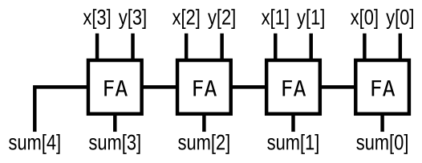

# Arithmetic circuits

## Half Adder
```verilog
module half_adder( 
    input a, b,
    output cout, sum );
	assign cout = a & b;
    assign sum = a ^ b;
endmodule
```
!!! note
    sum = a ^ b       
    cout = a & b

## Full Adder
```verilog
module full_adder( 
    input a, b, cin,
    output cout, sum );
	assign sum = a ^ b ^ cin;
    assign cout = a & b | b & cin | cin & a;
endmodule
```
!!! note
    sum = a ^ b ^ cin       
    cout = a & b | a & cin | b & cin = (a & b) | (cin & (a ^ b))

```verilog
module top_module( 
    input a, b, cin,
    output cout, sum );
	assign {cout,sum} = a + b + cin;
endmodule
```
重点关注下`assign {cout,sum} = a + b + cin;`这一行。

## Adder3
Now that you know how to build a full adder, make 3 instances of it to create a 3-bit binary ripple-carry adder. The adder adds two 3-bit numbers and a carry-in to produce a 3-bit sum and carry out. To encourage you to actually instantiate full adders, also output the carry-out from each full adder in the ripple-carry adder. cout[2] is the final carry-out from the last full adder, and is the carry-out you usually see.
```verilog
module top_module( 
    input [2:0] a, b,
    input cin,
    output [2:0] cout,
    output [2:0] sum );
    assign sum[0] = a[0] ^ b[0] ^ cin;
    assign cout[0] = a[0] & b[0] | b[0] & cin | cin & a[0];
    assign sum[1] = a[1] ^ b[1] ^ cout[0];
    assign cout[1] = a[1] & b[1] | b[1] & cout[0] | cout[0] & a[1];
    assign sum[2] = a[2] ^ b[2] ^ cout[1];
    assign cout[2] = a[2] & b[2] | b[2] & cout[1] | cout[1] & a[2];
endmodule
```
```verilog
module top_module( 
    input [2:0] a, b,
    input cin,
    output [2:0] cout,
    output [2:0] sum );
    fadd U1(a[0],b[0],cin,cout[0],sum[0]);
    fadd U2(a[1],b[1],cout[0],cout[1],sum[1]);
    fadd U3(a[2],b[2],cout[1],cout[2],sum[2]);
endmodule
 
module fadd( 
    input a, b, cin,
    output cout, sum );
    assign {cout,sum} = a + b + cin;
endmodule
```

## Exams/m2014 q4j
Implement the following circuit:


```verilog
module top_module (
	input [3:0] x,
	input [3:0] y,
	output [4:0] sum
);

	// This circuit is a 4-bit ripple-carry adder with carry-out.
	assign sum = x+y;	// Verilog addition automatically produces the carry-out bit.

	// Verilog quirk: Even though the value of (x+y) includes the carry-out, (x+y) is still considered to be a 4-bit number (The max width of the two operands).
	// This is correct:
	assign sum = (x+y);
	// But this is incorrect:
	assign sum = {x+y};	// Concatenation operator: This discards the carry-out!
endmodule
```

## Overflow
Assume that you have two 8-bit 2's complement numbers, a[7:0] and b[7:0]. These numbers are added to produce s[7:0]. Also compute whether a (signed) overflow has occurred.

Hint:
**A signed overflow occurs when adding two positive numbers produces a negative result, or adding two negative numbers produces a positive result.** There are several methods to detect overflow: It could be computed by comparing the signs of the input and output numbers, or derived from the carry-out of bit n and n-1.

```verilog
module top_module (
    input [7:0] a,
    input [7:0] b,
    output [7:0] s,
    output overflow
); 
    assign s = a + b;
    // 溢出发生条件：两个操作数符号位相同，但结果符号位不同
    assign overflow = (a[7] == b[7]) && (s[7] != a[7]);
endmodule
```

## Adder100
```verilog
module top_module (
	input [99:0] a,
	input [99:0] b,
	input cin,
	output cout,
	output [99:0] sum
);

	// The concatenation {cout, sum} is a 101-bit vector.
	assign {cout, sum} = a+b+cin;

endmodule
```