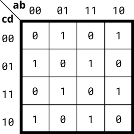

## Kmap4

Implement the circuit described by the Karnaugh map below.



Hint:

For this function, changing the value of any one input always inverts the output. It is a simple logic function, but one that can't be easily expressed as SOP nor POS forms.
```verilog
module top_module(
    input a,
    input b,
    input c,
    input d,
    output out  ); 
    assign out = (a^b)^(c^d);
endmodule
```