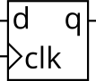
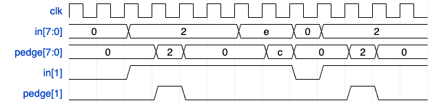
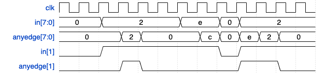
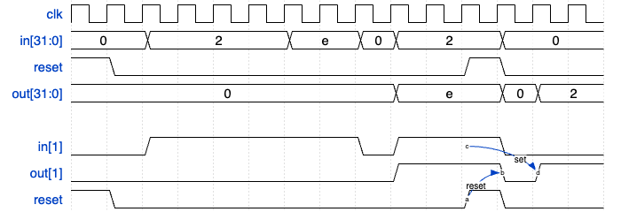

# Latches and Flipflops

## D-flipflop
A D flip-flop is a circuit that stores a bit and is updated periodically, at the (usually) positive edge of a clock signal.



D flip-flops are created by the logic synthesizer when a clocked always block is used (See alwaysblock2). A D flip-flop is the simplest form of "blob of combinational logic followed by a flip-flop" where the combinational logic portion is just a wire.

Create a single D flip-flop.

```verilog
module top_module (
    input clk,    // Clocks are used in sequential circuits
    input d,
    output reg q );//

    // Use a clocked always block
    //   copy d to q at every positive edge of clk
    //   Clocked always blocks should use non-blocking assignments
    always @(posedge clk) begin
        q <= d;
    end

endmodule
```
## synchronous and asynchronous reset flip-flops
在数字电路设计中，`同步复位`（Synchronous Reset）和`异步复位`（Asynchronous Reset）是两种用于控制触发器（flip-flop）复位的方式。这两者的区别主要在于复位信号如何影响触发器的输出。以下是对这两者的详细解释：

### 同步复位 (Synchronous Reset)

**定义**：同步复位是指复位信号与时钟信号同步，即复位信号的作用只会在时钟边沿（通常是上升沿或下降沿）到来时才会被检测和执行。

**工作原理**：
- 当复位信号被置为有效（通常是低电平或高电平，取决于设计），在下一个时钟边沿到来时，触发器的输出会被复位到一个预定的状态（通常是0）。
- 如果复位信号在非时钟边沿期间变化，触发器的输出不会立即响应，而是要等到下一个时钟边沿来临时才会执行复位操作。

**优点**：
- 易于综合（synthesis），因为复位信号与时钟同步，可以确保所有的触发器在同一时刻复位，减少了竞争冒险（race conditions）的可能性。
- 复位时不会产生毛刺（glitch），因为复位信号在时钟边沿才会被采样。

**缺点**：
- 在需要快速复位的情况下，响应速度较慢，因为必须等待下一个时钟边沿。
- 需要额外的逻辑来实现同步复位，这可能会增加电路的复杂性。

### 异步复位 (Asynchronous Reset)

**定义**：异步复位是指复位信号与时钟信号异步，即复位信号不依赖于时钟信号，可以在任何时候立即触发复位动作。

**工作原理**：
- 当复位信号被置为有效时，无论时钟信号处于什么状态，触发器的输出都会立即被复位到一个预定的状态。
- 当复位信号无效时，触发器重新回到正常工作状态，继续响应时钟信号的输入。

**优点**：
- 响应速度快，能够立即复位，不需要等待时钟边沿。
- 电路实现相对简单，不需要额外的逻辑来同步复位信号。

**缺点**：
- 容易产生毛刺，尤其是在复位信号解除时，因为复位信号的边沿可能会引发触发器的误动作。
- 可能引入竞争冒险问题，尤其是在不同复位路径上存在时延差异时，导致复位不一致。

### 应用场景

- **同步复位**常用于对时序要求严格的系统中，如同步数字电路和状态机设计中，因为它能确保所有触发器的复位发生在同一个时钟周期内。
- **异步复位**常用于对复位响应速度要求高的场合，如需要在电源上电或系统故障时立即复位的系统。

```verilog
module top_module(
	input clk,
	input [7:0] d,
	input areset,
	output reg [7:0] q);
	
	// The only difference in code compared to synchronous reset is in the sensitivity list.
	always @(posedge clk, posedge areset)
		if (areset)
			q <= 0;
		else
			q <= d;


	// In Verilog, the sensitivity list looks strange. The FF's reset is sensitive to the
	// *level* of areset, so why does using "posedge areset" work?
	// To see why it works, consider the truth table for all events that change the input 
	// signals, assuming clk and areset do not switch at precisely the same time:
	
	//  clk		areset		output
	//   x		 0->1		q <= 0; (because areset = 1)
	//   x		 1->0		no change (always block not triggered)
	//  0->1	   0		q <= d; (not resetting)
	//  0->1	   1		q <= 0; (still resetting, q was 0 before too)
	//  1->0	   x		no change (always block not triggered)
	
endmodule
```
## DFF + gate

```verilog
module top_module (
    input clk,
    input in, 
    output out);
    always @(posedge clk) begin
        out <= in ^ out;
    end
endmodule
```

## JK flip-flop
A JK flip-flop has the below truth table. Implement a JK flip-flop with only a D-type flip-flop and gates. Note: Qold is the output of the D flip-flop before the positive clock edge.

| J | K | Q        |
|---|---|-----------|
| 0 | 0 | Qold      |
| 0 | 1 | 0         |
| 1 | 0 | 1         |
| 1 | 1 | ~Qold     |

```verilog
module top_module (
    input clk,
    input j,
    input k,
    output Q); 
    always @(posedge clk) begin
        if(j&&k)
            Q <= ~Q;
        else if(j&&~k)
            Q <= 1;
        else if(~j&&k)
            Q <= 0;
        else
            Q <= Q;
    end
endmodule
```

## Edgedetect

For each bit in an 8-bit vector, detect when the input signal changes from 0 in one clock cycle to 1 the next (similar to positive edge detection). The output bit should be set the cycle after a 0 to 1 transition occurs.

Here are some examples. For clarity, in[1] and pedge[1] are shown separately.



```verilog
module top_module(
	input clk,
	input [7:0] in,
	output reg [7:0] pedge);
	
	reg [7:0] d_last;	
			
	always @(posedge clk) begin
		d_last <= in;			// Remember the state of the previous cycle
		pedge <= in & ~d_last;	// A positive edge occurred if input was 0 and is now 1.
	end
	
endmodule
```
## Edgedetect2

For each bit in an 8-bit vector, detect when the input signal changes from one clock cycle to the next (detect any edge). The output bit should be set the cycle after a 0 to 1 transition occurs.

Here are some examples. For clarity, in[1] and anyedge[1] are shown separately.



```verilog
module top_module (
    input clk,
    input [7:0] in,
    output [7:0] anyedge
);
	reg [7:0] d_last;	
    wire [7:0] tmp1, tmp2;
    assign anyedge = tmp1 | tmp2;
	always @(posedge clk) begin
		d_last <= in;			
		tmp1 <= in & ~d_last;	
        tmp2 <= ~(in | ~d_last);
	end
endmodule
```

```verilog
module top_module (
    input clk,
    input [7:0] in,
    output [7:0] anyedge
);
    reg [7:0] d_last = 8'h00;
    always@(posedge clk)
        begin
            d_last <= in;
            anyedge <= in ^ d_last;
        end
endmodule
```
## Edgecapture
For each bit in a 32-bit vector, capture when the input signal changes from 1 in one clock cycle to 0 the next. "Capture" means that the output will remain 1 until the register is reset (synchronous reset).

Each output bit behaves like a SR flip-flop: The output bit should be set (to 1) the cycle after a 1 to 0 transition occurs. The output bit should be reset (to 0) at the positive clock edge when reset is high. If both of the above events occur at the same time, reset has precedence. In the last 4 cycles of the example waveform below, the 'reset' event occurs one cycle earlier than the 'set' event, so there is no conflict here.

In the example waveform below, reset, in[1] and out[1] are shown again separately for clarity.


```verilog
module top_module (
    input clk,
    input reset,
    input [31:0] in,
    output [31:0] out
);
    reg [31:0] in1;
    
    always @(posedge clk) 
      in1 <= in; 
    // in1 始终为 in 的上一阶段
    always @(posedge clk) begin
        if (reset)
             out <= 0;
        else          
             out<= ~in & in1 | out;
    end 
endmodule
```
## Dualedge
You're familiar with flip-flops that are triggered on the positive edge of the clock, or negative edge of the clock. A dual-edge triggered flip-flop is triggered on both edges of the clock. However, FPGAs don't have dual-edge triggered flip-flops, and always @(posedge clk or negedge clk) is not accepted as a legal sensitivity list.

Hint:
- You can't create a dual-edge triggered flip-flop on an FPGA. But you can create both positive-edge triggered and negative-edge triggered flip-flops.
- This problem is a moderately difficult circuit design problem, but requires only basic Verilog language features. (This is a circuit design problem, not a coding problem.) It may help to first sketch a circuit by hand before attempting to code it.


```verilog
module top_module(
	input clk,
	input d,
	output q);
	
	reg p, n;
	
	// A positive-edge triggered flip-flop
    always @(posedge clk)
        p <= d ^ n;
        
    // A negative-edge triggered flip-flop
    always @(negedge clk)
        n <= d ^ p;
    
    // Why does this work? 
    // After posedge clk, p changes to d^n. Thus q = (p^n) = (d^n^n) = d.
    // After negedge clk, n changes to d^p. Thus q = (p^n) = (p^d^p) = d.
    // At each (positive or negative) clock edge, p and n FFs alternately
    // load a value that will cancel out the other and cause the new value of d to remain.
    assign q = p ^ n;
    
    
	// Can't synthesize this.
	/*always @(posedge clk, negedge clk) begin
		q <= d;
	end*/
    
    
endmodule
Verilog模块尝试实现一个双沿触发的触发器，也就是在时钟信号的正沿（posedge clk）和负沿（negedge clk）都可以捕捉数据。

### 设计原理：
这使用了两个寄存器 `p` 和 `n`，分别在正沿和负沿时更新它们的值。通过 `p` 和 `n` 的交替更新和异或运算（`p ^ n`），实现了每个时钟沿更新输出 `q` 的效果。

具体的实现步骤如下：

1. **正沿触发：**
    ```verilog
    always @(posedge clk)
        p <= d ^ n;
    ```
    这里，`p` 在时钟正沿时被赋值为 `d ^ n`，即 `d` 和 `n` 的异或值。

2. **负沿触发：**
    ```verilog
    always @(negedge clk)
        n <= d ^ p;
    ```
    在时钟的负沿，`n` 被赋值为 `d ^ p`，即 `d` 和 `p` 的异或值。

3. **输出逻辑：**
    ```verilog
    assign q = p ^ n;
    ```
    `q` 是 `p` 和 `n` 的异或结果。根据设计，每个时钟沿都会使 `p` 和 `n` 交替加载一个与当前输入 `d` 相关的值，而最终 `q` 总是会稳定在当前 `d` 的值。

### 为什么这个方法有效？
- 当时钟处于正沿时，`p` 被赋值为 `d ^ n`，此时输出 `q = p ^ n = (d ^ n) ^ n = d`，因为 `n ^ n = 0`。
- 当时钟处于负沿时，`n` 被赋值为 `d ^ p`，此时输出 `q = p ^ n = p ^ (d ^ p) = d`，因为 `p ^ p = 0`。
- 通过这种交替的更新机制，保证了每次时钟的正沿和负沿都能够正确地更新输出 `q`，使得 `q` 在每个时钟沿都跟踪输入 `d`。
