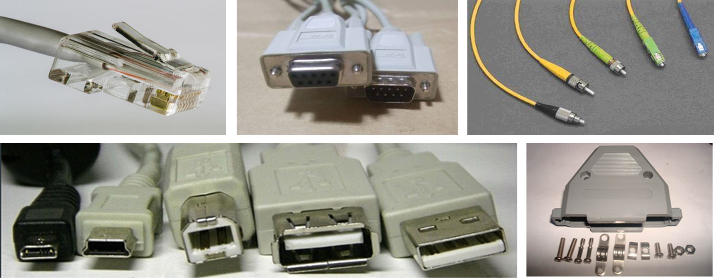
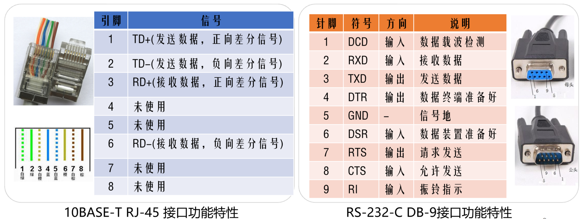
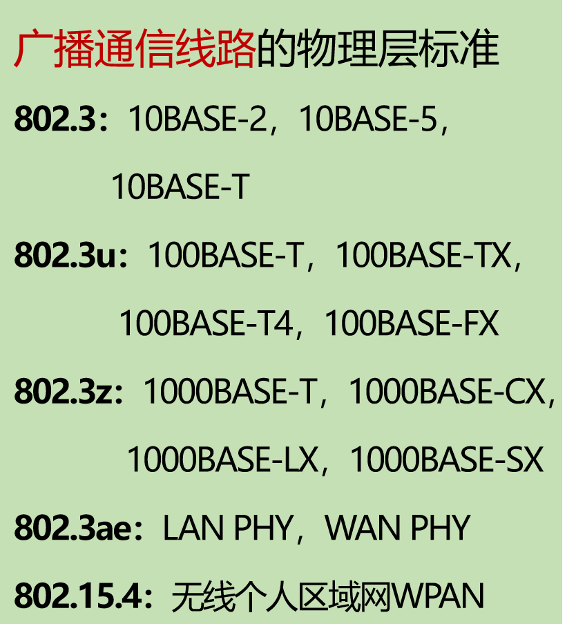
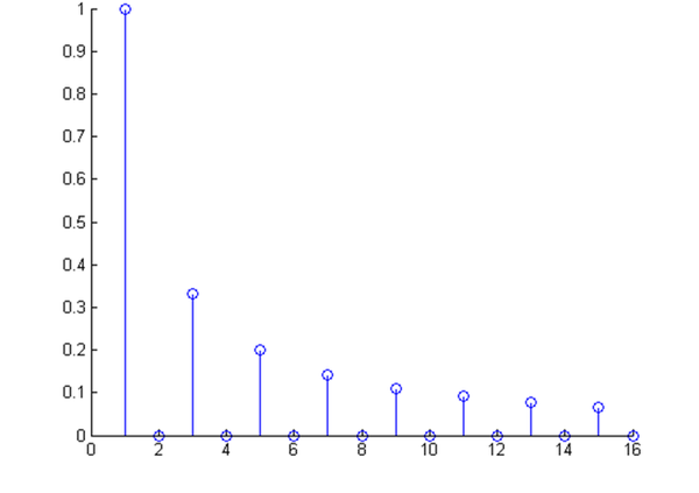
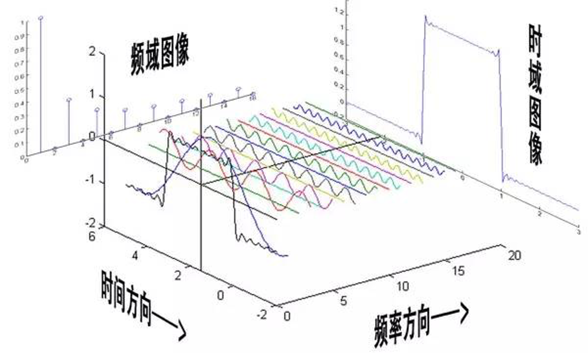
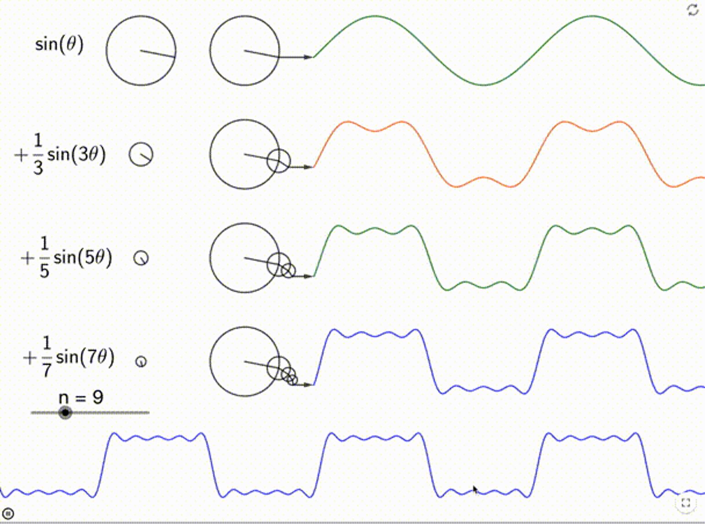

# 物理层

## 2.1 物理层基本概念

### 2.1.1 物理层功能

- 位置：物理层是网络体系结构中的**最底层**
- 功能：再连接各计算机的传输媒体中传输数据比特流
    - 数据链路层将数据比特流传送给物理层
    - 物理层将比特流按照传输媒体的需要进行编码
    - 然后将信号通过传输媒体传输到下一个节点的物理层
- 作用：尽可能地**屏蔽掉不同传输媒体和通信手段的差异**
    - 为数据链路层提供一个统一的数据传输服务

### 2.1.2 物理层特性

#### 接口特性

- **数据终端设备（DTE）**（比如电脑或路由器，负责产生和处理数据）
    - 一种具有一定的数据处理和转发能力的设备
    - 可以是数据的原点或终点
- **数据电路终结设备（DCE）**（调制解调器之类的设备，负责信号转换和连接维护）
    - 在DTE和传输线路之间提供信号变换和编码的功能
    - 负责建立、保持和释放数据链路
- 物理层协议是DTE和DCE之间的约定，规定了两者之间的接口特性
- 标准化的DTE/DCE接口具有
    - 机械特性、电气特性、功能特性、过程特性

#### 机械特性

设计接口的物理结构，通常采用接线器来实现机械上的连接。定义接线器的**形状和尺寸、引线数目和排列、固定和锁定装置**等

#### 电气特性

- 规定了DTE/DCE之间**多条信号线的电气连接及有关电路特性**
    - 发送器和接收器的**电路特性、负载要求、传输速率和连接距离**等
    - 如**发送信号电平、发送器和接收器的输出阻抗、平衡特性**等

举例：

**ITU-T V/X系列有关建议的某些电气特性**

| ITU-T 建议 | 信号类型 | “1”信号电平 | “0”信号电平 | 最高速率范围 |
| :--- | :--- | :--- | :--- | :--- |
| **V.28** | **非平衡传输** (对地) | -5 V ~ -15 V | +5 V ~ +15 V | ≤ 20 kb/s |
| **V.10 / X.26** | **非平衡传输** (对地) | -4 V ~ -6 V | +4 V ~ +6 V | ≤ 300 kb/s |
| **V.11 / X.27** | **平衡差分传输** (差动) | -2 V ~ -6 V | +2 V ~ +6 V | ≤ 10 Mb/s |

**普通电话交换网接口电气特性的主要规定**

| 发送电平 | ≤0dBm |
| :--- | :--- |
| 接收电平 |-5～-35dBm，视各种Modem而定 |
| 阻抗 | 600Ω |
| 平衡特性 | 平衡输入/输出 |

#### 功能特性

描述接口执行的功能，定义接线器的每一引脚的作用（针，pin）

#### 过程特性

指明对于不同功能的各种可能时间的出现顺序。

### 2.1.3 物理层常用标准

- **点对点通信线路**
    - 用于直接连接两个节点
    - 物理层标准：
        - EIA RS-232-C标准
        - EIA RS-449标准
- **广播通信线路**
    - 一条公共通信线路连接多个节点
    - 物理层标准：
        - 传统以太网IEEE 802.3：10BASE-T等
        - 快速以太网
        - 千兆以太网
        - 万兆以太网
        - 无线局域网

!!! note "广播通信线路的物理层标准"
    {width=300px}
    {width=300px}

## 2.2 数据通信基础

### 2.2.1 数据通信基础理论

- 主要内容
    - 研究信号在通信信道上传输时的数学表示及其所受到的限制
- 傅立叶分析
    - 在网络通信中，信息是以电磁信号（或简称信号）的形式传输的
    - 电磁信号是时间的函数（时域观）
    - 也可以表示成频率的函数（频域观）
    - 对于理解数据传输来讲，信号的频域观比时域观更重要
- 时域观
    - 从时间函数的角度来看，电磁信号分为模拟信号和数字信号
    - 模拟信号的信号强度随着时间平滑变化，或者说信号中没有突变或不连续的地方。
    - 数字信号的信号强度在一段时间内保持一个恒定值，然后又变成另外一个恒定值
- 频域观
    - 基本定义
        - 当一个信号的所有频率成分是某一个频率的整数倍时，该频率被称为基本频率
        - 信号的周期等于基本频率的周期
    - 傅立叶分析 

### 2.2.2 傅里叶分析

任何一个周期为T的有理周期性函数 g(t) 可分解为若干项（可能无限多项）正弦和余弦函数之和

这里我并不打算深究。可以粗陋理解为方波可以转化成无数正弦波的叠加。

{width=500px}

### 2.2.3 频域图像与时域图像

{width=500px}
{width=500px}

{width=500px}

### 2.2.4 正弦波

正弦波就是一个圆周运动在一条直线上的投影。频域的基本单元也可以理解为一个始终在旋转的圆

{width=500px}

### 2.2.5 有限带宽信号

#### 有限带宽

**带宽**：指的是一个信道能够**无障碍**通过的频率范围。任何实际的物理信道都不是理想的，它无法让所有频率的信号都完美通过。它有一个截止频率，记作$f_c$。

**信号传输特性详解**

1.  **对不同频率的衰减不同**
    *   **理论（频域观点）**：任何信号都可以通过傅里叶级数分解为多个不同频率的简单正弦波（称为谐波）的叠加。次数越高的谐波，频率越高。
    *   **现实**：信道在传输这些不同频率的谐波时，对它们的“削弱”（即衰减）程度是不同的。
    *   **0 ~ $f_c$ 频率范围**：这个频率区间的谐波振幅衰减较弱，能够比较顺利地通过信道。这个范围就是信道的**有效带宽**。
    *   **$f_c$ 以上频率**：这个频率区间的谐波振幅会急剧衰减，几乎无法有效传输。

2.  **引起输出失真**
    *   由于高频分量被严重衰减，接收端收到的信号就缺失了原始信号中的这些高频成分。就像一张高清图片被压缩成模糊的缩略图，细节（高频信息）丢失了，导致信号波形变形，这就是**失真**。

3.  **滤波器的应用**
    *   为了避免失真的信号干扰相邻信道，或者为了优化本信道的传输，可以主动接入一个**滤波器**，提前将频率高于$f_c$的成分过滤掉。这就强制将用户的信号限制在信道带宽之内，保证了传输的清晰度。

4.  **谐波次数与信号逼真度**
    *   通过信道的谐波次数越多，意味着原始信号被保留的频率成分越丰富，重建出的信号自然就越逼真。一个极端例子：
        *   **只通过1次谐波（基波）**：可能只能还原出一个方波的大致轮廓。
        *   **通过前10次谐波**：能还原出非常精确的方波形状。

#### 波特率与比特率的关系

解释了衡量数据传输速率的两个不同但相关的指标。

**核心概念区分**

| 术语 | 定义 | 比喻 | 单位 |
| :--- | :--- | :--- | :--- |
| **波特率** | **每秒钟信号变化的次数**（或称调制速率） | 每秒切换了多少种不同的交通信号灯状态（如红、黄、绿）。 | **Baud** |
| **比特率** | **每秒钟传输的二进制位数** | 每秒通过十字路口的车辆数量。 | **bps** |

**两者关系详解**

波特率和比特率的关系是本章的难点和重点。它们的关系用公式表示就是：
**比特率 = 波特率 × 每个信号变化所表示的二进制位数**

*   **关键取决于调制技术**：一个“信号变化”（一个码元）能代表多少信息，取决于我们使用的调制技术。
*   **举例说明**：
    1.  **每个信号值表示1位**：
        *   假设我们只有两种信号状态（比如0V表示0，5V表示1）。那么**每次信号变化只能表示1个比特**（0或1）。
        *   此时，**比特率 = 波特率**。例如，波特率是1000 Baud，比特率就是1000 bps。
    2.  **每个信号值表示3位**：
        *   假设我们使用一种更复杂的调制技术，能产生8种不同的信号状态（如8种不同的电压等级）。因为 2³ = 8，所以**每个信号状态可以表示3个比特**（000, 001, 010, ..., 111）。
        *   此时，**比特率是波特率的3倍**。例如，波特率是1000 Baud，比特率就是 1000 × 3 = 3000 bps。

计算题：

能通过信道的最高次谐波数目为：

$$ 
N = \frac{f_c}{f_1}
$$

其中$f_c$是指截止频率，$f_1$是指一次谐波的频率。对于比特率为 B bps 的信道，发送8位所需的时间位 8/B 秒。若8位为一个周期T，则一次谐波的频率是： $f_1 = \frac{B}{8}$

### 2.2.6 信道的最大数据传输速率

#### 奈奎斯特定理

**核心内容：**

- 1924年由奈奎斯特推导，适用于**无噪声有限带宽信道**
- **最大数据传输率公式：** $B_{max} = 2H \log_2 V$ (bps)
  - $H$：信道带宽(Hz)
  - $V$：信号电平级数
  - $B$：数据率(bit/s)，$S$：码元率(symbol/s)

**关键要点：**

- 任意信号通过带宽为$H$的低通滤波器时，每秒采样$2H$次即可完整重现信号
- 码元率(波特率)上限：$S \leq 2H$
- 数据率与码元率关系：$B \leq 2H \log_2 V$

**编码方式对比：**

- **NRZ编码**：$V=2$，$B_{max} = 2H$ bps
- **曼彻斯特编码**：$V=2$，$B_{max} = H$ bps（因每个比特需要两次电平变化）

#### 香农定理

**核心内容：**

- 1948年由香农提出，适用于**有随机噪声干扰的信道**
- **最大数据传输率公式：** $C = H \log_2 (1 + \frac{S}{N})$ (bps)
  - $S/N$：信噪比（信号功率与噪声功率之比）

**关键特性：**

- 基于信息论推导，具有普遍意义
- 与信号电平级数、采样速度无关
- 给出的是理论上限，实际难以达到
- 信噪比通常用分贝表示：$SNR_{dB} = 10 \log_{10} (\frac{S}{N})$

**应用场景：**

- 电话系统典型信噪比：30dB（对应$S/N = 1000$）

!!! example "例题"
    题目： What is the minimum bandwidth required for achieving B bits/sec when using 8 discrete voltage levels to represent bits over a channel with signal to noise ratio 20dB?

    解答步骤：
    
    1. 分析已知条件：

       - 目标数据率：$B$ bps
       - 电平级数：$V = 8$
       - 信噪比：20dB
    
    2. 信噪比转换：
       $$20 = 10 \log_{10} (\frac{S}{N}) \Rightarrow \frac{S}{N} = 10^{2} = 100$$
    
    3. 分别计算两个定理要求的带宽：

       - 奈奎斯特要求： $B \leq 2H \log_2 8 = 2H \times 3 = 6H$

        $$H \geq \frac{B}{6}$$

       - 香农要求： $B \leq H \log_2 (1 + 100) = H \log_2 101 \approx H \times 6.66$

        $$H \geq \frac{B}{6.66}$$
    
    4. 确定最小带宽：

       - 取两者中较大值：$H_{min} = \max(\frac{B}{6}, \frac{B}{6.66}) = \frac{B}{6}$
    
    答案：最小带宽需求为 $\frac{B}{6}$ Hz