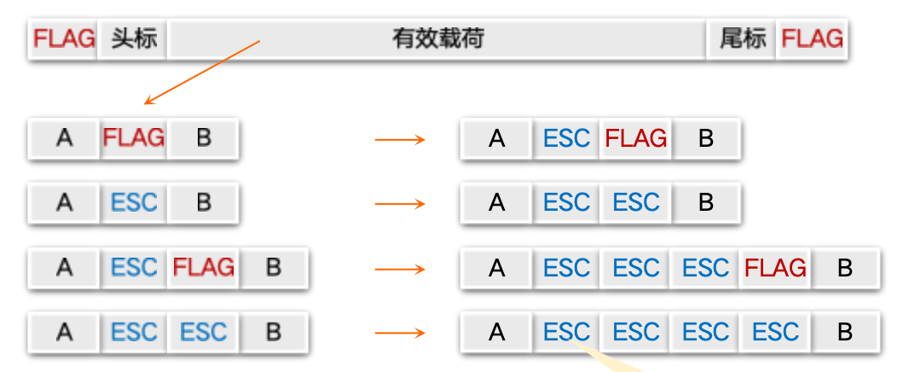
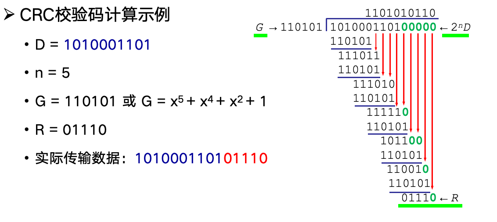

# 数据链路层

## 3.1 数据链路层的设计问题

### 3.1.1 数据链路层在协议栈中的位置

- 向上：向网络层提供明确的服务接口
- 向下：利用物理层提供的位流服务

### 3.1.2 数据链路层的功能

- 成帧
    - 家那个比特流划分成“帧”的主要目的是为了检测和纠正物理层在比特传输中可能出现的错误，数据链路层功能需借助“帧”的各个域来实现
- 差错控制
    - 处理传输中发生的差错，比如位错误、丢失等
- 流量控制
    - 利用物理层提供的位流服务

### 3.1.3 数据链路层提供的服务

- 无确认 无连接 服务
    - 接收方不对收到的帧进行确认
    - 适用场景：误码率低的可靠信道；实时通信；
    - 网络实例：以太网
- 有确认 无连接 服务
    - 每一帧都得到单独的确认（可以纠错、重传）
    - 适用场景：不可靠的信道（无线信道）
    - 网络实例：802.11
- 有确认 有连接 服务
    - 适用场景：长延迟的不可靠信道

### 3.1.4 成帧

如何标识一个帧的开始？答：使用**定界符**

如果数据部分中出现定界符怎么办？答：

- 成帧的方式
    - 字节计数法
    - 带字节填充的定界符法
    - 带比特填充的定界符法
    - 物理层编码违例

#### 字节计数法

适用于无差错传输的情形

若某个计数字节出错，这会破坏帧的边界，导致一连串帧的错误。

#### 带字节填充的定界符法

- 定界符（FLAG）：一个特殊的字节，比如0x01111110，即0x7E。

若有效载荷里面出现了0x7E怎么办？加转义字符。

接受方的处理：ESC后的一字节无条件成为转义字符，FLAG为帧的边界。

#### 带比特填充的定界符法

两个0比特之间，连续6个1比特，即0x01111110。

- 发送方检查有效载荷
    - 若在有效载荷中数显连续5个1比特，则直接插入1个0比特

- 接收方处理
    - 若出现5个连续的1
        - 若下一比特为0，则为有效载荷，直接丢弃0比特
        - 若下一比特为1，则连同后一比特的0，构成定界符，一帧结束

#### 物理层编码违例

核心思想：选择的定界符不会在数据部分中出现。

- 4B/5B编码方案
    - 4比特数据映射成5比特编码，剩余的一半码字（16个码字）未使用，可以用做帧定界符
- 前导码
- 曼切斯特编码/差分曼切斯特编码

### 3.1.5 差错控制

- 信道的噪声会导致数据传输问题
    - 差错：数据发生错误
    - 丢失：接收方未收到
    - 乱序：先发后到、后发先到
    - 重复：一次发送，多次接收

- 解决方案：差错检测与纠正、确认重传
    - 确认：接收方校验数据（差错校验），并给发送方应答，防止差错
    - 定时器：发送方启动定时器，防止丢失（如果一定时间没收到，那重传）
    - 顺序号：接收方检查序列号，防止乱序递交、重复递交

### 3.1.6 流量控制

防止接收方的接收缓冲区溢出。

- 基于**反馈**的流量控制
    - 接收方反馈，发送方调整发送速率
- 基于**速率**的流量控制
    - 发送方根据内建机制，自行限速

## 3.2 差错纠正与检测

### 3.2.1 差错检测与纠正概述

- 如何解决信道传输差错问题
    - 通常采用增**加冗余信息（校验信息）**的策略
    - 简单示例：每个比特传3份，可纠错

!!! question "考虑的问题"
    - 信道的特征和传输需求
    - 冗余信息的计算方法、携带的冗余信息量
    - 计算的复杂度等

- 两种主要策略
    - 检错码（error-detecting code）
        - 在被发送的数据块中，包含一些冗余信息，但这些信息只能使接收方推断是否发生错误，但不能推断哪位发生错误，接收方可以请求发送方重传数据
        - 主要用在高可靠、误码率较低的信道上，例如光纤链路
        - 偶尔发生的差错，可以通过重传解决差错问题
    - 纠错码（error-correcting code）
        - 发送方在每个数据块中加入足够的冗余信息，使得接收方能够判断接收到的数据是否有错，并能纠正错误（定位出错的位置）
        - 主要用于错误发生比较频繁的信道上，如无线链路
        - 也经常用于物理层，以及更高层（例如，实时流媒体应用和内容分发）
        - 使用纠错码的技术通常称为前向纠错（FEC，Forward Error Correction）

一些概念：

- 码字 (code word)：一个包含m个数据位和r个校验位的n位单元
    - 描述为 (n, m) 码，n=m+r
- 码率 (code rate)：码字中不含冗余部分所占的比例，可以用m/n表示
- 海明距离 (Hamming distance)：两个码字之间不同对应比特的数目
    - 例：0000000000 与0000011111的海明距离为5
    - 如果两个码字的海明距离为d，则需要d个单比特错就可以把一个码字转换成另一个码字
    - 为了检查出d个错（比特错），可以使用海明距离为 d+1 的编码
    - 为了纠正d个错，可以使用海明距离为 2d+1 的编码

| 能力        | 所需最小海明距离   | 说明                                                           |
| --------- | ---------- | ------------------------------------------------------------ |
| 检测出 d 个错误 | **d + 1**  | 因为如果两个合法码字之间的距离 ≥ d+1，那么任何 d 个以内的错误都不会把一个码字变成另一个合法码字，因此能检测出来 |
| 纠正 d 个错误  | **2d + 1** | 因为要确保错误后的码字距离正确码字比其他码字更近，这样才能唯一确定原码字                         |

假设每个码字在“码空间”中像是一个点：

* 海明距离相当于点与点之间的“距离”。
* 如果想**检测**错误，只要码字之间“间隔大于可能的错误范围”；
* 如果想**纠正**错误，就要让每个码字的“安全范围”（半径 d）**不重叠**。

### 3.2.2 典型检错码

常用的检错码包括：

- 奇偶检验 (Parity Check)：1位奇偶校验是最简单、最基础的检错码
- 校验和 (Checksum)：主要用于TCP/IP体系中的网络层和传输层
- 循环冗余校验 (Cyclic Redundancy Check，CRC)：数据链路层广泛使用的校验方法

#### 奇偶检验

- 基本思想：在数据块后附加1位校验位，使得整个码字中1的个数为偶数（偶校验）或奇数（奇校验）

#### 校验和

- 基本思想：将数据块划分为若干个固定长度的字（通常为16位），将这些字进行二进制加法（忽略进位），然后对结果取反，作为校验和附加在数据块后面
- 发送方：进行16位而击之补码求和晕眩，计算结果取反，作为校验和
- 接收方：对收到的数据块和校验和进行16位二进制加法，若结果全为1，则无差错，否则有差错

#### 循环冗余校验 (CRC)

- 基本思想：将数据块视为一个二进制多项式，选择一个生成多项式，对数据块进行模2除法，余数作为校验码附加在数据块后面
- 设原始数据 D 为 k 位二进制位模式
- 如果要产生 n 位的 CRC 校验码，则选择一个 n+1 位的生成多项式 G（收发方提前商定），满足 G 的最高位为1
- 将原始数据 D 左移 n 位（即在 D 后附加 n 个 0），得到 D * 2^n，然后用 D * 2^n 除以 G，得到余数 R（n 位），即为 CRC 校验码

### 3.2.3 典型纠错码

#### 设计纠错码
- 要求：m 个信息位，r 个校验位，能纠正单比特错误
- 对 $2^{m}$ 个有效信息中的任何一个，都有 n 个与其距离为 1 的无效码字
    - 若有单比特出错，则会变成这些无效码字中的一个，一共有 $n \times 2^{m}$ 个无效码字
    - 若没有出错，则会变成有效码字中的一个，一共有 $2^{m}$ 个有效码字
    - 因此，码空间中至少要有 $2^{m} + n \times 2^{m} = 2^{m}(n+1)$ 个码字
- 而码空间中一共有 $2^{n}$ 个码字，因此必须满足 $2^{n} \geq 2^{m}(n+1$，即 $2^{r} \geq n+1$，其中 $r=n-m$
- 即：$2^{r} \geq m + r + 1$，这是设计纠错码的基本不等式
- 在给定 m 的情况下，利用该不等式可以求出 r 的最小值

#### 海明码 (Hamming Code)
- 海明码是一种线性块码，可以纠正单比特错误
- 海明码的构造方法
    - 设码字长度为 n，信息位长度为 m，校验位长度为 r，满足 $n=m+r$ 和 $2^{r} \geq m + r + 1$
    - 将**校验位放在位置为 2 的幂次方的位置（1, 2, 4, 8, ...）**，其余位置放信息位
    - 每个校验位负责检查其位置编号中对应的二进制位为 1 的所有位置的比特
- 例如，(15, 11)海明码
    - 码字长度 n=15，信息位长度 m=11，校验位长度 r=4，满足 $2^{4} = 16 \geq 11 + 4 + 1$
    - 校验位放在位置 1, 2, 4, 8，其余位置放信息位
    - 校验位的计算如下：
        - 校验位 1 检查位置 1, 3, 5, 7, 9, 11, 13, 15
        - 校验位 2 检查位置 2, 3, 6, 7, 10, 11, 14, 15
        - 校验位 4 检查位置 4, 5, 6, 7, 12, 13, 14, 15
        - 校验位 8 检查位置 8, 9, 10, 11, 12, 13, 14, 15

- 定位错误与纠正
    - 接收方重新计算校验位，并与接收到的校验位比较
    - 若某些校验位不匹配，则将这些校验位的位置编号相加，得到一个数值，该数值即为出错比特的位置

#### REED-SOLOMON 码

- Reed-Solomon 码是一种非二进制线性块码，广泛应用于数字通信和存储系统中
    - RS 会把需要保护的数据划分为若干个符号（symbol），每个符号由多个比特组成
    - m 表示符号的大小，如果 m=8，则每个符号由 8 比特组成
    - 对于一个 RS(n, k) 码，n 表示码字中符号的总数，k 表示信息符号的数量，r=n-k 表示校验符号的数量
    - RS 码的纠错能力为 t=r/2，即可以纠正最多 t 个符号错误

## 3.3 基本的数据链路层协议

### 3.3.1 定义与假设

- 分层进程独立假设
    - 网络层、数据链路层、物理层为独立的进程
    - 进程间通过传递消息实现通信
- 提供可靠服务假设
    - 提供可靠的、面向连接的服务
    - 数据链路层发送的数据随时可向网络层获得
- 只处理通信错误假设
    - 仅处理通信错误
    - 假设机器不会崩溃，不考虑断电、重启等引起的问题

### 3.3.2 乌托邦式单工协议

### 3.3.3 无错信道单工停止-等待协议

### 3.3.4 有错信道单工停止-等待协议

## 3.4 滑动窗口协议

## 3.5 数据链路协议实例