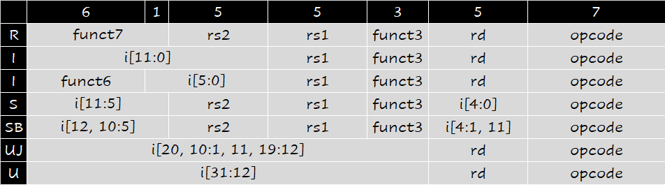

# The processor
## 4.1 Introduction
计算机的性能取决于三个因素：指令数、时钟周期和每条指令的时钟周期数（CPI）。而处理器的实现方式决定了时钟周期长度和CPI。

CPU的实现主要是由两部分组成：**控制单元**（Control Unit）和**数据通路**（Datapath）。


其中黑色部分为数据通路，蓝色部分为控制单元。

## 4.2 Datapath & Control
数据通路是**整个**传输信道，而控制信号是决定数据到底**走哪一条道**。

指令回顾：

### Instruction Fetch
指令的抓取依赖于PC值的更新。每条指令的长度是32bit，也就是4byte。程序从Instruction memory中依据PC值读取指令。
<center>

{width="500px"}

</center>

### R-Format Instructions
<center>

{width="600px"}


</center>

!!! Note
    Inst[19:15],[24:20],[11:7]分别对应rs1,rs2,rd。不管这是什么类型的指令、这条指令的这部分是不是rs1等等，我们始终读取指令的这一部分内容。

### Load/Store Instructions
<center>

{width="600px"}

</center>

### Branch Instructions

<center>

{width="600px"}

</center>

### ImmGen模块
|指令|立即数|
|||
||{{20{inst[31]}}, inst[31:20]};|
|sw|{{20{inst[31]}}, inst[31:25], inst[11:7]};|
|beq|{{20{inst[31]}}, inst[7], inst[30:25], inst[11:8], 1'b0}; |
|jal|{{12{inst[31]}}, inst[19:12], inst[20], inst[30:21], 1'b0};|

### Control
这部分内容主要是根据OPcode、Fun3等来选择数据通路。Control的核心在于8个值：

- RegWrite：是否写寄存器
- ALUSrc：选择哪个部分作为ALU的操作数
- ALU operation：选择ALU的计算
- MemRead：是否读内存
- MemWrite：是否写内存
- MemtoReg：写回哪里的内容
- jump：是否无条件跳转
- Brunch：是否有条件跳转

下面是不同指令对应的这些值：
<center>

</center>


我们一般对控制单元进行两级选择。第二级选择是ALU的选择。在第一级选择中，我们用两位的ALUop以及Fun来作为下一级选择的依据。


下面是实现代码，更加直观地看出两层选择。

```verilog
always @(*) begin
    case(OPcode)
        5'b01100:
        begin
            {ALUSrc_B, MemtoReg, RegWrite, MemRW, Branch, Jump, ALUop} = 9'b000100010;
        end // ALU
        5'b00000:
        begin
            {ALUSrc_B, MemtoReg, RegWrite, MemRW, Branch, Jump, ALUop} = 9'b101100000;
        end // load
        5'b01000:
        begin
            {ALUSrc_B, MemtoReg, RegWrite, MemRW, Branch, Jump, ALUop} = 9'b100010011;
        end // store
        5'b11000:
        begin
            {ALUSrc_B, MemtoReg, RegWrite, MemRW, Branch, Jump, ALUop} = 9'b000001001;
        end // beq
        5'b11011:
        begin
            {ALUSrc_B, MemtoReg, RegWrite, MemRW, Branch, Jump, ALUop} = 9'b010100100;
        end // jump
        5'b00100:
        begin
            {ALUSrc_B, MemtoReg, RegWrite, MemRW, Branch, Jump, ALUop} = 9'b100100010;
        end // ALUI
        default:
        begin
            {ALUSrc_B, MemtoReg, RegWrite, MemRW, Branch, Jump, ALUop} = 9'b000000000;
        end
    endcase
end

assign Fun = {Fun3, Fun7};

always @(*) begin
    case(ALUop)
        2'b00:ALU_Control = 3'b010; // add
        2'b01:ALU_Control = 3'b110; // sub
        2'b10:
            case(Fun)
                4'b0000:ALU_Control = 3'b010; // add
                4'b0001:ALU_Control = 3'b110; // sub
                4'b1110:ALU_Control = 3'b000; // and
                4'b1100:ALU_Control = 3'b001; // or
                4'b0100:ALU_Control = 3'b111; // slt
                4'b1010:ALU_Control = 3'b101; // srl
                4'b1000:ALU_Control = 3'b011; // xor
                default:ALU_Control = 3'bx;
            endcase
        2'b11:
            case(Fun3)
                3'b010:ALU_Control = 3'b010; // sw
                3'b000:ALU_Control = 3'b110; // beq
                3'b001:ALU_Control = 3'b110; // bne
                default:ALU_Control = 3'bx;
            endcase
        default:ALU_Control = 3'bx;
    endcase
end
```

## 4.4 A Simple Implementation Scheme