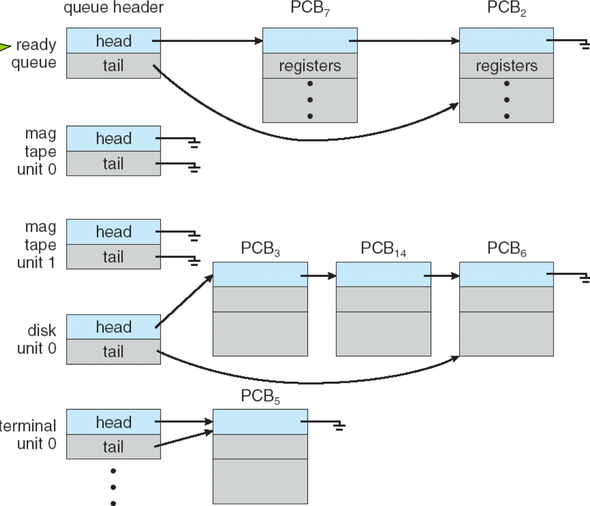
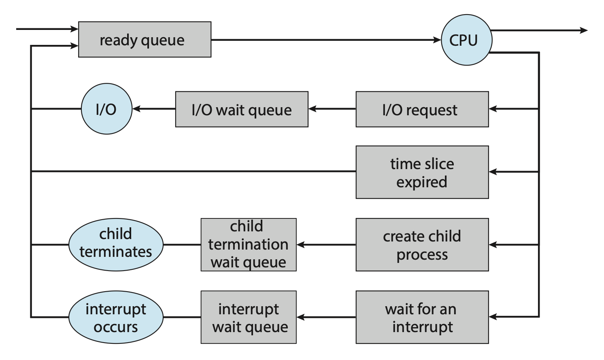
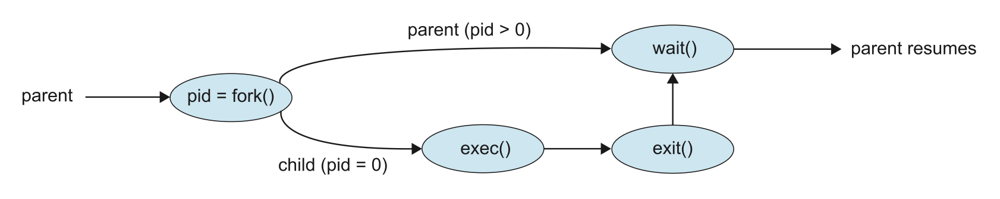

# Processes

## 3.1 进程概念

### 3.1.1 进程相关概念

进程就是运行中的程序。

- 一个进程包括：
    - 代码段（test section）
    - 程序计数器（PC）
    - 栈（函数参数，局部变量，返回地址）
    - 数据段（全局变量）
    - 堆（动态分配）

易错点：

- “程序”与“进程”不是完全等同：程序是静态文件；进程包含执行状态（PC、寄存器、内存映像等）。
- 堆与栈的用途与生命周期不同（堆是程序运行时动态分配，栈用于函数调用/返回）。
- 文本段和数据段的大小是固定的，因为它们的大小没法在程序运行时改变；而堆段和栈段的大小可在程序执行时动态伸缩。尽管栈段和堆段的扩张方向是朝向对方的，但 OS 会确保两者不会重叠。

{width=300px}

### 3.1.2 Heap Stack

- Heap
    - 完全二叉树
    - 父节点的值必须大于/小于他的孩子
- Stack
    - 函数调用使用
    - LIFO
    - 固定起点（栈指针寄存器）
    - push/pop 操作管理局部变量和返回地址
    - 大小通常受限，自动分配/回收

Stack 易发生栈溢出（递归深或大局部数组），Heap 可能发生内存泄漏（malloc/new 后未释放）

??? question "各类变量属于哪里？"
    | 类型                | 示例                                 | 所在区域                    | 生命周期            | 特点              |
    | ----------------- | ---------------------------------- | ----------------------- | --------------- | --------------- |
    | **局部变量**          | `int x=10;`（在函数内）                  | ✅ **栈 Stack**           | 随函数调用自动创建、返回后销毁 | 自动分配、速度快        |
    | **函数参数**          | `void f(int n)` 中的 `n`             | ✅ **栈 Stack**           | 与函数调用同步         |                 |
    | **返回地址 / 寄存器保存值** | 函数调用时保存的返回点                        | ✅ **栈 Stack**           | 由系统管理           | 实现函数调用机制        |
    | **临时对象**          | `int y = x + f(z);` 中的中间值          | ✅ **栈 / 寄存器**           | 执行结束即消失         |                 |
    | **全局变量**          | `int g = 5;`                       | ✅ **数据段 Data**          | 程序整个运行期存在       | 进程共享但线程安全性需注意   |
    | **静态局部变量**        | `static int c = 0;`                | ✅ **数据段 Data**          | 程序整个运行期存在       | 只初始化一次          |
    | **未初始化全局变量**      | `int count;`                       | ✅ **BSS 段**             | 程序整个运行期         | 系统自动初始化为 0      |
    | **动态分配变量**        | `int *p = malloc(10*sizeof(int));` | ✅ **堆 Heap**            | 手动分配 / 手动释放     | 由程序员控制，若忘记释放则泄漏 |
    | **C++ new 对象**    | `Person *p = new Person();`        | ✅ **堆 Heap**            | 手动释放（delete）    | new/delete 成对   |
    | **字符串字面值**        | `"Hello"`                          | ✅ **文字常量区（Text 的只读部分）** | 程序整个运行期         | 只读              |
    | **函数代码**          | `main()`、`printf()`                | ✅ **代码段 Text**          | 程序整个运行期         | 机器指令            |

### 3.1.3 进程状态

- 当一个进程运行时，他会改变状态：
    - new: 创建中
    - running: 正在 CPU 上执行
    - waiting: 等待某事件（I/O、信号）
    - ready: 可运行但未被分配 CPU（在 ready queue）
    - terminated: 完成/退出


### 3.1.4 Process Control Block (PCB)

PCB 包含信息

- 进程状态（state）
- 程序计数器（PC）
- CPU 寄存器内容（通用寄存器）
- CPU 调度信息（优先级、调度统计）
- 内存管理信息（页表/段表）
- 会计信息（CPU 时间、用户 ID）
- I/O 状态（打开文件、设备表）

作用

- 操作系统通过 PCB 保存/恢复进程的全部执行上下文，支持上下文切换与调度。

易错点

- PCB 存储的是进程的逻辑状态，不是进程所有的数据副本（数据在内存中）。PCB 通常位于内核空间。

## 3.2 进程调度

### 3.2.1 调度队列

- Job queue: 系统内所有进程（包含未入内存等）
- Ready queue: 已在内存、等待CPU执行
- Device queues: 等待设备的进程（按设备分类）

Ready queue 和 I/O Device queues 示意图：



进程调度的常用表示形式是队列图，圆形表示硬件资源，而箭头表示系统中的进程流，如下图所示：



### 3.2.2 调度器

- Long-term scheduler（作业调度）：决定哪些进程进入就绪队列。调用频率低（秒级）
- Short-term scheduler（CPU调度）：决定哪个就绪进程获得CPU。调用频繁（毫秒级）
- Medium-term scheduler（有时有）：用于交换（swawp out/in），调整多道程序度（挂起和恢复）

!!! note "UNIX and Windows do not use long-term scheduling"

### 3.2.3 上下文切换

- 切换进程需保存当前进程的 CPU 寄存器/程序计数器到 PCB，并把新进程的 PCB 寄存器加载到 CPU。
- 上下文切换是开销（系统不做用户工作），通常以毫秒计。
- 硬件支持（如寄存器组）可减少上下文开销。

## 3.3 进程上的操作

### 3.3.1 进程创建

- 父进程创建子进程，子进程又
创建其他进程，形成进程树
- 资源共享
    - 父进程和子进程共享所有资源
    - 子进程共享父进程的部分资源
    - 父进程和子进程不共享任何资源
- 执行
    - 父进程和子进程并发执行
    - 父进程等待子进程终止
- 地址空间
    - 子进程复制父进程
    - 子进程加载了一个程序
- UNIX 示例
    - fork 系统调用创建新进程
    - fork 后使用 exec 系统调用，将进程的内存空间替换为新程序


`fork()` 的功能是：

> 创建一个与父进程几乎一模一样的子进程。

当调用 `fork()` 后，系统内部会发生三件事：

1. **复制当前进程的地址空间**（即把父进程的代码、数据、栈、堆等复制一份，或使用写时复制 COW 技术）；
2. **为子进程创建新的 PCB（Process Control Block）**，并分配一个新的进程号（PID）；
3. **让父子进程“从同一行代码之后继续执行”**——也就是 fork() 调用之后。

---

| 调用位置     | fork() 的返回值       | 含义                    |
| -------- | ----------------- | --------------------- |
| **父进程中** | **> 0（子进程的 PID）** | 告诉父进程：新创建的子进程的 ID 是多少 |
| **子进程中** | **= 0**           | 告诉子进程：你是子进程（fork 出来的） |
| **错误时**  | **< 0**           | fork 失败（例如资源不足）       |




`exec()` 的功能是：

> 用一个新程序替换当前进程的代码和数据，继续执行新程序的 main()（不会回到旧代码）。


从系统角度看，exec() 并不会新建进程，而是：

1. 清空当前进程的用户空间（旧的代码段、数据段、堆、栈统统丢掉）。
2. 加载新的程序映像（例如 /bin/ls）到当前进程地址空间中。
3. 重新初始化栈并设置程序入口点（main() 或 _start）。
4. 跳转执行新程序的入口点。

```c
int main() {
  pid_t pid;
  pid = fork();
  if (pid < 0) { /* error */ }
  else if (pid == 0) { /* child */ 
      execlp("/bin/ls","ls", NULL); 
      /* ??? 这里之后的语句还会执行吗？ */
      /* 答案是不会执行！ */
  }
  else { /* parent */ 
      wait(NULL); 
      printf("Child Complete"); 
      exit(0); 
  }
}
```

### 3.3.2 进程终止

- 进程执行最后一条语句并请求操作系统删除它（退出）
    - 将数据从子进程输出到父进程（通过等待）
    - 操作系统释放进程的资源
- 父进程可以终止子进程的执行（中止）
    - 子进程已超出分配的资源
    - 分配给子进程的任务不再需要
    - 如果父进程正在退出
        - 某些操作系统不允许子进程在其父进程终止后继续运行
            - 所有子进程终止 
            - 级联终止
        - 在某些操作系统中，子进程会变为孤儿进程

## 3.4 协作进程

### 3.4.1 协作进程

- **独立的进程**不能影响或者被其他进程影响
- **协作的进程**可以相互影响（共享数据、同步等）

协作进程的好处：

- 信息共享
- 计算加速（多CPU）
- 模块化
- 方便

### 3.4.2 Producer-Consumer（生产者-消费者）问题

- 经典同步问题：生产者产生数据放到缓冲区，消费者从缓冲区取数据。
- 两种缓冲策略：
    - Unbounded buffer：无限大小（理论上），生产者几乎不用等待；现实中不可行。
    - Bounded buffer：固定大小（BUFFER_SIZE）。若满则生产者等待；若空则消费者等待。

### 3.4.3 Round Table

生产者插入逻辑：

```c
if ((in + 1) % SIZE == out) /* buffer full */ wait;
buffer[in] = item;
in = (in + 1) % SIZE;
```

消费者取出逻辑：

```c
if (in == out) /* buffer empty */ wait;
item = buffer[out];
out = (out + 1) % SIZE;
```
**问题**：竞态产生的场景（示例）：如果多个进程/线程同时访问 in、out 或 buffer[]，且没有同步保护，则可能出现交错执行造成数据错乱或丢失。

## 3.5 进程间通信

TODO

## 3.6 客户端-服务器通信

TODO