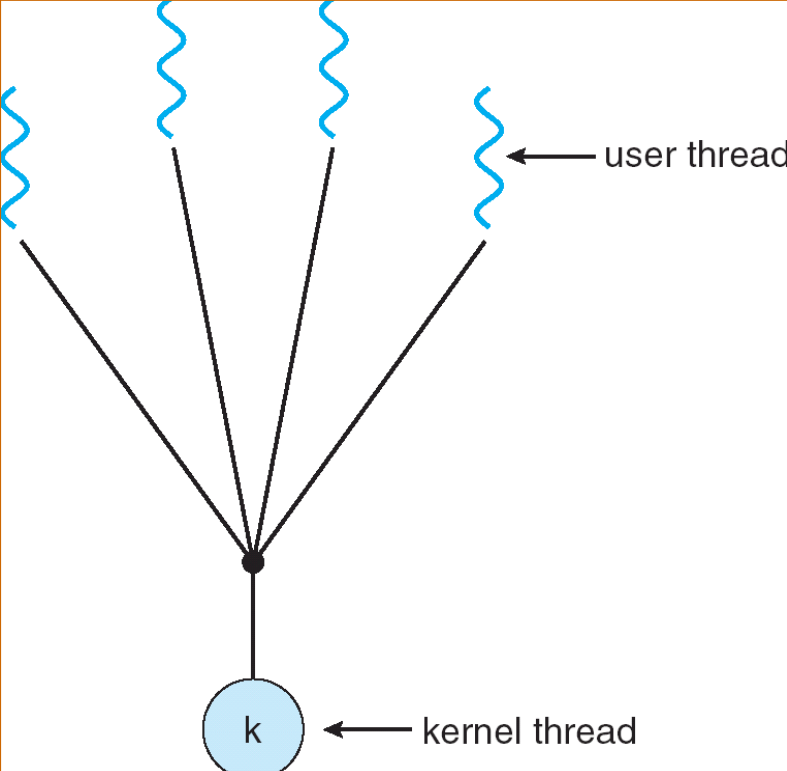
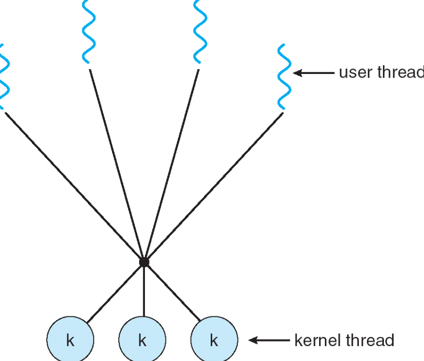

# Threads

## 4.1 总览

### 4.1.1 概念与动机

- 线程 = 轻量级进程（lightweight process）：同一进程内多个执行流（每个线程有自己的 PC、寄存器、栈），但共享进程地址空间（代码、全局数据、文件描述符等）。
- 动机：提高响应性（UI、服务器）、资源共享（多个任务共享内存无需 IPC）、在多核上并行利用 CPU、创建/切换开销小于进程。
- 示例（浏览器）：把“取数据、显示、处理输入”拆成独立线程，避免互相阻塞。

### 4.1.2 线程的好处

- 优点
    - 响应性（Responsiveness）——UI/交互更流畅。
    - 资源共享 —— 线程之间共享地址空间，通信成本低（无需内核 IPC）。
    - 经济（Economy）——创建/切换线程比进程便宜。
    - 并行化 —— 多核 CPU 上可真正并行执行。
- 风险
    - 共享内存带来竞态条件、数据一致性/内存可见性问题。
    - 调试困难（Heisenbug、竞态、死锁）。
    - 一个线程崩溃可能影响整个进程（所有线程共享进程资源）。
    - 设计复杂：需要同步机制（锁/条件变量/原子操作）。

### 4.1.3 线程 vs 进程

- 进程通常是独立的，而线程是进程的子集
- 进程比线程携带更多的状态信息，而进程内的多个线程**共享进程状态以及内存和其他资源**
- 进程拥有**独立的地址空间**，而线程**共享它们的地址空间**
- 进程仅通过系统提供的进程间通信机制进行交互
- 同一进程内**线程之间的上下文切换**通常比进程之间的上下文切换更快。
- 线程切换**开销小**（不需切换页表、TLB）；进程切换开销大。

### 4.1.4 用户级线程 vs 内核级线程

- **用户级线程（User threads）**
    - 线程库在用户空间实现（例如早期的 green threads）。
    - 优点：调度灵活、切换快；
    - 缺点：一旦线程做系统调用阻塞，整个进程阻塞；内核不可见线程（无法利用多核）。
- **内核级线程（Kernel threads）**
    - 由内核管理。
    - 优点：内核能调度到多个 CPU、阻塞只影响单个线程；
    - 缺点：切换较慢（需要内核态）且创建成本高。但如今几乎所有主流 OS 都支持内核线程（Linux/Windows/macOS）。

## 4.2 多线程模型

### 4.2.1 Many-to-One

- 多个用户线程映射到单个内核线程
- 优点：用户级调度灵活、创建/切换快。
- 缺点：如果有一个线程做**阻塞系统调用**，那么整个进程堵塞；无法再多核上并行；难以获得并行性能。

{width=500px}

### 4.2.2 One-to-One

- 每创建一个用户线程就创建一个内核线程
- 优点：支持并行；阻塞只影响单线程；内核能进行抢占调度。
- 缺点：创建/销毁开销大，线程数众多时资源消耗（内核 data structures）高。

{width=500px}

### 4.2.3 Many-to-Many

- 用户线程映射到一组内核线程，由运行时映射管理
- 优点：用户库可以控制并发度（例如限制内核线程数以避免oversubscribe），并能在阻塞时切换其他用户线程到其它内核线程。
- 实现复杂，需要内核/用户库协作

{width=500px}

### 4.2.4 Two-level

- 类似 M:M，但允许某些用户线程绑定到特定内核线程（绑定线程用于需要对内核的特定控制，如直接处理信号等）。

{width=500px}

## 4.3 线程经典问题

### 4.3.1 fork() 与 exec() 的语义

- 问题：进程中有**多个线程**，执行 fork() 时怎样复制？

- 常见行为：POSIX 要求子进程在 fork() 后仅复制调用 fork() 的线程的执行状态（即**子进程只有一个线程**——调用 fork() 的那个线程），且其它线程**不被复制**。原因：内核的复杂资源（锁、条件变量状态）在 fork 后可能处于不一致状态。

- 实践：很多实现建议在多线程程序中用 fork() 后**立即 exec()**，避免在 fork 子进程中执行复杂多线程逻辑（更具体，POSIX 提供 pthread_atfork 用于注册 fork 前后回调）。

- 小结：fork() 多线程程序要小心，仅复制调用线程；**exec() 会替换进程映像，终结所有线程**（因为进程变成新程序）。

### 4.3.2 线程取消

指在一个线程完成之前终止它。

- **异步取消（asynchronous）**：目标线程被立刻终止；危险，因为线程可能在持有锁或正在修改共享数据，导致资源不一致。

- **延迟取消（deferred）**：目标线程在某些取消点检查取消请求（例如 pthread_cond_wait、read 等是 cancellation points）；更安全，可清理资源。

### 4.3.3 信号处理

- 在 UNIX 系统中，信号用于通知进程特定事件已发生
- 信号处理程序用于处理信号
    1. 信号由特定事件生成
    2. 信号被传递给进程
    3. 信号被处理
- 传递方式取决于信号类型
    - 将信号传递给信号适用的线程
    - 将信号传递给进程中的每个线程
    - 将信号传递给进程中的特定线程
    - 指定一个特定线程来接收进程的所有信号

### 4.3.4 线程池

- 预先创建 N 个线程，放到池中等待任务（例如队列），避免每个请求都创建线程的开销。
- 优点
    - 一般来说，请求一个已经存在的线程比创建一个新的进程快。
    - 应用程序的线程数被“绑定”在池的大小范围内，不会无限制增加。

### 4.3.5 线程特有数据

在一个多线程程序中，所有线程共享同一个进程的地址空间，也就是说，全局变量、堆区内存、静态变量对所有线程都是可见的。

Thread-Specific Data (TSD)是一种机制，允许程序中每个线程拥有同名变量的独立副本。各个线程对变量的读写互不影响。可以理解为：“把全局变量变成每个线程的私有变量”。

### 4.3.6 调度激活

M:M 模型的典型需求：当内核决定对某进程分配/回收内核线程（LWP）或当线程阻塞时，如何通知用户级线程库？

Scheduler activations：内核对线程库做 upcall（一个内核→用户的回调通知），用户线程库通过 upcall 管理用户线程到 LWP 的映射。实现复杂，历史上有 Solaris 的研究/实现。

## 4.4 Pthreads

Pthreads 是 POSIX 标准的线程 API，广泛用于 UNIX-like 系统。

## 4.5 Windows 线程

TODO

## 4.6 Linux 线程

TODO

## 4.7 Java 线程

TODO