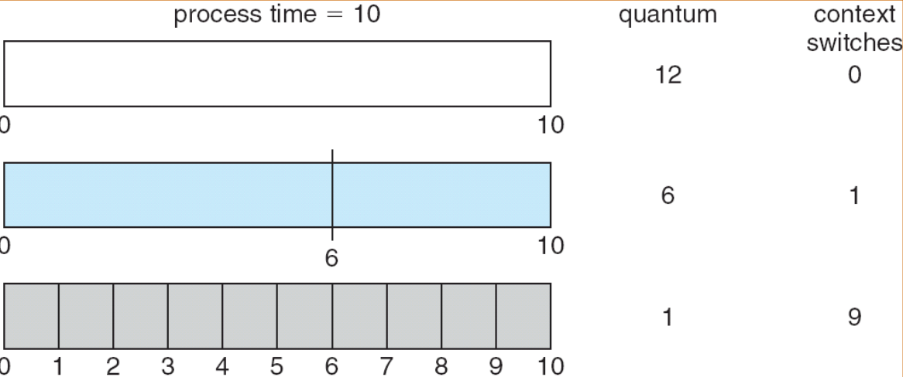

# CPU Scheduling

## 5.1 基本概念

### 5.1.1 概览

在多道程序系统中，CPU 是最稀缺的资源。调度（Scheduling）就是决定哪个进程在何时使用 CPU 的过程。

程序运行通常是 CPU 计算（CPU burst） 和 I/O 等待（I/O burst） 交替进行的。

- I/O-bound 进程：频繁 I/O、CPU 时间短；
- CPU-bound 进程：计算量大、I/O 时间短。

调度的目标之一：合理搭配 CPU-bound 与 I/O-bound 进程，以保持 CPU 高利用率。

### 5.1.2 CPU 调度器

功能：从内存中的就绪队列的进程中选择一个，分配 CPU 给它。

CPU 调度可能发生的四种情况：

| 序号 | 状态变化            | 是否抢占（preemptive） |
| -- | --------------- | ---------------- |
| 1  | 运行 → 等待（I/O 等）  | 否                |
| 2  | 运行 → 就绪（被中断）    | 是              |
| 3  | 等待 → 就绪（I/O 完成） | 是              |
| 4  | 运行 → 终止         | 否                |


调度器的种类（复习提醒）

- 长程调度（Long-term scheduler）：决定哪些作业进入内存。
- 短程调度（Short-term scheduler）：决定哪个就绪进程用 CPU。
- 中程调度（Medium-term scheduler）：负责挂起与恢复进程。

### 5.1.3 Dispatcher（分派器）

Dispatcher 是调度器的执行者，它完成：

- 上下文切换（context switch）
- 切换到用户态（user mode）
- 跳转到用户程序的入口

**Dispatch latency**（分派延迟）：从一个进程切换到另一个进程所花的时间。包括：

- 让出内核的当前进程；
- 分配资源给新进程。

这段时间内 CPU 实际上是空转的，会影响系统响应。

## 5.2 调度标准

| 指标                    | 含义           | 越小/越大越好 |
| --------------------- | ------------ | ------- |
| CPU 利用率               | CPU 忙碌的百分比   | 越高越好    |
| 吞吐量（Throughput）       | 单位时间内完成的进程数  | 越高越好    |
| 周转时间（Turnaround Time） | 提交 → 完成的时间   | 越短越好    |
| 等待时间（Waiting Time）    | 在就绪队列中等待的总时间 | 越短越好    |
| 响应时间（Response Time）   | 从请求到首次响应的时间  | 越短越好    |


## 5.3 调度算法

### 5.3.1 FCFS

First-Come, First-Served(FCFS) Scheduling, 先来先服务

- 非抢占式
- 按到达顺序执行
- 容易出现“护航效应”（convoy effect）：**短进程被长进程拖慢**。

### 5.3.2 SJF

Shortest-Job-First(SJF) Scheduling, 短任务优先

分为两种：

- 非抢占式
- 抢占式，如果有个新进程的剩余时间比当前执行时间要少，那么切换为新的进程。又叫SRJF。

**SJF 是最优的算法（平均等待时间最小）！**但问题是 —— 我们事先不知道下一个 CPU burst 的长度。


!!! info "预测 CPU burst 时间"

    用指数平均法（Exponential Averaging）预测下一个 CPU burst：
    [
    \tau_{n+1} = \alpha t_n + (1-\alpha)\tau_n
    ]

    * (t_n)：实际的上次 burst；
    * (\tau_{n+1})：预测值；
    * (0 \le \alpha \le 1)：平滑系数。

### 5.3.3 Priority

优先级调度

- 为每个进程分配一个优先级；
- CPU 分配给最高优先级的进程；
- 可抢占或非抢占。

问题及解决方案：

- 问题————饥饿：低优先级进程可能永远得不到 CPU。
- 解决————老化：随时间推移逐渐提高等待进程的优先级。

### 5.3.4 RR

Round Robin, 时间片轮转

- 时间片（time quantum）通常是 10–100ms；
- 每个进程最多运行一个时间片；
- 时间片到 → 抢占，放回就绪队列尾部。

如果就绪队列中有 n 个进程，且时间量为 q，则每个进程每次最多可获得 q 个时间单位的 1/n CPU 时间。任何进程的等待时间都不会超过 (n-1)q 个时间单位。

| 角度             | ( \frac{1}{n} ) 的 CPU 时间 | ( q ) 时间单位          |
| -------------- | ------------------------ | ------------------- |
| **表示的时间尺度** | 长期平均占用比例（抽象）             | 每次执行时的实际物理时长        |
| **是谁决定的**   | 队列中进程数量 n                | 时间片大小 q（调度器设定）      |
| **体现的性质**   | 公平性（Fairness）            | 响应性（Responsiveness） |
| **计算示例**    | 每个进程约占总 CPU 时间的 1/n      | 每次连续运行不超过 q 毫秒      |

特点：

- 响应时间快；
- 若时间片太小 → 上下文切换开销高；
- 若太大 → 退化为 FCFS。

{width=300px}

> 周转时间 = 从作业 **提交（arrival）** 到 **完成（completion）** 所经历的总时间。

也就是说，它表示一个进程在系统中从开始到结束所花的总时间，包括：

* 等待时间（在就绪队列中等待 CPU 的时间）；
* 执行时间（进程实际在 CPU 上运行的时间）；
* I/O 时间（如果有的话）。

[
\text{Turnaround Time} = \text{Completion Time} - \text{Arrival Time}
]


> **周转时间 = 完成时刻 − 到达时刻**


| 名称                         | 含义            | 计算公式            |
| -------------------------- | ------------- | --------------- |
| **等待时间 (Waiting Time)**    | 进程在就绪队列中等待的时间 | `周转时间 - 运行时间`   |
| **响应时间 (Response Time)**   | 第一次获得 CPU 的时间 | `首次执行时间 - 到达时间` |
| **周转时间 (Turnaround Time)** | 从提交到完成的全部时间   | `完成时间 - 到达时间`   |


> **周转时间（Turnaround Time）**：一个进程从进入系统到完成所需的总时间。
> **平均周转时间（Average Turnaround Time）**：所有进程的周转时间的平均值。
>
> 在比较调度算法（如 FCFS、SJF、RR）时，
> **平均周转时间越小，系统整体性能越好。**

### 5.3.5 Multilevel Feedback Queue

- 就绪队列被划分为多个独立的队列：
    - 前台（交互式）
    - 后台（批处理）
- 每个队列都有各自的调度算法，例如：
    - 前台 - RR
    - 后台 - FCFS
- 调度必须在队列之间进行
    - 固定优先级调度；（即先从前台处理所有任务，然后再从后台处理）。存在资源匮乏的可能性。
    - 时间片 - 每个队列获得一定数量的 CPU 时间，并可在其进程之间进行调度；例如：RR 模式下，80% 分配给前台
    - FCFS 模式下，20% 分配给后台

参数：

- 队列数量；
- 各队列的调度算法；
- 升级 / 降级条件；
- 新进程的初始队列。

!!! example "例子"
    ```text
    Q0: RR 8ms
    Q1: RR 16ms
    Q2: FCFS
    ```
    若进程在 Q0 时间片内没结束 → 降到 Q1；
    若 Q1 还没结束 → 降到 Q2。

    > 实际 OS（如 Linux）就是多级反馈队列的变种。

## 5.4 多处理器调度

当可用的 CPU 不止一个时，调度会变得更加复杂。

- 同质处理器
    - 性能相同
    - 能运行相同的指令集
    - 使用相同的内存空间
    - 任何进程都可以在任何 CPU 上运行
- 负载均衡
    - 让所有 CPU 的工作量尽可能平均

## 5.5 实时调度

## 5.6 线程调度

## 5.7 操作系统例子

## 5.8 Java 线程调度

## 5.9 算法评估