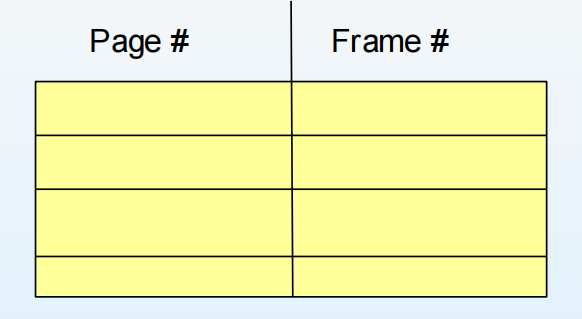
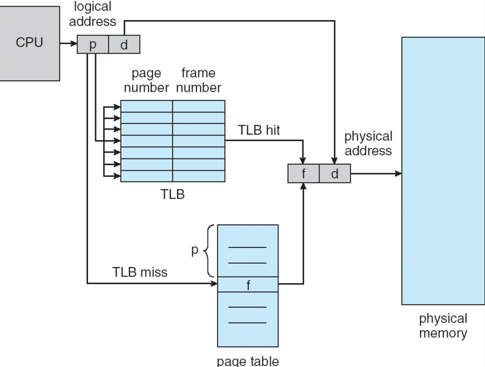
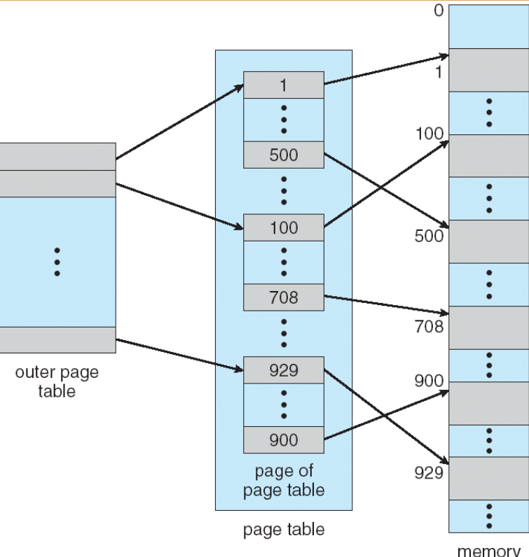
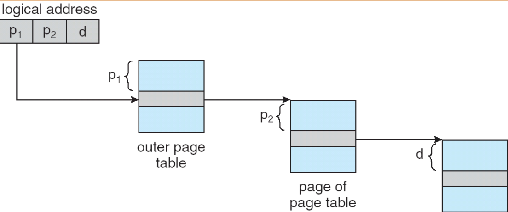
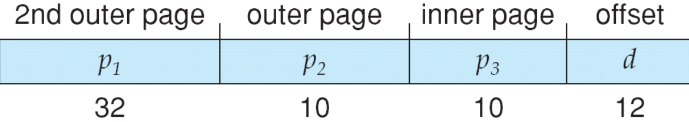
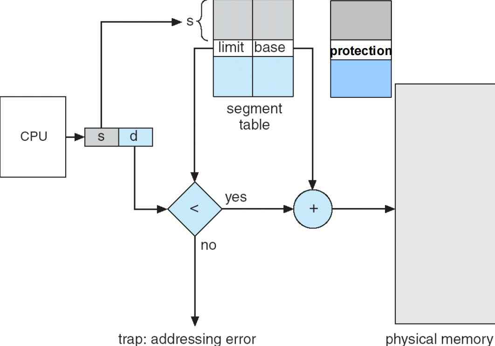
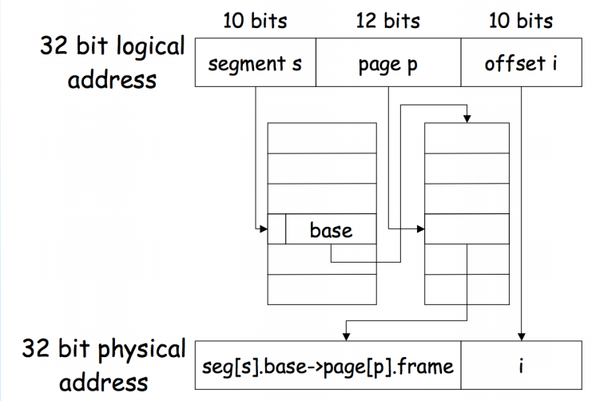

# Main Memory

## 8.1 背景

- 程序必须从磁盘加载到内存中，并放入进程中才能运行。
- **主内存和寄存器**是 CPU 可以直接访问的唯一存储介质。
- 寄存器访问只需**一个 CPU 时钟周期**（或更短）。
- 主内存访问可能需要**多个时钟周期**。
- **缓存**位于主内存和 CPU 寄存器之间。
- 需要对内存进行保护以确保其正确运行。

### Base and Limit Registers

- **基址寄存器（Base Register）**：存储进程的起始地址。
- **界限寄存器（Limit Register）**：存储进程的长度。

每次内存访问时，CPU 会将逻辑地址与基址寄存器相加以获得物理地址，并检查该地址是否在界限寄存器指定的范围内。如果不在范围内，则触发**内存保护异常**。

为什么需要基址和界限寄存器？

- 防止进程访问未分配给它的内存区域，确保内存保护。
- 允许进程在内存中的位置独立于其逻辑地址空间，提高内存利用率。
- 支持动态内存分配和多任务处理。
- 简化内存管理，减少碎片化。

### Binding of Instructions and Data to Memory

- **编译时绑定**：如果在编译时知道程序将被加载到内存中的哪个位置，则可以生成绝对地址代码。大部分时候见不到，典型例子有 BIOS 固件。
- **装入时绑定**：必须生成可重定位代码，编译器生成相对地址代码。装入程序时，操作系统将基址寄存器设置为程序的起始地址。典型例子有操作系统。
- **执行时绑定**：允许程序在执行过程中移动。需要硬件支持（基址和界限寄存器）。大部分程序是这样的。

### 逻辑地址和物理地址

- **逻辑地址（Logical Address）**：也称为虚拟地址，是程序生成的地址，由 CPU 生成。
- **物理地址（Physical Address）**：是实际的内存地址，由内存单元使用。

在调试程序时，我们看到的地址其实是逻辑地址。操作系统和硬件负责将逻辑地址映射到物理地址。

### Memory-Management Unit (MMU)

- **内存管理单元（MMU）**：硬件设备，负责将逻辑地址转换为物理地址。
- 在 MMU 模式下，重定向寄存器会被添加到每个逻辑地址以生成物理地址。
- 用户只能看到逻辑地址，而不会看到物理地址。

### 动态加载

- 程序的某些部分（如子程序）仅在需要时加载到内存中。
- 节省内存空间，提高效率。未使用的routine不会被加载。
- 不需要操作系统的特殊支持，通过程序设计实现。
- 当需要大量代码来处理不常见的情况时非常有用。

### 动态链接

- 链接推迟到执行时进行。
- 小片代码（stub）放在内存中，调用时跳转到实际子程序。

## 8.2 交换

- 可以把部分不常用的进程放进swap分区中，当需要使用的时候再调回内存。
- 备份存储 —— 足够大的快速磁盘，用于容纳所有用户的所有内存映像的副本；必须提供对这些内存映像的直接访问。
- swap分区有特定格式，并且受保护。

## 8.3 连续内存分配

- 主存一般来说划分为两个部分
    - 操作系统部分，通常驻留在内存的低地址部分
    - 用户进程部分，通常驻留在内存的高地址部分
- 重定位寄存器用于保护用户进程免受彼此干扰，以及免受操作系统代码和数据更改的影响。
    - 基址寄存器包含最小物理地址的值
    - 界限寄存器包含逻辑地址范围 ———— 每个逻辑地址必须小于界限寄存器的值
    - MMU 动态映射逻辑地址

### 动态分区分配问题

- First-Fit：从头开始扫描，找到第一个足够大的空闲分区。
- Best-Fit：扫描整个空闲列表，找到最小的足够大的分区。
    - 产生最小的剩余分区，但可能产生大量小碎片。
- Worst-Fit：扫描整个空闲列表，找到最大的空闲分区。
    - 产生最大的剩余分区。

**First-fit 和 best-fit 在速度和内存利用率方面通常优于 worst-fit。**

### 碎片

- **外部碎片**：由于动态分区分配，内存中存在许多小的未使用空间，无法满足新进程的内存需求。
    - 解决方法：紧凑（Compaction）——将所有进程移动到内存的一端，以创建一个大的连续空闲空间。
- **内部碎片**：分配给进程的内存块大于其实际需求，导致未使用的空间。
    - 解决方法：使用更小的分配单位，如分页或分段。

## 8.4 分页

- 将物理内存划分为固定大小的块，称为 frames
- 将逻辑内存划分为相同大小的块，称为 pages

### Address Translation Scheme

- 逻辑地址由两部分组成：页号（p）和页内偏移量（d）。

| 部分        | 含义            | 作用                   |
| --------- | ------------- | -------------------- |
| `p`（页号）   | 表示这个逻辑地址属于哪一页 | 作为索引去查页表（page table） |
| `d`（页内偏移） | 表示在这一页内的具体位置  | 用于定位页内的具体字节          |

### 页表

- 页表是一个大数组，里面有 2^p 个条目（p 是页号的位数）。
- 每个进程都有一个页表，存储**逻辑页号到物理帧号的映射**。
- 每个进程都有自己的页表，因为每个进程都有独立的逻辑地址空间。如果所有进程共享同一个页表，那么不同进程的逻辑地址会映射到同一个物理地址区域。

### 页表的硬件实现

- 页表是存储在主存中的，存储在用户态还是内核态？
- Page-table base register (PTBR)：保存当前进程页表的**起始地址**
- Page-table length register (PTLR)：保存页表的**长度（页数）**

### TLB

- translation look-aside buffers：一种高速缓存，存储最近使用的页表条目。

{width=300px}

### 含 TLB 的分页

{width=600px}

### Effective Access Time (EAT)

| 符号                  | 含义                                     | 典型量级          |
| ------------------- | -------------------------------------- | ------------- |
| ( \varepsilon )     | TLB（联想存储）查找时间（associative lookup time） | 很小，比如 10ns    |
| Memory cycle = 1 µs | 访问一次主存的时间                              | 1 µs          |
| ( \alpha )          | 命中率（Hit Ratio） = 查TLB命中的概率             | 比如 0.9 或 0.98 |
| ( 1 - \alpha )      | 未命中率（Miss Ratio）                       |               |
\

- 命中
    * 访问TLB（花 ( \varepsilon ) 时间）
    * 直接得到物理地址 → 访问主存一次（1 µs）

所以命中时总时间：
\[
T_{\text{hit}} = \varepsilon + 1
\]

- 未命中
    * 访问TLB（花 ( \varepsilon ) 时间）
    * 查页表（要访问主存一次，1 µs）
    * 再访问目标单元（又访问主存一次，1 µs）

所以未命中时总时间：
\[
T_{\text{miss}} = \varepsilon + 2
\]

所以总的来说：

\[
EAT = T_{\text{hit}} \times \text{HitRatio} + T_{\text{miss}} \times (1 - \text{HitRatio})
\]

\[
EAT = (\varepsilon + 1)\alpha + (\varepsilon + 2)(1 - \alpha)
\]

\[
EAT = 2 + \varepsilon - \alpha
\]

### 页表中的内存保护

- 每个页表条目包含一个有效位（valid bit），用于指示该页是否在进程的逻辑地址空间中。

### 共享页

通过映射关系，将多个进程的逻辑页映射到同一个物理页，从而实现代码共享。

## 8.5 页表的结构

### Hierarchical Paging 层次分页法

#### 两级页表

{width=400px}

- 在页表大小为 1K 的 32 位机器上，逻辑地址分为：
    - 一个 22 位的页号
    - 一个 10 位的页偏移量
- 由于页表是分页的，页号又分为：
    - 一个 12 位的页号
    - 一个 10 位的页偏移量

{width=300px}

p1 是第一级页表的索引，p2 是第二级页表的索引，d 是页内偏移量。

{width=400px}

#### 三级页表

在 64 位机器上：

{width=400px}

### Hashed Page Tables 哈希页表

- 适用于**大地址空间**的系统（如 64 位系统）
- 使用哈希函数将逻辑页号映射到页表中的一个条目。

哈希页表是针对“虚拟空间巨大、但使用稀疏”场景的一种折中

- 只开一个小得多的哈希表（比如几万个或几百万个桶）
- 当需要映射一个页时，哈希 (VPN, ASID) → 放入某个桶
- 查找时再从桶里找到匹配项

在哈希页表机制中，系统为了解决传统页表在大虚拟地址空间下占用内存过多的问题，引入了一种基于哈希函数的间接查找方式。具体来说，当CPU给出一个虚拟地址后，首先将其拆分为虚拟页号（VPN）和页内偏移，然后把VPN与当前进程的地址空间标识符（ASID）一起输入哈希函数，计算得到一个哈希索引值。这个索引用来定位到哈希表中的一个桶（bucket），桶中存放的是一个或多个页表项的链表结构。每个页表项都包含对应的虚拟页号VPN、ASID、以及该页映射的物理页框号（PFN）。系统随后沿着该链表逐项比对VPN与ASID，若找到匹配项，则取出对应的PFN，与原虚拟地址的页内偏移拼接，形成物理地址；若未找到，则说明该页未在内存中，需要产生缺页异常并从外存中调入。由于哈希页表通过哈希函数间接索引页表项，不再为每个虚拟页保留独立表项，因此显著减少了页表占用空间，同时平均查找效率接近O(1)，不过在发生哈希冲突时仍需线性遍历链表，会导致性能略有下降。

### Inverted Page Tables 反向页表

- 它观察到前两个方案的一个问题：页表大小与逻辑地址空间成正比。
- 因为通常物理内存少于逻辑地址空间，所以反向页表的做法是为每个物理帧建立表项
- 其缺点是必须倒着查找，这通常需要线性搜索，效率较低。

在反向页表机制中，系统不再为每个进程维护一张与虚拟地址空间同样大的页表，而是只建立一张全局性的反向页表，其大小与物理内存中的页框数相同。每个物理页框对应反向页表中的一个表项，表项中记录该页框当前属于哪个进程（ASID）以及该进程的哪个虚拟页号（VPN）。当CPU访问一个虚拟地址时，系统会先分离出虚拟页号VPN与页内偏移，然后将VPN和当前进程的ASID一起输入到哈希函数中计算出一个索引，用于在反向页表中查找。如果哈希表命中，则根据表项获得该虚拟页对应的物理页框号，拼接上页内偏移得到物理地址；若哈希未命中或哈希冲突，则可能需要顺序搜索或链式查找以找到匹配的〈ASID, VPN〉项，从而完成映射。由于反向页表的规模仅与物理内存大小有关，而不是虚拟空间大小，因此显著节省内存，但查找过程可能较慢，因此通常会配合TLB缓存以加快地址转换。

## 8.6 分段

- 方便用户去读
- 一个程序就是多个段的集合。段是逻辑上相关的信息块，如代码段、数据段、堆栈段等。
- 逻辑地址由一个二元组组成：  
    `<段号 (segment-number), 段内偏移量 (offset)>`

- 段表（Segment Table）用于将二维逻辑地址映射到物理地址；  
  每个段表项包含以下内容：  
    - **base**：该段在内存中的起始物理地址  
    - **limit**：该段的长度（最大有效偏移量）

- **段表基址寄存器（STBR）**：指向段表在内存中的位置

- **段表长度寄存器（STLR）**：表示程序使用的段的数量；  
  当段号 `s < STLR` 时，段号才合法

- 保护
    - valid 位：指示该段是否在逻辑地址空间中
    - 权限位：指示该段的访问权限（读、写、执行等）

{width=600px}

!!! note "Paging v.s. Segementation"

    | 特性 | 分页（Paging） | 分段（Segmentation） |
    |------|----------------|-----------------------|
    | **划分方式** | 将进程的虚拟地址空间切成固定大小的页（Page） | 按逻辑结构将程序分成段（Segment），每段大小可变 |
    | **是否逻辑相关** | 纯粹从物理内存管理角度划分，不反映程序结构 | 直接反映程序逻辑结构（代码段、数据段、栈段等） |
    | **大小是否固定** | 固定大小，例如 4KB、8KB | 大小不固定，依程序需求动态确定 |
    | **地址结构** | `<页号, 页内偏移>` | `<段号, 段内偏移>` |
    | **是否会产生外部碎片** | 不会（因为页大小固定） | 会产生外部碎片（段大小可变） |
    | **是否会产生内部碎片** | 会产生一些内部碎片 | 不会产生内部碎片 |
    | **页表/段表内容** | 每一页对应一个页表项（PTE） | 每一段对应一个段表项（base + limit） |
    | **保护方式** | 通常在页表项中提供读/写/执行等权限 | 每段可独立设定权限（更自然的逻辑保护） |
    | **优点** | 内存利用率更高，管理简单，适合现代 OS | 反映程序逻辑结构，便于共享与保护 |
    | **缺点** | 不反映程序结构，需要额外保护机制 | 外部碎片严重，难以管理 |
    | **现代系统使用情况** | 广泛使用（如 x86 的分页机制） | 独立的“纯分段”几乎已被淘汰 |
    | **是否可结合使用** | 可（如 x86：分段 + 分页） | 可（通常在逻辑层，配合分页） |

    1. 段是良好的信息逻辑单元（共享、保护、对用户友好）
    2. 页是良好的信息物理单元（简单的内存管理）
    3. 最好的是结合两者，上层segementation，下层paging

**Segmentation on paging**

这意味着把虚拟地址空间先按“段（segment）”划分（反映程序的逻辑结构），然后把每个段再用**页（pages）**来物理映射。也可以理解为：每个段由自己的页表（或页表子空间）管理。

常见场景：每个进程有段表（segment table），段表项不直接含物理基址，而是指向该段的页表 -> 再由页表把页号映射到物理帧。

{width=600px}

## 8.7 例子：Intel Pentium

略