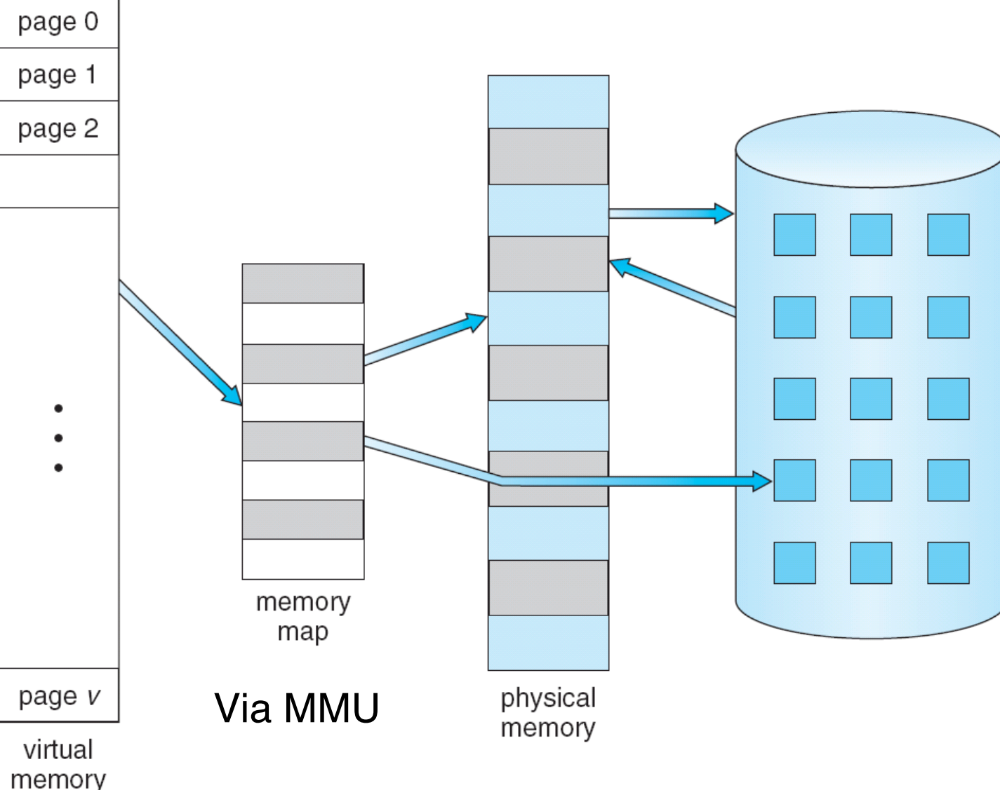
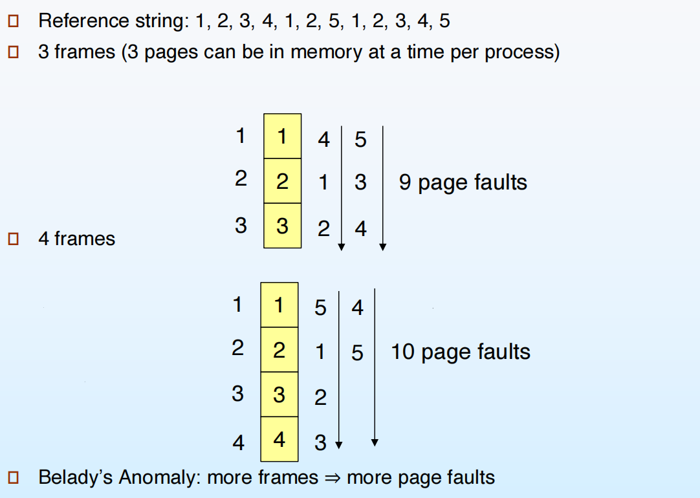
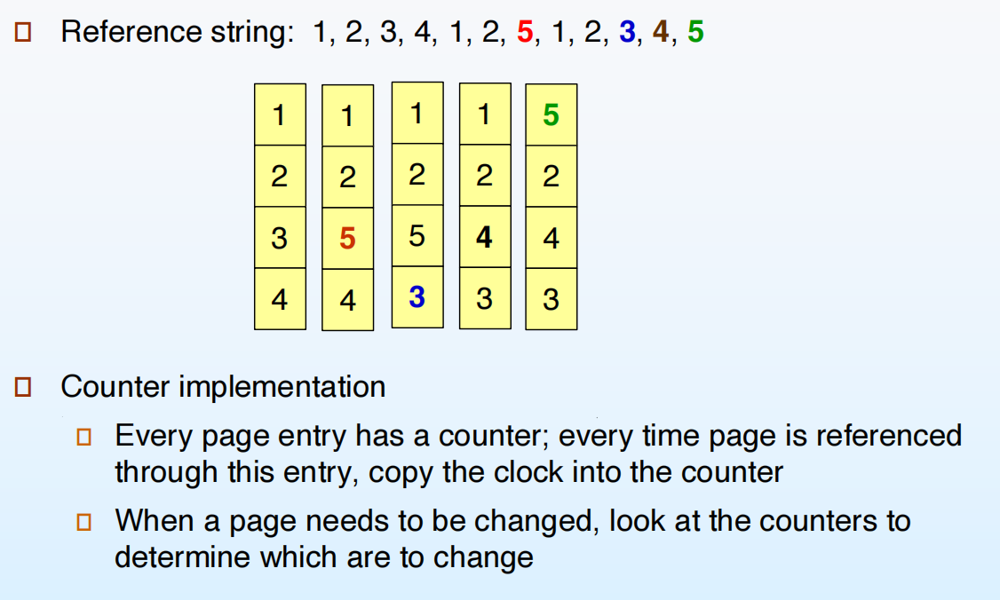
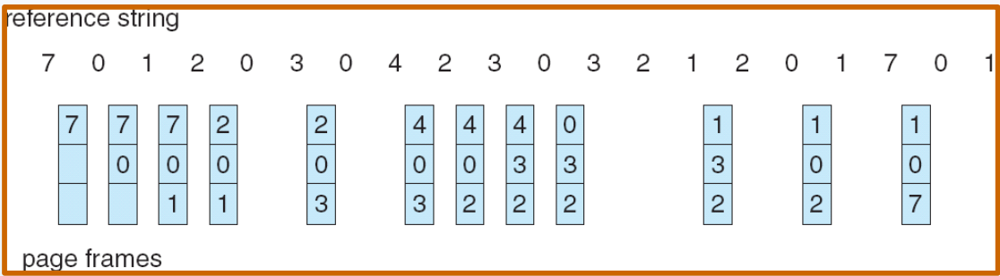
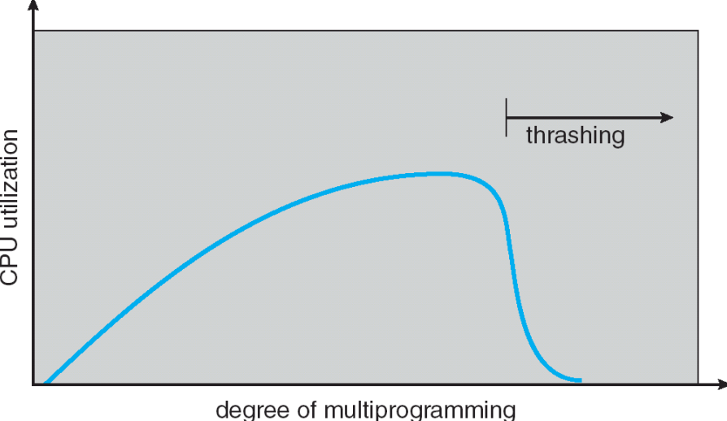

# Virtual Memory

## 9.1 背景

- 虚拟内存——“用户逻辑内存与物理内存的分离”
    - 逻辑内存空间可以远大于物理内存空间
    - 程序可以执行而不必完全装入内存。只有当前需要的部分才装入内存
    - 允许地址空间被多个进程共享
    - 允许更有效的进程创建
- 虚拟内存可以被创建通过：
    - 需求分页（demand paging）
    - 需求分段（demand segmentation）

{width=600px}

在硬盘区域开辟了一个内存大小2倍的交换区（swap space）。为什么是2倍？当映射关系不够时，操作系统可以将一些内存页换出到交换区，从而腾出内存空间给新的页。这也就是所谓的“按需换页”。

## 9.2 Demand Paging

- 仅当进程需要某页时才将其调入内存
    - 更少的I/O需求
    - 更少的内存需求
    - 更快的响应
    - 更多用户

在硬盘上，应用程序以可执行文件（例如 .exe）的形式被存放在某种文件容器结构中；但当程序第一次被加载运行时，操作系统不会直接以这种磁盘格式来执行，而是把其中的指令和数据按需取出、解析，并重新组织成适合在内存中运行的格式，也就是被划分成一个个固定大小的页面（page）放入相应的内存分区。磁盘上的 .exe 文件格式与内存中的页面布局完全不同，前者是为了存储和链接而设计，而后者是为了地址转换和分页管理而存在。当发生换页时，操作系统会把页面的内容写入交换区（swap）作为临时副本，因此 swap 里保存的也是内存页面的拷贝，而不是原始 .exe 文件的结构。

**Valid-Invalid Bit**

每个页表项都有一个有效-无效位（valid-invalid bit），用来指示该页是否在内存中。一开始，所有页表项都被标记为无效（invalid）。当进程试图访问一个页时，如果该页的页表项被标记为无效，操作系统会触发一个缺页异常（page fault），并将所需的页从磁盘加载到内存中，然后更新页表项为有效（valid）。

**Page Fault**

- 第一次访问都是缺页
- 因某种原因被换出的页再次被访问时也会发生缺页

处理的步骤：

1. 操作系统查找另一个表（kept with PCB）来决定
    - 只是不在内存中
    - 不合法的访问 -> 终止进程
2. 选择一个空闲的帧；如果没有，则选择一个要换出的帧
3. 将所需的页从磁盘读入所选的帧
4. 更新页表和内存映射表
5. 将 valid-invalid 位设置为有效
6. 重启导致缺页的指令

**Performance of Demand Paging**

- Page Fault Rate (p)：$ 0 \le p \le 1.0 $
    - if $ p = 0 $, no page faults
    - if $ p = 1 $, every reference is a page fault
- Effective Access Time (EAT)：
    - $ \text{memory access time} = \text{ma}
    - $ \text{page fault service time} = \text{pft} $
        - $ \text{pft} = \text{page fault overhead} + \text{swap page out} + \text{swap page in} + \text{restart overhead} $
    - $ EAT = (1 - p) \time ma + p \time pft $

## 9.3 Copy-on-write

- 允许父子进程共享同一页，直到其中一个进程试图修改该页，这时才为该进程创建该页的副本
- COW的概念：
    - 父进程和子进程的页表项都标记为只读
    - 当其中一个进程试图写入该页时，会引发一个保护异常
    - 操作系统会为该进程分配一个新的页，将原页的内容复制到新页中，然后更新该进程的页表项以指向新页，并将其标记为可读写

{width=400px}
{width=400px}

**What happens if there is no free frame?**

- Page replacement —— 选择一个页进行换出，以便为新页腾出空间
    - 算法
    - 性能
- 一些页可能被多次带进内存中

## 9.4 Page Replacement

- 使用 modifyd/dirty 位来减少换出页的数量
    - 如果一个页自从被调入内存后没有被修改过，则不需要将其写回磁盘
    - 每个页表项都有一个修改位（modified/dirty bit），当页被修改时，该位被设置为1；否则为0
- 页面替换算法：
    - 先进先出（FIFO）
    - 最少使用（LRU）
    - 最少使用次数（LFU）
    - 时钟算法（Clock）

### First-In-First-Out (FIFO) Page Replacement

{width=600px}
{width=600px}

### Optimal Page Replacement

{width=600px}
{width=600px}

### Least Recently Used (LRU) Page Replacement

{width=600px}
{width=600px}

当有两个进程在这种方式下优先级一样时，这时候我们换出最先来的页。

有多少页数，这个方法就要维护多少个count值。而且每次访问页时，都要更新对应的count值，更新代价太高了。

- 近似算法
    - 使用一个栈来记录最近使用的页
        - 每次访问一个页时，将其从栈中移除并推到栈顶
        - 当需要换出页时，选择栈底的页
        - 不严谨
    - 使用一个参考位（reference bit）
        - 每个页表项都有一个参考位，表示该页是否被访问过
        - 一开始，所有参考位都被设置为0
        - 定期清除所有页的参考位
        - 当需要换出页时，选择第一个参考位为0的页
    - Second Chance Algorithm
        - 这是对 FIFO 算法的改进
        - 需要 reference bit
        - 将所有页组织成一个循环队列
        - 需要维护一个指针，指向下一个要检查的页
        - 如果参考位为1
            - 将参考位清0
            - 暂时保留该页在内存中
            - 在时钟顺序（循环队列）中向前扫描以寻找要替换的页时，总是应用相同的规则

### Counting-Based Page Replacement

- LFU (Least Frequently Used)
    - 维护一个计数器，记录每个页被访问的次数
    - 当需要换出页时，选择访问次数最少的页
- MFU (Most Frequently Used)
    - 基于这样的假设：最近被访问次数多的页可能已经完成了它的任务
    - 当需要换出页时，选择访问次数最多的页

## 9.5 Allocation of Frames

### Fixed Allocation & Priority Allocation

- 每个进程最少需要分配一定数量的帧
    - 反之会导致频繁的缺页中断
    - 称为“驻留集”（resident set）
- 两个主要的分配策略
    - 固定分配
        - 每个进程分配固定数量的帧
        - 可能导致某些进程频繁缺页，而其他进程有空闲帧
    - 优先级分配
        - 根据进程的优先级分配帧
        - 高优先级进程获得更多的帧

### Global vs. Local Allocation

- 全局分配
    - 所有进程共享所有可用的帧
    - 当一个进程发生缺页时，可以从任何其他进程中换出帧
- 局部分配
    - 每个进程只能从其分配的帧中进行替换
    - 防止一个进程占用过多的帧，影响其他进程的性能

## 9.6 Thrashing

有时我也没做磁盘的工作，但是磁盘一直在工作。

- 如果一个进程没有足够的页面，它就会频繁地发生缺页中断，这种现象称为颠簸。这会导致：
    - 低CPU利用率
    - 在paging device排队，ready queue变空
    - 操作系统认为需要提高多道程序设计级别
    - 更多的进程 -> 更少的页数/进程 -> 更多的颠簸

{width=500px}

**Demand Paging and Thrashing**

## 9.7 Memory-Mapped Files

## 9.8 Allocating Kernel Memory

## 9.9 Other Considerations

## 9.10 Operating-System Examples