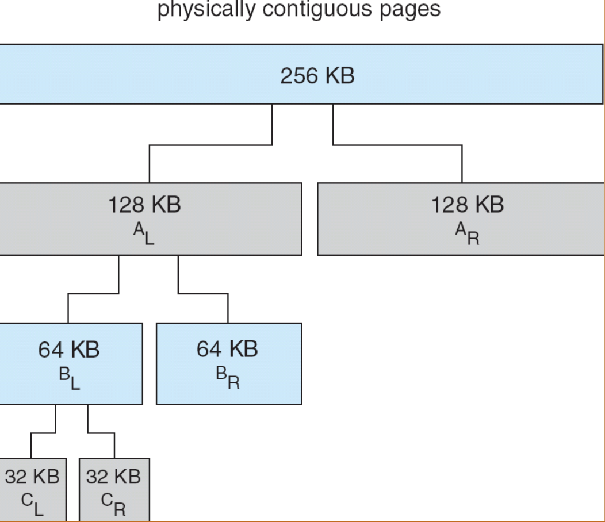

# Virtual Memory

## 9.1 背景

- 虚拟内存——“用户逻辑内存与物理内存的分离”
    - 逻辑内存空间可以远大于物理内存空间
    - 程序可以执行而不必完全装入内存。只有当前需要的部分才装入内存
    - 允许地址空间被多个进程共享
    - 允许更有效的进程创建
- 虚拟内存可以被创建通过：
    - 需求分页（demand paging）
    - 需求分段（demand segmentation）

{width=600px}

在硬盘区域开辟了一个内存大小2倍的交换区（swap space）。为什么是2倍？当映射关系不够时，操作系统可以将一些内存页换出到交换区，从而腾出内存空间给新的页。这也就是所谓的“按需换页”。

## 9.2 Demand Paging

- 仅当进程需要某页时才将其调入内存
    - 更少的I/O需求
    - 更少的内存需求
    - 更快的响应
    - 更多用户

在硬盘上，应用程序以可执行文件（例如 .exe）的形式被存放在某种文件容器结构中；但当程序第一次被加载运行时，操作系统不会直接以这种磁盘格式来执行，而是把其中的指令和数据按需取出、解析，并重新组织成适合在内存中运行的格式，也就是被划分成一个个固定大小的页面（page）放入相应的内存分区。磁盘上的 .exe 文件格式与内存中的页面布局完全不同，前者是为了存储和链接而设计，而后者是为了地址转换和分页管理而存在。当发生换页时，操作系统会把页面的内容写入交换区（swap）作为临时副本，因此 swap 里保存的也是内存页面的拷贝，而不是原始 .exe 文件的结构。

**Valid-Invalid Bit**

每个页表项都有一个有效-无效位（valid-invalid bit），用来指示该页是否在内存中。一开始，所有页表项都被标记为无效（invalid）。当进程试图访问一个页时，如果该页的页表项被标记为无效，操作系统会触发一个缺页异常（page fault），并将所需的页从磁盘加载到内存中，然后更新页表项为有效（valid）。

**Page Fault**

- 第一次访问都是缺页
- 因某种原因被换出的页再次被访问时也会发生缺页

处理的步骤：

1. 操作系统查找另一个表（kept with PCB）来决定
    - 只是不在内存中
    - 不合法的访问 -> 终止进程
2. 选择一个空闲的帧；如果没有，则选择一个要换出的帧
3. 将所需的页从磁盘读入所选的帧
4. 更新页表和内存映射表
5. 将 valid-invalid 位设置为有效
6. 重启导致缺页的指令

**Performance of Demand Paging**

- Page Fault Rate (p)：$ 0 \le p \le 1.0 $
    - if $ p = 0 $, no page faults
    - if $ p = 1 $, every reference is a page fault
- Effective Access Time (EAT)：
    - $ \text{memory access time} = \text{ma}
    - $ \text{page fault service time} = \text{pft} $
        - $ \text{pft} = \text{page fault overhead} + \text{swap page out} + \text{swap page in} + \text{restart overhead} $
    - $ EAT = (1 - p) \time ma + p \time pft $

## 9.3 Copy-on-write

- 允许父子进程共享同一页，直到其中一个进程试图修改该页，这时才为该进程创建该页的副本
- COW的概念：
    - 父进程和子进程的页表项都标记为只读
    - 当其中一个进程试图写入该页时，会引发一个保护异常
    - 操作系统会为该进程分配一个新的页，将原页的内容复制到新页中，然后更新该进程的页表项以指向新页，并将其标记为可读写

{width=400px}
{width=400px}

**What happens if there is no free frame?**

- Page replacement —— 选择一个页进行换出，以便为新页腾出空间
    - 算法
    - 性能
- 一些页可能被多次带进内存中

## 9.4 Page Replacement

- 使用 modifyd/dirty 位来减少换出页的数量
    - 如果一个页自从被调入内存后没有被修改过，则不需要将其写回磁盘
    - 每个页表项都有一个修改位（modified/dirty bit），当页被修改时，该位被设置为1；否则为0
- 页面替换算法：
    - 先进先出（FIFO）
    - 最少使用（LRU）
    - 最少使用次数（LFU）
    - 时钟算法（Clock）

### First-In-First-Out (FIFO) Page Replacement

{width=600px}
{width=600px}

### Optimal Page Replacement

{width=600px}
{width=600px}

### Least Recently Used (LRU) Page Replacement

{width=600px}
{width=600px}

当有两个进程在这种方式下优先级一样时，这时候我们换出最先来的页。

有多少页数，这个方法就要维护多少个count值。而且每次访问页时，都要更新对应的count值，更新代价太高了。

- 近似算法
    - 使用一个栈来记录最近使用的页
        - 每次访问一个页时，将其从栈中移除并推到栈顶
        - 当需要换出页时，选择栈底的页
        - 不严谨
    - 使用一个参考位（reference bit）
        - 每个页表项都有一个参考位，表示该页是否被访问过
        - 一开始，所有参考位都被设置为0
        - 定期清除所有页的参考位
        - 当需要换出页时，选择第一个参考位为0的页
    - Second Chance Algorithm
        - 这是对 FIFO 算法的改进
        - 需要 reference bit
        - 将所有页组织成一个循环队列
        - 需要维护一个指针，指向下一个要检查的页
        - 如果参考位为1
            - 将参考位清0
            - 暂时保留该页在内存中
            - 在时钟顺序（循环队列）中向前扫描以寻找要替换的页时，总是应用相同的规则

### Counting-Based Page Replacement

- LFU (Least Frequently Used)
    - 维护一个计数器，记录每个页被访问的次数
    - 当需要换出页时，选择访问次数最少的页
- MFU (Most Frequently Used)
    - 基于这样的假设：最近被访问次数多的页可能已经完成了它的任务
    - 当需要换出页时，选择访问次数最多的页

## 9.5 Allocation of Frames

### Fixed Allocation & Priority Allocation

- 每个进程最少需要分配一定数量的帧
    - 反之会导致频繁的缺页中断
    - 称为“驻留集”（resident set）
- 两个主要的分配策略
    - 固定分配
        - 每个进程分配固定数量的帧
        - 可能导致某些进程频繁缺页，而其他进程有空闲帧
    - 优先级分配
        - 根据进程的优先级分配帧
        - 高优先级进程获得更多的帧

### Global vs. Local Allocation

- 全局分配
    - 所有进程共享所有可用的帧
    - 当一个进程发生缺页时，可以从任何其他进程中换出帧
- 局部分配
    - 每个进程只能从其分配的帧中进行替换
    - 防止一个进程占用过多的帧，影响其他进程的性能

## 9.6 Thrashing

有时我也没做磁盘的工作，但是磁盘一直在工作。

- 如果一个进程没有足够的页面，它就会频繁地发生缺页中断，这种现象称为颠簸。这会导致：
    - 低CPU利用率
    - 在paging device排队，ready queue变空
    - 操作系统认为需要提高多道程序设计级别
    - 更多的进程 -> 更少的页数/进程 -> 更多的颠簸

{width=500px}

**Demand Paging and Thrashing**

### Working-Set Model

- 工作集（working set）——进程在一段时间内所使用的页面集合
    - 定义：$ WSS_i (t, \Delta) $ 是进程 $ P_i $ 在时间 $ t $ 之前的时间间隔 $ \Delta $ 内所引用的页面集合
        - 如果 $ \Delta $ 太小，可能无法包含进程的全部局部性
        - 如果 $ \Delta $ 太大，可能包含不相关的页面
        - 如果 $ \Delta = \infty $，则工作集等同于进程的全部页面
    - 通过跟踪页面引用历史来确定工作集
    - 工作集大小 $ D = \sum_{i=1}^{N} |WSS_i| $
        - 如果 $ D > $ 可用帧数，则发生颠簸
        - 如果 $ D < $ 可用帧数，则系统处于稳定状态

**Keeping Track of the Working Set**

- 使用时间间隔计时器进行近似
    - 每个进程有一个定时器，在每个 $ \Delta $ 时间单位后触发
    - 当定时器触发时，操作系统检查每个页面的参考位
        - 如果参考位为1，则将其加入工作集，并将参考位清0
        - 如果参考位为0，则将其从工作集中移除
- 有一个隐形规则，页面会被尽量加载回原来的位置，而不是去寻找一个新的位置

### Page-Fault Frequency Scheme

- 通过监控页面错误率来调整分配给进程的帧数
    - 如果页面错误率高于某个阈值，说明进程需要更多的帧，则增加分配的帧数
    - 如果页面错误率低于某个阈值，说明进程有多余的帧，则减少分配的帧数

## 9.7 Memory-Mapped Files

- 将文件映射到进程的地址空间，使得文件的内容**可以像内存一样被访问**
    - 允许按需加载文件内容
    - 支持共享内存映射文件
    - 提高文件I/O性能

{width=500px}

!!! danger "Memory-Mapped Shared Memory 和 Copy-on-write 的区别"
    - Memory-Mapped Shared Memory 允许多个进程共享同一文件的映射，任何一个进程对映射区域的修改都会反映到文件中，并且其他进程也能看到这些修改
    - Copy-on-write 则是在父子进程之间共享内存页，一旦当其中一个进程尝试修改该页，就为该进程创建该页的副本，从而实现独立的修改

{width=600px}

!!! question "为什么 memory-mapped files 比传统的 read() 和 write() 更快？"
    - 传统的 read() 和 write() 需要多次**系统调用**，涉及用户态和内核态的切换，开销较大
    - memory-mapped files 通过将文件直接映射到进程的地址空间，允许进程直接访问文件内容，触发 demand paging，调用层次少，减少了系统调用的次数，提高了性能

## 9.8 Allocating Kernel Memory

操作系统编程和普通的应用程序编程有很大的不同，没有虚拟内存的保护。这也就意味着，内核代码可以直接访问物理内存地址，而不需要经过虚拟地址转换。

- 内核从专门的内核内存池中分配内存，这个内存池通常是预先分配好的，或者通过特殊的内存管理机制来管理。
    - 内核要分配各种大小的结构，需要减少碎片
    - 一些内核呢村需要连续的物理内存

所以大多数系统不会对内核代码和数据采用分页机制。

### Buddy System

- 从由物理上连续的页面组成的固定大小段中分配内存
- 内存被划分为大小为 $ 2^k $ 的块
    - 当请求内存时，找到最小的 $ 2^k $ 块来满足请求
    - 如果没有合适的块，则将更大的块分割成两个伙伴块，直到找到合适的大小
    - 释放内存时，检查相邻的伙伴块是否也空闲，如果是，则合并成更大的块

{width=500px}

这种方法下，internal fragmentation 能保证小于 50%。

### Slab Allocation

- 预先分配一组对象缓存（slabs）来满足内核对象的分配需求
- 内核中所有的结构体是不允许动态变化大小的，所以这些结构体都是固定大小的。与其每次分配和释放内存时都去找合适的内存块，不如预先分配好一大块内存，然后将其划分为多个固定大小的缓存区（slabs），每个缓存区用于存放特定类型的内核对象。
- 也有缺点：
    - 不能很好地处理大小变化的对象
    - 可能会导致内存碎片

!!! note "限制进程数量的值"
    1. pid 的位数限制
    2. slab 分配器的限制

### Prepageing

- 预分配
    - 为了减少进程初始化造成的大量缺页
    - 在进程被引用前为这个进程准备一些页
    - 但如果这个被准备的页并没有被使用，那么 I/O 和内存就被浪费了
    - 假设 s 个页被预分配，$ \alpha $ 是被使用的页的比例
        - Is benefit: $ s \time a $ saved page faults > or < cost: $ s \time (1 - \alpha) \time$?

## 9.9 Other Considerations

### Page Size

Page 如果大，那么 table 就会变小，也就会节省内存，但是内部碎片会变多，一旦发生 page fault，代价会变大。

### TLB

- TLB Reach
    - 增加 Page Size，通过 TLB 访问的内存也就变大（不太现实）
    - 动态允许多种 Page Size

### Program Structure

- Each row is stored in one page，也就是说每一行数据都存储在一个独立的页中

```c
for (i = 0; i < 128; i++) {
    for (j = 0; j < 128; j++) {
        data[i][j] = 0;
    }
}
```

128 page faults

```c
for (j = 0; j < N; j++) {
    for (i = 0; i < N; i++) {
        data[i][j] = 0;
    }
}
```

128 * 128 = 16384 page faults

### I/O Interlock

有些页是不能被换出的，比如内核使用的页等等

- 处理 I/O 操作时，必须确保相关的页在内存中
    - 使用锁定页（locked pages）来防止它们被换出
    - 在启动 I/O 操作前锁定页，I/O 完成后解锁页

## 9.10 Operating-System Examples

### Windows XP

* **使用按需分页，并采用“聚簇 (clustering)”技术。**
  聚簇指的是在发生缺页时，不只加载发生缺页的那一页，还会将其周围的一些页面一起加载到内存中，提高预取效率。

* **为每个进程分配“工作集最小值”和“工作集最大值”（通常为 50–345 页）。**
  工作集表示一个进程当前在内存中的活跃页集合。

* **工作集最小值（working set minimum）是系统保证进程至少会拥有的页面数量。**

* **进程最多可以拥有其工作集最大值（working set maximum）定义的页数。**
  如果进程在达到最大值后继续发生缺页，则只能在本进程内部进行页面替换（即局部替换策略）。

* **当系统的可用物理内存低于某个阈值时，系统会自动启动“工作集修剪（working set trimming）”，以恢复足够的可用内存。**

* **工作集修剪会从那些拥有超过其工作集最小值页面的进程中，回收多余的页面。**

### Solaris

* **维护一个空闲页列表，用于分配给发生缺页的进程。**

* **Lotsfree：空闲内存阈值参数。**
  当系统的可用内存降到 *低于* lotsfree 时，系统开始进行页面换出（paging out）。

* **Desfree：空闲内存更低的阈值参数。**
  当可用内存低于 desfree 时，系统会**提高页面换出的频率**，加速回收内存。

* **Minfree：最低阈值。**
  当可用内存低于 minfree 时，系统会启动**交换（swapping）**，将整个进程换出到磁盘。

* **页面换出操作由 pageout 进程执行。**

* **pageout 使用改进时钟算法（modified clock algorithm）扫描并选择可换出的页面。**

* **scanrate 表示 pageout 扫描页面的速度，范围从 slowscan（低速扫描）到 fastscan（高速扫描）。**

* **pageout 调用的频率取决于空闲内存量：可用内存越少，pageout 调用越频繁，用以加速回收页面。**
