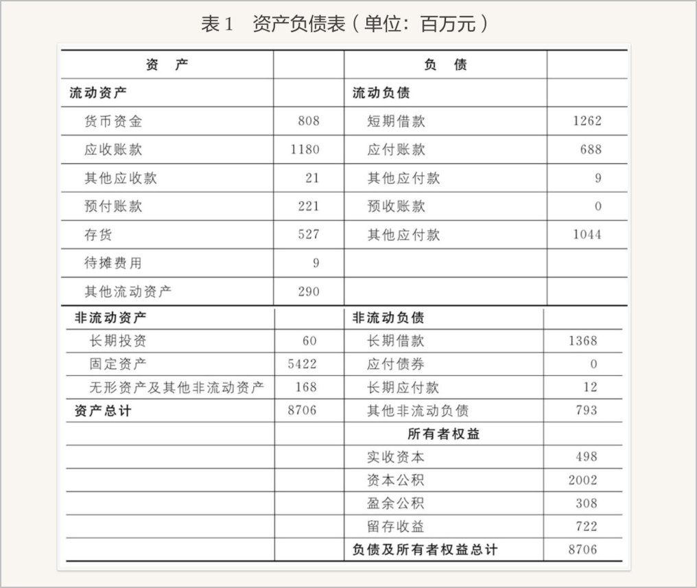
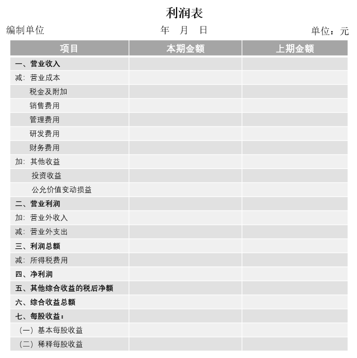

# 总论
## 会计内涵
### 会计的含义

会计是一个以提供财务为主的经济信息系统，是经济管理的重要工具。

- 做会计：记账、提供会计信息（报表）
- 用会计：利用信息、做好决策

1-4月：公司公布上年年报

交易所市场：沪、深

- 营业收入
    - 主营业务收入（产品利润收入）
    - 其他业务收入
- 营业外收入
    - 补助收入

!!! note
    区分“应收帐款”和“现金”，应收帐款并不是当场支付，目前未收到。现金的说服力 > 应收账款。

ST:被特别处理 

- 两年亏损:ST 
- 三四年亏损:退市

新规：最近一个会计年度经审计净收入小于零，且营收额低于1亿元，退市。

IPO要求连续3年提交报表供交易所审核。

**会计报表：**

1. 资产负债表：反应财务状况（月报，年报）
2. 利润表：反应经营成果（月报，年报）
3. 现金流量表：反应现金流量表（月报，年报）
4. 所有者权益变动表：反应所有者权益变动（年报）

**三大要素：**

1. 资产
2. 负债
3. 所有者权益（净资产）

!!! note
    资产 = 负债 + 所有者权益

!!! note
    收入 - 费用 = 利润

### 会计对象

以**货币计量**的经济活动即资金运动是企业会计的对象。

缺陷：只有能以货币计量的经济活动才可记录。

1. 资金进入企业

2. 资金的循环周转：G —— w --- p --- w' —— G' ，表现为**供应、生产、销售**过程，其价值发生了两种变化：

       - 资金的形态变化
       - 价值的增值

3. 资金退出企业

!!! tip
    进入 —— G —— w --- p --- w' —— G' —— 退出

    货币资金 储备资金 生产资金 产品资金 货币资金

先编利润表，再编资产负债表。

### 会计的主要内容
1. 会计原理
2. 各要素的确认、计量、记录
3. 企业财务报告的编制与分析

## 会计准则

## 会计假设
### 含义
正常会计活动的前提条件。
### 内容
**四大前提（四大假设）**

1. 会计主体假设 有3个**严格区分**
    1. 会计主体与主体所有者（借款）
    2. 会计主体与主题发生经济关系的别的主体（采购与销售）
    3. 会计主体与法律主体（合伙企业是会计主体但不是法律主体）
2. 持续经营假设 （除非有明确的反证要终止经营活动...）

    要求：持续经营状态与清算状态应采用完全不同的会计处理方法。

3. 会计分期假设
4. 货币计量和币值不变假设

