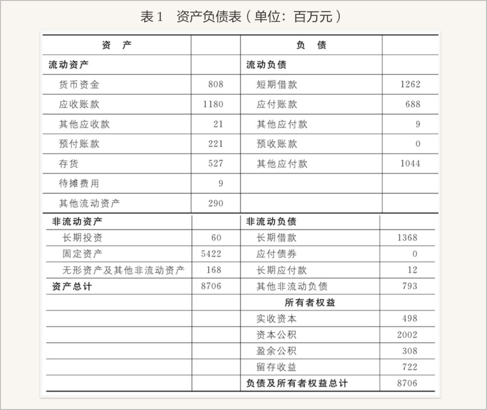
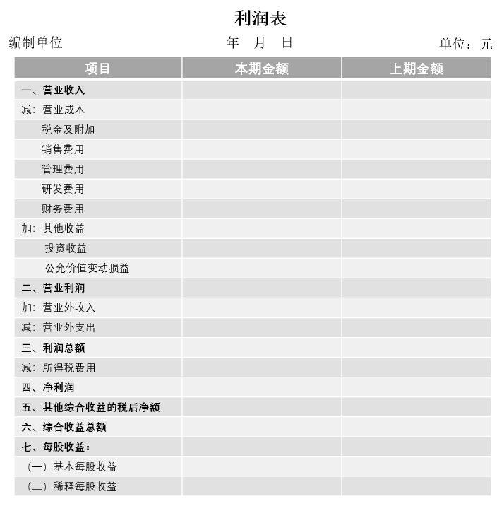
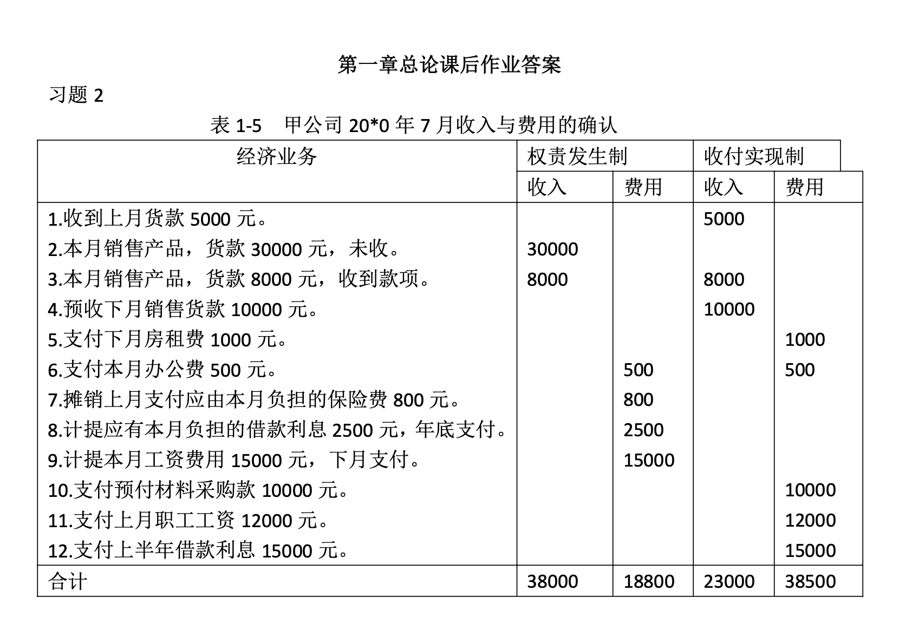

# 总论
## 会计内涵
### 会计的含义

会计是一个以提供财务为主的经济信息系统，是经济管理的重要工具。

- 做会计：记账、提供会计信息（报表）
- 用会计：利用信息、做好决策

**1-4月：公司公布上年年报**若推迟，可能有“难言之隐”。

交易所市场：沪、深

- 营业收入
    - 主营业务收入（产品利润收入）
    - 其他业务收入
- 营业外收入
    - 补助收入

!!! note
    区分“应收账款”和“现金”，应收账款并不是当场支付，目前未收到。现金的说服力 > 应收账款。

ST:被特别处理 

- 两年亏损:ST 
- 三四年亏损:退市

新规：最近一个会计年度经审计净收入小于零，且营收额低于1亿元，退市。

IPO要求连续3年提交报表供交易所审核。

**会计报表：**

1. 资产负债表：反应财务状况（月报，年报）
2. 利润表：反应经营成果（月报，年报）
3. 现金流量表：反应现金流量表（月报，年报）
4. 所有者权益变动表：反应所有者权益变动（年报）

**三大要素：**

1. 资产
2. 负债
3. 所有者权益（净资产）

这三者为**静态要素**。

!!! note
    资产 = 负债 + 所有者权益

!!! note
    收入 - 费用 = 利润

这三者为**动态要素**。

### 会计对象

以**货币计量**的经济活动即资金运动是企业会计的对象。

缺陷：只有能以货币计量的经济活动才可记录。

1. 资金进入企业

2. 资金的循环周转：G —— w --- p --- w' —— G' ，表现为**供应、生产、销售**过程，其价值发生了两种变化：

       - 资金的形态变化
       - 价值的增值

3. 资金退出企业

!!! tip
    进入 —— G —— w --- p --- w' —— G' —— 退出

    货币资金 储备资金 生产资金 产品资金 货币资金

先编利润表，再编资产负债表。

### 会计的主要内容
1. 会计原理
2. 各要素的确认、计量、记录
3. 企业财务报告的编制与分析

## 会计准则

## 会计假设
### 含义
正常会计活动的前提条件。
### 内容
**四大前提（四大假设）**

1. 会计主体假设 有3个**严格区分**
    1. 会计主体与主体所有者（借款）
    2. 会计主体与主题发生经济关系的别的主体（采购与销售）
    3. 会计主体与法律主体（合伙企业是会计主体但不是法律主体）
2. 持续经营假设 （除非有明确的反证要终止经营活动...）

    要求：持续经营状态与清算状态应采用完全不同的会计处理方法。

3. 会计分期假设
4. 货币计量和币值不变假设

- 会计分期是持续经营的必然结果
- 会计分期是对会计核算时间范围的具体划分
- 会计主体：能进行核算

法律主体：股份有限公司

### 缺陷
四大假设说明会计信息有哪些缺陷？

- 只反映某个主体
- 只反映历史价值
- 只反映某个期间
- 只反映货币信息

## 会计信息质量要求
1. 可靠性：客观真实
2. 相关性
3. 可理解性：清晰明了
4. 可比性：会计处理的方法应当前后期一致；不同会计主体的信息应互相可比
5. 实质重于形式：按照实质进行核算
6. 重要性：提供一切有用的重要信息
7. 谨慎性：对于收入、费用处理持稳健态度
8. 及时性：按规定期限
!!! note
    相关性有时会影响可靠性，要兼顾。    
    第一年巨亏，第二年盈利：使用损失计提    
    折旧年限下降，双倍余额递减法（加速折旧）：压低利润（业绩好的时候低调一点）  
    售后回购不能算销售  
    材料领用：先进先出法；加权平均法

## 会计确认的基础
### 收付实现制
以实际收到或支付现金作为确认收入和费用归属期间的标准。
!!! warning
    基本淘汰
### 权责发生制原则
以权利、责任的发生作为确认收入和费用归属期间的标准。

要求：跨期的收入费用，应采用特殊程序和方法记录和分配。

!!!note
    收入归属期是企业提供服务的会计期间  
    费用归属期是企业获得利益的会计期间

| 业务  | 权责发生制  | 收付实现制  |
| ---- | ---- | ---- |
| 销售A20件，单价500，收存银行 | 10000 | 10000 |
| 销售A20件，单价500，贷款未收 | 10000 | X |
| 预收购买单位贷款5000，存入银行 | X | 5000 |
| 1月以存款支付本季度租金900元 | 300 | 900 |

## 会计计量属性
### 类别
1. 历史成本（实际成本）
2. 重置成本（现行成本）
3. 可变现净值
4. 公允价值

### 应用原则
一般采用历史成本。采用...的，应当保证所确定的会计要素金额能够取得并可靠计量。

??? success "课后习题答案"
    