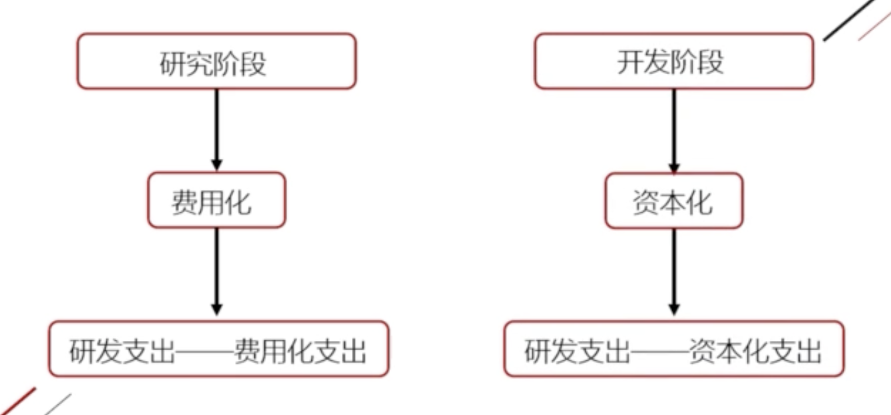
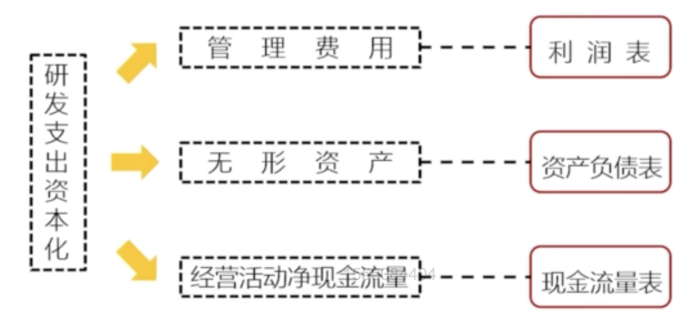
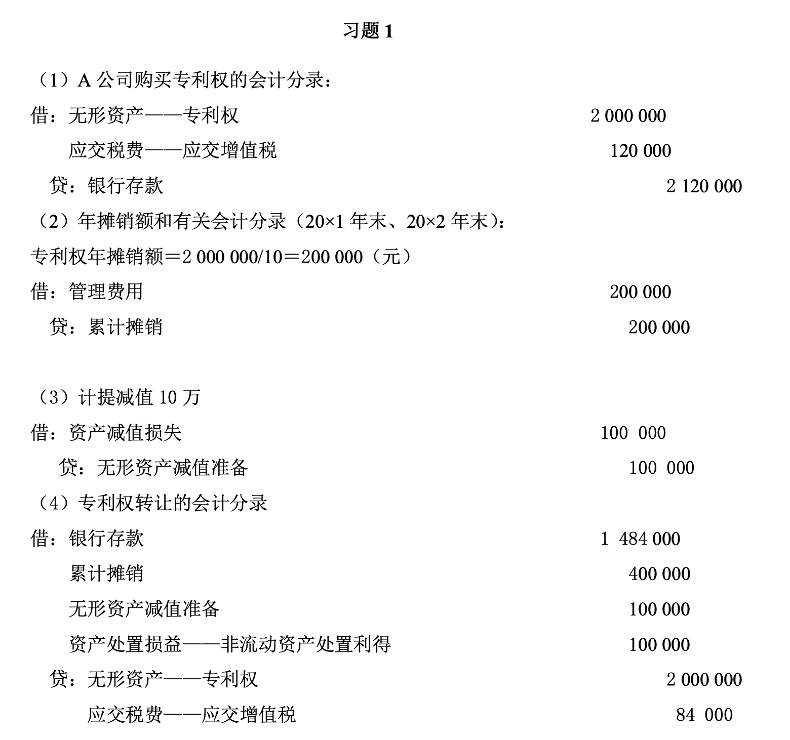
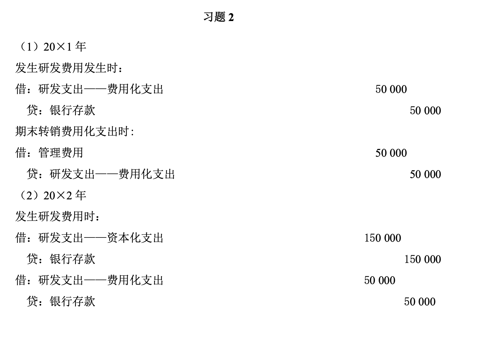
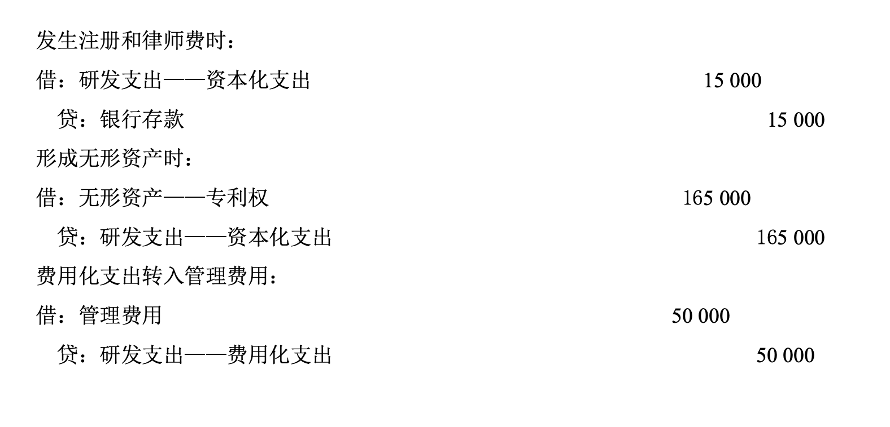

# 无形资产
包括专利权、商标权、土地使用权、特许权、非专利技术等
## 无形资产的取得
无形资产应当按照实际成本进行初始计量。
### 外购无形资产的成本 
包括**购买价款**、**相关税费（不包含一般纳税人的增值税）**以及**直接归属于使该项资产达到预定用途所发生的其他支出**

- 借：无形资产      
应交税费——应交增值税
- 贷：银行存款
### 投资者投入的无形资产的成本 
应当按照投资合同或协议**约定的价值**确定，但合同或协议约定价值不公允的，应该按**公允价值**入账。

- 借：无形资产      
应交税费——应交增值税
- 贷：实收资本

### 自行开发的无形资产成本
#### 研究与开发阶段的区分
1. **研究阶段** 研究阶段的有关支出，在发生时应当费用化计入当期损益。
2. **开发阶段** 如果企业能够证明开发支出符合无形资产的定义及相关确认条件，则可将其资本化确认为无形资产成本。
#### 设立账户
- 研发支出————费用化支出
    - 确认工资：
        - 借：研发支出-费用化支出
        - 贷：应付职工薪酬
    - 期末转为管理费用：
        - 借：管理费用
        - 贷：研发支出-费用化支出
- 研发支出————资本化支出
    - 确认工资：
        - 借：研发支出-资本化支出
        - 贷：应付职工薪酬
    - 期末**达到预定用途后**转为无形资产：
        - 借：无形资产
        - 贷：研发支出-资本化支出

{width="400px"}

!!! warning "企业操控"
    研发支出费用化还是资本化的问题。较多资本化->降低费用->提高利润。这样能同时美化3个表：

    {width="500px"}

## 无形资产的摊销
- 摊销方法：年限平均法
- 摊销期限：与其使用年限与合同或法律规定较短者（年限无法确定：减值测试）
- 会计处理
    - 借：管理费用（费用化）      
    制造费用（资本化）
    - 贷：累计摊销

- 当月增加的无形资产，**当月开始摊销**；当月减少的无形资产，当月**不再摊销**。

- 一般采用直线法摊销，一般残值视为**零**，除以下情况：
    - 有第三方承诺在无形资产使用寿命结束时购买该无形资产
    - 可以根据活跃市场得到预计残值信息

## 无形资产的期末计量

- 期末计量：发生减值，应该计提减值准备
    - 借：资产减值损失
    - 贷：无形资产减值准备

??? Example
    

## 无形资产的处置

1. 出售无形资产——作为资产处置损益
    - 借：银行存款      
    无形资产减值准备    
    累计摊销
    - 贷：无形资产    
    应交税费    
    资产处置损益

??? Example
    

2. 出租无形资产——作其他业务收入
    - 借：银行存款                 
    - 贷：其他业务收入

??? Example
    

3. 无形资产报废——作营业外支出
    - 借:累计摊销                       
    无形资产减值准备    
    营业外支出        
    - 贷:无形资产

??? Example
    

??? success "课后习题答案"
    
    
    
    