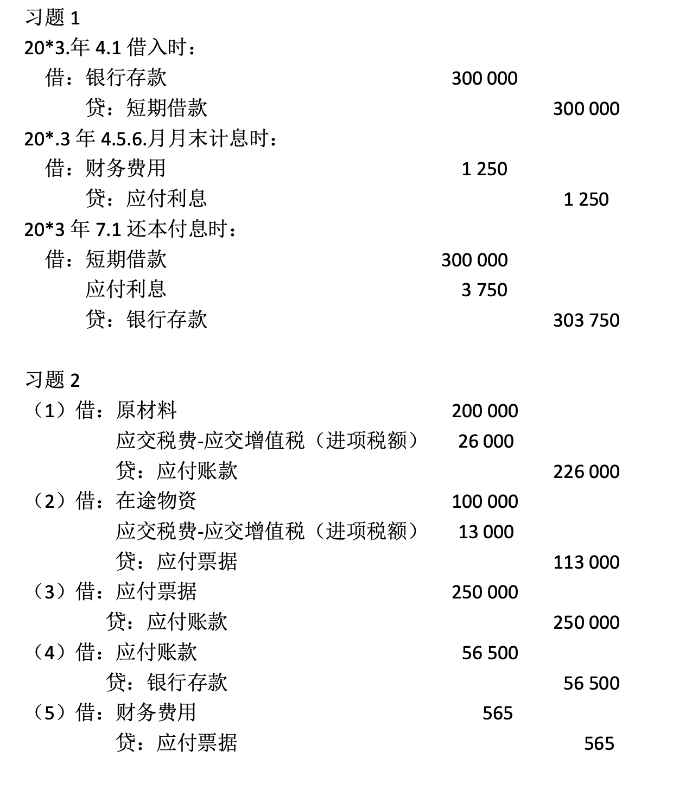
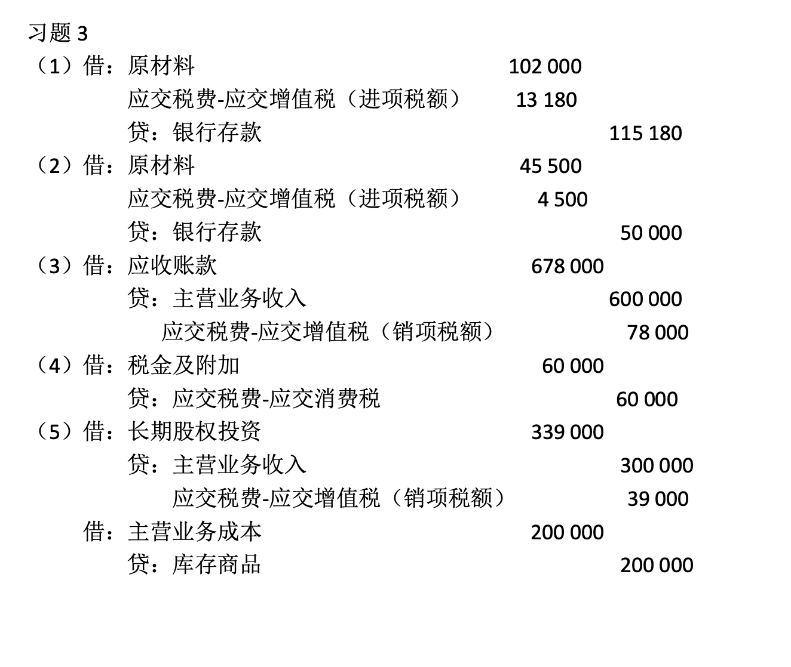
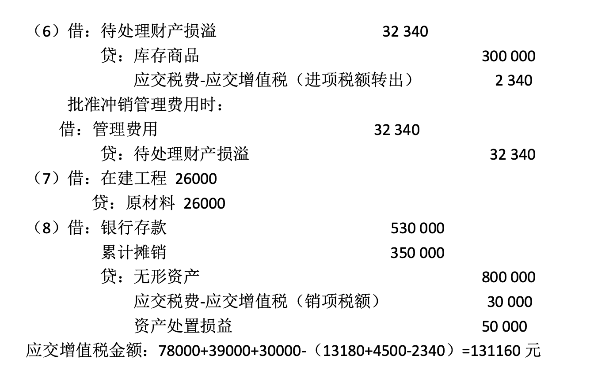
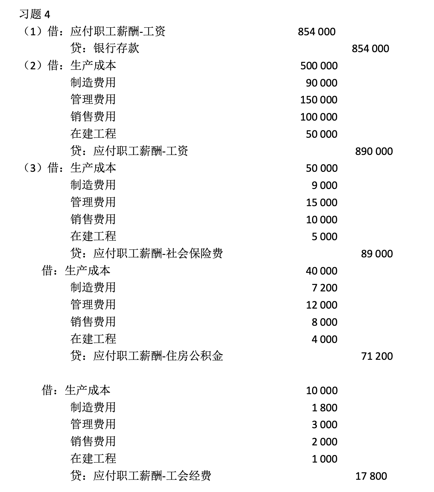
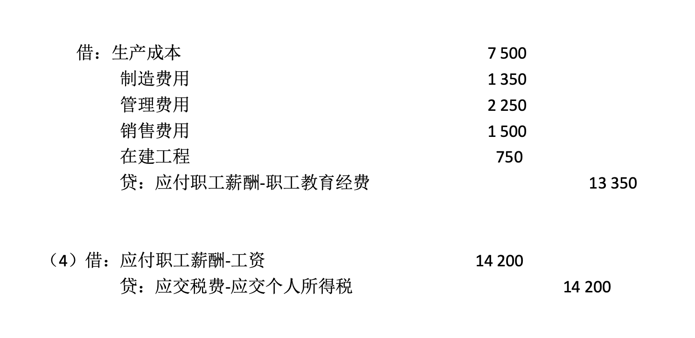
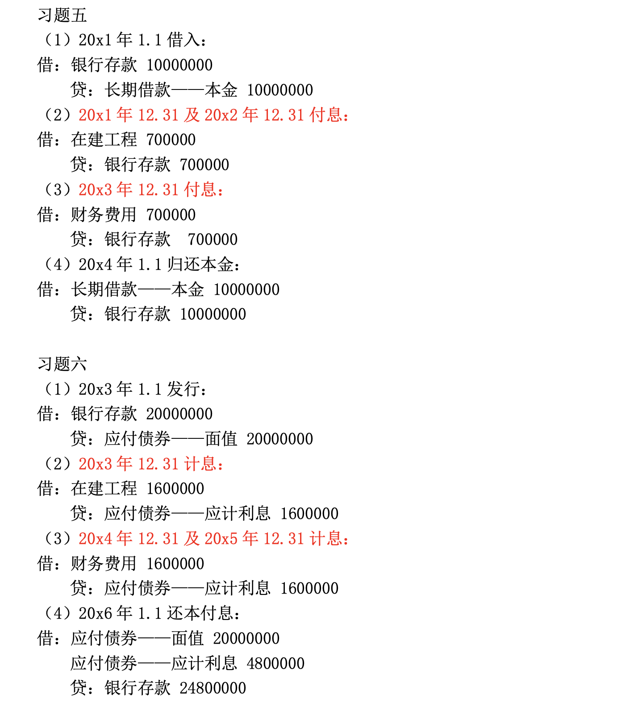

# 负债

- 流动负债
    - 短期借款
    - 应付票据
    - 应付账款
    - 预收账款
    - 应交税费
    - 应付职工酬薪
    - 应付股利
- 长期负债
    - 长期借款
    - 应付股利

## 短期借款

### 借款时

- 借：银行存款
- 贷：短期借款

### 期末计提利息时

- 借：财务费用
- 贷：应付利息

### 还本付息时

- 借：短期借款      
    应付利息
- 贷：银行存款

!!! note
    **企业月末不计提利息：期末计提利息的账就不存在，还本付息的账就变成**

    - 借：短期借款      
        财务费用
    - 贷：银行存款

    **这样还会导致财务费用不准确。那么什么时候可以期末不计提利息呢？**

    - 短期借款不跨年，月末可不计提利息，因为不影响本年利润
    - 短期借款跨年，月末可不计提利息，年末必须计提利息，因为影响本年利润

    **关于计提利息是否正确：**

    - 该提的不提：虚增当期利润、虚减未来利润
    - 不该提的多提：虚减本期利润、虚增未来利润

!!! warning "注意"
    负债账户往往先有**贷方**再有借方。

## 应付票据

### 用应付票据采购材料时

- 借：原材料           
    应交税费————应交增值税（进项税额）
- 贷：应付票据

### 期末计提利息时

- 借：财务费用
- 贷：应付票据————利息

### 偿还应付票据时

- 借：应付票据————本金       
    应付票据————利息
- 贷：银行存款

!!! note
    **若是不带息的票据，则没有期末计提利息的账。偿还时仅需：**

    - 借：应付票据————本金
    - 贷：银行存款

    **若带息票据期末不计提利息，则到期时应改成：**

    - 借：应付票据————本金      
        财务费用
    - 贷：银行存款

    **那么什么时候可以期末不计提利息呢？**

    - 带息票据不跨年，期末可不计提利息
    - 带息票据跨年，期末必须计提利息

    **若到期时没有能力偿还票据：**

    - 商业承兑汇票到期无力支付
        - 借：应付票据
        - 贷：应付账款
    - 银行承兑汇票到期无力支付
        - 借：应付票据
        - 贷：短期借款

    **关于大额应收票据计提利息是否正确：**

    - 该提的不提：虚增当期利润、虚减未来利润
    - 不该提的多提：虚减本期利润、虚增未来利润

## 应付账款

### 赊购时

- 借：在途物资（或原材料）      
    应交税费————应交增值税（进项税额）
- 贷：应付账款（总额）

### 付款时

- 借：应付账款
- 贷：银行存款

!!! note
    **若货物已到发票未到，如何处理？**

    **若到期时没有能力偿还应付账款，如何处理？**

## 应付职工薪酬

### 不同部门人员的工资薪酬计入不同的成本费用

- 借：**生产成本（产品生产人员工资）**       
**制造费用（车间管理人员工资）**    
*管理费用（管理人员工资）*    
*销售费用（销售人员工资）*    
**在建工程（在建工程人员工资）**    
研发支出（研发人员工资）（最好区分费用化支出和资本化支出）    
- 贷：应付职工薪酬——工资    
——社会保险      
——职工福利      
——工会经费      
——职工教育经费      
——住房公积金

### 支付工资时

- 借：应付职工薪酬
- 贷：银行存款

### 结转代扣款及代扣个人所得税时

- 借：应付职工薪酬
- 贷：其他应付款（代扣款）      
其他应收款（代垫款收回）    
应交税费－应交个人所得税    
银行存款

!!! note 
    **若将车间管理人员费用记成管理费用：**

    会使当期利润减少。

## 应交税费

主营业务收入入账的金额都是不含增值税的金额。

### 一般纳税人

#### 采购时的进项税额

- 借：原材料
    应交税费————应交增值税
- 贷：银行存款

#### 销售时的销项税额

**13%**

- 借：应收帐款
- 贷：主营业务收入      
    应交税费————应交增值税（进项税额）

#### 应交税费

$$ 应交税费 = 销项税额 - 进项税额 $$

- 借：应交税费
- 贷：银行存款

### 小规模纳税人

#### 采购时没有进项税额

- 借：原材料
- 贷：银行存款等

#### 销售时的销项税额

**3%**

- 借：应收账款
- 贷：主营业务收入      
    应交税费——应交增值税（销项税额）

#### 应交税费

$$ 应交税费 = 销项税额 $$

- 借：应交税费
- 贷：银行存款

!!! note "特殊情况"
    **购进的货物发生非常损失，进项税不能抵扣：**

    - 借：待处理财产损益
    - 贷：原材料    
        应交税费————应交增值税（进项税额转出）

    **原材料用于集体福利，进项税不能抵扣：**

    - 借：应付职工薪酬
    - 贷：原材料    
        应交税费——应交增值税（进项税额转出）
    
    **购进免税农产品，按9%抵扣，购买价减去可抵扣的税款后的金额计入原材料成本**

    **消费税法规定，特殊消费品生产销售的企业要交消费税，例如烟酒。**

    - 借：税金及附加
    - 贷：应交税费————应交消费税

    *消费税没有从主营业务收入中分离出来！*

!!! example
    企业将自产的一批产品用于利润分配，该批产品成本为80万，计税价格为100万，适用的增值税税率13%，编制会计分录。

    - 借：应付股利 113
    - 贷：主营业务收入 100    
        应交税费————应交增值税（销项税额） 13
    
    - 借：主营业务支出 80
    - 贷：库存商品 80

## 长期负债

我国的会计准则中规定：与购建固定资产直接相关的借款费用，在该项资产**交付使用或完工之前**计入该项**资产的成本**；属于**生产经营期间**的计入**财务费用**。

- 生产经营的使用（费用化）
    - 借：财务费用
    - 贷：应付利息
- 固定资产构建的使用（资本化）
    - 借：在建工程
    - 贷：应付利息

### 借入时

- 借：银行存款
- 贷：长期借款

### 期末计提利息时

{width="500px"}

{width="500px"}

### 还本付息时

{width="500px"}

!!! warning "企业调节利润"
    在工程交付前的利息应该资本化。企业容易延迟“工程交付时间节点”，将利息更多用于资本化而不是费用化，美化利润。

## 应付债券

公司债券通常应具备以下五个要素：

- 债券面值：指债券票面标明的金额；
- 债券利率：票面利率；
- 付息日：支付债券利息的日期；
- 到期日：偿还债券本金的日期；
- 发行者名称：债券的债务主体。

1. 溢价发行：此时票面利率 > 市场利率
2. 面值发行：此时票面利率 = 市场利率
3. 折价发行：此时票面利率 < 市场利率

具体处理：

1. 设立应付债券     
—债券面值    
—利息调整   
—应计利息    

2. 每年年末应计提利息

    $$ 应计利息=票面价值×票面利率 $$

3. 每年年末应摊销溢折价（实际利率法）

    - 财务费用（或在建工程）=应计利息-溢价摊销
    - 财务费用（或在建工程）=应计利息+折价摊销

### 发行债券时
- 借:银行存款                         
- 贷:应付债券—面值      
    —利息调整

### 期末计提和摊销

- 借:财务费用(在建工程) （摊余成本×实际利率）                         
    应付债券—利息调整 （差额）                
- 贷:应付债券—应计利息（面值×票面利率）

### 债券偿还

- 借:应付债券—面值    
    —应计利息
- 贷:银行存款

??? success "课后习题答案"
    
    
    
    
    
    