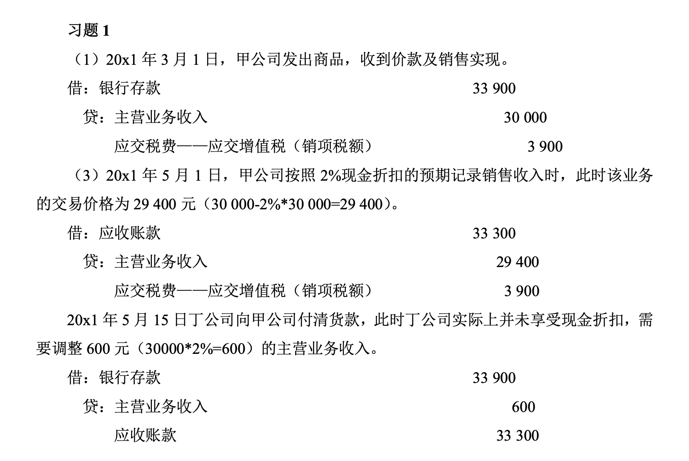
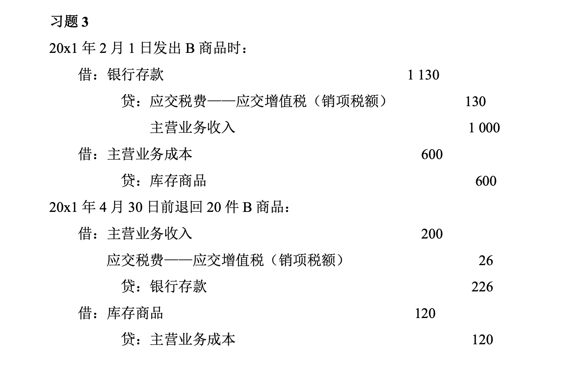
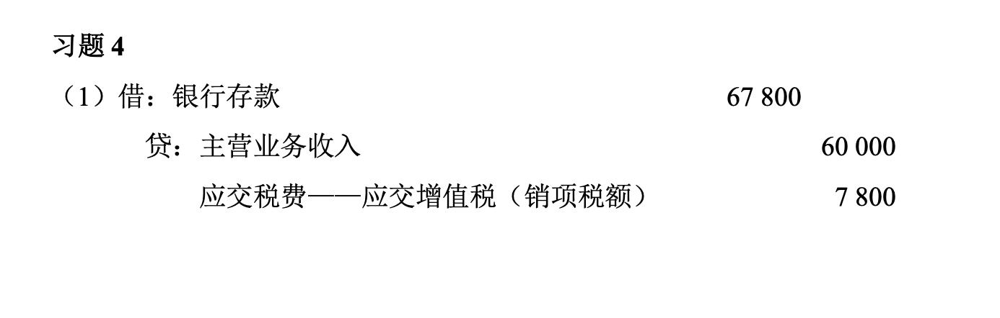
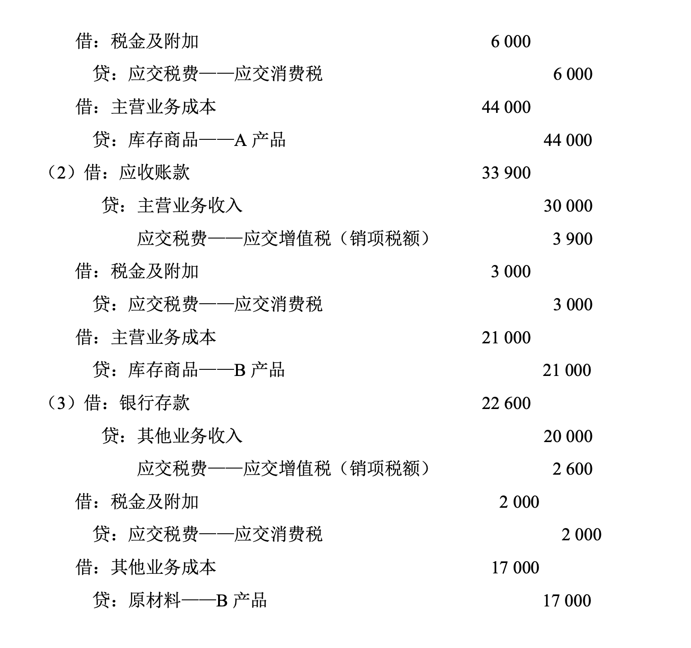
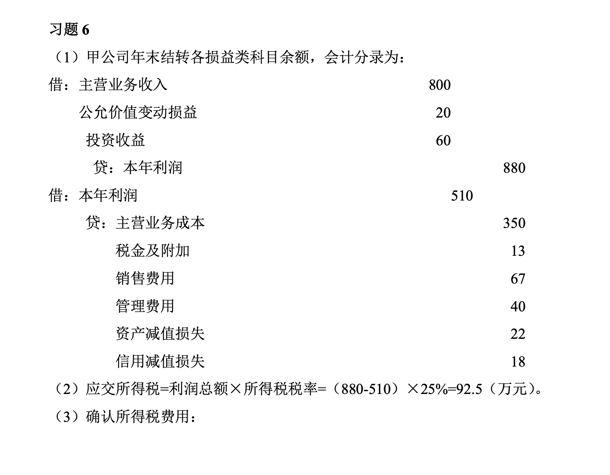
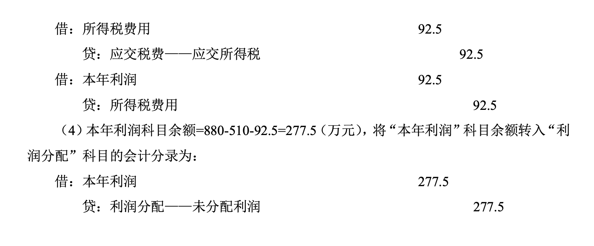

# 收入、费用和利润

## 收入
### 收入概述
指企业在**日常活动**中形成的，会导致所有者权益增加的，与所有者投入资本无关的经济利益的总流入。

- 营业收入
    - 主营业务收入：指企业开展核心性业务取得的收入，是利润形成的主要来源。可根据企业营业执照上规定的主营业务范围确定。
    - 其他业务收入：指企业为完成其经营目标而从事的与经常性活动相关的活动实现的收入。如工业企业**销售材料，提供非工业性劳务，出租固定资产，出租无形资产等**获得的收入。
- 营业外收入：有些交易或事项也能为企业带来经济利益的流入，但是不由企业的日常活动产生，流入的经济利益是利得

### 收入的确认
- 收入确认的原则（何时确认收入？）
    - 企业应当在履行了合同中的履约义务，即在客户取得相关商品控制权时确认收入。
    - 得相关商品控制权：主导该商品的使用 + 从中获得几乎全部的经济利益
    - 注意：取得收款权，才可视为收入实现

### 会计处理

#### 一般销售的会计处理
- 销售产品一批，货款已经收到
    - 借：银行存款
    - 贷：主营业务收入    
        应交税费——应交增值税（销项税额）
- 销售产品一批，货款未收到
    - 借：应收账款
    - 贷：主营业务收入    
        应交税费——应交增值税（销项税额）
- 结转已售产品的实际生产成本
    - 借：主营业务成本
    - 贷：库存商品
- 收回尚未收到的货款
    - 借：银行存款
    - 贷：应收账款
- 支付发生的各种销售费用
    - 借：销售费用
    - 贷：银行存款（或库存现金）
- 计算应缴纳的已售产品的城建税
    - 借：税金及附加
    - 贷：应交税费

#### 存在可变对价的情况

- 销售合同中存在可变对价的，企业应该按照最可能发生金额确定可变对价的最佳估计数。
- 每一资产负债表日，企业应该重新估计应计入交易价格的可变对价金额。
- 可变对价发生变动的，后续变动额应该调整变动当期的营业收入。

!!! example
    发票价款200万，折扣条件2/30，1/60，n/90

    赊销日根据经验判断客户可能在30天内付款，则该项业务的交易价格为196万元

    - 借：应收账款 222                    
    - 贷:主营业务收入 196    
        应交税费—应交增值税 26

    客户未在30日内付款，重新估计会在60天付款，则该业务的交易价格调整为198万

    - 借：应收账款 2
    - 贷：主营业务收入 2

    若客户提前付款了，那么反过来做账：

    - 贷：主营业务收入 x
    - 借：应收账款 x

#### 销售折让、销售退回

- 借：主营业务收入    
    应交税费——应交增值税（销项税）
- 贷：应收账款

!!! warning
    - 销售退回涉及已经结转成本的，应该冲减成本
    - 销售折让不涉及成本的冲销

    会计分录

    - 借：库存商品
    - 贷：主营业务成本

#### 销售时发现经济利益很难流入企业

1. 销售时不能确认收入，会计分录为：
    - 借：发出商品
    - 贷：库存商品
2.  
    1. 待客户满足收入确认条件：经济利益能够流入企业
        - 借：应收账款
        - 贷：主营业务收入    
            应交税费——应交增值税
    2. 收到客户退换货物
        - 借：库存商品
        - 贷：发出商品
3. 结转成本从发出商品结转

#### 出售原材料、出租固定资产作为其他业务收入

## 费用
### 概述
指企业在日常活动中形成的，会导致所有者权益减少的，与向所有者分配利润无关的经济利益的总流出。
### 分类

1. 营业成本
    - 主营业务成本
    - 其他业务成本
2. 期间费用
    - 管理费用
    - 财务费用
    - 销售费用
3. 税金费用
    - 税金及附加
    - 所得税费用

#### 与收入配比的费用
- “生产成本”账户，可按产品开设明细账户
- “制造费用”账户，可按车间开设明细账户

#### 三大期间费用
1. **管理费用**：指企业为组织和管理企业生产经营所发生的管理费用，包括企业在筹建期间内发生的开办费、董事会和行政管理部门在企业的经营管理中发生的或者应由企业统一负担的公司经费、工会经费、董事会费、聘请中介机构费、咨询费、诉讼费、业务招待费、技术转让费、研究费用、排污费以及行政管理部门等发生的固定资产修理费用等。

    例：明达公司计提行政管理部门固定资产折旧费600元，用银行存款支付行政管理部门的水电费1 300元。编制的会计分录如下：

    - 借：管理费用                                                 1 900
    - 贷：累计折旧                                                   600    
        银行存款                                                  1 300

2. **销售费用**：指企业在销售商品和材料、提供劳务的过程中发生的各种费用，包括企业在销售商品过程中发生的保险费、包装费、展览费和广告费、商品维修费、装卸费等，以及为销售本企业商品而专设的销售机构的职工薪酬、业务费、折旧费、固定资产修理费用等费用

    例：20×1年5月，明达公司计算确定销售人员的职工薪酬89 000元。编制的会计分录如下：

    - 借：销售费用                                                 89 000
    - 贷：应付职工薪酬                                             89 000

3. **财务费用**：指企业为筹集生产经营所需资金等而发生的筹资费用，包括利息支出（减利息收入）、汇兑损益以及相关的手续费

    例：20×1年6月末，明达公司计提经营期间发生的到期一次还本付息的长期借款利息5000元。编制的会计分录如下：

    - 借：财务费用                                                 5 000
    - 贷：长期借款                                                      5 000

#### 二大税金费用

1. **税金及附加**：指企业经营活动应负担的相关税费，包括消费税、城市维护建设税、教育费附加、房产税、车船税、城镇土地使用税、印花税等。

    例：20×1年3月30日，明达公司销售应税消费品一批，不含增值税的价款为50 000元，该产品的消费税税率为10%。编制的会计分录如下：

    - 借：税金及附加                                                 5 000
    - 贷：应交税费——应交消费税                                     5 000

2. **所得税费用**：有利润所得必须交纳的费用。基本会计分录为：

    - 借：所得税费用
    - 贷：应交税费——应交所得税

## 利润

### 三大利润
1. 营业利润 = 营业收入 - 营业成本 - 税金及附加 - 管理费用 - 财务费用 - 销售费用 + 其他收益 + 投资收益 + 公允价值变动收益（损失用负数） + 信用减值损失（损失用负数）+ 资产减值损失（损失用负数） + 资产处置收益（损失用负数）
2. 利润总额 = 营业利润 + 营业外收入 - 营业外支出
3. 净利润 = 利润总额 - 所得税费用

### 营业利润的构成项目

- 营业利润增加项目（收入）：营业收入、其他收益
- 营业利润减少项目（费用）：营业成本、管理费用、销售费用、税金及附加
- 营业利润增减不确定的项目：信用减值损失、资产减值损失、公允价值变动收益、投资收益、资产处置收益、财务费用

!!! note
    - 其他收益：与企业日常活动相关的政府补助，应当按照经济业务实质，计入其他收益。
    - 与企业日常活动无关的政府补助，应当计入营业外收入
    - 资产处置损益：非流动资产出售利得与损失
    - 营业外收支：非流动资产报废利得与损失】
    
    其他收益是营业利润的成分，倾向于计入其他收益。盈利倾向计入资产处置损益，亏损倾向计入营业外收支。

### 营业外收入、营业外支出
- 营业外收入：非流动资产报废净收益、部分政府补助、接受捐赠、现金盘盈利得、违约金收入，期末转入本年利润的贷方
- 营业外支出：非流动资产报废净收益、捐赠支出、非常损失、违约金支出，期末转入本年利润的借方

### 所得税费用

1. 计算
    所得税 = 应纳税所得额 × 税率    
    应纳税所得额 = 利润总额 +（-）纳税调整项目
2. 会计处理
    - 借：所得税费用
    - 贷：应交税费——应交所得税
    - 借：本年利润
    - 贷：所得税费用

??? success "课后习题答案"
    
    
    
    
    
    