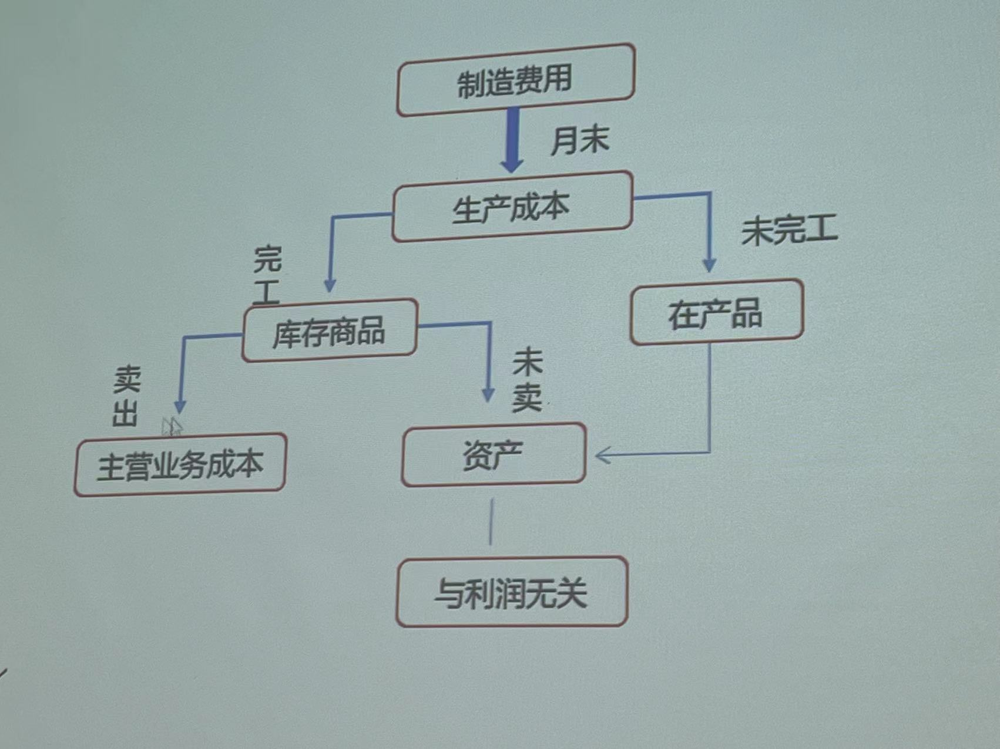

# 会计要素与复式记账

## 会计要素
!!! tip
    详细内容见dzq的笔记

### 资产（权利）
- 资产
    - 流动资产
        - 货币资金
        - 交易行金融资产
        - 应收及预付款项
        - 存货
    - 非流动资产
        - 固定资产
        - 在建工程
        - 债券投资
        - 长期股权投资
        - 无形资产

!!! 流动性
    - 变现能力
    - 被耗用时间

收入方式：  
1. 银行存款+    
2. 应收票据+    
3. 应收帐款+    

!!! 判断
    1. 甲企业从乙企业处获得将来允许其生产乙企业设计的产品的权益，有效期三年。预期甲企业生产的这种新产品能增加企业的的利润。✅ （购买专利）
    2. 甲企业招了一个经理创造价值 ❌（无法计量）
    3. 购买了一个设备，每年提供10000元产品供应市场。此设备是向银行借款支付的。✅
    4. 客户欠甲企业1000元贷款，但客户破产，企业受不到了 ❌（无法带来经济利益）

### 负债（义务）
- 负债
    - 流动负债
        - 短期借款（一年以内）
        - 应付及预收款项：应付票据、应付账款、预收账款、其他应付款（除销售采购以外占用被人的钱）、应付股利、应付利息
        - 应付员工薪酬：
        - 应交税费
    - 长期负债
        - 长期借款
        - 应付债券
        - 长期应付款

流动负债多，还债压力大，企业风险高。

!!! tip 
    向银行借款一千万：  
    1. 短期借款增加1000万
    2. 银行存款增加1000万（不算货币资金）

    采购原材料，货款500万未付：  
    第一种可能：    
    1. 原材料增加500万
    2. 应付账款增加500万

    第二种可能：    
    1. 原材料增加500万
    2. 应收票据增加500万

    第三种可能：    
    1. 原材料增加500万
    2. 银行存款减少500万

    第四种可能：    
    1. 原材料增加500万
    2. 预付账款减少500万

    **控制能力：一>二>三>四 （竞争能力强）**

负债越少越好？❌ 负债是杠杆工具，放大股东钱的作用

!!! note
    其他应付款：除销售采购以外占用了别人的钱
    其他应收款：除销售采购以外被别人占用的钱

### 所有者权益

- 所有者权益
    - 实收资本（投资者投入的资本）//资本
    - 资本公积 //资本
    - 盈余公积（从净利润中提取） //利润
    - 未分配利润  //利润

资本公积形成的主要途径举例：资本溢价

!!! example
    原股东2人，3年前各投入100万。新股东想占1/3股份，投入130万。 
    此时：  
    1. 实收资本+100万   
    2. 资本公积+30万    
    3. 银行存款+130万   

### 收入（及利得）

- 收入
    - 主营业务收入
    - 其他业务收入（包装物出租、固定资产出租的租金收入）
    - 投资收入
    - 营业外收入（如罚款收入、政府补贴收入）

### 费用（及损失）

- 费用
    - 生产过程中的费用
        - 生产成本（直接费用）原材料
        - 制造费用（间接费用）车间主任工资、照明费用、折旧费用
    - 管理过程中的费用：管理费用
    - 销售过程中的费用：销售费用
    - 筹资过程中的费用：财务费用
    - 其他业务成本
    - 资产减值损失
    - 公允价值变动损益（既可作为利得，也可作为损益）
    - 税金费用：所得税费用、税金及附加
    - 营业外支出

生产过程中的费用只有在产品销售后才会成为与利润相关的费用。

### 利润
1. 净利润 = 利润总额 - 所得税费用
2. 利润总额 = 营业利润 + 营业外收入 - 营业外支出
3. 营业利润 = 营业收入 - 营业成本 - 税金及附加 - 管理费用 - 销售费用 - 财务费用 + 投资收益 + 公允价值变动收益 + 资产减值损失（损失用负数表示）

## 会计等式

资产 = 负债 + 所有者权益 + （收入 - 费用）【最终变成所有者权益里的未分配利润和盈余积金】

## 会计科目与账户
### 会计科目
总分类科目和明细分类科目
### 账户

## 借贷复式记账法
### 复式记账法
### 借贷复式记账法
|借方|贷方|
|:--:|:---:|
|||
|||
|||

资产类账户期末余额 = 期初余额 + 本期借方发生额 - 本期贷方发生额

负债和所有者权益类账户期末余额 = 期初余额 + 本期贷方发生额 - 本期借方发生额

|资产类||负债和所有者权益类||
|:--:|:--:|:--:|:--:|
|期初余额|||期初余额|
|本期增加数|本期减少数|本期减少数|本期增加数|
|本期借方发生额|本期贷方发生额|本期借方发生额|本期贷方发生额|
|期末余额|||期末余额|

- 资产类、费用：增加是借方，减少是贷方
- 负债及权益类、收入、利润：增加是贷方，减少是借方

收入和费用**没有期初、期末余额**，反应了时期，是动态的。收入基本都在贷方，除非退货之类导致收入减少。本月收入与下月无关。收入和费用共计到本年利润中。

**利润**

|利润减少额（费用转入额）|利润增加额（收入转入额）|
|:--:|:--:|
|本期借方发生额|本期贷方发生额|
|期末余额|期末余额|

!!! tips
    银行承兑汇票：应付票据  
    投资者投入，公允价值200万：实收资本     
    罚款：营业外支出

有借必有贷，借贷必相等。    

所有账户的借方发生额合计数 = 所有账户的贷方发生额合计数

所有账户的借方期末余额合计数 = 所有账户的贷方期末余额合计数

所有账户的借方期初余额合计数 = 所有账户的贷方期初余额合计数

