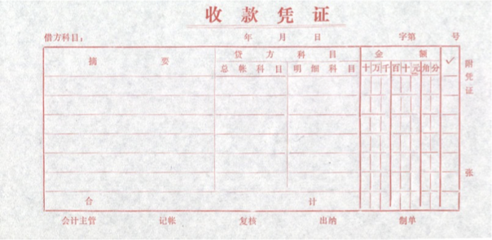

# 会计循环
## 分录与记账
### 会计分录
#### 什么是会计分录
指明经济业务应记账户名称、记账方向、记入金额的记录。在会计实务中，会计分录即为记账凭证。

#### 会计分录的格式：  
借：×××(账户名)     ×××(金额)   
&nbsp;&nbsp;贷: ××××(账户名)    ×××(金额)
#### 如何编制会计分录 
分析的程序和步骤是:
1. 引起哪些要素项目的变化(变化的账户名称）
2. 判断变化项目的变化方向（金额的增或减)
3. 根据账户模式判断应记账户的借方还是贷方

!!! example
    1月30日以银行存款3000归还银行短期借款，同时支付当月借款利息300，共计3300。
    ??? answer
        借：短期借款 3000    
        &nbsp;&nbsp;&nbsp;财务费用 300  
        &nbsp;&nbsp;&nbsp;&nbsp;贷：银行存款 3300        
        **解题关键：“当月”**
    ??? 拓展
        要是不是当月付款：  
        借：财务费用 300    
        &nbsp;&nbsp;&nbsp;&nbsp;贷：应付利息 300 

        借：短期借款 3000    
        &nbsp;&nbsp;&nbsp;应付利息 300  
        &nbsp;&nbsp;&nbsp;&nbsp;贷：银行存款 3300 

#### 分录种类
- 简单分录——一借一贷的对应关系   
- 复合分录——一借多贷、一贷多借

### 会计凭证
#### 含义
会计凭证是记录经济业务、明确经济责任，并作为记账依据的书面证明文件。

#### 原始凭证

#### 记账凭证

!!! note
    - 收款凭证：**借方**中有库存现金或银行存款
    - 付款凭证：**贷方**中有库存现金或银行存款
    - 转账凭证：都没有

    涉及现金与银行存款之间的业务，一般只填制付款凭证。

### 会计账簿
#### 含义
由具有专门格式并互相联系的账页组成的、用以序时或分类记录经济业务的簿籍。  
账户记录是账簿的实质内容
#### 分类

## 试算与调整
现实中本月发生了100笔业务，但是有可能会有120笔。因为会有其他月份的业务（权责发生制）。

账项调整的依据：权责发生制  
账项调整的目的：合理反映个月的收入和费用，以合理确定各月盈亏    

调账的世界一般在期末或月末。

{width="300px"}

- 应计项目：钱未发生收付
    - 应计收入：收入归属于本期，但钱未收到
    - 应计费用：费用归属于本期，但钱未付出
- 递延项目：钱易发生收付
    - 预付费用：费用归属于本期，且钱早已付出
    - 预收收入：收入归属于本期，且钱早已收到

!!! example "应计费用"
    年初租入固定资产一年，每月应付租金100元，合同约定年末一次性付清1200     
    （1）**调整分录** 每月月末：    
    借：管理费用        100     
    &nbsp;&nbsp;&nbsp;&nbsp;贷：其他应付款          100       
    （2）**业务分录** 年末：    
    借：其他应付款           1200       
    &nbsp;&nbsp;&nbsp;&nbsp;贷：库存资金             1200   

    如果忘了调整分录，会导致利润虚高。

!!! example "预付费用"
    上年末，预付本年租入固定资产全年租金1200        
    （1）**业务分录** 上年年末：    
    借：预付账款           1200     
    &nbsp;&nbsp;&nbsp;&nbsp;贷：银行存款            1200    
    （2）**调整分录** 本年每月月末：    
    借：管理费用        100     
    &nbsp;&nbsp;&nbsp;&nbsp;贷：预付账款          100       

    如果忘了调整分录，会导致利润虚增，资产虚增。故意遗忘，会导致利润更漂亮。

## 结账与编表
虚账户：没有余额    
实账户：有余额

{width="300px"}

# 回顾思考

!!! example
    以下哪些单据是原始凭证？    
    A.生产计划 B.采购合同 C.入库单 D.转账凭证  
    
    C   
    AB不确定是否会发生，D是会计凭证

!!! example
    以下应该多栏式的是  
    A.原材料 B.生产成本 C.管理费用 D.应收账款   

    BC 这两个都是由很多项目构成的
    A 数量-金额式 D 三栏式，只要名称详细就好

!!! example
    如何查清账上发生的金额是否正确？

    去查对应的会计凭证以及附着的原始凭证。

!!! example
    期末时，转服“本年利润”账户借方的是      
    A.其他业务收入
    B.库存商品
    C.主营业务收入
    D.主营业务成本

    D.主营业务成本 利润账户的借方是导致利润的减少。AC转到贷方。B不用转到本年利润，这是资产负债表中的内容。

!!! example
    以银行存款支付**当月**销售人员工资，会计分录应为    
    
    借：销售费用    
    &nbsp;&nbsp;&nbsp;&nbsp;贷：银行存款    
    !!! Warning
        解题关键是**“当月”**，不需要通过应付职工薪酬。

!!! example
    出售给丙公司X产品3000件，每件售价60元，货款尚未收到。X产品单件成本40元。
    
    借：应收账款   180000    
    &nbsp;&nbsp;&nbsp;&nbsp;贷：主营业务收入 180000    
    借：主营业务成本    120000
    &nbsp;&nbsp;&nbsp;&nbsp;贷：库存商品————X    120000     
    !!! Warning
        销售，库存商品和应收账款不相等呀。

- 整个企业的分录分为业务分录和调整分录。最终做一个结账分录。
- 调整分录中不可能出现银行存款。
- 调整分录期末结账前编制。
- 调整分录一方面设计利润表账户，另一方设计资产负债表账户。
- 调整分录依据的是权责发生制。
- 月末的结账分录：损益类账户转到本年利润。 年末的结账分录是利润转到未分配利润。
- “计提”是调整分录。
- 生产车间工人工资：生产成本 车间主任：制造费用
- 从仓库拿原材料：原材料变成生产成本。
- 和利润有关联的业务要编制结账分录。要涉及损益类账户。
- 生产成本->库存商品->主营业务成本，到第三步主营业务成本才与利润有关系。制造费用就更远了。
- 应工出差：其他应收款。 销售部门人员出差：销售费用。
- 购买原材料发生的运费计入原材料的成本。
- 购入股票：交易性金融资产

