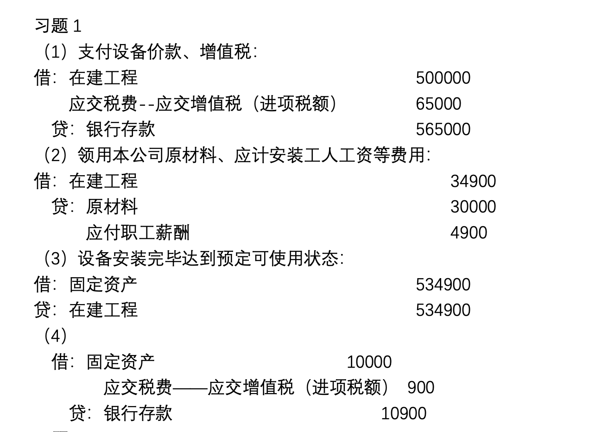
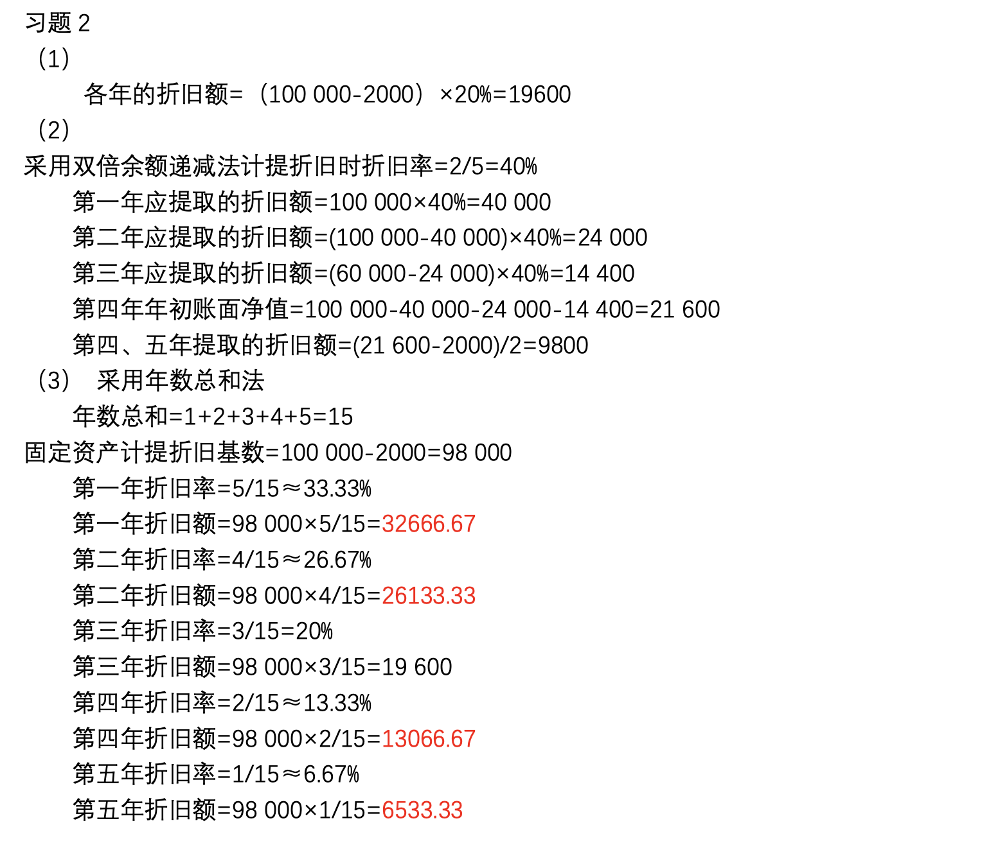
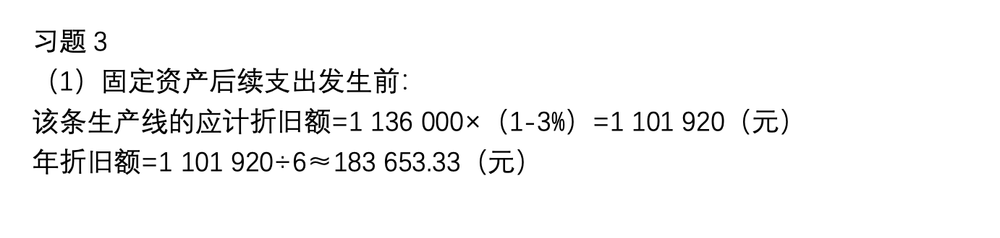
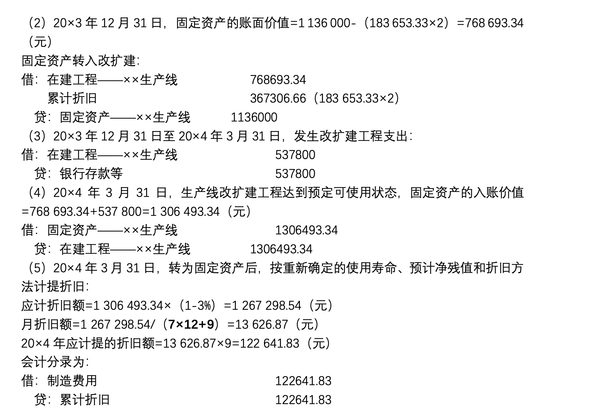
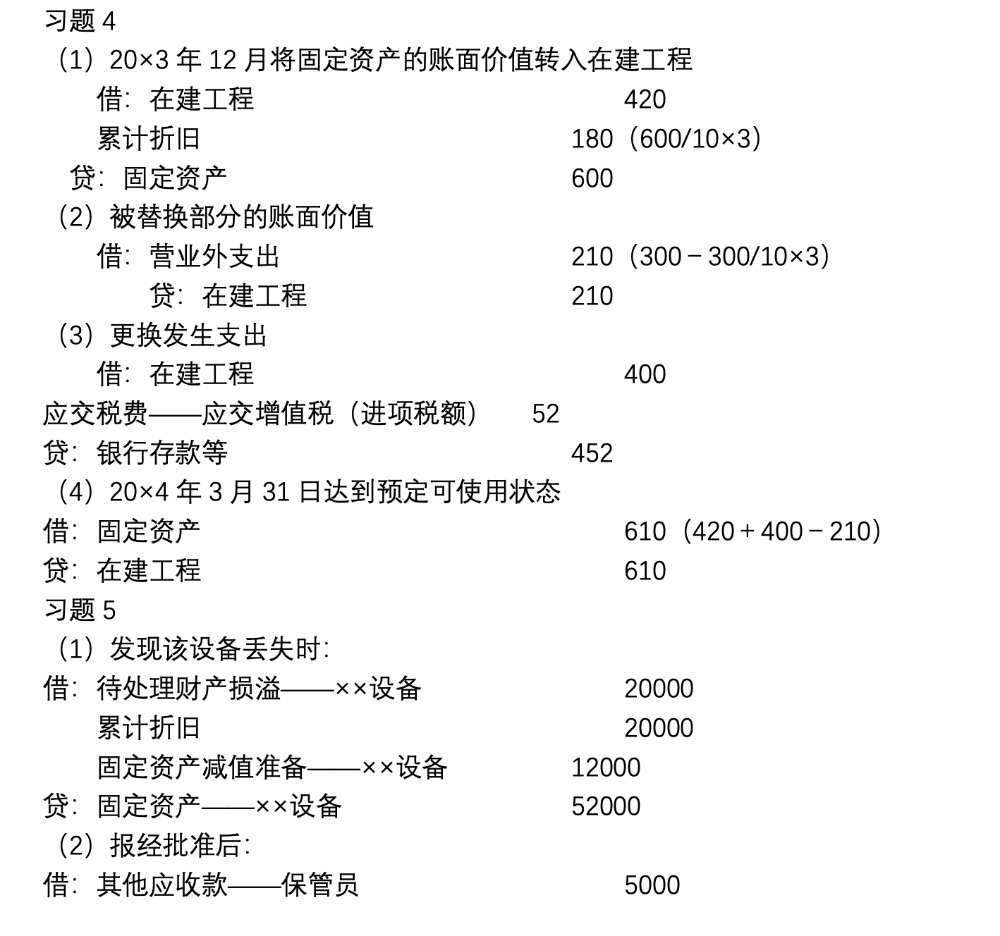
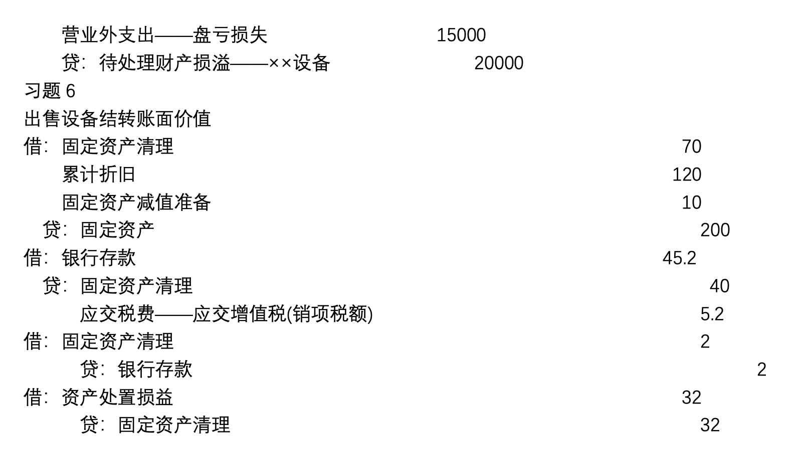

# 固定资产

## 固定资产的增加

### 计价及会计处理
按取得时的实际成本入账，即按原始价值（原价）。

#### 购置的固定资产
- 原价 = 买价 + 包装费 + 运输费 + 装卸费 + 保险费 + 安装费用
- 会计处理：
    - 借：固定资产 原价    
    应交税费————应交增值税（进项税额）
    - 贷：银行存款 （应付账款）

!!! note
    需要安装的可先计入“在建工程”，等安装完再计作固定资产。（有点类似于在途物资）

#### 自行建造的固定资产
- 原价 = 工程用料 + 工程人工 + 工程管理费用
- 会计处理：
    - 在建时：
        - 借：在建工程
        - 贷：工程物资  
        应付职工酬薪    
        银行存款
    - 完工时：
        - 借：固定资产
        - 贷：在建工程

#### 盘盈的固定资产

- 入账价值 = 重置成本 = 同类固定资产的市场价格 - 损耗价值
- 会计处理：
    - 借：固定资产
    - 贷：以前年度损益调整

#### 投资者投入的固定资产
- 入账价值 = 合同约定价值或公允价值
- 会计处理：    
    - 借：固定资产    
    应交税费————应交增值税（进项税额）
    - 贷：实收资本    
    资本公积（多余的）

!!! example "例子"
    A公司接受C公司投入设备一台，合同约定的价值为500 000元，取得专票65 000元。双方谈定将固定资产的90%作为注册资本。会计分录如下：

    - 借：固定资产 500 000    
    应交税费————应交增值税（进项税额） 65 000
    - 贷：实收资本 450 000    
    资本公积 115 000

    有溢价投入，说明企业有吸引力。

## 固定资产的折旧

### 计提折旧应考虑的因素
- 原价、预留净残值、使用年限、折旧方法

### 计算折旧的方法

!!! warning
    - 改变折旧方法——>调节利润
    - 拉长折旧年限——>美化利润

#### 年限平均法（直线法）

$$\frac{原价 - 预留净残值}{使用年限} = 本年折旧额$$

#### 工作量法

$$\frac{原价 - 预留净残值}{总工作量} = 单位工作量折旧额$$

$$本年折旧额 = 单位工作量折旧额 \times 本年工作量$$

- 优点：计算方便
- 局限：忽略了无形讯号和停用期间的损耗；固定资产的预计工作量较难估计。
- 适用情形：主要适用于运输设备。

#### 加速折旧法

前几年折旧额较大，后面折旧额小。符合**谨慎性**。

- 双倍余额递减法：不考虑残值下直线法折旧率的两倍    
以各年折余价值为基础    
最后两年改成直线法

$$年折旧额 = 固定资产折余价值 \times 双倍直线法折旧率$$

#### 年数总和法

$$某年折旧率 = \frac{尚可使用年限}{各年可使用年限之和}$$

$$年折旧额 = （固定资产原始 - 估计净残值） \times 年折旧率$$

### 折旧会计分录
- 借：管理费用    
制造费用    
销售费用    
- 贷：累计折旧

!!! warning
    企业可能会将管理费用混成车间的管理费用，因为这样做会美化利润。

固定资产的减少要分为**原价减少**和**折旧**。所以设立累计折旧账户，折旧放在累计折旧的贷方而不是固定资产的贷方。累计折旧的借方表示退出使用固定资产已计提折旧的金额。固定资产的余额一定表示的是**原价**。

!!! note
    固定资产非整数年：当月增加固定资产，下个月增加；当月折旧，当月计提。

## 固定资产的修理

### 更新改造
1. 特点:延长寿命,提高产出数量或质量
2. 要求:将支出资本化,即计入固定资产价值

- 会计处理：
    - 借：在建工程      
    累计折旧
    - 贷：固定资产
    - 借：在建工程
    - 贷：工程物资      
    应付职工酬薪
    - 借：银行存款      
    营业外支出（拆下来的零部件卖掉）
    - 借：固定资产
    - 贷：在建工程

### 日常修理
1. 特点:保持固定资产的继续使用
2. 要求:将支出费用化,应当计入当期损益

- 会计分录：
    - 借：管理费用
    - 贷：原材料    
    应付职工酬薪

!!! warning
    ||本期利润|以后利润|资产|
    |:--:|:--:|:--:|:--:|
    |将费用作为资本性支出|+|-|+|
    |将资本性支出作为费用|-|+|-|

## 固定资产的减少

### 出售、报废、损毁的会计处理

1. 设置“固定资产清理”账户
    - 借：固定资产清理    
    累计折旧
    - 贷：固定资产

{width="300px"}

??? example "例子"
    {width="500px"}

!!! note
    资产处置损益：借方损失，贷方增加。

### 固定资产盘亏的会计处理

- 借：待处理财产损益    
累计折旧
- 贷：固定资产
- 借：营业外支出
- 贷：待处理财产损益

??? example "例子"
    {width="500px"}

## 固定资产期末计量

- 固定资产减值：可回收金额 < 账面价值
    - 借：资产减值损失————计提的固定资产减值准备
    - 贷：固定资产减值损失准备

!!! Warning "注意"
    企业固定资产减值损失一经确认，在以后期间内不得转回！

??? success "课后习题答案"
    
    
    
    
    
    