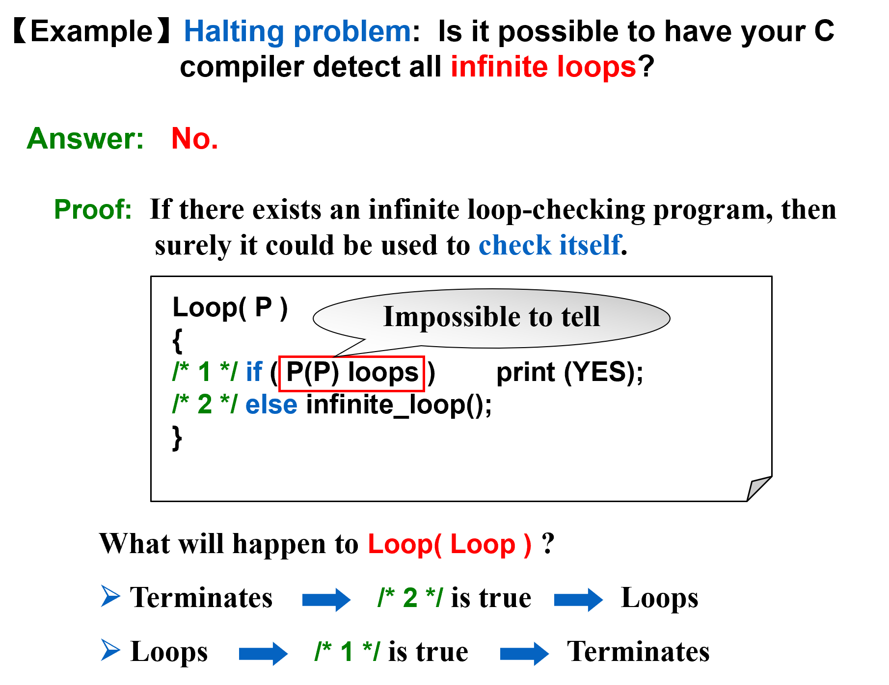
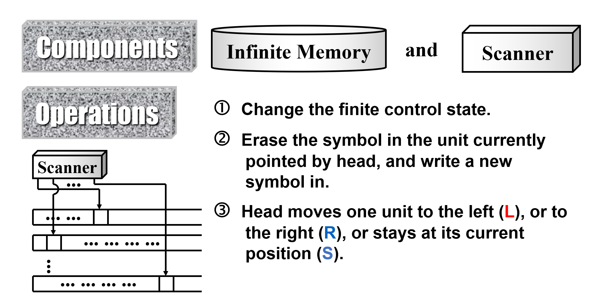
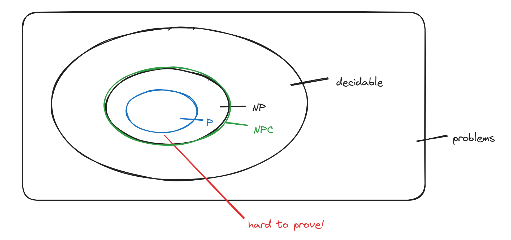
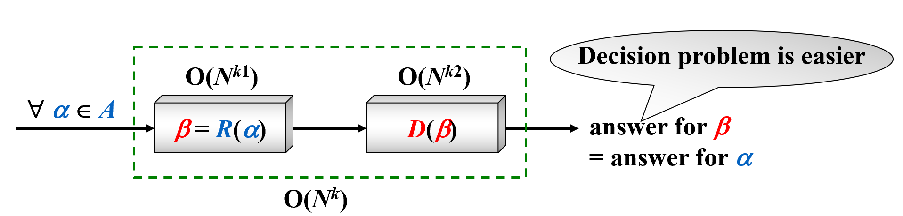
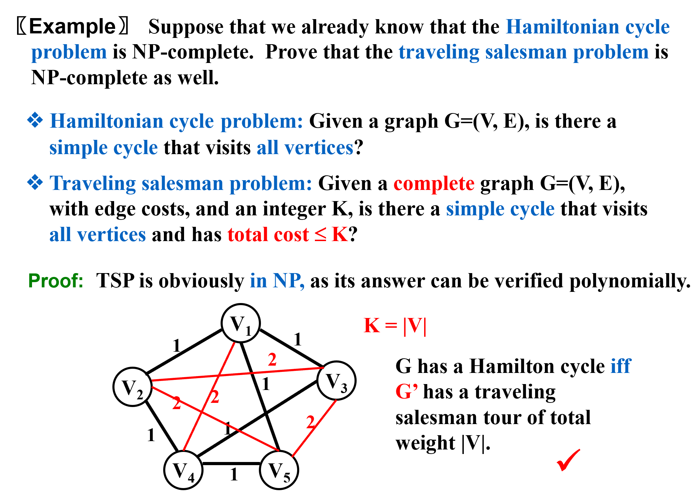
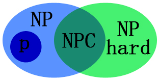

# NP-Completeness
纵观本章问题，我们将涉及3类问题：P类问题、NP类问题和NPC类问题。最后一类问题就是我们所说的NP完全问题。
## 回顾

- 欧拉回路问题：“一笔画”
- 哈密顿回路问题：找到一个环，通过且仅通过每一个顶点一次
- 单源最短路径
- 单元最长路径

其中欧拉回路和单源最短路径是可以在多项式时间内找出解的，而剩下两个目前没有已知算法能在**多项式时间**内找出解。

!!! note
    如果一个问题能在多项式时间内找出解，则称其为简单问题。

??? example "停机问题"
    

## P类问题
P类问题就是在多项式时间内可以解决的问题。
## NP类问题
NP类问题就是那些在多项式时间内可以被证明的问题。

### 图灵机
我们从图灵机的角度了解NP问题。用图灵机来解决数学问题。（时间无限、纸笔无限、能量无限……）

{width="700px"}

图灵机分为两种：确定性图灵机（Deterministic Turing Machine）和非确定图灵机（Nondeterministic Turing Machine）。

- 确定性图灵机：每一步都有若干状态可以选择，每一步的选择都是确定的。
- 非确定图灵机：可以从下面的若干步骤自由选择。如果给一个**指导**，它可以一直选择正确的答案。

对于确定性图灵机k级遍历来找出正确答案时，非确定性图灵机可以在指导下一步跳到正确答案。若非确定图灵机找出正确答案需要$O(n)$，则确定性图灵机需要$O(n^k)$，时多项式复杂度和超多项式复杂度的问题。注意，这只是快慢问题，**可计算性**无任何差别。

**NP: Nondeterministic polynomial-time（非确定性多项式时间）**

NP类问题在多项式时间内可以被**证明**。

!!! note
    并非所有可计算的问题都是NP问题。例如，考虑判断一个图是否没有哈密顿回路的问题。这需要列出所有的回路进行判断，是一个超多项式时间复杂度的问题。

我们能确定$P \subseteq NP$，但是我们搞不清楚$P \subset NP$是否正确。例如哈密顿回路问题。

!!! Warning "重要"
    - 确定性图灵机可以用来求解P问题（多项式时间内）
    - 确定性图灵机可以用来验证NP问题（多项式时间内）
    - 非确定图灵机可以用来求解NP问题（多项式时间内）
    - 非确定图灵机不能用来验证NP-hard问题（多项式时间内）

## NPC问题
NPC问题是所有NP问题中最难的那一类问题。一个NPC问题有如下性质：**所有NP问题都可以多项式规约于NPC问题。**

问题之间的关系如图所示：

由规约知，所有的NPC问题难度都是**等价的**，所以证明了一个NPC问题有多项式解法，那就是相当于证明了所有的问题都有多项式解法，那就证明了$P = NP$。

Given any instance $\alpha \in \text{Problem A}$, if we can find a program $R(\alpha) \rightarrow \beta \in \text{Problem B}$ with $T_R(N) = O(N^{k1})$, and another program $D(\beta)$ to get an answer in time $O(N^{k2})$. Moreover, if the answer for $\beta$ is the same as the answer for $\alpha$, then

第一个被证明为NPC的问题是SAT（电路可满足）问题。

## 多项式规约

已知哈密顿回路问题是NPC，证旅行商问题也是NPC。

首先证明旅行商问题是NP问题（答案在多项式时间内可验证）。显然可以在多项式时间内验证。我们要加上红色的边来将这张图补成完全图。现在来看这张图。若原图中没有哈密顿回路，那么一定要经过一条红色的边，那么旅行商问题的解一定是V+1或更多。

## NP-hard问题
- 所有的NP问题都可以用多项式时间规约到NP-hard问题
- 但是NP-hard问题不一定是NP问题

**即使NPC问题发现了多项式级的算法，NP-Hard问题有可能仍然无法得到多项式级的算法。**事实上，由于NP-Hard放宽了限定条件，它将有可能比所有的NPC问题的时间复杂度更高从而更难以解决。

{width="250px"}

## A Formal-language Framework
形式化语言框架

- 一个抽象问题Q是一个问题的实例(Instances)和问题的解(Solutions)之间的二元映射关系
- 编码：通过编码将其转化为具体问题（喂给图灵机）
- 一些定义：

- 语言可被**判定**：A language L is decided by an algorithm A if every binary string in L is accepted by A and every binary string not in L is rejected by A（还要关注L之外的字符串，里面为1，外面为0）（若L被判定，L的子集不一定能被判定）
- 语言可被**接受**：To accept a language, an algorithm need only worry about strings in L, but to decide a language, it must correctly accept or reject every string in {0, 1}*（只要关注L里面的字符串就行，里面也为1）（若L被接受，那么L的子集也被接受）

!!! note
    P逻辑上的定义：   

    $$ 
    P = \{ L ⊆ \{0, 1\}^* : \text{there exists an algorithm A that decides L in polynomial time} \} 
    $$

    NP的定义：

    A language L belongs to NP iff there exist a two-input polynomial-time algorithm A and a constant c such that 

    $$ 
    L = \{ x ∈ \{0, 1\}^* : \text{there exists a certificate } y \text{ with } |y| = O(|x|^c) \text{ such that } A(x, y) = 1 \} 
    $$

    We say that algorithm A verifies language L in polynomial time.

{width="600px"}

!!! Note
    - P ⊆ co-NP
    - P ⊆ co-NP ∩ NP

A language L ⊆ {0, 1}* is NP-complete if

1. $L ∈ NP$, and
2. $L’ ≤_P L$ for every $L’ ∈ NP$.

## Clique problem & Vertex cover problem
- Clique problem: Given an undirected graph $G = (V, E)$ and an integer $K$, does $G$ contain a complete subgraph (clique) of (at least) $K$ vertices?
- Vertex cover problem: Given an undirected graph $G = (V, E)$ and an integer $K$, does $G$ contain a subset $V' ⊆ V$ such that $|V'|$ is (at most) $K$ and every edge in $G$ has a vertex in $V'$ (vertex cover)?

证明**分团问题**是NP完备，我们可以很简单的将**顶点覆盖问题**多项式归约成这个问题。因为存在一个大小是k以上的分团，等价于它的补图中存在一个大小是k以上的独立集。

??? example "具体证明"
    