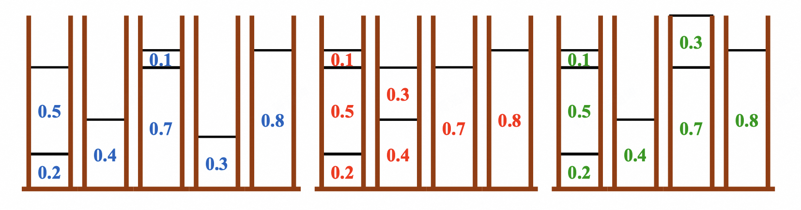
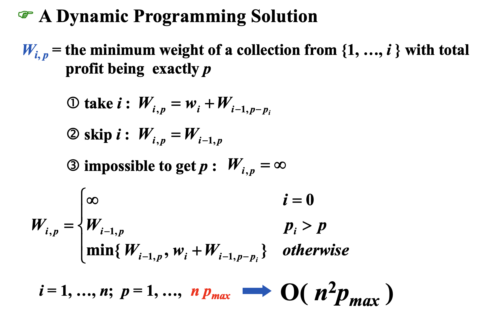
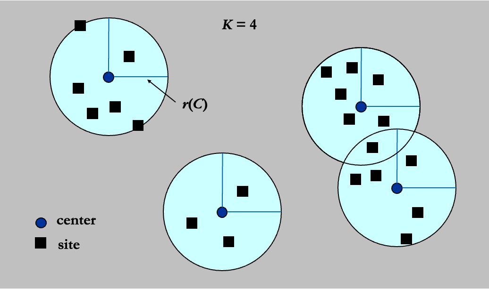
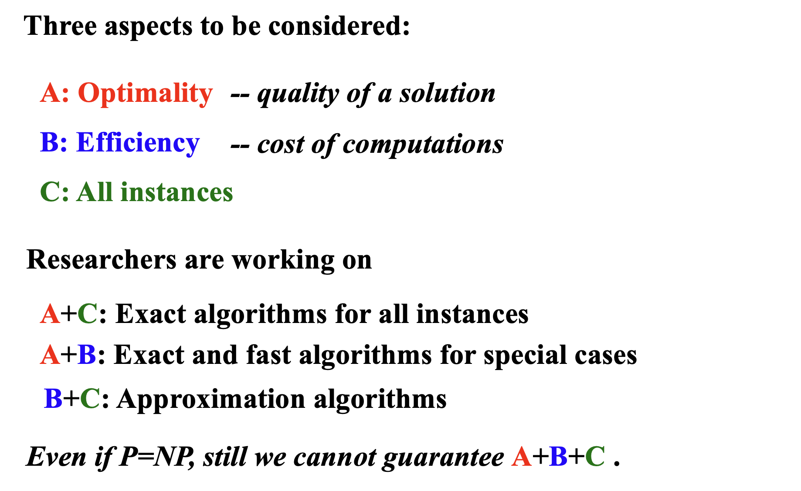

# Approximation

## 回顾

对于NPC问题：

- 如果N很小，那么$O(2^N)$也是可以接受的
- 通过增加限制条件或只取关键结果从而在多项式时间内解决
- 在多项式时间内找到接近最优解的答案
    - 牺牲精度，提高速度

## Approximation Ratio
### approximation ratio 近似比

$$
\rho(n) \ge \max (\frac{C}{C^*} ,\frac{C^*}{C})
$$

其中$C^*$是最优解，$C$是所给算法得到的结果。

If an algorithm achieves an approximation ratio of $\rho(n)$, we call it a $\rho(n)$-approximation algorithm.

### approximation scheme 近似范式

$(1+\varepsilon)-\text{approximation algorithm}$

FPTAS: fully polynomial-time approximation scheme $O((\frac{1}{\varepsilon})^2n^3)$

## Approximate Bin Packing

Given $N$ items of sizes $S_1, S_2, \ldots, S_N$, such that $0 < S_i \leq 1$ for all $1 \leq i \leq N$. Pack these items in the fewest number of bins, each of which has unit capacity.

### Next Fit
```c
void NextFit ( )
{   read item1;
    while ( read item2 ) {
        if ( item2 can be packed in the same bin as item1 )
    place item2 in the bin;
        else
    create a new bin for item2;
        item1 = item2;
    } /* end-while */
}
```

每次查看当前箱子能否装得下，装不下就放在下一个箱子里。

!!! note "近似率"
    Let $M$ be the optimal number of bins required to pack a list $I$ of items.  Then next fit never uses more than $2M – 1$ bins.  There exist sequences such that next fit uses $2M  – 1$ bins.

    证明：相邻两个箱子之和大于1。

### First Fit
```c
void FirstFit ( )
{   while ( read item ) {
        scan for the first bin that is large enough for item;
        if ( found )
    place item in that bin;
        else
    create a new bin for item;
    } /* end-while */
}
```

从第一个箱子到最后一个全局扫描，第一个能装下的箱子就装那个。

!!! note "近似率"
    Let $M$ be the optimal number of bins required to pack a list $I$ of items.  Then first fit never uses more than $17M / 10$ bins.  There exist sequences such that first fit uses $17(M – 1) / 10$ bins.

### Best Fit
扫描一下，看哪个箱子装之后留下的空隙最小。

但是还是1.7。

### 三种做法比较




### First (or Best) Fit Decreasing

- Online Problem（在线问题）：输入一个一个地到达。本例中，你无法得知下一个 item size 会是多少。
- Offline Problem（离线问题）：输入同时全部到达。本例中，你在运行算法之前可以预知全部的 item size。

我们可以先排序成单调减的序列，然后用first或best fit——first (or best) decreasion.

!!! note "近似率"
    Let $M$ be the optimal number of bins required to pack a list $I$ of items.  Then first fit decreasing never uses more than $11M / 9 + 6/9$ bins.  There exist sequences such that first fit decreasing uses $11M / 9 + 6/9$ bins.

## The Knapsack Problem

A knapsack with a capacity $M$ is to be packed. Given $N$ items. Each item $i$ has a weight $w_i$ and a profit $p_i$. If $x_i$ is the percentage of the item $i$ being packed, then the packed profit will be $p_i x_i$.

- **分数版背包问题：**可以用贪心算法。贪心准则是性价比。得到精确解。
- **0-1版背包问题：**此时贪心得到的不再是最优解，而是估计解。

!!! note "近似率"
    The approximation ratio is **2**.

    $p_{max} \leq P_{opt} \leq P_{frac}$

    $p_{max} \leq P_{greedy}$

    $P_{opt} \leq P_{frac} \leq P_{greedy} + p_{max}$

    所以我们可以得到

    $$ \frac{P_{opt}}{P_{greedy}} \leq 1 + \frac{p_{max}}{P_{greedy}} \leq 2$$

!!! warning "DP解法"
    
    <center>
    {width="500px"}
    </center>

## The K-center Problem



Input: Set of $n$ sites $s_1, \ldots, s_n \cdots$

Center selection problem:  Select $K$ centers $C$ so that the maximum distance from a site to the nearest center is **minimized**.

### A Greedy Solution

#### 不靠谱的greedy

Put the first center at the **best possible** location for a single center, and then keep adding centers so as to **reduce the covering radius** each time by as much as possible.


不靠谱起来没有上限！

#### 靠谱一点的greedy

What if we know that $r(C^*) \leq r$ where $C^*$ is the optimal solution set?

<center>

{width="200px"}

</center>

下面的程序是最优半径检测器：

```c
Centers  Greedy-2r ( Sites S[ ], int n, int K, double r )
{   Sites  S’[ ] = S[ ]; /* S’ is the set of the remaining sites */
    Centers  C[ ] = empty;
    while ( S’[ ] != empty ) {
        Select any s from S’ and add it to C;
        Delete all s’ from S’ that are at dist(s’, s) <= 2r;
    } /* end-while */
    if ( |C| <= K ) return C;
    else ERROR(No set of K centers with covering radius at most r);
}
```

接下来用二分搜索来进行猜测。

这个做法就是按照2-approximation来构造的，不可能缩减到1.99，总能构造出错误案例。

#### A smarter solution

```c
Centers  Greedy-Kcenter ( Sites S[ ], int n, int K )
{   Centers  C[ ] = empty;
    Select any s from S and add it to C;
    while ( |C| < K ) {
        Select s from S with maximum dist(s, C);
        Add s it to C;
    } /* end-while */
    return C;
}
```

#### 结论

!!! warning "定理"
    Unless $P = NP$, there is no $2-\text{approximation algorithm}$ for center-selection problem for any $\rho < 2$.

## 总结


