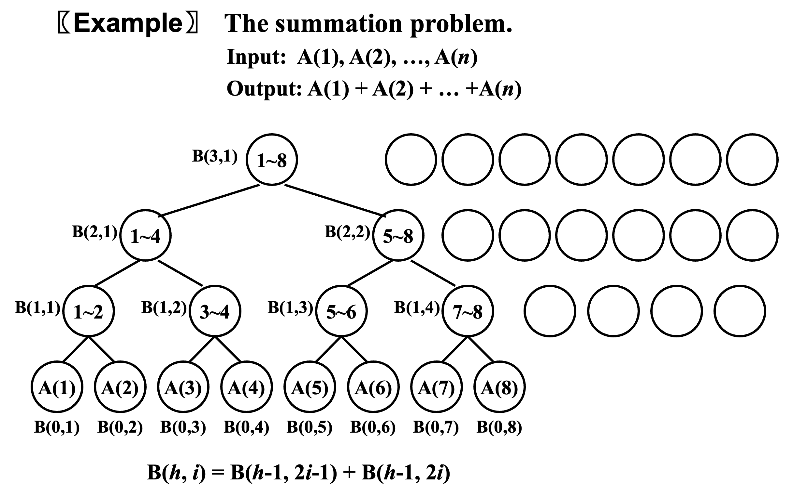

# Parallel Algorithms

- Machine parallelism
    - Processor parallelism
    - Pipelining
    - Very-Long Instruction Word (VLIW)
- Parallel algorithms

## Parallel Random Access Machine (PRAM)


处理内存冲突

- Exclusive-Read Exclusive-Write (EREW) 独占式写入和读取
- Concurrent-Read Exclusive-Write (CREW) 可以并发读，独占写
- Concurrent-Read Concurrent-Write (CRCW) 都可以并发 
    - Common rule 所有处理器都写同样的值
    - Arbitrary rule 同时写，可能有一个写成功
    - Priority rule 有优先级

### 例子：加法



```c
for Pi ,  1 <= i <= n  pardo
    B(0, i) := A( i )
    for h = 1 to log n do
        if i <= n/2^h
            B(h, i) := B(h-1, 2i-1) + B(h-1, 2i)
        else stay idle
    for i = 1: output B(log n, 1); 
    for i > 1: stay idle
```


## Work-Depth (WD)

```c
for Pi ,  1 <= i <= n  pardo
   B(0, i) := A( i )
for h = 1 to log n 
    for Pi, 1 <= i <= n/2^h  pardo
        B(h, i) := B(h-1, 2i-1) + B(h-1, 2i)
for i = 1 pardo
   output  B(log n, 1)
```


Measuring the performance

1. Work load -- total number of operations: $W(n)$
2. Worst-case running time:$T(n)$

- $W(n)$ operations and $T(n)$ time
- $P(n) = W(n) / T(n)$ processors and $T(n)$ time (on a PRAM)
- $W(n)/p$ time using any number of $p \leq W(n) /T(n)$processors (on a PRAM)
- $W(n)/p + T(n)$ time using any number of $p$ processors (on a PRAM)

{width="600px"}

!!! note
    **WD-presentation Sufficiency Theorem**: An algorithm in the WD mode can be implemented by any $P(n)$ processors within $O(W(n)/P(n) + T(n))$ time, using the same concurrent-write convention as in the WD presentation.


### 例子：前缀和


```c
for Pi , 1 <= i <= n pardo
    B(0, i) := A(i)
for h = 1 to log n
    for i , 1 <= i <= n/2^h pardo
        B(h, i) := B(h - 1, 2i - 1) + B(h - 1, 2i)
for h = log n to 0
    for i even, 1 <= i <= n/2^h  pardo
        C(h, i) := C(h + 1, i/2)
    for i = 1 pardo
        C(h, 1) := B(h, 1)
    for i odd, 3 <= i <= n/2^h pardo
        C(h, i) := C(h + 1, (i - 1)/2) + B(h, i)
for Pi , 1 <= i <= n pardo
    Output C(0, i)
```

$$T(n) = O(\log n) $$

$$W(n) = O(n) $$

### 例子：两个有序数组的合并
Merging – merge two *non-decreasing* arrays $A(1), A(2), …, A(n)$ and $B(1), B(2), …, B(m)$ into another non-decreasing array $C(1), C(2), …, C(n+m)$

思想：找出A数组每一个元素在C数组中对应的位置，然后一步将A和B的元素都搬过去。


那么如何排序？


如何优化？


第一步是将其分割，此时$T(n)=O(\log n)$，$W(n)=O(n)$。第二步是排序小块，此时$T(n)=O(\log n)$，$W(n)=O(n)$。所以总步骤是$T(n)=O(\log n)$，$W(n)=O(n)$。

### 例子：Maximum finding

- Replace “+” by “max” in the summation algorithm, $T(n)=O(\log n)$，$W(n)=O(n)$
- Compare all pairs

```c
for Pi , 1 <= i <= n  pardo
    B(i) := 0
for i and j, 1 <= i, j <= n  pardo
    if ( (A(i) < A(j)) || ((A(i) = A(j)) && (i < j)) )
            B(i) = 1
    else B(j) = 1
for Pi , 1 <= i <= n  pardo
    if B(i) == 0
        A(i) is a maximum in A
```
此处用了$n^2$个处理器。“大功率跑车算法”

$$
T(n)=O(1), W(n)=O(n^2)
$$

接下来将几种优化工作量方法：

#### A Doubly-logarithmic Paradigm

按照$\sqrt n$来分组：


按照$h = \log \log n$来分组：


#### Random Sampling

