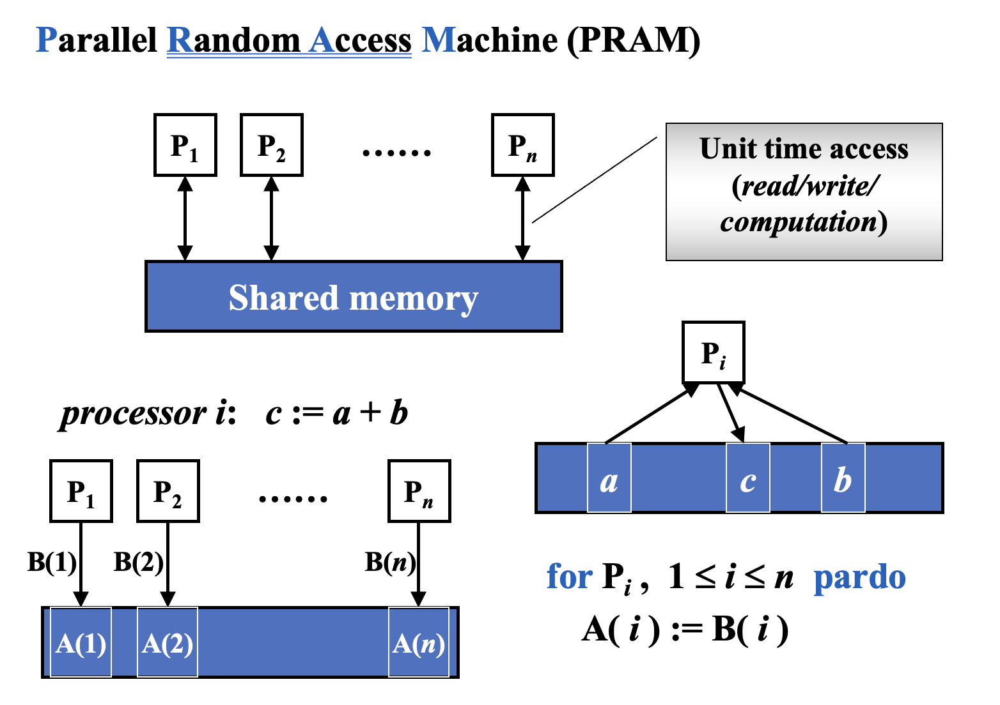

# Parallel Algorithms

- Machine parallelism
    - Processor parallelism
    - Pipelining
    - Very-Long Instruction Word (VLIW)
- Parallel algorithms

## Parallel Random Access Machine (PRAM)

处理内存冲突

- Exclusive-Read Exclusive-Write (EREW) 读写锁
- Concurrent-Read Exclusive-Write (CREW) 可以并发读
- Concurrent-Read Concurrent-Write (CRCW) 都可以并发
    - Common rule 所有处理器都写同样的值
    - Arbitrary rule 同时写，可能有一个写成功
    - Priority rule 有优先级

### 例子

## Work-Depth (WD)

对于内存写：CRCW中的Arbitrary rule