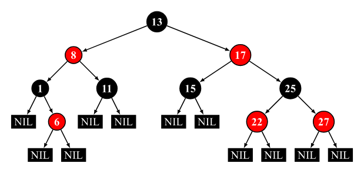

# 红黑树, B+树
## 红黑树
> https://www.cs.usfca.edu/~galles/visualization/RedBlack.html

红黑树是一种**自平衡**的**二叉搜索树**。每个节点额外存储了一个 color 字段 ("RED" or "BLACK")，用于确保树在插入和删除时保持平衡。
### 性质
一棵合法的红黑树必须遵循以下五条性质：

1.  节点为红色或黑色
2.  NIL 节点（空叶子节点）为黑色
3.  红色节点的子节点为黑色
4.  从根节点到 NIL 节点的每条路径上的黑色节点数量相同
5.  根节点必须为黑色（？

下图为一棵合法的红黑树：

插入的节点默认是红色的。

!!! note
    这不是一个合法的红黑树。    
       

!!! success "lemma"
    A red-black tree with $N$ internal nodes has height at most $2\ln (N+1)$.

### 插入
插入节点默认是**红色**，这样只可能违反根叶黑或不红红性质。

#### 插入节点是root
直接变黑。
#### U是红色
G变红，U和P变黑，然后将G变为X继续检查。
#### U是黑色
LL,RR,LR,RL-rotation, then change the color.（向上递归）

### 删除
红黑树的删除是一个十分繁琐的过程。

!!! Warning
    接下来说的孩子不包括空节点!
#### Case 1
没有孩子。  
- 红色孩子：直接删除
- 黑色孩子：最复杂，放到最后讲

#### Case 2
只有左子树/只有右子树。 
根据红黑树的性质，这种情况一定是一黑一红。
**操作：**

1. 直接用下面的节点替换掉上面的节点
2. 将替换后的节点变成黑色

#### Case X

!!! success
    

    {width="400px"}
    

## B+树
### 定义与性质

**一个 Order M 的 B+ 树定义如下：**

- 根节点要么是叶节点，要么有 2 到 $M$ 个子节点(1 ~ $M-1$ keys)
- 所有**除了根节点**的非叶节点都有 $\lceil \frac{M}{2} \rceil$ 到 $M$ 个子节点($\lceil \frac{M}{2} \rceil - 1$ ~ $M-1$ keys)
- 所有叶节点深度相同

!!! tip
    实际上，所有数据都存储在叶节点里

!!! example 
    - A 2-3 tree with 3 nonleaf nodes must have 18 keys at most. **(T)**
    ??? "解释"
        一个非叶节点为根节点，其余两个节点最多有 2\*3=6 个叶节点孩子；一个叶子存放 3 个 key，一共 18 个

### 插入操作

!!! tip
    对于叶子节点，最多可以存 M 个 Key；对于内节点，最多可以存 M-1 个 Key
以2-3树为例子，插入操作如下：

1. 与内部节点所存键值比较，找到合适叶节点插入。
2. 如果插入后该节点键数不超过3，则插入结束。
3. 若超过3个节点（也就是4个节点），按照大小分成两个节点，父节点增加一个值。若父节点增加后不超过2，则插入结束。
4. 若父节点超过了2个值（3个值），将该节点分为两个节点，左节点继承key[0], 右节点继承key[2], key[1]作为新的键值传给父节点，递归。

### 删除操作

1. 删除后若无异常，结束。
2. 若低于m/2，则考虑
      1. 借旁边节点的
      2. 若不能借（借了低于m/2），则合并
3. 递归向上