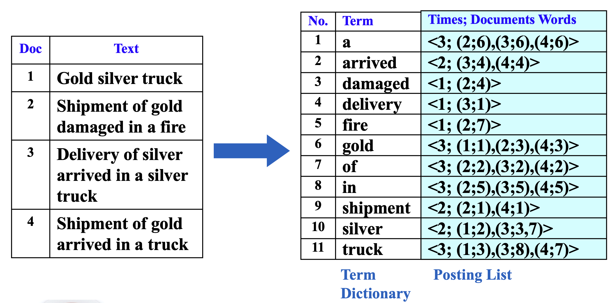
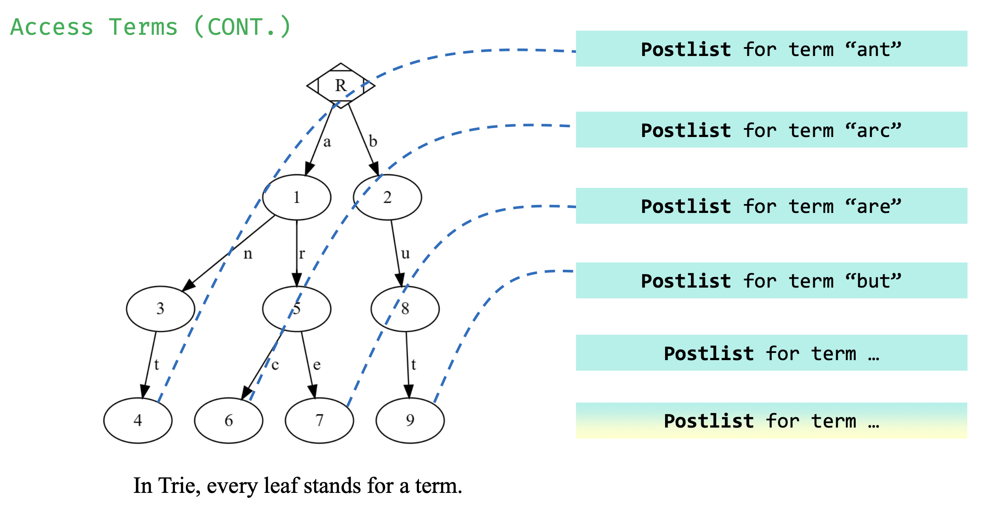
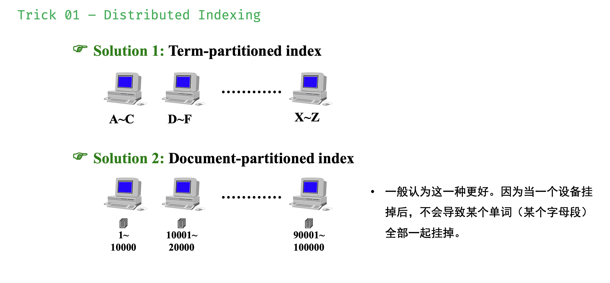
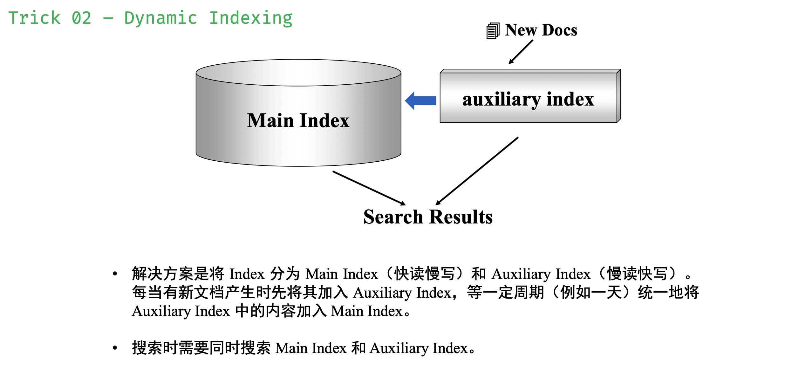
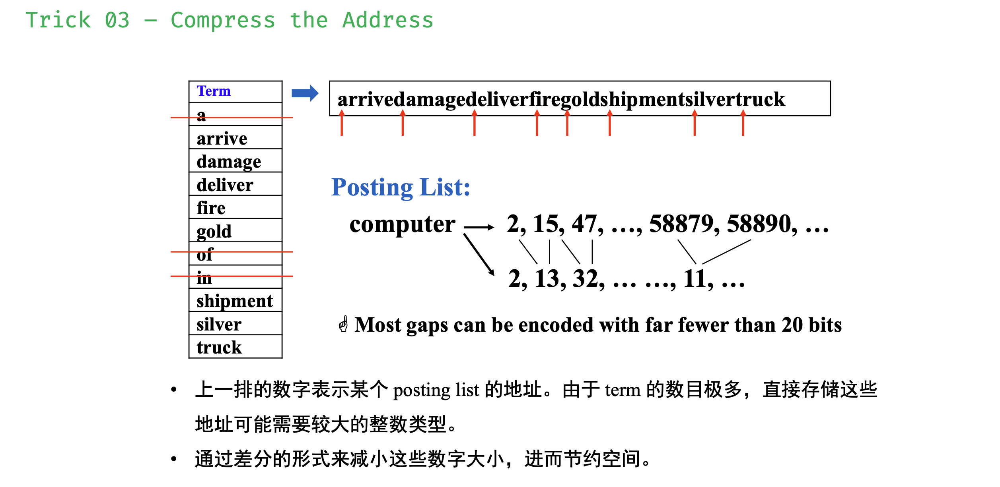
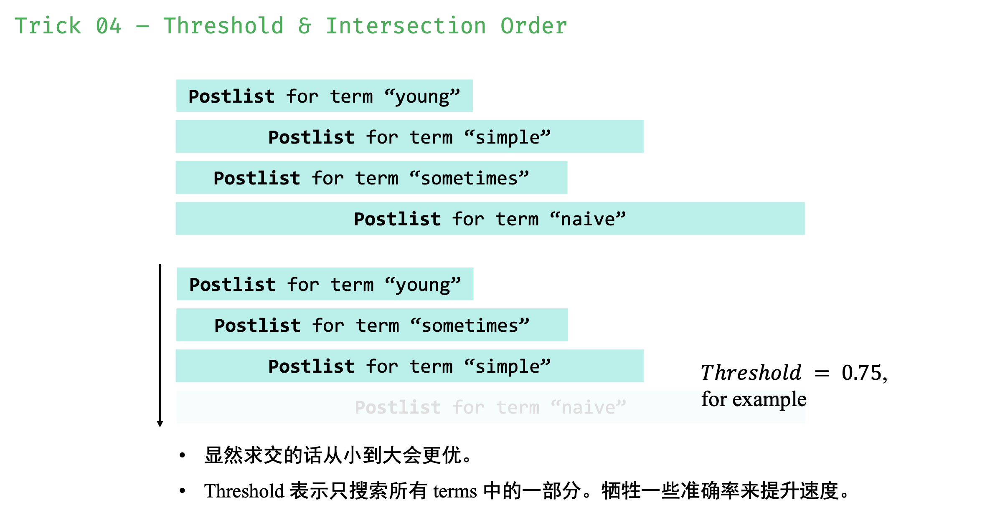
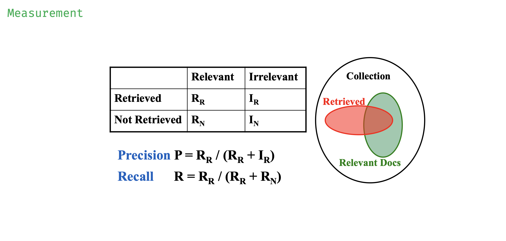

# Invert File Index
## Definition
- Index is a mechanism for locating a given term in a text.
- Inverted file contains a list of pointers (e.g. the number of a page) to all occurrences of that term in the text.
- 

第十个Term:silver`<2;(1;2),(3;3,7)>`是指这个词在两篇文章中出现过，在第一篇的第二个词，在第二篇的第3个和第7个词。

查找时，先找Term，再由Term引到Postlist的链表。

!!! Note "数据结构"
    Term的实现不可能用列表，因为一个个枚举太慢了。Postlist一般是使用链表。

**Term的数据结构**

- Hashing
    - 理想情况下，hashing的单个查询更快
    - Hashing的问题在于冲突以及不支持快速的范围查询。比如要查找一堆re开头的单词，会需要一个个算哈希值。

- 字典树Tries
    - 每个叶节点都代表一个Term
    - 若单词有相同前缀，则会经过相同父节点
    - 复杂度就是单词的长度

**生成Term的伪代码：**

## 提取文章中Term
当读取文章中的 Term 用作索引时，还需要：

- Word Stemming
	- 提取该 Term 的词根，如 says,said,saying 都看作词根 say
	- https://tartarus.org/martin/PorterStemmer/
	- https://github.com/wooorm/stmr.c
- Stop Words
	- 一些 Term 太过常见，没有价值，所以需要过滤它们
	- 搜索 Word Stop List 即可找到过滤列表

## 存储Term
### LRU (Least Recently Used)

### Distributed Index
按照一定规则进行分布式存储：

- 第一种存储很复杂，但是检索方便
- 第二种存储方便，但是检索很复杂

### Dynamic indexing

### Compression

## Thresholding

## Measure

- **精确率** 是检索到的相关记录与检索到的记录总数的比率。
- **召回率** 是检索到的相关记录与相关记录总数的比值。

## 例题

!!! example
    In distributed indexing, document-partitioned strategy is to store on each node all the documents that contain the terms in a certain range.
    ??? success "answer"
        F 在磁盘分区索引技术中，每个节点均会存放部分索引，而不是所有的索引。因为分布式索引的方式是按文档序号排序的，如果按包含的terms分类，在储存故障时，关于这个terms的文档全没了，不抗风险。

!!! example
    When evaluating the performance of data retrieval, it is important to measure the relevancy of the answer set.
    ??? success "answer"
        F 这个说的是data retrieval，错。Information retrieval才需要measure the relevancy of the answer set。

!!! example
    Precision is more important than recall when evaluating the explosive detection in airport security. 
    ??? success "answer"
        F 在机场安全的危险品探测中应该是Recall率更重要。

!!! example
    While accessing a term by hashing in an inverted file index, range searches are expensive.  
    ??? success "answer"
        T 哈希不适合范围搜索

!!! example
    When measuring the relevancy of the answer set, if the precision is high but the recall is low, it means that:

    A.
    most of the relevant documents are retrieved, but too many irrelevant documents are returned as well

    B.
    most of the retrieved documents are relevant, but still a lot of relevant documents are missed

    C.
    most of the relevant documents are retrieved, but the benchmark set is not large enough

    D.
    most of the retrieved documents are relevant, but the benchmark set is not large enough
    ??? success "answer"
        B

!!! example
    Which of the following is NOT concerned for measuring a search engine?

    A.
    How fast does it index

    B.
    How fast does it search

    C.
    How friendly is the interface

    D.
    How relevant is the answer set
    ??? success "answer"
        C

!!! example
    There are 28000 documents in the database. The statistic data for one query are shown in the following table. The recall is: __

    ||Relevant|Irrelevant|
    |:--:|:--:|:--:|
    |Retrieved|4000|12000|
    |Not Retrieved|8000|4000|
    ??? success "answer"
        33% 召回率是检索到的相关记录与相关记录总数的比值。4000/4000+8000

