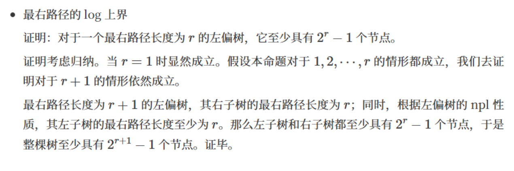
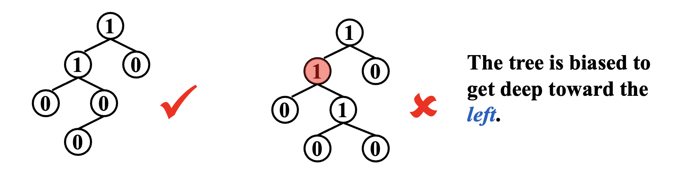
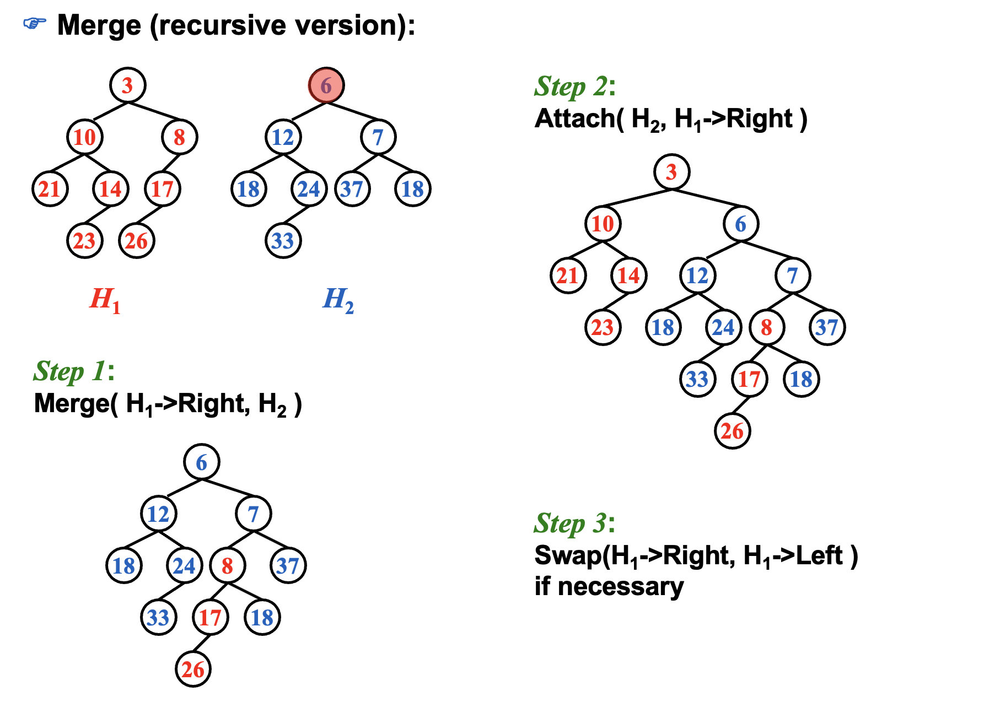
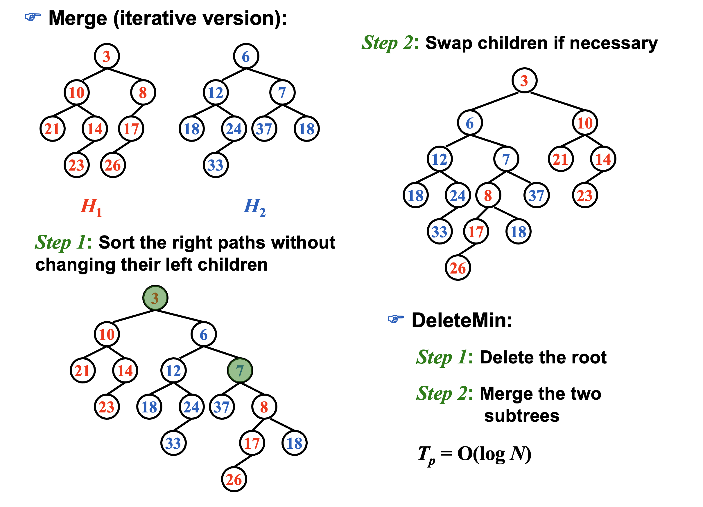
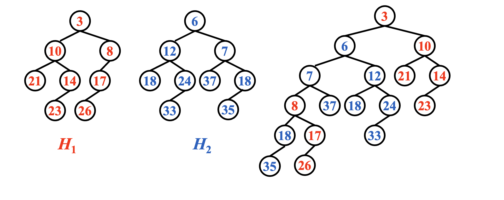
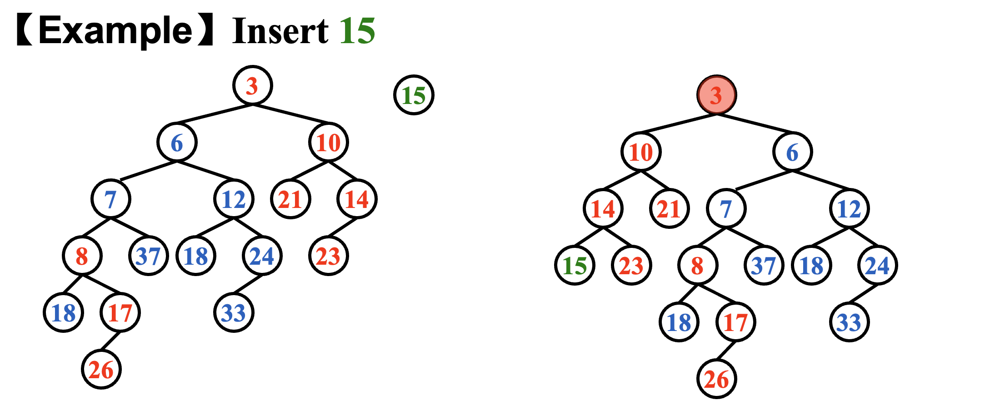
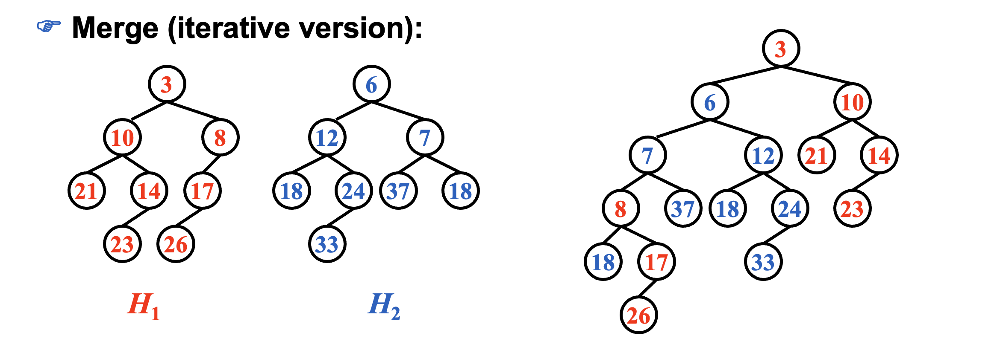
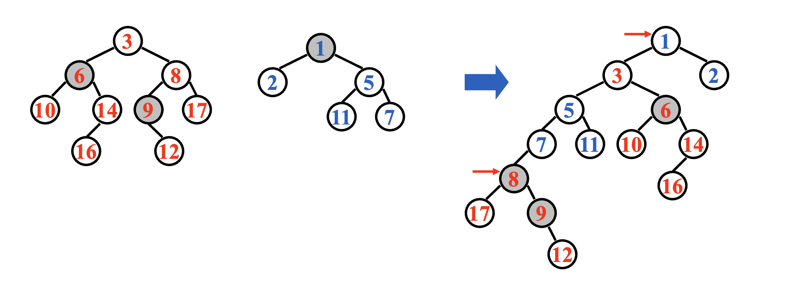
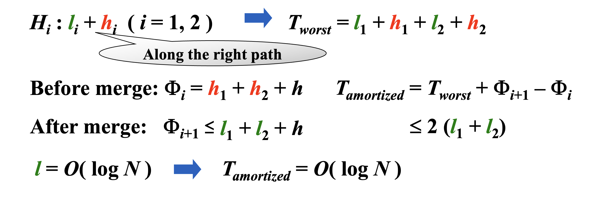

# Leftist Heap & Skew Heap
## Leftist Heap
!!! discussion
    How fast can we merge two heaps if we simply use the original heap structure? 

    答案是O(n).光是两个数组之间的复制就要O(n)的复杂度。

### Definition
左偏堆，亦称左偏树（Leftist Tree），是一种用于实现优先级队列的 Binary Heap 数据结构，它具有和堆一样的大小顺序，但表现形式为**非平衡二叉树**，因此不能使用数组表示和维护。

左偏堆的关键特征之一是计算和维护每个节点的 **Null Path Length** ，该长度定义为从节点 X 到最近的 Null 节点的距离，在程序结构中通常使用 `dist(X)` 或 `Npl(X)` 表示

!!! note "Definition"
    The null path length, Npl(X), of any node X is the length of the shortest path from X to a node without two children.  Define Npl(NULL) = –1.

- Npl(X) = min { Npl(C) + 1 for all C as children of X }
!!! tip
    有点像计算树高，只不过计算树高是取max


!!! Definition
    The leftist heap property is that for every node X in the heap, the null path length of the left child is at least as large as that of the right child.
    
    对于左偏堆任何一个节点，都有Npl(LC) >= Npl(RC).

并能得到以下定理：

1. 从根到最右侧叶的路径是从根到叶的最短距离（这里采用拓展二叉树的形式，即叶节点为 Null 节点）
2. 如果到最右侧路径上有 $r$ 个节点，则左偏堆起码有 $2^r-1$ 个节点，这也意味着对于具有 $N$ 个节点的左偏堆，到最右侧叶节点的路径长度为 $O(log N)$（可用数学归纳法证明）





```C
typedef struct node {
    ElementType Val;
    struct node *left;
    struct node *right;
    int Npl;
} Node;
```

### Operation
对左偏堆的操作主要是 **Merge** ，其它操作都可以通过 Merge 来调整。

- `DeleteMin()` 或 `ExtractMin` 可以通过删除 root 并为左右子树调用 Merge 来完成
- `Insert()` 可以通过 Merge 原来的左偏堆以及单个节点的树来完成


| Function   | Complexity  |
| ---------- | ----------- |
| Get Min    | $O(1)$      |
| Delete Min | $O(log N)$ |
| Insert     | $O(log N)$ |
| Merge      | $O(log N)$ |

#### 递归Merge



这个例子是告诉我们先比较两个数的根节点，然后合并，具体合并过程不用管，这是递归的过程。然后再把树接回去，最后判断下是否需要调整。

具体点讲：  
1. 根大的堆接到根小的堆的右子树  
2. 若是右子树不为空，则堆的右子树代替堆     
3. 检查Npl值，异常则交换左右子树

```c
Node* Merge(Node* H1, Node* H2){
    if(H1 == NULL) return H2;
    if(H2 == NULL) return H1;
    if(H1->Val < H2->Val) return Merge1(H1,H2);
    else return Merge1(H2,H1);
}

// 静态属性使得其可以在写题时正确互相调用
static Node* Merge1(Node* H1, Node* H2) {
    if(H1->left == NULL)
        H1->left = H2; // 同时做到了swap
    else {
        H1->right = Merge(H1->right,H2);
        if(H1->left->Npl < H1->right->Npl)
            swap(H1->left,H1->right);
    } // end else
    return H1;
}
```

#### 迭代Merge



详细步骤：  
1. 将两棵树的右路径提出来排个序     
2. 将左子树挨个挂上去   
3. 检查Npl，左右调整    


## Skew Heap
### Definition
**斜堆（Skew Heap）**是左偏堆的简单形式，具有和左偏堆类似的性质，但又有所不同。

其特点是在进行 Merge 操作时，每次都进行左右子树的 Swap。无Npl。

!!! Note
    - Skew heaps have the advantage that **no extra space** is required to maintain path lengths and **no tests** are required to **determine when to swap children**.
    - It is an open problem to determine precisely the expected right path length of both leftist and skew heaps.

### Operation
#### 递归Merge


详细步骤：  
1. 根小的堆子树u左右交换    
2. 将交换后的u的左子树与根大的堆v做Merge操作    
3. Merge之后的树接到原先的左子树上  



!!! Warning
    斜堆完全没有能力维持左倾的特性！


#### 迭代Merge


具体操作：  
1. 右路径从小到大排序   
2. 左子树不变，左右交换，一个个连上去

### 均摊分析
#### 目的
对 Skew Heap 的 Merge 操作进行分析，实际成本是斜堆的右路径长度，但是我们没有办法限制右路径的长度。所以我们要进行均摊分析。
#### 方法
D_i：the root of the resulting tree

!!! Warning
    单调增函数不适合用来估计均摊成本，应为每一步都会比实际成本更大，不精确。
定义势能函数 $\phi(D_i)$ 为以 $D_i$ 为根节点的树的 Heavy Nodes 的数量，其中 Heavy Nodes 定义为右子树的节点数大于等于左子树的节点数的 Node。

那么对于 Heavy Nodes 以及相对的 Light Nodes，有如下性质：

- 任意不在右路径的节点，其在归并前后左右子树不变化，即轻重情况也不变（只有右路径上的节点会产生轻重变化）
- 右路径上所有重节点在归并后全部变为轻节点，而轻节点有可能但不一定变为重节点






!!! Tip
    想要右路径轻节点多，那左倾程度就越大，右路径就越短，右路径轻节点就少；  
    想要右路径长，那左倾程度就小，那右路径轻节点就少。

