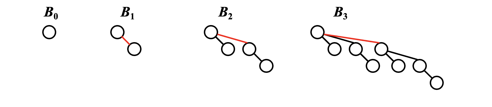
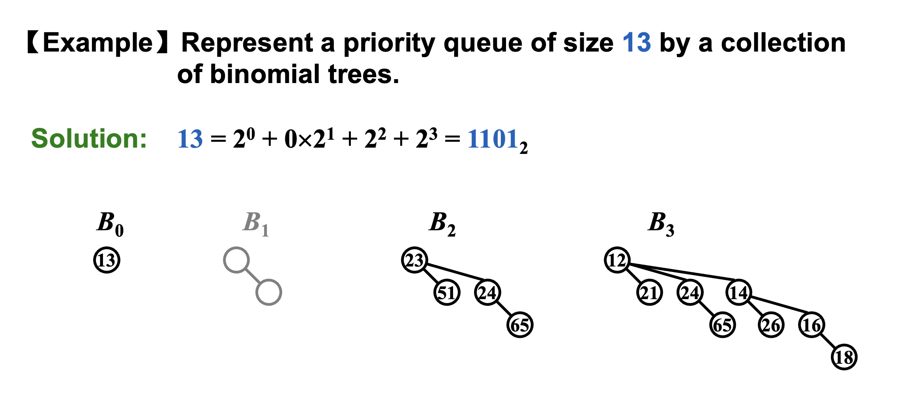
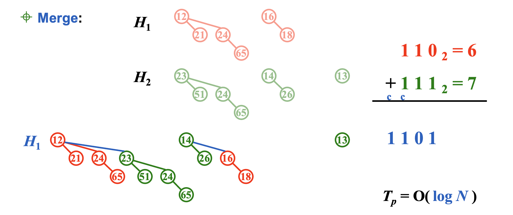
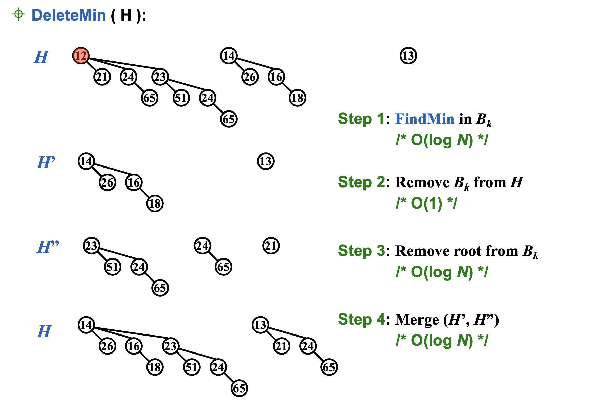
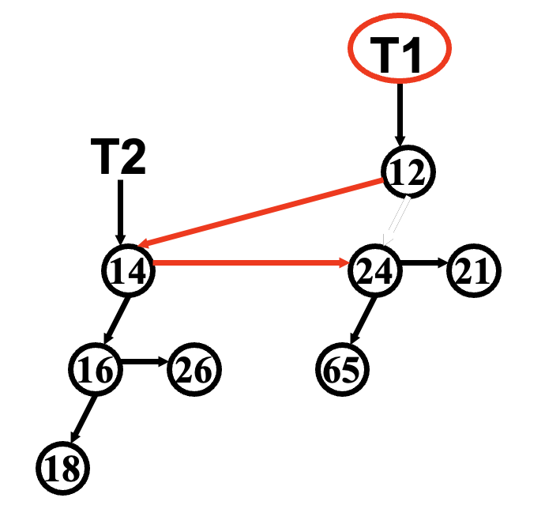
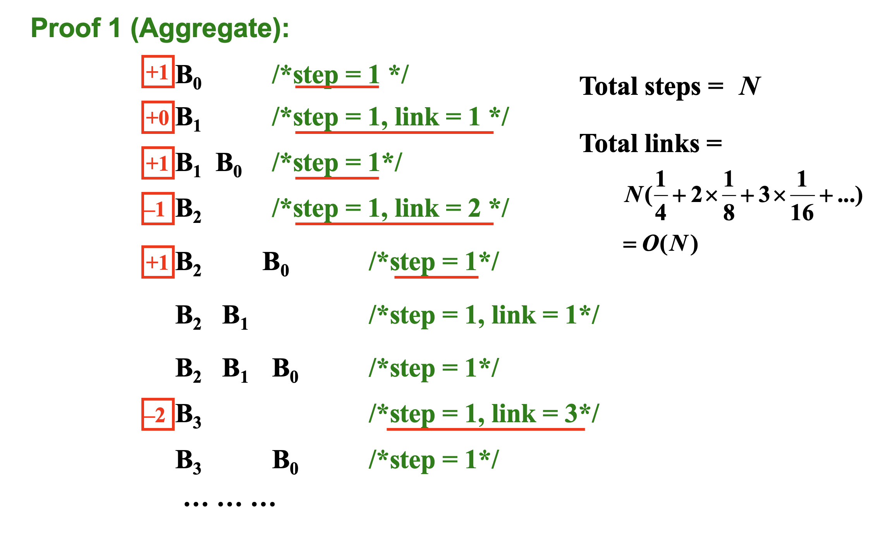

# Binomial Queue

## Definition

A binomial queue is not a heap-ordered tree, but rather a collection of heap-ordered trees, known as a forest.(森林)  Each heap-ordered tree is a binomial tree.


!!! Note "递归定义"
    A binomial tree of height 0 is a one-node tree.     
    A binomial tree, Bk, of height k is formed by attaching a binomial tree, $B_{k–1}$, to the root of another binomial tree, $B_{k–1}$.
    



!!! Note "性质"
    Bk consists of a root with **k** children, which are  $ B_0, B_1, B_2, \cdots , B_{k-1}$ . Bk has exactly $2^k$ nodes. The number of nodes at depth d is 
    $
    \binom{k}{d}
    $.


A priority queue of any size can be uniquely represented by a collection of binomial trees. 因为每个数都可以转换成唯一的二进制数。




**实现**：使用指针数组，每个指针指向一个Binomial Queue.

## Operation


### FindMin

The minimum key is in one of the roots.
There are at most $ \lceil \log N \rceil $ roots, hence Tp = O(log n).


!!! Warning
    但是我们有快速操作。We can remember the minimum and update whenever it is changed.  Then this operation will take O(1).

### Merge



复杂度就是进行加法的位数。

!!! Tip
    对于一个十进制数，要确定其转换成二进制后有多少位，可以通过以下步骤进行计算：

    设十进制数为 \( N \)，那么它转换成二进制后的位数 \( L \) 可以通过以下公式计算：

    \[
    L = \lfloor \log_2{N} \rfloor + 1
    \]

    其中 \( \lfloor x \rfloor \) 表示向下取整。

## Insert
!!! Warning "注意"
    单次Insertion可以看作是一次特殊的merge，单次复杂度是$O(\log n)$。但是这并不意味着从空开始insert n 次复杂度是$O(n\log n)$，通过均摊分析可知是$O(n)$。

### DeleteMin




### Decrease Key

## Implementation

Binomial queue = **array** of binomial trees

|Operation|Property|Solution|
|:--:|:--:|:--:|
|DeleteMin|Find all the subtrees quickly|Left_child_next_sibling with linkes lists|
|Merge|The children are ordered by their sizes|The new tree will be the largest. Hence maintain the subtrees **in decreasing sizes**.|

```C
typedef struct BinNode *Position;
typedef struct Collection *BinQueue;
typedef struct BinNode *BinTree;  /* missing from p.176 */

struct BinNode 
{ 
    ElementType	Element;
    Position LeftChild;
    Position NextSibling;
} ;

struct Collection 
{ 
    int	CurrentSize;  /* total number of nodes */
    BinTree	TheTrees[ MaxTrees ];
} ;
```

```C
BinTree CombineTrees( BinTree T1, BinTree T2 )
{  /* merge equal-sized T1 and T2 */
    if ( T1->Element > T2->Element )
        /* attach the larger one to the smaller one */
        return CombineTrees( T2, T1 );
    /* insert T2 to the front of the children list of T1 */
    T2->NextSibling = T1->LeftChild;
    T1->LeftChild = T2;
    return T1;
}
```
<center>
{width="200px"}
</center>

```c
BinQueue Merge( BinQueue H1, BinQueue H2 )
{	BinTree T1, T2, Carry = NULL; 	
    int i, j;
    if ( H1->CurrentSize + H2-> CurrentSize > Capacity )  ErrorMessage();
    H1->CurrentSize += H2-> CurrentSize;
    for ( i = 0, j = 1; j <= H1->CurrentSize; i++, j*=2 ) {
        T1 = H1->TheTrees[i]; T2 = H2->TheTrees[i]; /* current trees */
        switch( 4*!!Carry + 2*!!T2 + !!T1 ) { // 将操作数变为0和1
        case 0: /* 000 */
        case 1: /* 001 */  break;	
        case 2: /* 010 */  H1->TheTrees[i] = T2; 
                           H2->TheTrees[i] = NULL; 
                           break;
        case 4: /* 100 */  H1->TheTrees[i] = Carry; 
                           Carry = NULL; 
                           break;
        case 3: /* 011 */  Carry = CombineTrees( T1, T2 );
                           H1->TheTrees[i] = H2->TheTrees[i] = NULL; 
                           break;
        case 5: /* 101 */  Carry = CombineTrees( T1, Carry );
                           H1->TheTrees[i] = NULL; 
                           break;
        case 6: /* 110 */  Carry = CombineTrees( T2, Carry );
                           H2->TheTrees[i] = NULL; 
                           break;
        case 7: /* 111 */  H1->TheTrees[i] = Carry; 
                           Carry = CombineTrees( T1, T2 ); 
                           H2->TheTrees[i] = NULL; 
                           break;
        } /* end switch */
    } /* end for-loop */
    return H1;
}
```
```c
ElementType  DeleteMin( BinQueue H ) {	
    BinQueue DeletedQueue; 
    Position DeletedTree, OldRoot;
    ElementType MinItem = Infinity;  /* the minimum item to be returned */	
    int i, j, MinTree; /* MinTree is the index of the tree with the minimum item */

    if ( IsEmpty( H ) )  {
        PrintErrorMessage();
        return –Infinity; 
    }

    for ( i = 0; i < MaxTrees; i++) {  /* Step 1: find the minimum item */
        if( H->TheTrees[i] && H->TheTrees[i]->Element < MinItem ) { 
        MinItem = H->TheTrees[i]->Element;  MinTree = i;    
        } /* end if */
    } /* end for-i-loop */

    DeletedTree = H->TheTrees[ MinTree ];  
    H->TheTrees[ MinTree ] = NULL;   /* Step 2: remove the MinTree from H => H’ */ 
    OldRoot = DeletedTree;   /* Step 3.1: remove the root */ 
    DeletedTree = DeletedTree->LeftChild;   free(OldRoot);
    DeletedQueue = Initialize();   /* Step 3.2: create H” */ 
    DeletedQueue->CurrentSize = ( 1<<MinTree ) – 1;  /* 2MinTree – 1 */

    for ( j = MinTree – 1; j >= 0; j – – ) {  
        DeletedQueue->TheTrees[j] = DeletedTree;
        DeletedTree = DeletedTree->NextSibling;
        DeletedQueue->TheTrees[j]->NextSibling = NULL;
    } /* end for-j-loop */

    H->CurrentSize  –= DeletedQueue->CurrentSize + 1;
    H = Merge( H, DeletedQueue ); /* Step 4: merge H’ and H” */ 
    return MinItem;
}
```
!!! Tip
    对照前面的原理图食用更佳（

## Amortized analysis
|第几次|操作成本|
|:--:|:--:|
|1|1|
|2|2|
|3|1|
|4|3|
|5|1|
|...|...|

0出现的越早，所需的代价越小。


### Potential method
定义势能函数
$$ \phi(i) = \text{number of trees after } i \text{th insertion} $$
过程：
$$ B_{k+1},\cdots, B_3, B_2, B_1, B_0 $$
$$ c_i = i + (k + 1)$$
$$ \hat{c}_i = i + (k + 1) + x + 1 - (x + k + 1) = 2 $$

所以：
$$ \sum_{i=1}^{N}{\hat{c_i}} = \sum_{i=1}^{N}{c_i} + \phi(i) - \phi(0) = 2N $$
$$ \sum_{i=1}^{N}{c_i} =2N - \phi(0) \leq 2N = O(N)$$

### Accounting method

每一个节点内都有一个硬币，

### Aggregate analysis




## 各类堆的操作复杂度


|Heaps:|Leftist|Skew|Binomial|Fibonacci|Binary|Link list||
|:--:|:--:|:--:|:--:|:--:|:--:|:--:|:--:|
|Make heap|O(1)|O(1)|O(1)|O(1)|O(1)|O(1)||
|Find-Min||||||||
|Merge|||||O(n)|||
|Insert||||||||
|Delete||||||||
|Delete-Min||||||||
|Decrease-Key||||||||