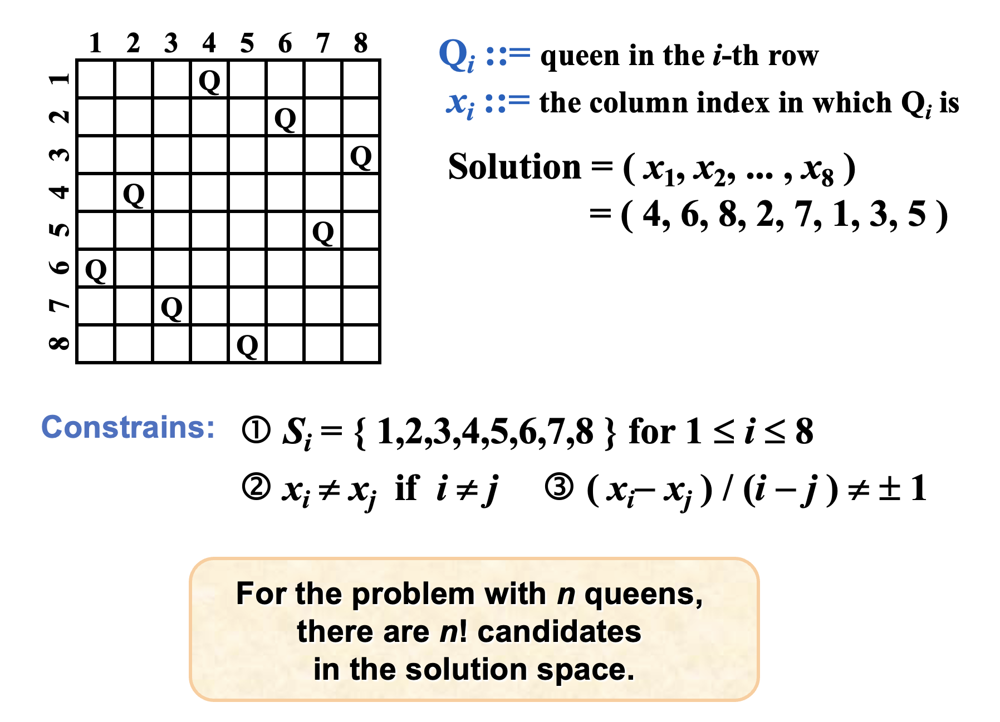
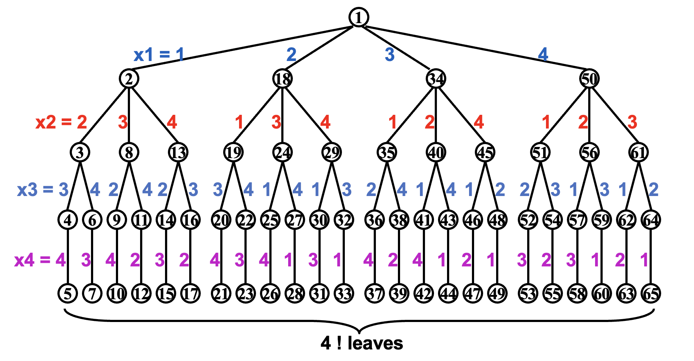
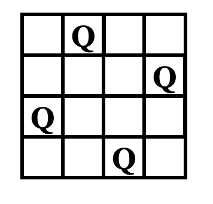
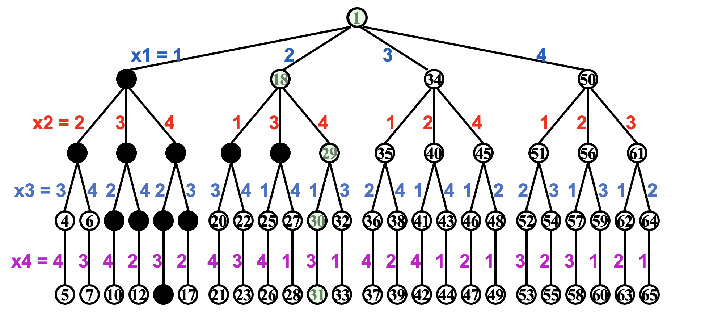
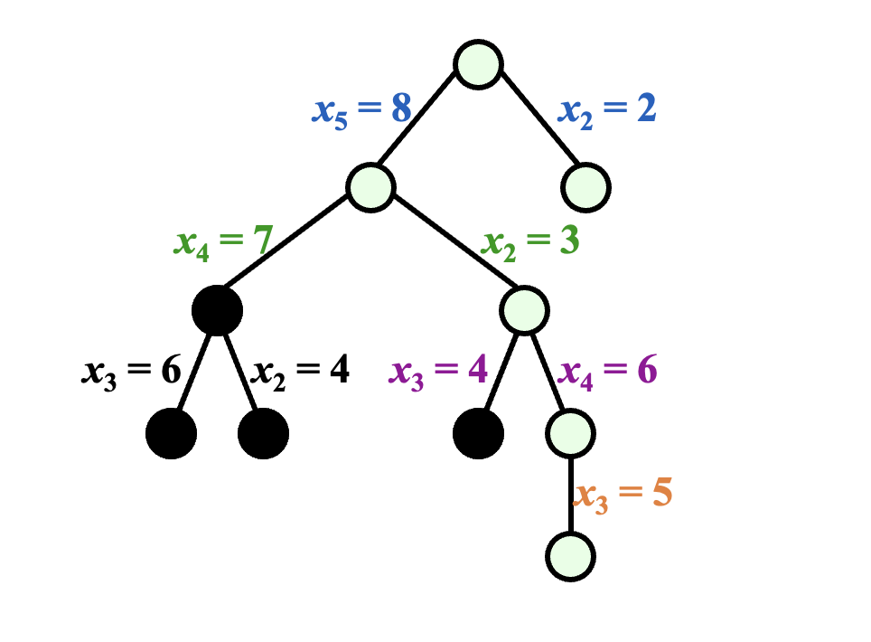
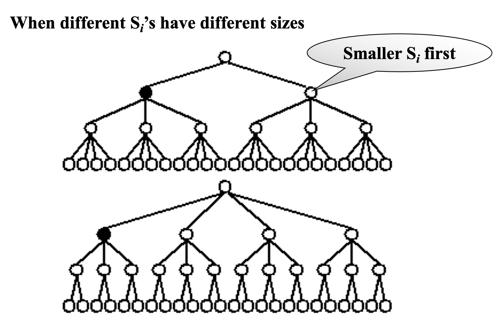
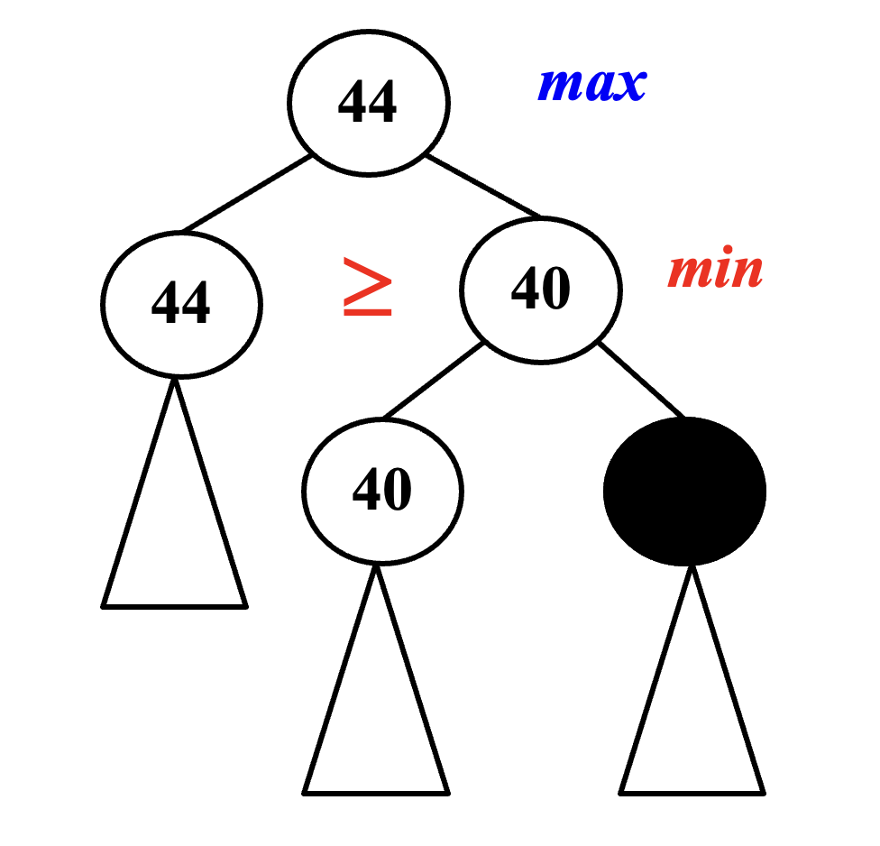
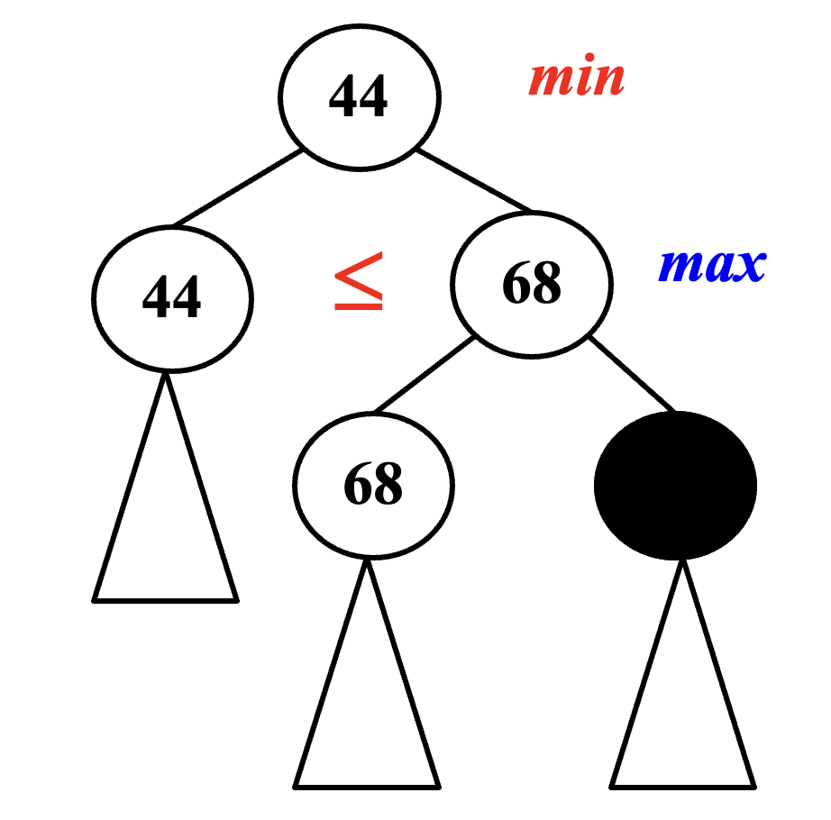

# Backtracking

## Rationale of the Backtracking Algorithms

A sure-fire way to find the answer to a problem is to **make a list of all candidate answers, examine each**, and following the examination of all or some of the candidates, declare the identified answer.

**Backtracking** enables us to **eliminate** the explicit examination of **a large subset** of the candidates while still guaranteeing that the answer will be found if the algorithm is run to termination.(pruning 剪枝)

The basic idea is that suppose we have a partial solution $( x_1, \cdots , x_i )$ where each $x_k \in S_k$ for  $1 \leq k \leq i < n$.   First we add $x_{i+1} \in S_{i+1}$ and check if $( x_1, \cdots , x_i, x_{i+1} )$ satisfies the constrains.  If the answer is “yes” we continue to add the next $x$, else we delete $x_i$ and backtrack to the previous partial solution $( x_1, \cdots , x_{i-1} )$.

## Eight queens



!!! Note
    第一步的操作数是$8^8$，第二部的操作数减为$8!$。

以4皇后问题为例：   
第一步：先建树  


第二步：进行深搜来检测路径是否正确  
<center>
{width="150px"}
</center>


## The Turnpike Reconstruction Problem
Given $N$ points on the x-axis with coordinates $x_1 <  x_2 <\cdots< x_N$ .  Assume that $x_1 = 0$.  There are $N ( N – 1 ) / 2 $ distances between every pair of points.

Given $N ( N – 1 ) / 2 $ distances. Reconstruct a point set from the distances.

**Example**         
Given $D = \{ 1, 2, 2, 2, 3, 3, 3, 4, 5, 5, 5, 6, 7, 8, 10 \}$      

- Step 1: $ N ( N – 1 ) / 2 = 15$  implies  $N = 6$
- Step 2: $ x_1 = 0 $ and $x_6 = 10 $
- Step 3: find the next largest distance and check  

!!! Warning
    处理顺序是从最大距离到最小距离，在找距离时，一定是找当前节点到两个端点之间的距离，不可以去找中间节点的距离。这是因为中间节点之间的路径长度一定小于其到端点之间的距离，而我们是从最大距离到最小距离的顺序找的。


<center>
{width="400px"}
</center>

```C
bool Reconstruct (DistType[], DistSet D, int N, int left, int right) {
    bool Found = false;
    if (Is_empty(D)) {
        return true; // 退出递归
    }
    D_max = FindMax(D);
    OK = Check(D_max, N, left, right);
    if(OK) {
        X[right] = D_max;
        for(i = 1; i < left; i++) {
            Delete(abs(X[right] - X[i]), D);
        }
        for(i = right + 1; i <= N; i++) {
            Delete(abs(X[right] - X[i]), D);
        }
        Found = Reconstruct(X, D, N, left, right-1);
        if(!Found) {
            for(i = 1; i < left; i++) {
                Insert(abs(X[right] - X[i]), D);
            }
            for(i = Right + 1; i < N; i++) {
                Insert(abs(X[right] - X[i]), D);
            }
        }
    }
    if ( !Found ) { /* if option 1 does not work */
        /* option 2: X[left] = X[N]-D_max */
        OK = Check( X[N]-D_max, N, left, right );
        if ( OK ) {
            X[left] = X[N] – D_max;
            for ( i=1; i<left; i++ ) {
                Delete( |X[left]-X[i]|, D);
            }
            for ( i=right+1; i<=N; i++ ) {
                Delete( |X[left]-X[i]|, D);
            }
            Found = Reconstruct (X, D, N, left+1, right );
            if ( !Found ) {
                for ( i=1; i<left; i++ ) {
                    Insert( |X[left]-X[i]|, D);
                }
                for ( i=right+1; i<=N; i++ ) {
                    Insert( |X[left]-X[i]|, D);
                }
            }
        }
        /* finish checking option 2 */
    } /* finish checking all the options */    
    return Found;
}
```


!!! Warning "模板"
    ```C
    bool Backtracking ( int i )
    {   Found = false;
        if ( i > N )
            return true; /* solved with (x1, …, xN) */
        for ( each xi  Si ) { 
            /* check if satisfies the restriction R */
            OK = Check((x1, …, xi) , R ); /* pruning */
            if ( OK ) {
                Count xi in;
                Found = Backtracking( i+1 );
                if ( !Found )
                    Undo( i ); /* recover to (x1, …, xi-1) */
            }
            if ( Found ) break; 
        }
        return Found;
    }
    ```

<center>
{width="300px"}
</center>

优先选择第一个，因为第一个的剪枝会减去一大片。

## Minimax Strategy

$$
f(P) = W_{Computer} - W_{Human}
$$

只有叶节点会用$f(P)$，往上的话就用minimax。

### $\alpha$ pruning 

<center>

{width="200px"}

</center>

### $\beta$ pruning

<center>

{width="200px"}

</center>


$\alpha-\beta$ pruning: when both techniques are combined.  In practice, it limits the searching to only $O(\sqrt{N})$ nodes, where $N$ is the size of the full game tree.