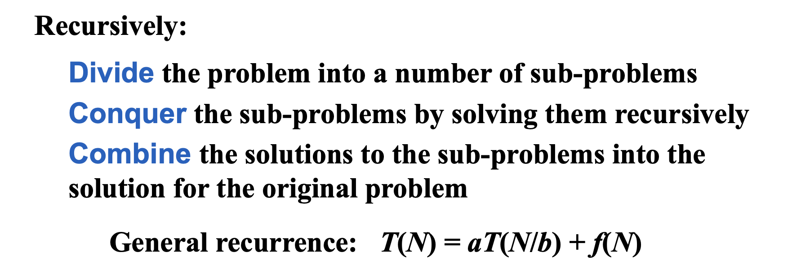
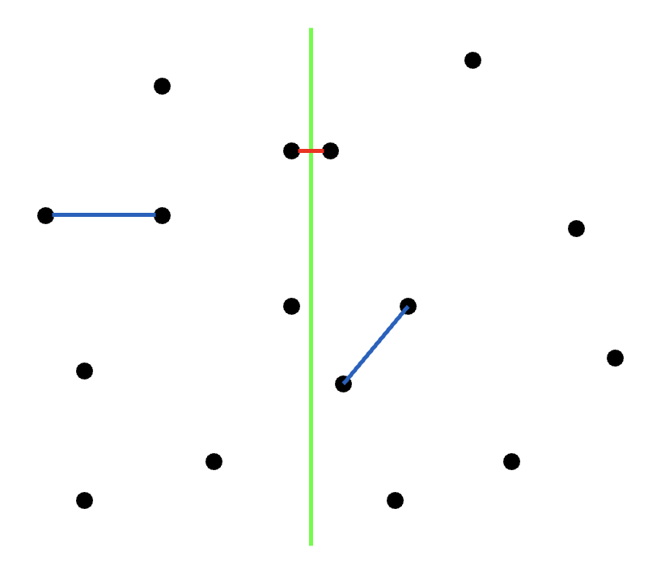
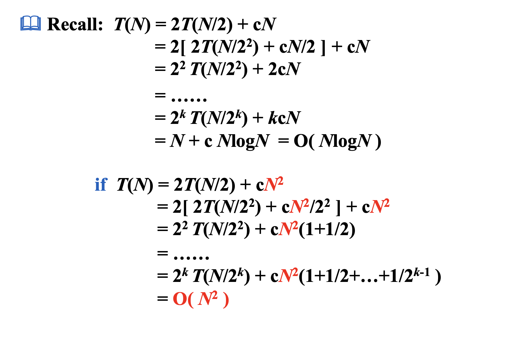
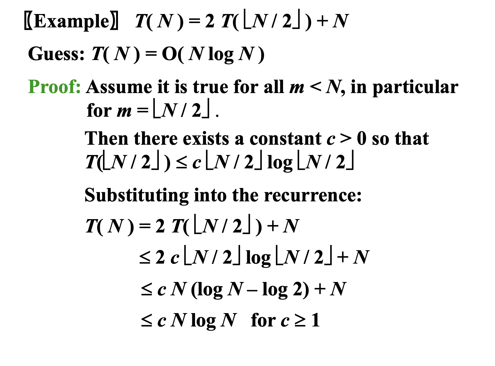
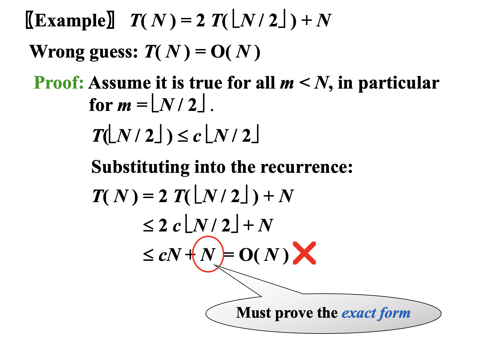
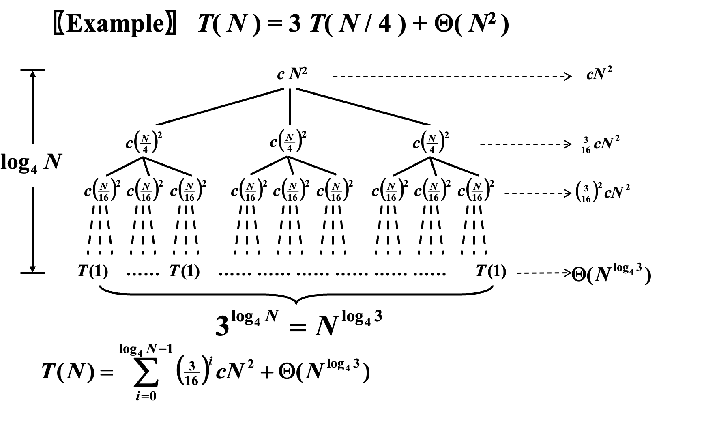

# Divide and Conquer

## Closest Points Problem
### Simple Exhaustive Search
Check $ N(N-1)/2 $ pairs of points.$T = O(N^2)$.
### Divide and Conquer 

回顾分治算法的时间复杂度：

Three methods for solving recurrence:   
- Substitution method
- Recursion-tree method
- Master method

## Substitution method
guess, then prove by induction.

正确猜测：  

错误示范：  

!!! Warning
    每过一层就会加一！

## Recursion-tree method

## Master method

$$\begin{gather}T(N)=aT(\frac{N }{b})+\Theta(N^k \log^pN),a\ge 1,b\gt 1 ,p\ge 0 \\
\\
T(N)=\begin{cases}O(N^{\log_ba})\ ,\ if\ \log_ba\gt k \\ O(N^k\log ^{p+1}N)\ ,\ if\ \log_ba=k \\  O(N^k \log ^pN)\ ,\ if\ log_ba\lt k
\end{cases}
\end{gather}$$