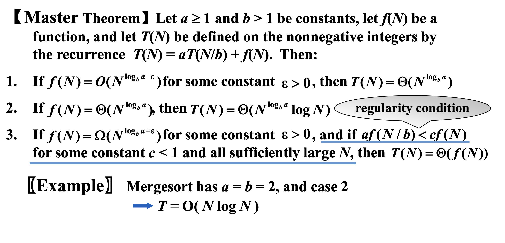

# Divide and Conquer

## Closest Points Problem
### Simple Exhaustive Search
Check $ N(N-1)/2 $ pairs of points.$T = O(N^2)$.
### Divide and Conquer 

回顾分治算法的时间复杂度：

Three methods for solving recurrence:   
- Substitution method
- Recursion-tree method
- Master method

## Substitution method
guess, then prove by induction.

正确猜测：  

错误示范：  

!!! Warning
    每过一层就会加一！

## Recursion-tree method

## Master method

