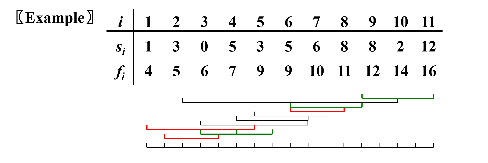
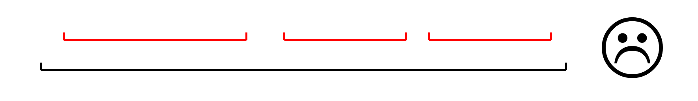

# Greedy Algorithms

- Optimization Problems 最优化问题

Given a set of constraints and an optimization function.  Solutions that satisfy the constrains are called **feasible solutions**. A feasible solution for which the optimization function has the **best possible value** is called an optimal solution.

- Greedy Method 贪心算法

Make the **best** decision at each stage, under some **greedy criterion**. A decision made in one stage is **not changed** in a later stage, so each decision should **assure feasibility**.

也就是说，求的是局部最优解。

!!! note
    - 当且仅当局部最优解等于全局最优解的时候，贪心算法才成立。
    - 贪婪算法不能保证最优解。但是，它通常会产生非常接近最优解的值，因此当寻找最优解需要花费太多时间时，它直观上很有吸引力。（之后讲approximation的时候会讲到）


## Activity Selection Problem 
Given a set of activities \( S = \{ a_1, a_2, \ldots, a_n \} \) that wish to use a resource (e.g., a classroom). Each \( a_i \) takes place during a time interval \([s_i, f_i)\). 

Activities \( a_i \) and \( a_j \) are compatible if \( s_i \ge f_j \) or \( s_j \ge f_i \) (i.e., their time intervals do not overlap).

Now our goal is to select a maximun-size subset of mutually compatible activities.


### DP
我们可以用动态规划来解决这个问题。将一系列活动$a_1, a_2, a_3 \cdots a_n$中取出一个$a_k$，那么最优解就可以表达为以下式子：（其中$c_{ij}$表示的是从活动i到活动j之中最大兼容的活动）

$$
c_{ij} = 
\begin{cases} 
0, & \text{if } S_{ij} = \emptyset \\
\max \{ c_{ik} + c_{kj} + 1 \}, & \text{if } S_{ij} \neq \emptyset
\end{cases}
$$

我们不难看出此时的复杂度是$O(n^2)$，这花销很大。

### Greedy
动态规划的时间复杂度太高了，因此我们可以考虑贪心算法。

#### Greedy Rule 1     
Select the interval which **starts first**.
<center>
{width="600px"}
</center>

#### Greedy Rule 2    
Select the interval which is **the shortest**.
<center>
{width="500px"}
</center>

#### Greedy Rule 3      
Select the interval with the **fewest conflicts** with other remaining intervals (but not overlapping the already chosen intervals).
<center>
{width="600px"}
</center>

#### Greedy Rule 4      
Select the interval which **ends first** (but not overlapping the already chosen intervals).
<center>
{width="500px"}
</center>

对于该问题，贪心算法的原则是局部决策选取结束时间最早、且与目前已确定举办的活动无时间冲突的活动。

因此，对于贪心算法，我们仅需要对活动按照结束时间进行排序，再对其进行一次遍历即可得到结果。其中，排序时间复杂度为$O(N\log N)$，遍历时间复杂度是$O(N)$，总时间复杂度就是$O(N\log N)$。

下面给出伪代码：
```c
Recursive_activity_selector(s, f, k, n)
{
    m = k + 1;
    while (m <= n && s[m] < f[k])
        ++m;
    if (m <= n)
        return {a_m} ∪ Recursive_activity_selector(s,f,m,n);
    else
        return {∅};
}

sort(s,f,n); // sort by f
Recursive_activity_selector(s,f,0,n);

---

Iterative_activity_seletor(s, f)
{
    n = s.length();
    A = {a_1};
    k = 1;
    for(m = 2;m < n;++m)
        if (s[m] >= f[k]){
            A = A ∪ {a_m};
            k = m;
        }
    return A;
}
```

## Huffuman Codes
离散中已经学过了。每个数只能存在叶节点，来保持其前缀码的特性。

```c
void Huffman ( PriorityQueue  heap[ ],  int  C )
{   consider the C characters as C single node binary trees,
     and initialize them into a min heap;
     for ( i = 1; i < C; i++ ) { 
        create a new node;
        /* be greedy here */
        delete root from min heap and attach it to left_child of node;
        delete root from min heap and attach it to right_child of node;
        weight of node = sum of weights of its children;
        /* weight of a tree = sum of the frequencies of its leaves */
        insert node into min heap;
   }
}
```

$$T = O(C \log C)$$

!!! Warning "正确性我不会证明（惭愧）。"
