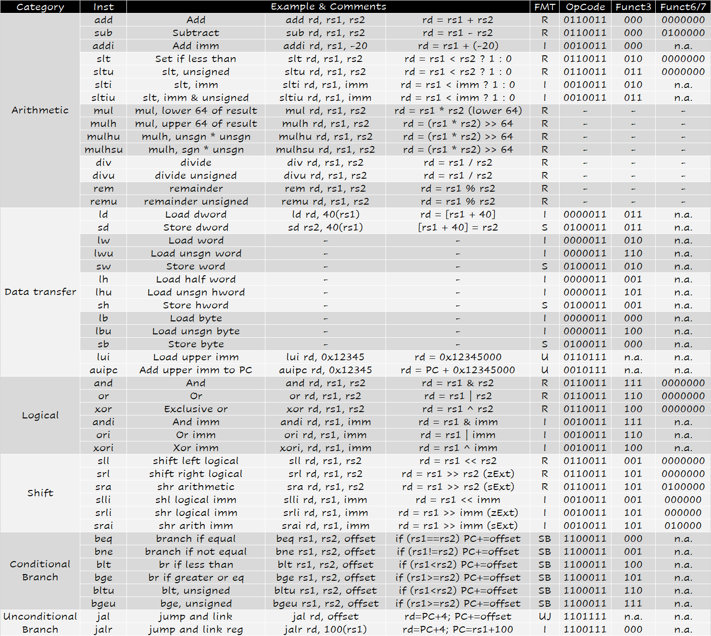

# Instructions: Language of the Machine

## 2.1 Introduction
Language of the machine:

- Instructions: Statement
- Instruction set: Syntax

<center>
{width="500px"}
</center>

Today’s computers are built on 2 key principles: (Stored-program concept)

- Instruction are represented as numbers.
- Programs can be stored in memory to be read or written just like numbers.

> Von Neumann’ Computer

## 2.2 Operations of the Computer Hardware

- Design Principle 1: Simplicity favors regularity（简单源于规整）

## 2.3 Operands of the Computer Hardware
### 寄存器

- RISC-V has a 32 × 64-bit register file
    - Use for frequently accessed data
    - 64-bit data is called a "doubleword"
        - 32 x 64-bit general purpose registers x0 to x31
    - 32-bit data is called a "word"
    - 16-bit data is called a "halfword"

- RISC-V does not require words to be aligned in memory
    - 不同于其他的一些架构，RISC-V允许不对齐的寻址，但是效率会低。

<center>
{width="700px"}
</center>

- Design Principle 2: Smaller is faster（更少则更快）
    - main memory: millions of locations    
原因：数量过多的寄存器可能会增加时钟周期，因为电信号传输的距离更远，所花费的时间越长。


<center>
{width="750px"}
{width="750px"}
</center>

- x5 - x7 以及 x28 - x31 是 temp reg，如果需要的话 caller 保存；也就是说，不保证在经过过程调用之后这些寄存器的值不变。
- x8 - x9 和 x18 - x27 是 saved reg，callee 需要保证调用前后这些寄存器的值不变；也就是说，如果 callee 要用到这些寄存器，必须保存一份，返回前恢复。

!!! warning
    很重要！最好记住。

!!! example
    ```c
    f = (g + h) - (i + j);
    ```
    f, …, j in x19, x20, …, x23
    ```asm
    add x5, x20, x21
    add x6, x22, x23
    sub x19, x5, x6
    ```

### 寻址

- RISC-V is Little Endian（小端）
    - Least-significant byte at least address of a word
    - Big Endian: most-significant byte at least address

当我们从 0x1000 这个地址读出一个 dword 时，我们读到的实际上是 0x1000~0x1007 这 8 个字节，并将 0x1000 存入寄存器低位，0x1007 存入高位。

<center>
{width="600px"}
</center>

> 小端和大端只是商业竞争上的差别。

RISC-V支持4种寻址方式，分别是：

1. PC relative 寻址
2. 立即数寻址（lui）
3. 间接寻址（jalr）
4. 基址寻址（8(sp)）

<center>

</center>

- Design Principle 3: Make common case fast（加速经常性时间）
    - 专用寄存器x0硬连线到常数0


## 2.4 Signed and unsigned numbers

同是4位的情况下:

- unsigned:没有符号位，直接表示数字。[0~15]
- signed-magnitude:第一位是符号位，剩下3位来表示数字。符号位1就是负数，0就是正数。[-7~7]
- 1's complement:反码表示，各位取反即可。[-15~0]
- 2's complement:补码表示，各位取反加一。[-8~7]


## 2.5 Representing Instructions in the computer
RISC-V的指令被编码为32bit的word。在RISC-V中，每条指令都是等长的。


<center>

</center>


指令类型总览：

<center>

</center>

> 其中 I 型指令有两个条目；这是因为立即数移位操作 slli , srli , srai 并不可能对一个 64 位寄存器进行大于 63 位的移位操作，因此 12 位 imm 中只有后 6 位能实际被用到，因此前面 6 位被用来作为一个额外的操作码字段，如上图中第二个 I 条目那样。其他 I 型指令适用第一个 I 条目。

### R型指令

<center>
{width="650px"}
</center>

> 在 RISC 指令集中，只有 load 系列和 store 系列指令能够访问内存。

各个部分的解释：

- opcode: operation code
- rd: destination register number
- funct3: 3-bit function code (additional opcode)
- rs1: the first source register number
- rs2: the second source register number
- funct7: 7-bit function code (additional opcode)

注意rd，rs1，rs2的位置！

- Design principle 3: Good design demands good compromises.（优秀的设计需要适当的折中）
    - 此处的这种方式是保持所有指令一样长。

### I型指令

<center>
{width="650px"}
</center>

> Load Instruction是I型指令！

- rs1: source（例如立即数运算）or **base address** register number（基址）（ld指令）
- immediate: constant operand（立即数）, or **offset** added to base address（偏移量）（ld指令）
    - 采用2's complement
    - 符号位扩展

!!! example
    ld x9, 64(x22)

    - x22是rs1
    - 64是immediate
    - x9是rd

<center>
{width="650px"}
</center>

逻辑操作，详情见下。

### S型指令
<center>
{width="650px"}
</center>

> Store Instruction是S型指令！

- rs1: base address register number（基址）
- rs2: source operand register number（数据源）
- immediate: **offset** added to base address（偏移量）
    - 被分成了[11:5]和[4:0]，是为了让rs1和rs2保留在固定的位置。

!!! example
    sd x9, 64(x22)

    - x22是rs1
    - 64是immediate
    - x9是rs2

### SB型指令
<center>
{width="700px"}
</center>
B类型指令包含两个寄存器和⼀个12位的⽴即数作为操作数，B类型指令⽆需⽬标寄存器。  
B类型指令⽐较两个寄存器rs1, rs2，若满⾜某条件，则跳转到 PC+imm 处继续执⾏。

- beq, bne, blt, bge, bltu, bgeu

### UJ型指令
<center>

{width="700px"}

</center>

J类型指令包含⼀个⽬标寄存器和20位⽴即数。

- jal x1, 1234

### U型指令

<center>

{width="700px"}

</center>

U类型指令包含⼀个⽬标寄存器和20位⽴即数.

- lui rd, imm


## 2.6 Logical Operations

<center>
{width="500px"}
</center>

<center>

</center>

### Shift Operations

I型指令

<center>
{width="650px"}
</center>

- immed: how many positions to shift
- Shift left logical
    - Shift left and fill with 0 bits
    - `slli` by i bits multiplies by $2^i$
- Shift right logical
    - Shift right and fill with 0 bits
    - srliby i bits divides by $2^i$ (unsigned only)

因为在64位寄存器中，偏移量不可能大于63位，因此 12 位 imm 中只有后 6 位能实际被用到。

### AND, OR, XOR Operations

R型指令

<center>
{width="650px"}
</center>

- AND:
    - Useful to mask bits in a word
        - Select some bits, clear others to 0（留下想要的）
- OR:
    - Useful to include bits in a word
        - Set some bits to 1, leave others unchanged（有些设为一，保持其他不变）
- XOR:
    - Differencing operation
        - Revert some bits

## 2.7 Instructions for making decisions

### Branch and Loops

- SB型指令
    - beq（是否等于，等于就跳）
    - bne（是否不等，不等就跳）
- R型指令
    - slt（rs1是否小于rs2，小就跳）

#### Signed vs. Unsigned

- Signed comparison: blt, bge
- Unsigned comparison: bltu, bgeu

!!! example
    - x22 = 1111 1111 1111 1111 1111 1111 1111 1111
    - x23 = 0000 0000 0000 0000 0000 0000 0000 0001
    - x22 < x23 # signed
        - -1 < 1
    - x22 > x23 # unsigned
        - +4,294,967,295 > +1

### Hold out Case/Switch
用来选择去哪一种情况。

{width="580px"}

## 2.8 Supporting Procedures in Computer Hardware

### Procedures
**过程或函数**允许程序员一次只专注于任务的一部分。

在执行函数时，程序必须遵循以下几个步骤：

1. 将参数放在过程可以访问到的位置
2. 将控制转交给过程
3. 获取过程所需的储存资源
4. 执行所需的任务
5. 将结果值放在调用程序可以访问到的位置
6. 将控制返回到初始点，因为过程可以从程序的多个点调用

- x10~x17：八个参数寄存器，用于传递参数或返回值
- x1:一个返回地址寄存器，用于返回到起始点

### Procedure Call Instructions

- Instruction for procedures: jal(jump-and-link)
    - **Caller: jal x1, ProcedureAddress**
    - 下一条指令的地址会存在x1（也就是ra）中，ra = PC + 4
    - 然后跳转到指定位置
- Procedure return: jalr(jump and link register)（跳回去）
    - **Callee: jalr x0, 0(x1)**
    - 和jal差不多，跳转地址是0+ra中存放的地址。
    - 用x0当作rd，x0的值不允许改变，效果是丢弃返回地址。
    - Can also be used for computed jumps (e.g. for case/switch statements)

### Using More Registers
- 更多用于传参的寄存器
    - a0 ~ a7(x10-x17): eight argument registers to pass parameters & return values
    - ra/x1: one return address register to return to origin point
    - 可以对照上面的寄存器表

换出寄存器的理想数据结构是栈。栈指针为x2(sp)。进入函数之前，我们必须保存进入函数之前的值，免得函数将原来的值破坏掉。所以，进函数之前，我们要做的操作是**压栈**。函数调用完之后，我们要恢复进函数之前的值，所以要**出栈**。

<center>

</center>

#### 压栈
要记住的是，栈指针总是指向栈的顶端元素位置。
```asm
addi sp, sp, -24   // 留出3个位置存放数据
sd   x5, 16(sp)    
sd   x6, 8(sp)
sd   x20, 0(sp)    // 栈指针是指向第一个元素的
```

#### 出栈
```
ld   x20, 0(sp)
ld   x6, 8(sp)
ld   x5, 16(sp)
addi sp, sp, 24    // 删除3个元素
```

### Preserved vs. Not Preserved

!!! warning "saved reg & tmp reg"
    saved reg是调用后在函数开头压栈，结尾出栈恢复值

|Preserved|Not Preserved|
|:--:|:--:|
|Saved Registers: x8~x9, x18~x27|Temporaty Registers: x5~x7, x28~x31|
|Stack Pointer Register: x2(sp)|Argument/result Registers: x10~x17|
|Frame Pointer: x8(fp)||
|Return Address: x1(ra)||
|Stack above the stack pointer|Stack below the stack pointer|

RISC-V将寄存器分为保留和非保留两类。保留寄存器是指在函数调用前后必须保持相同值的寄存器，因为调用者期望在调用后能够继续使用这些寄存器的值。保留寄存器包括s0到s11，sp和ra。非保留寄存器，也称为临时寄存器，是指在函数调用中可以自由修改的寄存器，不需要保存和恢复。非保留寄存器包括t0到t6和a0到a7，即参数寄存器。

函数调用时，如果一个函数需要修改保留寄存器的，那么它必须在修改前将它们保存到堆栈上，并在返回前将它们从堆栈上恢复。这样可以避免破坏调用者的寄存器内容。而如果一个函数只修改非保留寄存器的值，那么它就不需要保存和恢复它们，因为调用者不会再使用它们。

参数寄存器为什么时非保留寄存器呢？第一点，参数寄存器是为函数参数传递服务的，数据的生命周期通常只限于一次函数调用。第二点，参数寄存器的内容在函数调用过程中可以被覆盖，因此允许调用者或被调用者保存和恢复。而保留寄存器内容通常不应改变，必须始终保持一致性。参数寄存器每次调用函数时里面的值都会改变（改成要调用函数时所要传递的参数）。函数内部将a0，a1等中的值传到s0，s1中处理...

### 实例

```c
int foo(a, b) {
    int c = bar(b, a);
    return 2 * c;
}

int bar(a, b) {
    return a + b;
}
```


```
foo:
    addi sp, sp, -24          # 为栈帧分配 24 字节
    sd s0, 0(sp)              # 保存 s0 到栈帧
    sd s1, 8(sp)              # 保存 s1 到栈帧
    sd ra, 16(sp)             # 保存返回地址到栈帧

    mv s0, a0                 # 将第一个参数 a0 (a) 保存到 s0
    mv s1, a1                 # 将第二个参数 a1 (b) 保存到 s1

    mv a0, s1                 # 将 b (s1) 移动到 a0，准备作为 bar 的第一个参数
    mv a1, s0                 # 将 a (s0) 移动到 a1，准备作为 bar 的第二个参数

    jal ra, bar               # 调用 bar 函数

    mv s0, a0                 # 将 bar 的返回值存到 s0
    slli s0, s0, 1            # 将 s0 左移 1 位，相当于乘以 2
    mv a0, s0                 # 将结果放入 a0，作为返回值

    ld ra, 16(sp)             # 恢复返回地址
    ld s1, 8(sp)              # 恢复 s1
    ld s0, 0(sp)              # 恢复 s0
    addi sp, sp, 24           # 恢复栈指针

    jalr x0, 0(ra)            # 返回调用者

bar:
    addi sp, sp, -16          # 为栈帧分配 16 字节
    sd s0, 0(sp)              # 保存 s0 到栈帧
    sd s1, 8(sp)              # 保存 s1 到栈帧

    mv s0, a0                 # 将第一个参数 a0 (a) 保存到 s0
    mv s1, a1                 # 将第二个参数 a1 (b) 保存到 s1

    addi t0, s0, s1           # 计算 a + b，将结果存到 t0

    mv a0, t0                 # 将结果移动到 a0，作为返回值

    ld s1, 8(sp)              # 恢复 s1
    ld s0, 0(sp)              # 恢复 s0
    addi sp, sp, 16           # 恢复栈指针

    jalr x0, 0(ra)            # 返回调用者
```
函数在调用其他函数之前，要先将**外部函数传给他的值保存下来**（对应`mv s0, a0`和`mv s1, a1`），然后将要**传给调用函数的值放进参数寄存器**（对应`mv a0, s1`和`mv a1, s0`）。

这段代码s是故意要用的，其实有点累赘。


在`foo`函数中，我们先把`ra`压栈，这⾥的`ra`是`foo`函数返回调⽤它的函数（也许是`main`函数或其他函数）的地址。因为在`foo`函数中调⽤了`bar`函数，所以我们需要保存`ra`，以便在`foo`函数返回时能够正确返回到调⽤`foo`函数的地⽅，我们暂且把它叫做`ra_foo`。中间那句`jal ra, bar`的意思是：跳转到 `bar`函数，并且将`ra`寄存器的值设置为`bar`函数返回时应该返回的地址。这样，当`bar`函数执⾏完毕后，会返回到`foo`函数的下⼀条指令。因此这⾥的`ra`和上⾯的不⼀样，它是`bar`函数返回时应该返回的地址，我们暂且把它叫做`ra_bar`。`bar`函数执⾏完成后返回的地址是存在`ra_bar`中的。在`bar`函数结束返回`foo`函数之后，`foo`函数也要返回调⽤它的函数，所以我们需要将`ra_foo`中的地址取出来，然后跳转到那个地址。

## 2.9 Communicating with People

- ASCII
- Unicode

```c
void strcpy (char x[], char y[]) {
    size_t i;
    i = 0;
    while ((x[i] = y[i]) != '\0') {
        i += 1;
    }
}
```
假设x，y存放在x10，x11中，i在x19中。
```asm
strcpy:                      # 函数 strcpy 的入口点
    addi sp, sp, -8          # 减少栈指针，为保存寄存器 x19 分配空间
    sd x19, 0(sp)            # 将寄存器 x19 的值存入栈，以便函数调用结束时恢复

    add x19, x0, x0          # 初始化 i = 0，将寄存器 x19 清零

L1:                          # 循环开始标签
    add x5, x19, x11         # 计算 y[i] 的地址：x5 = x11 + i
    lbu x6, 0(x5)            # 加载 y[i] 的值到 x6（无符号字节加载）

    add x7, x19, x10         # 计算 x[i] 的地址：x7 = x10 + i
    sb x6, 0(x7)             # 将 y[i] 的值存储到 x[i] 中（存储字节）

    beq x6, x0, L2           # 如果 y[i] == '\0'（x6 == 0），跳转到 L2（循环结束）

    addi x19, x19, 1         # i += 1，将寄存器 x19 加 1
    jal x0, L1               # 跳转到 L1，继续循环

L2:                          # 循环结束标签
    ld x19, 0(sp)            # 从栈中恢复寄存器 x19 的值
    addi sp, sp, 8           # 恢复栈指针

    jalr x0, 0(x1)           # 返回调用者
```
注意，一个char是一字节。

## 2.10 RISC V Addressing for 32-Bit Immediate and Addresses
!!! Warning
    对大立即数的RISC-V编址和寻址，重要！


### Brunch Addressing

<center>


</center>

注意，最后一个bit补了0，相当于立即数乘2。

- Target address = PC + Branch offset = PC + immediate × 2

### Jump Addressing

<center>


</center>

### Show branch offset in machine language

```c
while (save[i] == k)
    i = i + 1;
```

```asm
Loop:
    slli a0, s6, 3         # temp reg x10 = 8 * i
    add a0, a0, s9         # x10 = address of save[i]
    ld s1, 0(a0)           # temp reg x9 = save[i]
    bne s1, s8, Exit       # go to Exit if save[i] != k

    addi s6, s6, 1         # i = i + 1
    beq zero, zero, Loop   # go to Loop

Exit:
```

我们要分析这里的Exit和Loop到底存的是什么值（立即数）。首先，一条指令是32bit，也就是4字节。我们还知道，指令中存的地址是要跳转到的指令和本条指令的地址之差。所以，Exit这里应该写12，Loop这里应该写-20。但是要记住，要利用跳转指令的编码方式来写这条指令。由于inst指令都会乘2，所以编入立即数是应该编6和-10。详情见下图：

<center>


</center>

### While branch target is far away

当跳转地址很远，导致立即数没办法存这么大数据时，我们采取以下方法：

- 可以加入一个无条件跳转
    - 我们把跳转的条件翻转一下，让其来决定是否要进行无条件跳转

```
    beq a0, zero, L1
```
变为
```
    bne a0, zero, L2
    jal zero, L1

L2:
```
jal的立即数很大，一般可以满足跳转需求。要是jal还满足不了，那么将要跳转的地址存入寄存器，然后用jalr。

## 2.11 Synchronization in RISC-V


{width="550px"}
{width="600px"}


## 2.12 Translating and starting a program


Java虚拟机


## 2.13 A C Sort Example To Put it All Together

### Swap

```c
void swap (long long v[], size_t k) {
    long long temp;
    temp = v[k];
    v[k] = v[k+1];
    v[k+1] = temp;
}
```

Register allocation for swap    
v ---- x10 k ---- x11 temp ---- x5

```asm
swap:
    slli x11, x11, 3
    add x6, x10, x11
    ld x5, 0(x6)
    ld x7, 8(x6)
    sd x7, 0(x6)
    sd x5, 8(x6)

    jalr x0, 0(x1)
```

### Sort
很好的例子！
```c
void sort (long long v[ ] , size_t n ) {
    size_t i , j ;
    for ( i = 0 ; i < n ; i + = 1 ) {
        for ( j = i - 1 ; j >= 0 && v[j] > v[j + 1] ; j -= 1 )
            swap ( v , j ) ;
    }
}
```
Register allocation for sort    
v ---- x10 n ---- x11 i ---- x19 j ---- x20     
Preserving registers in sort    
x1, x19, x20, x21, x22

```asm
swap:
    slli x11, x11, 3          // x11 = x11 * 8 (convert index to byte offset)
    add x6, x10, x11          // x6 = address of v[j] (v + j*8)
    ld x5, 0(x6)              // x5 = v[j]
    ld x7, 8(x6)              // x7 = v[j+1]
    sd x7, 0(x6)              // v[j] = v[j+1]
    sd x5, 8(x6)              // v[j+1] = v[j]
    jalr x0, 0(x1)            // return to caller

sort:
    addi sp, sp, -40          // allocate space on stack for 5 registers
    sd x1, 32(sp)             // save return address (x1) on stack
    sd x22, 24(sp)            // save x22 on stack
    sd x21, 16(sp)            // save x21 on stack
    sd x20, 8(sp)             // save x20 on stack
    sd x19, 0(sp)             // save x19 on stack

    li x19, 0                 // initialize i = 0

for1tst:                      // start of outer loop (for i = 0; i < n; i++)
    bge x19, x11, Exit1       // if i >= n, exit loop
    addi x20, x19, -1         // initialize j = i - 1

for2tst:                      // start of inner loop (for j = i - 1; j >= 0 && v[j] > v[j+1]; j--)
    blt x20, x0, NextIter1    // if j < 0, exit inner loop
    slli x5, x20, 3           // x5 = j * 8 (convert index to byte offset)
    add x5, x5, x10           // x5 = address of v[j]
    ld x6, 0(x5)              // x6 = v[j]
    ld x7, 8(x5)              // x7 = v[j+1]
    ble x6, x7, NextIter1     // if v[j] <= v[j+1], exit inner loop

    mv x21, x10               // save array base pointer (v) in x21
    mv x22, x11               // save array size (n) in x22

    mv x10, x21               // pass base pointer (v) to swap
    mv x11, x20               // pass index (j) to swap
    jal x1, swap              // call swap(v, j)

    mv x10, x21               // restore array base pointer (v)
    mv x11, x22               // restore array size (n)
    addi x20, x20, -1         // decrement j
    jal x0, for2tst           // jump to inner loop test

NextIter1:                    // label for exiting inner loop
    addi x19, x19, 1          // increment i
    jal x0, for1tst           // jump to outer loop test

Exit1:                        // label for exiting outer loop
    ld x19, 0(sp)             // restore x19 from stack
    ld x20, 8(sp)             // restore x20 from stack
    ld x21, 16(sp)            // restore x21 from stack
    ld x22, 24(sp)            // restore x22 from stack
    ld x1, 32(sp)             // restore return address (x1) from stack
    addi sp, sp, 40           // deallocate space from stack
    jalr x0, 0(x1)            // return to caller
```