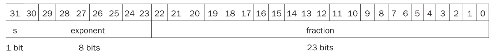
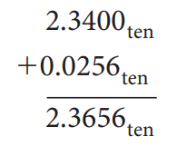

# Arithmetic for Computer

## 3.1 Introduction

让我们来看下面的数字：

$$1001_2$$

我们其实并不知道他具体表示什么数字。如果这是一个无符号类型数字，那么他表示的就是9。如果是反码表示的话，那表示的就是-1。如果是补码表示的话，那表示的就是-7。

!!! warning "重点"
    同是4位的情况下:

    - unsigned:没有符号位，直接表示数字。[0~15]
    - signed-magnitude:第一位是符号位，剩下3位来表示数字。符号位1就是负数，0就是正数。[-7~7]
    - 1's complement:反码表示，各位取反即可。[-15~0]
    - 2's complement:补码表示，各位取反加一。[-8~7]

## 3.2 Arithmetic

### Overflow

判别是否发生overflow方法：看两位进位。

{width="500px"}

使用两个进位的概念：

- 进位到符号位（MSB）的进位$C_{\text{in}}$：从次高位到符号位的进位。
- 从符号位溢出的进位$C_{\text{out}}$：从符号位到更高位（超出位宽范围）的进位。

如果$C_{\text{in}} \neq C_{\text{out}}$，就发生了溢出。

$$
\text{Overflow} = C_{\text{in}} \oplus C_{\text{out}}
$$

!!! question
    如果发生了overflow，应该怎么处理呢？

- 会产生中断（详见第四章中断）
- 反馈给操作系统
    - 纠正并返回程序
    - 带着错误码返回程序
    - 终止程序

!!! note
    注意区分CF(Carry Flag)和OF(Overflow Flag)    
       
    - CF:针对无符号数   
    - OF:针对有符号数

### Constructing an ALU

从全加器构建起。[点我跳转全加器](https://note.xiu-zju.me/yuyan/Verilog/circuit/3/#full-adder)

#### Ripple carry adder（行波进位加法器）

{width="300px"}

等上一个加法器算完，将数据传输给下一个加法器再运算。**Slow, but simple.**

这里讲解一下less位。Result1~Result31一定是零。只看Result0位。result0是由最后一个全加器传回来的，是装运算结果的最高位，也就是符号位。ALU执行的是减法操作，只看符号位便能知晓比较的两个数的大小。

#### Carry look-ahead adder（超前进位加法器）
整体思路是后面的加法器不借助前面的加法器的运算结果，而是直接拿取原数据自己进行运算。

超前进位加法器是一种改进的加法器电路，通过减少进位信号传播的延迟来提高加法运算的速度。相比于传统的**串行进位加法器**（Ripple Carry Adder），超前进位加法器采用了并行计算进位信号的方式，从而避免了逐级进位的传递。

在二进制加法中，每一位的计算分为三部分：

1. **生成进位信号** (Generate, G)：当两个加数的对应位都为1时会产生进位，表示为：
   $$
   G_i = A_i \cdot B_i
   $$

2. **传播进位信号** (Propagate, P)：当两个加数的对应位中至少有一个为1时，进位可以被传播，表示为：
   $$
   P_i = A_i + B_i
   $$

3. **计算进位信号** (Carry, C)：根据生成和传播信号，计算第 \( i+1 \) 位的进位：
   $$
   C_{i+1} = G_i + P_i \cdot C_i
   $$

通过这种方式，可以将进位的计算过程并行化，而不需要逐级等待前一位的进位信号。

{width="200px"}

超前进位加法器的关键在于提前计算出所有进位信号 \( C_i \)，公式为：
$$
C_1 = G_0 + P_0 \cdot C_0
$$
$$
C_2 = G_1 + P_1 \cdot C_1 = G_1 + P_1 \cdot (G_0 + P_0 \cdot C_0)
$$
$$
C_3 = G_2 + P_2 \cdot C_2 = G_2 + P_2 \cdot (G_1 + P_1 \cdot (G_0 + P_0 \cdot C_0))
$$

以此类推，通过递归展开公式，可以同时计算多个进位信号。

{width="300px"}

这是一个两级的超前进位加法器。在这个加法器里面，P和G都是立即可以算出来的，因为他们不依赖于C，有了源操作数立马就能出来。根据上式，C4、C8、C12、C16是可以一起计算出来的。同时计算出来的还有第一个小加法器里的C1、C2、C3。有了C4、C8和C12，C5等才可以进行计算。所以第一批出来的是C1、C2、C3、C4、C8、C12、C16，其余是第二批。

#### Carry skip adder（进位旁路加法器）

{width="200px"}

同样通过这个思路，但是只是将上一位加法器的进位提前计算给下一位加法器，还是有行波的思想。

{width="500px"}

#### Carry select adder（进位选择加法器）

不管前一个给的进位是0还是1，我都把结果算出来，等到前一个进位到了的时候，直接选择结果。提高了速度。

{width="400px"}

> 例题：[Carry select adder](https://hdlbits.01xz.net/wiki/Module_cseladd)

## 3.3 Multiplication
核心思想：

{width="200px"}

- 位移
    - 算数位移：要补符号位
    - 逻辑位移：不补符号位

### Version 1
原理是根据Multiplier的0/1来选择是否要将Multiplicand的对应位移结果加到Product上。

{width="500px"}

一共进行 64 次：

1. 判断 Multiplier 寄存器的最低位是否是 1：
    - 如果是，则将 Multiplicand 寄存器的值加到 Product 寄存器里；
    - 如果否，进入下一步；
2. 将 Multiplier 寄存器的值右移一位（这是为了不断拿出每一位，相当于在枚举 Multiplier 的每一位），将 Multiplicand 寄存器的值左移一位；
3. 判断是否做满 64 次，决定是否终止；

### Version 2

{width="500px"}

优化点：它将Multiplicand寄存器换为了64位，而将位移操作转移到了Product寄存器中进行。这里最重要的一点就是，64位加法只影响Product寄存器左侧的64位，而之后的右移操作则是128位。这样，虽然最低位的结果一开始会被放在Product寄存器的第65位里，但是在经过64次右移之后，它就出现在第一位了。于是，所有的128位加法都被64位加法替代，实现了加速。

一共进行 64 次：

1. 判断 Multiplier 寄存器的最低位是否是 1：
    - 如果是，则将 Multiplicand 寄存器的值加到 Product 寄存器的左半部分里；
    - 如果否，进入下一步；
2. 将 Multiplier 寄存器的值右移一位，将 Product 寄存器的值右移一位；
3. 判断是否做满 64 次，决定是否终止；

### Version 3

{width="500px"}

### Booth's Algorithm

不是很想学，有空再学吧。

> [咸鱼暄对于Booth算法的讲解](https://xuan-insr.github.io/computer_organization/3_arithmetic/#booths-algorithm)

## 3.4 Division

### Version 1

{width="500px"}

At first, the divisor is in the left half of the divisor register, and the divident（被除数） is in the right half of the remainder register. Then, shift right the divisor register each step, and that means the weight of divisor reduces.

流程图如下：

{width="300px"}

### Version 2

{width="500px"}

- “除数寄存器”缩减为64-bit的，无需支持移位
  128-bit ALU缩小为64-bit
- 取消“商寄存器”，商从右端逐位移入“余数寄存器”
- “余数寄存器”只有高64位参与加减法运算
- “余数寄存器”需要支持左移和右移
- 运算结束时，商占据“余数寄存器”的低64位

一开始被除数是放在余数寄存器的右边的。逐渐左移。最后余数寄存器的高64位是余数，低64位是商。

## 3.5 Floating point numbers

[IEEE-754 Floating Point Converter](https://www.h-schmidt.net/FloatConverter/IEEE754.html)

### IEEE 754 浮点表示

在二进制中，浮点数的表示格式为：

$$1.xxxxxx_2 \times 2^{yyyy}$$

增加尾数位数的大小可以提高小数精度，增加指数位数可以增加数的表示范围。

在RISC-V中，表示的通式是：

$$(-1)^S \cdot (1 + fraction) \cdot 2^{exponent-bias}$$

- S表示正负
- fraction是小数后的部分
- exponent是指数
- bias是偏移量

#### single precision

对于单精度浮点数，偏移量是127。

#### double precision

对于双精度浮点数，偏移量是1023。

#### 具体步骤

1. 将十进制数用二进制的科学计数法表示
2. 正数S为0，负数S为1
3. 尾数等于规格化数-1
4. 指数等于实际指数加偏移量

!!! example "例子"
    用单精度浮点数表示$-0.625_{10}$。

    $$-0.625_{10} = -0.101_2 = -1.01 \times 2^{-1} = (-1)^1 \cdot (1 + 0.01) \cdot 2^{126 - 127}$$

    答案是$1 01111110 01000000000000000000000$。

#### 特殊数

- 第一个表示0
- 第二个表示非规格化数，这种数主要是为了表示一些很小的数
- 第三个表示正常的浮点数
- 第四条表示无穷大或无穷小
- 第五条表示NaN(Not a Number)

#### 范围
- 能表示值的**绝对值**的范围是$1.0_2 \times 2^{1-\text{bias}} \sim 1.11\dots 11_2 \times 2^{11\dots 11_2-1-\text{bias}}$，即
$1\times 2^{1 - \text{bias}}\sim(2 - 2^\text{-Fra#})\times 2^{(2^\text{Exp#} - 1) - 1 - \text{bias}}$，其中Fra#和Exp#分别表示fraction和exponent的位数。
    - 单精度浮点数：$\pm 1\times 2^{-126}\sim \pm(2 - 2^{-23}) \times 2^{127}$
    - 双精度浮点数：$\pm 1\times 2^{-1022}\sim \pm(2 - 2^{-52}) \times 2^{1023}$

#### 精度
- $2^{\text{-Fra#}}$
    - 单精度浮点数：$2^{-23}$
    - 双精度浮点数：$2^{-52}$

### 浮点数加减法
以 $1.000_2\times2^{-1}-1.110_2\times2^{-2}$ 为例， 浮点数的加减法分为以下几步：

1. Alignment：指数对齐，**将小指数对齐到大指数**：$-1.110_2\times2^{-2} = -0.111\times2^{-1}$
    - 为什么是小对大？首先，小对大的过程是在小指数的fraction前补0，可能导致末尾数据丢失；大对小的过程是在大指数的fraction后补0，可能导致前面的数据丢失。在计算过程中，我们保持的精确位数是有限的，而在迫不得已丢去精度的过程中，让小的那个数的末几位被丢掉的代价比大的前几位丢失要小太多了。
2. Addiction Fraction：部分相加减：$1.000-0.111=0.001$
3. Normalization：将结果规格化：$0.001\times2^{-1}=1.000\times2^{-4}$；同时需要检查是否出现 overflow或者underflow，如果出现则触发Exception
4. Rounding：将Fraction部分舍入到正确位数；舍入结果可能还需要规格化，此时回到步骤3继续运行

### 浮点数乘法
- 分别处理S、exponent和fraction：
    - 将两个Exponent相加并 减去一个bias，因为 bias 加了 2 次
    - 将两个(1 + Fraction)相乘，并将其规格化；此时同样要考虑 overflow 和 underflow；然后舍入，如果还需要规格化则重复执行
    - 根据两个操作数的符号决定结果的符号

### 精确算数
IEEE 754规定了一些额外的舍入控制，在计算时，总是在右边保留两个额外的位，一个是保护位（guard），另一个是舍入位（round），用来保证舍入的精确性。

{width="120px"}

另外还有一个位叫sticky bit，其定义是：只要round右边出现过非零位，就将sticky置1，这一点可以用在加法的右移中，可以记住是否有1被移出，从而能够实现"round to nearest even"。