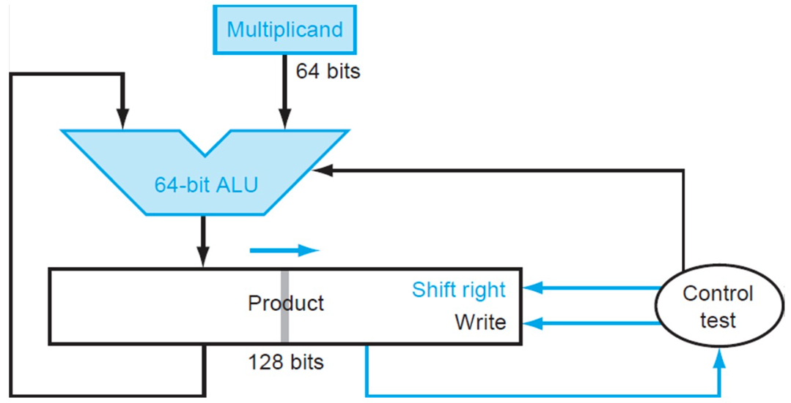

# Arithmetic for Computer

## 3.1 Introduction

让我们来看下面的数字：

$$1001_2$$

我们其实并不知道他具体表示什么数字。如果这是一个无符号类型数字，那么他表示的就是9。如果是反码表示的话，那表示的就是-1。如果是补码表示的话，那表示的就是-7。

!!! warning "重点"
    同是4位的情况下:

    - unsigned:没有符号位，直接表示数字。[0~15]
    - signed-magnitude:第一位是符号位，剩下3位来表示数字。符号位1就是负数，0就是正数。[-7~7]
    - 1's complement:反码表示，各位取反即可。[-15~0]
    - 2's complement:补码表示，各位取反加一。[-8~7]

## 3.2 Arithmetic

### Overflow

判别是否发生overflow方法：看两位进位。

{width="500px"}

使用两个进位的概念：

- 进位到符号位（MSB）的进位$C_{\text{in}}$：从次高位到符号位的进位。
- 从符号位溢出的进位$C_{\text{out}}$：从符号位到更高位（超出位宽范围）的进位。

如果$C_{\text{in}} \neq C_{\text{out}}$，就发生了溢出。

$$
\text{Overflow} = C_{\text{in}} \oplus C_{\text{out}}
$$

!!! question
    如果发生了overflow，应该怎么处理呢？

- 会产生中断（详见第四章中断）
- 反馈给操作系统
    - 纠正并返回程序
    - 带着错误码返回程序
    - 终止程序

### Constructing an ALU

从全加器构建起。[点我跳转全加器](https://note.xiu-zju.me/yuyan/Verilog/circuit/3/#full-adder)

#### Ripple carry adder（行波进位加法器）

{width="300px"}

等上一个加法器算完，将数据传输给下一个加法器再运算。**Slow, but simple.**

这里讲解一下less位。Result1~Result31一定是零。只看Result0位。result0是由最后一个全加器传回来的，是装运算结果的最高位，也就是符号位。ALU执行的是减法操作，只看符号位便能知晓比较的两个数的大小。

#### Carry look-ahead adder（超前进位加法器）
整体思路是后面的加法器不借助前面的加法器的运算结果，而是直接拿取原数据自己进行运算。

超前进位加法器是一种改进的加法器电路，通过减少进位信号传播的延迟来提高加法运算的速度。相比于传统的**串行进位加法器**（Ripple Carry Adder），超前进位加法器采用了并行计算进位信号的方式，从而避免了逐级进位的传递。

在二进制加法中，每一位的计算分为三部分：

1. **生成进位信号** (Generate, G)：当两个加数的对应位都为1时会产生进位，表示为：
   $$
   G_i = A_i \cdot B_i
   $$

2. **传播进位信号** (Propagate, P)：当两个加数的对应位中至少有一个为1时，进位可以被传播，表示为：
   $$
   P_i = A_i + B_i
   $$

3. **计算进位信号** (Carry, C)：根据生成和传播信号，计算第 \( i+1 \) 位的进位：
   $$
   C_{i+1} = G_i + P_i \cdot C_i
   $$

通过这种方式，可以将进位的计算过程并行化，而不需要逐级等待前一位的进位信号。

{width="200px"}

超前进位加法器的关键在于提前计算出所有进位信号 \( C_i \)，公式为：
$$
C_1 = G_0 + P_0 \cdot C_0
$$
$$
C_2 = G_1 + P_1 \cdot C_1 = G_1 + P_1 \cdot (G_0 + P_0 \cdot C_0)
$$
$$
C_3 = G_2 + P_2 \cdot C_2 = G_2 + P_2 \cdot (G_1 + P_1 \cdot (G_0 + P_0 \cdot C_0))
$$

以此类推，通过递归展开公式，可以同时计算多个进位信号。

{width="300px"}

这是一个两级的超前进位加法器。在这个加法器里面，P和G都是立即可以算出来的，因为他们不依赖于C，有了源操作数立马就能出来。根据上式，C4、C8、C12、C16是可以一起计算出来的。同时计算出来的还有第一个小加法器里的C1、C2、C3。有了C4、C8和C12，C5等才可以进行计算。所以第一批出来的是C1、C2、C3、C4、C8、C12、C16，其余是第二批。

#### Carry skip adder（进位旁路加法器）

{width="200px"}

同样通过这个思路，但是只是将上一位加法器的进位提前计算给下一位加法器，还是有行波的思想。

{width="500px"}

#### Carry select adder（进位选择加法器）

不管前一个给的进位是0还是1，我都把结果算出来，等到前一个进位到了的时候，直接选择结果。提高了速度。

{width="400px"}

> 例题：[Carry select adder](https://hdlbits.01xz.net/wiki/Module_cseladd)

## 3.3 Arithmetic--Addition & subtraction and ALU

## 3.4 Multiplication
核心思想：

{width="200px"}

### Version 1
原理是根据Multiplier的0/1来选择是否要将Multiplicand的对应位移结果加到Product上。

{width="500px"}

一共进行 64 次：

1. 判断 Multiplier 寄存器的最低位是否是 1：
    - 如果是，则将 Multiplicand 寄存器的值加到 Product 寄存器里；
    - 如果否，进入下一步；
2. 将 Multiplier 寄存器的值右移一位（这是为了不断拿出每一位，相当于在枚举 Multiplier 的每一位），将 Multiplicand 寄存器的值左移一位；
3. 判断是否做满 64 次，决定是否终止；

### Version 2

{width="500px"}

优化点：它将Multiplicand寄存器换为了64位，而将位移操作转移到了Product寄存器中进行。这里最重要的一点就是，64位加法只影响Product寄存器左侧的64位，而之后的右移操作则是128位。这样，虽然最低位的结果一开始会被放在Product寄存器的第65位里，但是在经过64次右移之后，它就出现在第一位了。于是，所有的128位加法都被64位加法替代，实现了加速。

一共进行 64 次：

1. 判断 Multiplier 寄存器的最低位是否是 1：
    - 如果是，则将 Multiplicand 寄存器的值加到 Product 寄存器的左半部分里；
    - 如果否，进入下一步；
2. 将 Multiplier 寄存器的值右移一位，将 Product 寄存器的值右移一位；
3. 判断是否做满 64 次，决定是否终止；

### Version 3

{width="500px"}

## 3.5 Division

## 3.6 Floating point numbers

## 数的表示
同是4位的情况下:

- unsigned:没有符号位，直接表示数字。[0~15]
- signed-magnitude:第一位是符号位，剩下3位来表示数字。符号位1就是负数，0就是正数。[-7~7]
- 1's complement:反码表示，各位取反即可。[-15~0]
- 2's complement:补码表示，各位取反加一。[-8~7]
## ALU
- 加法：加法器、CLA
- 减法：转化为加法

!!! note
    注意区分CF(Carry Flag)和OF(Overflow Flag)    
       
    - CF:针对无符号数   
    - OF:针对有符号数

- 位移
    - 算数位移：要补符号位
    - 逻辑位移：不补符号位

## IEEE Floating Point
