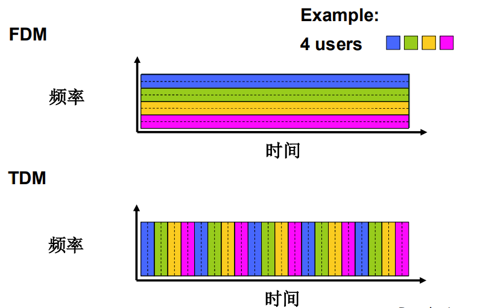

# 计算机网络和因特网

## 1.1 什么是因特网

### 从具体构成角度

- 节点
    - 主机及其上运行的应用程序
    - 路由器、交换机等网络交换设备
- 边：通信链路
    - 接入网链路：主机连接到互联网的链路
    - 主干链路：路由器间的链路
    - 光纤、同轴电缆、无线电、卫星
    - 传输速率：**带宽**(bps)
- 主机/端系统：
    - 数以亿计的、互联的计算设备
    - 运行网络应用程序
- 分组交换设备：转发分组
    - 路由器和交换机
- 协议
    - 协议定义了在两个或多个通信实体之间交换的**报文格式**和**次序**，以及在报文传输和/或接收或其他事件方面所采取的动作
    - 分为各个层的协议
    - TCP, IP, HTTP, FTP, PPP

端系统通过通信链路和分组交换机连接到一起。端系统通过因特网服务提供商（Internet Service Provider, ISP）接入因特网。

TCP 提供面向连接的通信服务，UDP 提供无连接的通信服务。

### 网络结构

- **网络边缘**
    - 主机
    - 应用程序（客户端和服务器）
- **网络核心**
    - 互连着的路由器
    - 网络的网络
- 接入网、物理媒体
    - 有线或无线通信链路

## 1.2 网络边缘

- 端系统（主机）
    - 运行应用程序
    - 如 Web、email
    - 在“网络的边缘”
- 客户/服务器（C/S）模式
    - 客户端向服务器请求、接收服务
    - 如 Web 浏览器/服务器，email 客户端/服务器
- 对等（peer-peer）模式
    - 很少（甚至没有）专门的服务器
    - 如 Gnutella, KaZaA, Emule

### 采用网络设施的面向连接服务

握手：在数据传输之前做好准备

TCP - 传输控制协议

- 可靠地、按顺序地传送数据
    - 确认和重传
- 流量控制
    - 发送方不会淹没接收方
    - 带宽大则可要求发送速率快，反之亦然
- 拥塞控制
    - 当网络拥塞时，发送方降低发送速率

应用：HTTP（Web），FTP（文件传送），Telnet（远程登录），SMTP（email）

### 采用基础设施的无连接服务

UDP - 用户数据报协议

- 无连接
- 不可靠数据传输
- 无流量控制
- 无拥塞控制

应用：流媒体、远程会议、DNS、Internet 电话

## 1.3 网络核心

- 网络核心：路由器的网状网络

数据怎么通过网络进行传输？

- 电路交换
    - 为每一个呼叫预留一条专有电路：如电话网
- 分组交换
    - 将要传输的数据分为一个个单位

### 电路交换

电路交换（Circuit Switching）是一种传统的网络通信方式，其主要特点和机制如下：

1. **为每个呼叫预留一条专有电路**

   * 类似于传统电话系统，在通信开始前需要先建立一条端到端的物理连接线路。

2. **端到端资源独占**

   * 呼叫一旦建立，通信过程中所占用的链路带宽和交换能力都是独占的，不与其他通信共享资源。

3. **资源预分配**

   * 在通信之前，系统为该呼叫预留“端到端”资源（链路带宽 + 交换节点能力）。

4. **保证性能**

   * 一旦建立连接，通信的带宽和延迟可以得到保证，因为路径已经固定并专用。

5. **若无数据发送，资源浪费**

   * 即使通话中暂时没有数据传输（如沉默时段），资源也被占用（无共享能力），导致**效率低**。

6. **无分组操作**

   * 数据不需要被拆分成分组；数据在建立好的路径中连续传输。

#### 电路交换的资源划分方式

网络资源（如带宽）被分成“片”（pieces），常见划分方式有：

* **频分复用 (FDM, Frequency-Division Multiplexing)**
* **时分复用 (TDM, Time-Division Multiplexing)**
* **波分复用 (WDM, Wave-Division Multiplexing)**

{width=300px}

!!! question "例题"
    在一个电路交换网络上，从主机A到主机B发送一个640,000比特的文件需要多长时间？

    - 所有的链路速率为 1.536 Mbps
    - 每条链路使用时隙数为 24 的TDM
    - 建立端-端的电路需 500 ms
    
    每条链路的速率：1.536Mbps/24 = 64kbps
    
    传输时间：640kb/64kps = 10s

    共用时间：传输时间 + 建立链路时间 = 10s + 500ms = 10.5s

#### 电路交换不适合计算机之间的通信

- 连接建立时间长
- 计算机之间的通信有突发性，如果使用线路交换，则浪费的片较多
    - 即使这个呼叫没有数据传递，其所占据的片也不能够被别的呼叫使用
- 可靠性不高？

### 分组交换

#### 工作方式

- 以分组为单位存储-转发方式
    * 网络带宽资源不再分分为一个个片，传输时使用全部带宽
    * 主机之间传输的数据被分为一个个分组
- 资源共享，按需使用
    - 存储-转发：分组每次移动一跳
    - 被传输到下一个链路之前，整个分组必须到达路由器：存储-转发
    - 在一个速率为R bps的链路，一个长度为L bits 的分组的存储转发延时： L/R s

#### 主要特点：

- 高效利用资源：

    * 链路资源**按需分配**（不预留），多个通信可以**共享链路带宽**，称为“统计多路复用（statistical multiplexing）”。

- 灵活性强：

    * 不需要提前建立端到端连接，通信灵活快速，适合**计算机之间的突发通信**。

- 存储-转发机制（Store-and-Forward）：

    * 每个路由器在转发分组前，**必须先完整接收**整个分组，然后才转发到下一跳。
    * 带来**每跳传播延迟**：`L/R` 秒，其中

      * `L`: 分组长度 (bits)
      * `R`: 链路带宽 (bps)

#### 分组交换的挑战：

- 排队延迟和丢包：

    * 当到达的分组速率 > 输出链路速率，会产生**排队**。
    * 若队列溢出，**分组将被丢弃**。

#### 核心功能：

* **转发（Forwarding）**：根据分组头部的目的地址，将其从输入端口发送到合适的输出端口。
* **路由（Routing）**：确定分组到达目的地所经过的路径。

!!! note "分组交换 vs. 电路交换"
    - 适合于对**突发式数据**传输
        - 资源共享
        - 简单，不必建立呼叫
    - 过度使用会造成网络拥塞：分组延时和丢失
        - 对可靠地数据传输需要协议来约束：拥塞控制
    - Q: 怎样提供类似电路交换的服务？
        - 保证音频/视频应用需要的带宽
        - 一个仍未解决的问题(chapter 7)

#### 数据报网络

- 每个分组（packet）独立路由，称为“数据报（datagram）”；
- 每个分组都带有完整的目的地址信息；
- 网络中每个路由器根据分组头部信息独立决定下一跳；
- 各个分组可能走不同路径，到达顺序可能变化。

| 特性   | 描述                           |
| ---- | ---------------------------- |
| 路由方式 | 每个分组独立决策（根据目的地址）             |
| 建立连接 | 不需要，直接发送                   |
| 顺序保证 | 不保证分组按顺序到达                 |
| 可靠性  | 网络层不负责可靠传输（靠上层协议如 TCP 实现）  |
| 灵活性  | 高，适合突发、动态流量                |
| 代表协议 | **IP 协议（Internet Protocol）** |

#### 虚电路网络

- 在传输数据前，先建立一条逻辑连接，称为“虚电路”（VC）；
- 分组传输过程中，都走相同路径，使用相同的虚电路编号；
- 每个路由器维护虚电路表，根据虚电路号转发。

| 特性   | 描述                              |
| ---- | ------------------------------- |
| 路由方式 | 只需连接时选择一次路径，之后都走同一条             |
| 建立连接 | 必须先建立虚电路                      |
| 顺序保证 | 所有分组按顺序到达                     |
| 可靠性  | 可选择性支持                          |
| 延迟   | 连接建立时高，但之后转发快（查表）               |
| 代表协议 | **ATM、Frame Relay、X.25、MPLS** 等 |

!!! danger "虚电路网络 vs. 电路交换"
    | 项目         | 电路交换         | 虚电路网络（分组交换）            |
    | ---------- | ------------ | ---------------------- |
    | 🔌 是否建立连接  | ✅ 是          | ✅ 是                    |
    | 📦 是否拆分数据  | ❌ 不拆分，连续传输   | ✅ 拆分成分组，分组发送           |
    | 🔁 路由方式    | 固定物理链路（物理路径） | 固定逻辑路径（通过标签或编号识别）      |
    | 💡 数据转发方式  | 物理电路直连       | 分组交换（每个分组通过查表转发）       |
    | 📉 带宽资源分配  | 独占（为呼叫预留带宽）  | 共享（统计复用，不必预留带宽）        |
    | 🚫 空闲时资源浪费 | 是（没有数据也占用）   | 否（无数据不占资源）             |
    | 📌 举例协议    | 电话交换网        | MPLS、ATM、Frame Relay 等 |

## 1.4 接入网和物理媒体

