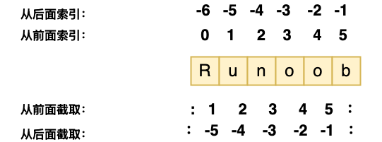

# Python基本数据类型

!!! note
    在 Python 中，m = "asf" 和 m = 'asf' 之间没有区别。它们都用于定义字符串，双引号 (") 和单引号 (') 是等效的，可以互换使用

## 多个变量赋值
Python允许你同时为多个变量赋值。例如：
```Python
a = b = c = 1
```
以上实例，创建一个整型对象，值为 1，从后向前赋值，三个变量被赋予相同的数值。

您也可以为多个对象指定多个变量。例如：
```Python
a, b, c = 1, 2, "runoob"
```
以上实例，两个整型对象 1 和 2 的分配给变量 a 和 b，字符串对象 "runoob" 分配给变量 c。

## 标准数据类型
Python3 中常见的数据类型有：

- Number（数字）
- String（字符串）
- bool（布尔类型）
- List（列表）
- Tuple（元组）
- Set（集合）
- Dictionary（字典）
Python3 的六个标准数据类型中：

- 不可变数据（3 个）：Number（数字）、String（字符串）、Tuple（元组）；
- 可变数据（3 个）：List（列表）、Dictionary（字典）、Set（集合）。

此外还有一些高级的数据类型，如: 字节数组类型(bytes)。


### Number（数字）
Python3 支持 int、float、bool、complex（复数）。

在Python 3里，只有一种整数类型 int，表示为长整型，没有 python2 中的 Long。

像大多数语言一样，数值类型的赋值和计算都是很直观的。

内置的 type() 函数可以用来查询变量所指的对象类型。
```Python
>>> a, b, c, d = 20, 5.5, True, 4+3j
>>> print(type(a), type(b), type(c), type(d))
<class 'int'> <class 'float'> <class 'bool'> <class 'complex'>
```

### String（字符串）
Python中的字符串用单引号 ' 或双引号 " 括起来，同时使用反斜杠 \ 转义特殊字符。

字符串的截取的语法格式如下：

变量[头下标:尾下标]
索引值以 0 为开始值，-1 为从末尾的开始位置。



### bool（布尔类型）
布尔类型即 True 或 False。

在 Python 中，True 和 False 都是关键字，表示布尔值。

布尔类型可以用来控制程序的流程，比如判断某个条件是否成立，或者在某个条件满足时执行某段代码。

布尔类型特点：

- 布尔类型只有两个值：True 和 False。

- bool 是 int 的子类，因此布尔值可以被看作整数来使用，其中 True 等价于 1。

- 布尔类型可以和其他数据类型进行比较，比如数字、字符串等。在比较时，Python 会将 True 视为 1，False 视为 0。

- 布尔类型可以和逻辑运算符一起使用，包括 and、or 和 not。这些运算符可以用来组合多个布尔表达式，生成一个新的布尔值。

- 布尔类型也可以被转换成其他数据类型，比如整数、浮点数和字符串。在转换时，True 会被转换成 1，False 会被转换成 0。

- 可以使用 bool() 函数将其他类型的值转换为布尔值。以下值在转换为布尔值时为 False：None、False、零 (0、0.0、0j)、空序列（如 ''、()、[]）和空映射（如 {}）。其他所有值转换为布尔值时均为 True。

### List（列表）
List（列表） 是 Python 中使用最频繁的数据类型。

列表可以完成大多数集合类的数据结构实现。列表中元素的类型可以不相同，它支持数字，字符串甚至可以包含列表（所谓嵌套）。

列表是写在方括号 [] 之间、用逗号分隔开的元素列表。

和字符串一样，列表同样可以被索引和截取，列表被截取后返回一个包含所需元素的新列表。

列表截取的语法格式如下：

> 变量[头下标:尾下标]

| 序号 | 方法 | 描述 |
| --- | --- | --- |
| 1 | `list.append(obj)` | 在列表末尾添加新的对象 |
| 2 | `list.count(obj)` | 统计某个元素在列表中出现的次数 |
| 3 | `list.extend(seq)` | 在列表末尾一次性追加另一个序列中的多个值（用新列表扩展原来的列表） |
| 4 | `list.index(obj)` | 从列表中找出某个值第一个匹配项的索引位置 |
| 5 | `list.insert(index, obj)` | 将对象插入列表 |
| 6 | `list.pop([index=-1])` | 移除列表中的一个元素（默认最后一个元素），并且返回该元素的值 |
| 7 | `list.remove(obj)` | 移除列表中某个值的第一个匹配项 |
| 8 | `list.reverse()` | 反向列表中元素 |
| 9 | `list.sort(key=None, reverse=False)` | 对原列表进行排序 |
| 10 | `list.clear()` | 清空列表 |
| 11 | `list.copy()` | 复制列表 |

索引值以 0 为开始值，-1 为从末尾的开始位置。
### Tuple（元组）
元组（tuple）与列表类似，不同之处在于元组的元素不能修改。元组写在小括号 () 里，元素之间用逗号隔开。

元组中的元素类型也可以不相同。

!!! Warning
    如果你想创建只有一个元素的元组，需要注意在元素后面添加一个逗号，以区分它是一个元组而不是一个普通的值，这是因为在没有逗号的情况下，Python会将括号解释为数学运算中的括号，而不是元组的表示。

| 序号 | 方法 | 描述 | 示例 |
| --- | --- | --- | --- |
| 1 | `len(tuple)` | 计算元组元素个数 | `>>> tuple1 = ('Google', 'Runoob', 'Taobao')`<br>`>>> len(tuple1)`<br>`3` |
| 2 | `max(tuple)` | 返回元组中元素最大值 | `>>> tuple2 = ('5', '4', '8')`<br>`>>> max(tuple2)`<br>`'8'` |
| 3 | `min(tuple)` | 返回元组中元素最小值 | `>>> tuple2 = ('5', '4', '8')`<br>`>>> min(tuple2)`<br>`'4'` |
| 4 | `tuple(iterable)` | 将可迭代系列转换为元组 | `>>> list1= ['Google', 'Taobao', 'Runoob', 'Baidu']`<br>`>>> tuple1=tuple(list1)`<br>`>>> tuple1`<br>`('Google', 'Taobao', 'Runoob', 'Baidu')` |

### Set（集合）
Python 中的集合（Set）是一种无序、可变的数据类型，用于存储唯一的元素。

集合中的元素不会重复，并且可以进行交集、并集、差集等常见的集合操作。

在 Python 中，集合使用大括号 {} 表示，元素之间用逗号 , 分隔。

另外，也可以使用 set() 函数创建集合。

注意：创建一个空集合必须用 set() 而不是 { }，因为 { } 是用来创建一个空字典。

创建格式：

```Python
parame = {value01,value02,...}
或者
set(value)
```

| 方法 | 描述 |
| --- | --- |
| `add()` | 为集合添加元素 |
| `clear()` | 移除集合中的所有元素 |
| `copy()` | 拷贝一个集合 |
| `difference()` | 返回多个集合的差集 |
| `difference_update()` | 移除集合中的元素，该元素在指定的集合也存在 |
| `discard()` | 删除集合中指定的元素 |
| `intersection()` | 返回集合的交集 |
| `intersection_update()` | 返回集合的交集 |
| `isdisjoint()` | 判断两个集合是否包含相同的元素，如果没有返回 True，否则返回 False |
| `issubset()` | 判断指定集合是否为该方法参数集合的子集 |
| `issuperset()` | 判断该方法的参数集合是否为指定集合的子集 |
| `pop()` | 随机移除元素 |
| `remove()` | 移除指定元素 |
| `symmetric_difference()` | 返回两个集合中不重复的元素集合 |
| `symmetric_difference_update()` | 移除当前集合中在另外一个指定集合相同的元素，并将另外一个指定集合中不同的元素插入到当前集合中 |
| `union()` | 返回两个集合的并集 |
| `update()` | 给集合添加元素 |
| `len()` | 计算集合元素个数 |

### Dictionary（字典）
字典（dictionary）是Python中另一个非常有用的内置数据类型。

列表是有序的对象集合，字典是无序的对象集合。两者之间的区别在于：字典当中的元素是通过键来存取的，而不是通过偏移存取。

字典是一种映射类型，字典用 { } 标识，它是一个无序的 键(key) : 值(value) 的集合。

键(key)必须使用不可变类型。

在同一个字典中，键(key)必须是唯一的。

```Python
#!/usr/bin/python3

dict = {}
dict['one'] = "1 - 菜鸟教程"
dict[2]     = "2 - 菜鸟工具"

tinydict = {'name': 'runoob','code':1, 'site': 'www.runoob.com'}


print (dict['one'])       # 输出键为 'one' 的值
print (dict[2])           # 输出键为 2 的值
print (tinydict)          # 输出完整的字典
print (tinydict.keys())   # 输出所有键
print (tinydict.values()) # 输出所有值
```
### bytes 类型
在 Python3 中，bytes 类型表示的是不可变的二进制序列（byte sequence）。

与字符串类型不同的是，bytes 类型中的元素是整数值（0 到 255 之间的整数），而不是 Unicode 字符。

bytes 类型通常用于处理二进制数据，比如图像文件、音频文件、视频文件等等。在网络编程中，也经常使用 bytes 类型来传输二进制数据。

创建 bytes 对象的方式有多种，最常见的方式是使用 b 前缀：

此外，也可以使用 bytes() 函数将其他类型的对象转换为 bytes 类型。bytes() 函数的第一个参数是要转换的对象，第二个参数是编码方式，如果省略第二个参数，则默认使用 UTF-8 编码：
```python
x = bytes("hello", encoding="utf-8")
```
与字符串类型类似，bytes 类型也支持许多操作和方法，如切片、拼接、查找、替换等等。同时，由于 bytes 类型是不可变的，因此在进行修改操作时需要创建一个新的 bytes 对象。例如：

实例
```python
x = b"hello"
y = x[1:3]  # 切片操作，得到 b"el"
z = x + b"world"  # 拼接操作，得到 b"helloworld"
```
需要注意的是，bytes 类型中的元素是整数值，因此在进行比较操作时需要使用相应的整数值。例如：

实例
```python
x = b"hello"
if x[0] == ord("h"):
    print("The first element is 'h'")
```

其中 ord() 函数用于将字符转换为相应的整数值。