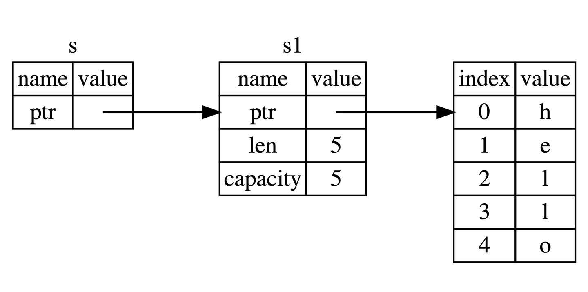
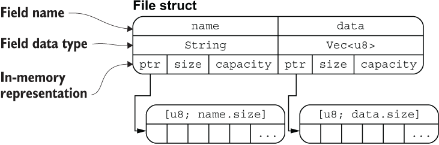

# 基础入门

## 2.1 变量绑定与解构

### 变量绑定

```rust
let a = "hello world";
```

这里就涉及 Rust 最核心的原则——所有权，简单来讲，任何内存对象都是有主人的，而且一般情况下完全属于它的主人，绑定就是把这个对象绑定给一个变量，让这个变量成为它的主人。


### 变量的可变性

Rust 语言中，变量可以是可变的也可以是不可变的。将本身无需改变的变量声明为不可变在运行期会避免一些多余的 runtime 检查，实现性能上的提升。

Rust 的变量在默认情况下是不可变的。前文提到，这是 Rust 团队为我们精心设计的语言特性之一，让我们编写的代码更安全，性能也更好。可以通过 mut 关键字让变量变为可变的，让设计更灵活。在 Rust 中，可变性很简单，只要在变量名前加一个 mut 即可。

```rust
fn main() {
    let x = 5;
    println!("x = {}", x);
    x = 6;                  // error!
    let mut y = 6;
    println!("y = {}", y);
    y = 7;
    println!("y = {}", y);
}
```

选择可变还是不可变，更多的还是取决于你的使用场景，例如不可变可以带来安全性，但是丧失了灵活性和性能（如果你要改变，就要重新创建一个新的变量，这里涉及到内存对象的再分配）。而可变变量最大的好处就是使用上的灵活性和性能上的提升。

例如，在使用大型数据结构或者热点代码路径（被大量频繁调用）的情形下，在同一内存位置更新实例可能比复制并返回新分配的实例要更快。使用较小的数据结构时，通常创建新的实例并以更具函数式的风格来编写程序，可能会更容易理解，所以值得以较低的性能开销来确保代码清晰。

### 用下划线开头忽略未使用的变量

```rust
let _x = 5;
```

这是告诉 Rust 这里的变量目前是不会使用的，让编译器不要警告。

也可以通过声明实现：

```rust
#[allow(unused_variables)]
fn main() {
    let x = 1; 
}
```

### 变量解构

let 表达式不仅仅用于变量的绑定，还能进行复杂变量的解构：从一个相对复杂的变量中，匹配出该变量的一部分内容。

```rust
fn main() {
    let (a, mut b): (bool,bool) = (true, false);
    // a = true,不可变; b = false，可变
    println!("a = {:?}, b = {:?}", a, b);

    b = true;
    assert_eq!(a, b);
}
```

#### 解构式赋值

```rust
struct Struct {
    e: i32
}

fn main() {
    let (a, b, c, d, e);

    (a, b) = (1, 2);
    [c, .., d, _] = [1, 2, 3, 4, 5];
    Struct { e, .. } = Struct { e: 5 };

    assert_eq!([1, 2, 1, 4, 5], [a, b, c, d, e]);
}
```

这段代码展示了 Rust 中 **解构赋值（destructuring assignment）** 的多种写法，包括：

* 元组解构
* 数组解构（带 `..`）
* 结构体解构（带 `..`）
* 占位符 `_` 的用法


1. 元组解构赋值

    ```rust
    (a, b) = (1, 2);
    ```

    这是元组解构：将 `(1, 2)` 赋值给 `a = 1`、`b = 2`。


2. 数组解构赋值（带 `..`）

    ```rust
    [c, .., d, _] = [1, 2, 3, 4, 5];
    ```

    这一句使用了数组模式匹配：

    * `[c, .., d, _]` 表示：

    * `c` 是第一个元素
    * `..` 忽略中间若干个元素
    * `d` 是倒数第二个
    * `_` 忽略最后一个（常用于忽略变量）

    对应赋值 `[1, 2, 3, 4, 5]`：


3. 结构体解构赋值（带 `..`）

    ```rust
    Struct { e, .. } = Struct { e: 5 };
    ```

    这是结构体解构的一种写法，表示：

    * 只取出字段 `e`，并赋值给变量 `e`；
    * `..` 表示**忽略其他字段**（尽管这里没别的字段，但 `..` 是必须的语法）。

    所以 `e = 5`


| 解构类型  | 写法                 | 含义                           |
| ----- | ------------------ | ---------------------------- |
| 元组解构  | `(a, b) = (1, 2)`  | 将元组元素分别赋值                    |
| 数组解构  | `[c, .., d, _]`    | 开头 `c`，结尾前一个 `d`，最后一个 `_` 忽略 |
| 结构体解构 | `Struct { e, .. }` | 提取字段 `e`，忽略其余字段              |
| `_`   | 占位符                | 忽略一个值不绑定变量                   |
| `..`  | 展开/忽略其余部分          | 适用于数组和结构体                    |


### 变量和常量之间的差异

- 常量不允许使用 mut。常量不仅仅默认不可变，而且自始至终不可变，因为常量在编译完成后，已经确定它的值。
- 常量使用 const 关键字而不是 let 关键字来声明，并且值的类型必须标注。

下面是一个常量声明的例子，其常量名为 MAX_POINTS，值设置为 100,000。（Rust 常量的命名约定是全部字母都使用大写，并使用下划线分隔单词，另外对数字字面量可插入下划线以提高可读性）：

```rust
const MAX_POINTS: u32 = 100_000;
```

常量可以在任意作用域内声明，包括全局作用域，在声明的作用域内，常量在程序运行的整个过程中都有效。对于需要在多处代码共享一个不可变的值时非常有用，例如游戏中允许玩家赚取的最大点数或光速。

!!! note
    在实际使用中，最好将程序中用到的硬编码值都声明为常量，对于代码后续的维护有莫大的帮助。如果将来需要更改硬编码的值，你也只需要在代码中更改一处即可。

### 变量遮蔽

Rust 允许声明相同的变量名，在后面声明的变量会遮蔽掉前面声明的。

```rust
fn main() {
    let x = 5;
    // 在main函数的作用域内对之前的x进行遮蔽
    let x = x + 1;

    {
        // 在当前的花括号作用域内，对之前的x进行遮蔽
        let x = x * 2;
        println!("The value of x in the inner scope is: {}", x);
    }

    println!("The value of x is: {}", x);
}
```

这和 mut 变量的使用是不同的，第二个 let 生成了完全不同的新变量，两个变量只是恰好拥有同样的名称，涉及一次**内存对象的再分配** ，而 mut 声明的变量，可以修改同一个内存地址上的值，并不会发生内存对象的再分配，性能要更好。

变量遮蔽的用处在于，如果你在某个作用域内无需再使用之前的变量（在被遮蔽后，无法再访问到之前的同名变量），就可以重复的使用变量名字，而不用绞尽脑汁去想更多的名字。

## 2.2 基本类型

Rust 每个值都有其确切的数据类型，总的来说可以分为两类：**基本类型**和**复合类型**。 基本类型意味着它们往往是一个最小化原子类型，无法解构为其它类型（一般意义上来说），由以下组成：

- 数值类型：有符号整数 (i8, i16, i32, i64, isize)、 无符号整数 (u8, u16, u32, u64, usize) 、浮点数 (f32, f64)、以及有理数、复数
- 字符串：字符串字面量和字符串切片 &str
- 布尔类型：true 和 false
- 字符类型：表示单个 Unicode 字符，存储为 4 个字节
- 单元类型：即 () ，其唯一的值也是 ()

#### 类型推导及标注

Rust 是一门静态类型语言，也就是编译器必须在编译期知道我们所有变量的类型，但这不意味着你需要为每个变量指定类型，因为 Rust 编译器很聪明，它可以**根据变量的值和上下文中的使用方式来自动推导出变量的类型**，同时编译器也不够聪明，在某些情况下，它无法推导出变量类型，需要手动去给予一个类型标注。

```rust
#![allow(unused)]
fn main() {
let guess = "42".parse().expect("Not a number!");
}
```

.parse() 是一个泛型方法，它的行为取决于你期望它解析成什么类型。虽然 "42" 是字符串（&str 类型），但 Rust 标准库中有许多类型（比如 i32、f64 等）都为 .parse() 提供了实现 —— 只要你告诉它“我要解析成什么”。

这段代码的目的是将字符串 "42" 进行解析，而编译器在这里无法推导出我们想要的类型：整数？浮点数？字符串？因此编译器会报错。

```rust
#![allow(unused)]
fn main() {
let guess: i32 = "42".parse().expect("Not a number!");
}
```

### 2.2.1 数值类型

#### 整数类型

| 长度         | 有符号类型 | 无符号类型 |
|--------------|------------|------------|
| 8 位         | `i8`       | `u8`       |
| 16 位        | `i16`      | `u16`      |
| 32 位        | `i32`      | `u32`      |
| 64 位        | `i64`      | `u64`      |
| 128 位       | `i128`     | `u128`     |
| 视架构而定    | `isize`    | `usize`    |


isize 和 usize 类型取决于程序运行的计算机 CPU 类型： 若 CPU 是 32 位的，则这两个类型是 32 位的，同理，若 CPU 是 64 位，那么它们则是 64 位。

整型字面量可以用下表的形式书写：

| 数字字面量	| 示例        |
|--------------|------------|
| 十进制         | 98_222       |
| 十六进制        | 0xff     |
| 八进制       | 0o77     |
| 二进制        | 0b1111_0000     |
| 字节 (仅限于 u8)  | b'A'     |


**整型溢出**

假设有一个 u8 ，它可以存放从 0 到 255 的值。那么当你将其修改为范围之外的值，比如 256，则会发生整型溢出。关于这一行为 Rust 有一些有趣的规则：当在 debug 模式编译时，Rust 会检查整型溢出，若存在这些问题，则使程序在编译时 panic(崩溃,Rust 使用这个术语来表明程序因错误而退出)。

在当使用 --release 参数进行 release 模式构建时，Rust 不检测溢出。相反，当检测到整型溢出时，Rust 会按照补码循环溢出（two’s complement wrapping）的规则处理。简而言之，大于该类型最大值的数值会被补码转换成该类型能够支持的对应数字的最小值。比如在 u8 的情况下，256 变成 0，257 变成 1，依此类推。程序不会 panic，但是该变量的值可能不是你期望的值。依赖这种默认行为的代码都应该被认为是错误的代码。
    
**注意，这里只适用于运行时溢出（runtime overflow），不适用于字面值溢出（literal overflow）！**
```rust
let a: u8 = 256; // 错误：256 是超出 u8 范围的字面值
```

**这是编译期字面量溢出，Rust 在编译阶段就能确定这个错误，因此它不管你是 debug 模式还是 release 模式，都会直接拒绝编译。**
```rust
    fn get_val() -> u8 {
        255
    }

    fn main() {
        let a = get_val();
        let b = a + 1;  // debug 模式下 panic，release 模式下 wrap
        println!("{}", b);
    }
```

要显式处理可能的溢出，可以使用标准库针对原始数字类型提供的这些方法：

- 使用 wrapping_* 方法在所有模式下都按照补码循环溢出规则处理，例如 wrapping_add
- 如果使用 checked_* 方法时发生溢出，则返回 None 值
- 使用 overflowing_* 方法返回该值和一个指示是否存在溢出的布尔值
- 使用 saturating_* 方法，可以限定计算后的结果不超过目标类型的最大值或低于最小值，例如:
    ```rust
        assert_eq!(100u8.saturating_add(1), 101);
        assert_eq!(u8::MAX.saturating_add(127), u8::MAX);
    ```

下面是一个演示wrapping_*方法的示例：


```rust
    fn main() {
        let a : u8 = 255;
        let b = a.wrapping_add(20);
        println!("{}", b);  // 19
    }
```

#### 浮点类型

Rust 中浮点类型数字也有两种基本类型： f32 和 f64，分别为 32 位和 64 位大小。默认浮点类型是 f64，在现代的 CPU 中它的速度与 f32 几乎相同，但精度更高。

浮点数根据 [IEEE-754 标准](https://note.xiu-zju.me/courses/jz/3/3/#35-floating-point-numbers)实现。f32 类型是单精度浮点型，f64 为双精度。


**浮点数陷阱**

浮点数由于底层格式的特殊性，导致了如果在使用浮点数时不够谨慎，就可能造成危险，有两个原因：

- **浮点数往往是你想要数字的近似表达** 浮点数类型是基于二进制实现的，但是我们想要计算的数字往往是基于十进制，例如 0.1 在二进制上并不存在精确的表达形式，但是在十进制上就存在。这种不匹配性导致一定的歧义性，更多的，虽然浮点数能代表真实的数值，但是由于底层格式问题，它往往受限于定长的浮点数精度，如果你想要表达完全精准的真实数字，只有使用无限精度的浮点数才行

- **浮点数在某些特性上是反直觉的** 例如大家都会觉得浮点数可以进行比较，对吧？是的，它们确实可以使用 >，>= 等进行比较，但是在某些场景下，这种直觉上的比较特性反而会害了你。因为 f32 ， f64 上的比较运算实现的是 std::cmp::PartialEq 特征(类似其他语言的接口)，但是并没有实现 std::cmp::Eq 特征，但是后者在其它数值类型上都有定义，说了这么多，可能大家还是云里雾里，用一个例子来举例：

!!! example "例子"
    Rust 的 HashMap 数据结构，是一个 KV 类型的 Hash Map 实现，它对于 K 没有特定类型的限制，但是要求能用作 K 的类型必须实现了 std::cmp::Eq 特征，因此这意味着你无法使用浮点数作为 HashMap 的 Key，来存储键值对，但是作为对比，Rust 的整数类型、字符串类型、布尔类型都实现了该特征，因此可以作为 HashMap 的 Key。

为了避免上面说的两个陷阱，你需要遵守以下准则：

- 避免在浮点数上测试相等性
- 当结果在数学上可能存在未定义时，需要格外的小心


#### NaN

对于数学上未定义的结果，例如对负数取平方根 -42.1.sqrt() ，会产生一个特殊的结果：Rust 的浮点数类型使用 NaN (not a number) 来处理这些情况。

所有跟 NaN 交互的操作，都会返回一个 NaN，而且 NaN 不能用来比较。出于防御性编程的考虑，可以使用 is_nan() 等方法，可以用来判断一个数值是否是 NaN 。

> 有点像数据库的空值？

#### 数字运算

符合直觉。

#### 位运算

符合直觉。

对于移位运算，Rust 会检查它是否超出该整型的位数范围，如果超出，则会报错 overflow。比如，一个 8 位的整型，如果试图移位 8 位，就会报错，但如果移位 7 位就不会。Rust 这样做的理由也很简单，如果移位太多，那么这个移位后的数字就是全 0 或者全 1，所以移位操作不如直接写 0 或者 -1，这很可能意味着这里的代码是有问题的。需要注意的是，不论 debug 模式还是 release 模式，Rust 都会检查溢出。

```rust
fn main() {
   let a: u8 = 255;
   let b = a>>7; // ok
   let b = a<<7; // ok
   let b = a>>8; // overflow
   let b = a<<8; // overflow
}
```

#### 序列（range）
Rust 提供了一个非常简洁的方式，用来生成连续的数值，例如 1..5，生成从 1 到 4 的连续数字，不包含 5 ；1..=5，生成从 1 到 5 的连续数字，包含 5，它的用途很简单，常常用于循环中：

```rust
for i in 1..=5 {
    println!("{}",i);
}
```

序列只允许用于数字或字符类型，原因是：它们可以连续，同时编译器在编译期可以检查该序列是否为空，字符和数字值是 Rust 中仅有的可以用于判断是否为空的类型。如下是一个使用字符类型序列的例子：

```rust
for i in 'a'..='z' {
    println!("{}",i);
}
```


```rust
use std::ops::{Range, RangeInclusive};
fn main() {
    assert_eq!((1..5), Range{ start: 1, end: 5 });
    assert_eq!((1..=5), RangeInclusive::new(1, 5));
}
```

#### 使用 As 完成类型转换
Rust 中可以使用 As 来完成一个类型到另一个类型的转换，其最常用于将原始类型转换为其他原始类型，但是它也可以完成诸如将指针转换为地址、地址转换为指针以及将指针转换为其他指针等功能。

#### 有理数和复数

Rust 的标准库相比其它语言，准入门槛较高，因此有理数和复数并未包含在标准库中：

- 有理数和复数
- 任意大小的整数和任意精度的浮点数
- 固定精度的十进制小数，常用于货币相关的场景

按照以下步骤来引入 `num` 库：

1. 创建新工程 `cargo new complex-num && cd complex-num`
2. 在 `Cargo.toml` 中的 `[dependencies]` 下添加一行 `num = "0.4.0"`
3. 将 `src/main.rs` 文件中的 `main` 函数替换为下面的代码
4. 运行 `cargo run`

```rust
use num::complex::Complex;

 fn main() {
   let a = Complex { re: 2.1, im: -1.2 };
   let b = Complex::new(11.1, 22.2);
   let result = a + b;

   println!("{} + {}i", result.re, result.im)
 }
```

#### 总结

之前提到了过 Rust 的数值类型和运算跟其他语言较为相似，但是实际上，除了语法上的不同之外，还是存在一些差异点：

- **Rust 拥有相当多的数值类型**. 因此你需要熟悉这些类型所占用的字节数，这样就知道该类型允许的大小范围以及你选择的类型是否能表达负数
- **类型转换必须是显式的**. Rust 永远也不会偷偷把你的 16bit 整数转换成 32bit 整数
- **Rust 的数值上可以使用方法**. 例如你可以用以下方法来将 `13.14` 取整：`13.14_f32.round()`，在这里我们使用了类型后缀，因为编译器需要知道 `13.14` 的具体类型

### 2.2.2 字符、布尔、单元类型

#### 字符类型

**所有的 Unicode 值**都可以作为 Rust 字符，包括单个的中文、日文、韩文、emoji 表情符号等等，都是合法的字符类型。Unicode 值的范围从 U+0000 ~ U+D7FF 和 U+E000 ~ U+10FFFF。由于 Unicode 都是 4 个字节编码，因此字符类型也是占用 4 个字节。Rust 的字符只能用 '' 来表示， "" 是留给字符串的。

#### 布尔类型

true 和 false。布尔值占用内存的大小为 1 个字节。

#### 单元类型

() 是 Rust 中“无返回值”的标志，它本身是一个合法的类型，叫“单元类型”，并且它只有一个值，那就是 () 本身。

Rust 是强类型语言，一切都有类型。就算你什么都不返回，编译器也要给它一个“类型”来标注：这时候用的就是 () 类型。

可以把它看作 Rust 中的“空值的显式表达”，不像 C/C++ 里直接忽略返回值，也不像 Java 用 void。

!!! note "应用"
    可以用 () 作为 map 的值，表示我们不关注具体的值，只关注 key。可以作为一个值用来占位，但是完全不占用任何内存。


### 2.2.3 语句与表达式

Rust 的函数体是由一系列语句组成，最后由一个表达式来返回值，例如：

```rust
fn add_with_extra(x: i32, y: i32) -> i32 {
    let x = x + 1; // 语句
    let y = y + 5; // 语句
    x + y // 表达式
}
```

语句会执行一些操作但是不会返回一个值，而表达式会在求值后返回一个值，因此在上述函数体的三行代码中，前两行是语句，最后一行是表达式。

#### 语句

语句完成了具体的操作，但是并没有返回值。例如 let 语句。

#### 表达式

表达式会进行求值，然后返回一个值。例如 5 + 6，在求值后，返回值 11，因此它就是一条表达式。

表达式可以成为语句的一部分，例如 let y = 6 中，6 就是一个表达式，它在求值后返回一个值 6（有些反直觉，但是确实是表达式）。

调用一个函数是表达式，因为会返回一个值，调用宏也是表达式，用花括号包裹最终返回一个值的语句块也是表达式，总之，能返回值，它就是表达式。

```rust
fn main() {
    let y = {
        let x = 3;
        x + 1
    };
    println!("The value of y is {}.", y);
}
```

表达式不能包含分号。这一点非常重要，一旦你在表达式后加上分号，它就会变成一条语句，再也不会返回一个值!

最后，表达式如果不返回任何值，会隐式地返回一个 () 。

### 2.2.4 函数


- 函数名和变量名使用蛇形命名法(snake case)，例如 fn add_two() {}
- 函数的位置可以随便放，Rust 不关心我们在哪里定义了函数，只要有定义即可
- 每个函数参数都需要标注类型

#### 永不返回的发散函数

当用 ! 作函数返回类型的时候，表示该函数永不返回( diverging functions )，特别的，这种语法往往用做会导致程序崩溃的函数。

- 这个函数永远不会返回正常的值
- 也就是说，它**要么 panic，要么无限循环，要么退出程序**

```rust
fn dead_end() -> ! {
    panic!("穷途末路！");
}
```

```rust
fn forever() -> ! {
    loop {
        println!("我永远在这！");
    }
}
```

!!! warning "关于 return"
    ```rust
    fn plus_or_minus(x: i32) -> i32 {
        if x > 5 {
            x - 5 //  这个是一个表达式，但 `if` 没有 else 分支
        }
        x + 5
    }
    ```
    这里编译器会报错，这是因为 if 是表达式而不是语句，需要有返回值。这里 if 没有写 else 分支，Rust 需要知道这个 if 的整体值是什么，但如果条件不成立，它该返回什么？没写 else，它就默认返回 ()（unit）。所以实际上代码会变成：
    ```rust
    let tmp = if x > 5 {
        x - 5   // i32
    } else {
        ()      // unit
    };
    ```
    就报错了：i32 和 () 不匹配。所以我们需要 return 来提前返回。


## 2.3 所有权与借用

### 2.3.1 所有权

Rust 通过所有权来管理内存，编译器在编译时会根据一系列规则进行检查。对于程序运行期，不会有任何性能上的损失。

#### 栈(Stack)与堆(Heap)

栈和堆的核心目标就是为程序在运行时提供可供使用的内存空间。

**栈**

后进先出。栈中的所有数据都必须占用已知且固定大小的内存空间，假设数据大小是未知的，那么在取出数据时，你将无法取到你想要的数据。

**堆**

与栈不同，对于大小未知或者可能变化的数据，我们需要将它存储在堆上。当向堆上放入数据时，需要请求一定大小的内存空间。操作系统在堆的某处找到一块足够大的空位，把它标记为已使用，并返回一个表示该位置地址的指针，该过程被称为在堆上分配内存，有时简称为 “分配”(allocating)。接着，该指针会被推入栈中，因为指针的大小是已知且固定的，在后续使用过程中，你将通过栈中的指针，来获取数据在堆上的实际内存位置，进而访问该数据。由上可知，堆是一种缺乏组织的数据结构。

**性能比较**

在栈上分配内存比在堆上分配内存要快，因为入栈时操作系统无需进行函数调用（或更慢的系统调用）来分配新的空间，只需要将新数据放入栈顶即可。相比之下，在堆上分配内存则需要更多的工作，这是因为操作系统必须首先找到一块足够存放数据的内存空间，接着做一些记录为下一次分配做准备，如果当前进程分配的内存页不足时，还需要进行系统调用来申请更多内存。 

**所有权与堆栈**

当你的代码调用一个函数时，传递给函数的参数（包括可能指向堆上数据的指针和函数的局部变量）依次被压入栈中，当函数调用结束时，这些值将被从栈中按照相反的顺序依次移除。

因为堆上的数据缺乏组织，因此跟踪这些数据何时分配和释放是非常重要的，否则堆上的数据将产生内存泄漏 —— 这些数据将永远无法被回收。这就是 Rust 所有权系统为我们提供的强大保障。

#### 所有权原则

- Rust 中每一个值都被一个变量所拥有，该变量被称为值的所有者
- 一个值同时只能被一个变量所拥有，或者说一个值只能拥有一个所有者
- 当所有者（变量）离开作用域范围时，这个值将被丢弃(drop)

#### 变量绑定背后的数据交互

**转移所有权**

先来看一段代码：

```rust
let x = 5;
let y = x;
```

这段代码**并没有发生所有权的转移**，原因很简单： 代码首先将 5 绑定到变量 x，接着拷贝 x 的值赋给 y，最终 x 和 y 都等于 5，因为整数是 Rust 基本数据类型，是固定大小的简单值，因此这两个值都是通过自动拷贝的方式来赋值的，都被存在栈中，完全无需在堆上分配内存。

整个过程中的赋值都是通过值拷贝的方式完成（发生在栈中），因此并不需要所有权转移。

!!! warning "疑问"
    可能有同学会有疑问：这种拷贝不消耗性能吗？实际上，这种栈上的数据足够简单，而且拷贝非常非常快，只需要复制一个整数大小（i32，4 个字节）的内存即可，因此在这种情况下，拷贝的速度远比在堆上创建内存来得快的多。实际上，上一章我们讲到的 Rust 基本类型都是通过自动拷贝的方式来赋值的，就像上面代码一样。

但是当涉及到非基本类型（不是储存在栈上）的时候，这里就不能自动拷贝，例如存放在堆上的 String。

实际上， String 类型是一个复杂类型，由存储在栈中的**堆指针**、**字符串长度**、**字符串容量**共同组成，其中堆指针是最重要的，它指向了真实存储字符串内容的堆内存。容量是堆内存分配空间的大小，长度是目前已经使用的大小。

```rust
let s1 = String::from("hello");
let s2 = s1;
```

Rust 这样解决问题：当 s1 被赋予 s2 后，Rust 认为 s1 **不再有效**，因此也无需在 s1 离开作用域后 drop 任何东西，这就是把所有权从 s1 转移给了 s2，**s1 在被赋予 s2 后就马上失效了**。

**clone 深拷贝**

Rust 永远也不会自动创建数据的 “深拷贝”。因此，任何自动的复制都不是深拷贝，可以被认为对运行时性能影响较小。

如果我们确实需要深度复制 String 中堆上的数据，而不仅仅是栈上的数据，可以使用一个叫做 clone 的方法。

```rust
let s1 = String::from("hello");
let s2 = s1.clone();

println!("s1 = {}, s2 = {}", s1, s2);
```

如果代码性能无关紧要，例如初始化程序时或者在某段时间只会执行寥寥数次时，你可以使用 clone 来简化编程。但是对于执行较为频繁的代码（热点路径），使用 clone 会极大的降低程序性能，需要小心使用！

!!! note "热点路径"
    热点路径 = 程序运行中频繁执行的核心代码段，影响整体性能的“热点”。
    在这些地方，clone 代价大、应谨慎使用；非热点路径中可以放心使用 clone 来提升代码可读性和开发效率。

**copy 浅拷贝**

浅拷贝只发生在栈上，因此性能很高，在日常编程中，浅拷贝无处不在。

像整型这样的基本类型在编译时是已知大小的，会被存储在**栈**上，所以拷贝其实际的值是快速的。这意味着没有理由在创建变量 y 后使 x 无效（x、y 都仍然有效）。换句话说，这里没有深浅拷贝的区别，因此这里调用 clone 并不会与通常的浅拷贝有什么不同，我们可以不用管它（可以理解成在栈上做了深拷贝）。

这里可以给出一个通用的规则：**任何基本类型的组合**可以 Copy ，**不需要分配内存或某种形式资源的类型**是可以 Copy 的。如下是一些 Copy 的类型：

- 所有整数类型，比如 u32
- 布尔类型，bool，它的值是 true 和 false
- 所有浮点数类型，比如 f64
- 字符类型，char
- 元组，当且仅当其包含的类型也都是 Copy 的时候。比如，(i32, i32) 是 Copy 的，但 (i32, String) 就不是
- 不可变引用 &T 。但是注意：**可变引用** &mut T 是不可以 Copy的

#### 函数的传值与返回

```rust
fn main() {
    let s = String::from("hello");  // s 进入作用域

    takes_ownership(s);             // s 的值移动到函数里 ...
                                    // ... 所以到这里不再有效
    println!("{}", s);              // error!

    let x = 5;                      // x 进入作用域

    makes_copy(x);                  // x 应该移动函数里，
                                    // 但 i32 是 Copy 的，所以在后面可继续使用 x

} // 这里, x 先移出了作用域，然后是 s。但因为 s 的值已被移走，
  // 所以不会有特殊操作

fn takes_ownership(some_string: String) { // some_string 进入作用域
    println!("{}", some_string);
} // 这里，some_string 移出作用域并调用 `drop` 方法。占用的内存被释放

fn makes_copy(some_integer: i32) { // some_integer 进入作用域
    println!("{}", some_integer);
} // 这里，some_integer 移出作用域。不会有特殊操作
```

所有权很强大，避免了内存的不安全性，但是也带来了一个新麻烦：**总是把一个值传来传去来使用它**。传入一个函数，很可能还要从该函数传出去，结果就是语言表达变得非常啰嗦，幸运的是，Rust 提供了新功能解决这个问题。

### 2.3.2 引用与借用

#### 引用与解引用

常规引用是一个指针类型，指向了对象存储的内存地址。

```rust
fn main() {
    let x = 5;
    let y = &x;
    assert_eq!(x, 5);
    assert_eq!(*y, 5);
}
```

#### 不可变引用

& 符号即是引用，它们允许你使用值，但是不获取所有权。



正如变量默认不可变一样，引用指向的值默认也是不可变的，没事，来一起看看如何解决这个问题。

#### 可变引用

```rust
fn main() {
    let mut s = String::from("Hello, world!");
    change_string(&mut s);
    println!("{}", s);
}

fn change_string(s: &mut String) {
    s.push_str(" from Rust!");
}
```

!!! info
    这是可以直接调用 some_string.push_str(...) 的原因是：Rust 在方法调用中会自动解引用（类似 C++ 的 -> 语法糖）。所以 some_string.push_str(...) 实际上等价于 (*some_string).push_str(...)。这种自动解引用叫做**自动引用与解引用**（Deref coercion）。

**1. 同一作用域，特定数据只能有一个可变引用！**

这种限制的好处就是使 Rust 在编译期就避免数据竞争，数据竞争可由以下行为造成：

- 两个或更多的指针同时访问同一数据
- 至少有一个指针被用来写入数据
- 没有同步数据访问的机制

**2. 可变引用与不可变引用不能同时存在！**

多个不可变借用被允许是因为没有人会去试图修改数据，每个人都只读这一份数据而不做修改，因此不用担心数据被污染。

!!! quote "用一个很形象的例子来说明这两个原则"
    

!!! bug "错误代码赏析"
    ```rust
    #[allow(unused_variables)]
    fn main() {
        let s: &str = "Hello, World!"; // ① s 是 *不可变* 的字符串切片
        let r = &s;                    // ② r 是对 s 的 *不可变借用*
        let r1 = &mut s;               // ③ 试图对同一个 s 进行 *可变借用*
        r1.push_str(" This is a mutable reference."); // ④ push_str 并不适用于 &str
    }
    ```

    | # | 问题                                       | 出错原因                                  |
    | - | ---------------------------------------- | ------------------------------------- |
    | 1 | `s` 本身没有用 `mut` 声明                       | 不能把一个 **不可变绑定** 再拿去做 `&mut` 借用。       |
    | 2 | 已经有 `r = &s` 的 **不可变借用**                 | 按借用规则：同一时刻要么若干个不可变借用，要么一个可变借用，二者不能并存。 |
    | 3 | `&mut s` 的类型其实是 `&mut &str`              | 只是把“指针变量”本身设为可变，**并不能** 修改字符串内容。      |
    | 4 | `push_str` 只在 `String`/`&mut String` 上可用 | `&str`（字符串切片）是只读视图，没有 `push_str` 方法。  |

**NLL**

```rust
fn main() {
   let mut s = String::from("hello");

    let r1 = &s;
    let r2 = &s;
    println!("{} and {}", r1, r2);
    // 新编译器中，r1,r2作用域在这里结束

    let r3 = &mut s;
    println!("{}", r3);
} // 老编译器中，r1、r2、r3作用域在这里结束
  // 新编译器中，r3作用域在这里结束
```

对于这种编译器优化行为，Rust 专门起了一个名字 —— Non-Lexical Lifetimes(NLL)，专门用于找到某个引用在作用域(})结束前就不再被使用的代码位置。

虽然这种借用错误有的时候会让我们很郁闷，但是你只要想想这是 Rust 提前帮你发现了潜在的 BUG，其实就开心了，虽然减慢了开发速度，但是从长期来看，大幅减少了后续开发和运维成本。

#### 垂悬引用

悬垂引用也叫做悬垂指针，意思为指针指向某个值后，这个值被释放掉了，而指针仍然存在，其指向的内存可能不存在任何值或已被其它变量重新使用。在 Rust 中编译器可以确保引用永远也不会变成悬垂状态：当你获取数据的引用后，编译器可以确保数据不会在引用结束前被释放，要想释放数据，必须先停止其引用的使用。

## 2.4 复合类型

### 2.4.1 字符串与切片

尤其要区分 String 和 &str ！

#### 切片

对于字符串而言，切片就是对 String 类型中某一部分的引用。
（这里我们说的切片指的是切片的引用）

```rust
let s = String::("hello, world!");
let hello = &s[0..5];
let world = &s[6..11];
```

创造切片：左闭右开区间。


!!! warning "注意"
    在对字符串使用切片语法时需要格外小心，切片的索引必须落在字符之间的边界位置，也就是 UTF-8 字符的边界，例如中文在 UTF-8 中占用三个字节，下面的代码就会崩溃：

    ```rust
    fn main() {
        let s = "中国人";
        let a = &s[0..2];
        println!("{}",a);
    }   
    ```

    因为我们只取 s 字符串的前两个字节，但是本例中每个汉字占用三个字节，因此没有落在边界处，也就是连 **中** 字都取不完整，此时程序会直接崩溃退出，如果改成 &s[0..3]，则可以正常通过编译。 


在 Rust 中，直接使用切片类型（如 [i32] 或 str）会导致编译错误，这是因为切片是 ​​动态大小类型（DST, Dynamically Sized Types）​​，而 Rust 的编译期内存安全规则要求所有类型必须有已知的固定大小。

切片本质​​：切片是对连续内存数据的视图（如数组的一部分或字符串的一部分），其长度在编译时未知。

- [i32]：表示一个长度不确定的 i32 序列。
- str：表示一个长度不确定的 UTF-8 字节序列。

​​问题​​：Rust 需要在编译期知道类型的大小（例如栈分配、结构体布局等），但切片的长度是运行时确定的，无法静态推断。

切片的引用（如 &[i32]）是一个 ​​胖指针（fat pointer），包含：

- ​指针​​：指向切片数据的起始地址。
- ​长度​​：切片的元素数量（运行时已知）。

这样，&[i32] 的大小是固定的（通常为 2 个 usize，即指针 + 长度），编译器可以处理它。切片的第一个字是指向数据的指针，第二个字是切片的长度。字的大小取决于处理器架构，例如在 x86-64 上，字的大小是 64 位也就是 8 个字节，那么一个切片引用就是 16 个字节大小。

#### 字符串

字符串是由字符组成的连续集合。但是我们提到过，Rust 中的字符是 Unicode 类型，因此每个字符占据 4 个字节内存空间，但是在字符串中不一样，字符串是 UTF-8 编码，也就是字符串中的字符所占的字节数是变化的(1 - 4)，这样有助于大幅降低字符串所占用的内存空间。

str 类型是硬编码进可执行文件，也无法被修改，但是 String 则是一个可增长、可改变且具有所有权的 UTF-8 编码字符串，当 Rust 用户提到字符串时，往往指的就是 String 类型和 &str 字符串切片类型，这两个类型都是** UTF-8 编码**。

#### String 与 &str 的转换
在之前的代码中，已经见到好几种从 &str 类型生成 String 类型的操作：
```rust
String::from("hello,world")
"hello,world".to_string()
```

那么如何将 String 类型转为 &str 类型呢？答案很简单，取引用即可：

```rust
fn main() {
    let s = String::from("hello,world!");
    say_hello(&s);
    say_hello(&s[..]);
    say_hello(s.as_str());
}

fn say_hello(s: &str) {
    println!("{}",s);
}
```

#### 字符串索引

Rust 中不可以通过索引的方式访问子串。

字符串的底层的数据存储格式实际上是[ u8 ]，一个字节数组。

```rust
let hello = String::from("中国人");
```

如果问你该字符串多长，你可能会说 3，但是实际上是 9 个字节的长度，因为大部分常用汉字在 UTF-8 中的长度是 3 个字节，因此这种情况下对 hello 进行索引，访问 &hello[0] 没有任何意义，因为你取不到 中 这个字符，而是取到了这个字符三个字节中的第一个字节，这是一个非常奇怪而且难以理解的返回值。

还有一个原因导致了 Rust 不允许去索引字符串：因为索引操作，我们总是期望它的性能表现是 O(1)，然而对于 String 类型来说，无法保证这一点，因为 Rust 可能需要从 0 开始去遍历字符串来定位合法的字符。

#### 操作字符串

**追加**

```rust
fn main() {
    let mut s = String::from("Hello ");

    s.push_str("rust");
    println!("追加字符串 push_str() -> {}", s);

    s.push('!');
    println!("追加字符 push() -> {}", s);
}
```

```plaintext
追加字符串 push_str() -> Hello rust
追加字符 push() -> Hello rust!
```

**插入**

需要传入两个参数，第一个参数是字符（串）插入位置的索引，第二个参数是要插入的字符（串），索引从 0 开始计数，如果越界则会发生错误。

```rust
fn main() {
    let mut s = String::from("Hello rust!");
    s.insert(5, ',');
    println!("插入字符 insert() -> {}", s);
    s.insert_str(6, " I like");
    println!("插入字符串 insert_str() -> {}", s);
}
```

```plaintext
插入字符 insert() -> Hello, rust!
插入字符串 insert_str() -> Hello, I like rust!
```

**替换**

1. replace

该方法可适用于 String 和 &str 类型。replace() 方法接收两个参数，第一个参数是要被替换的字符串，第二个参数是新的字符串。该方法会替换所有匹配到的字符串。**该方法是返回一个新的字符串，而不是操作原来的字符串。**

```rust
fn main() {
    let string_replace = String::from("I like rust. Learning rust is my favorite!");
    let new_string_replace = string_replace.replace("rust", "RUST");
    dbg!(new_string_replace);
}
```

2. replacen

该方法可适用于 String 和 &str 类型。replacen() 方法接收三个参数，前两个参数与 replace() 方法一样，第三个参数则表示替换的个数。**该方法是返回一个新的字符串，而不是操作原来的字符串。**

```rust
fn main() {
    let string_replace = "I like rust. Learning rust is my favorite!";
    let new_string_replacen = string_replace.replacen("rust", "RUST", 1);
    dbg!(new_string_replacen);
}
```

3. replace_range

该方法仅适用于 String 类型。replace_range 接收两个参数，第一个参数是要替换字符串的范围（Range），第二个参数是新的字符串。**该方法是直接操作原来的字符串，不会返回新的字符串。**该方法需要使用 mut 关键字修饰。

```rust
fn main() {
    let mut string_replace_range = String::from("I like rust!");
    string_replace_range.replace_range(7..8, "R");
    dbg!(string_replace_range);
}
```

**删除**

与字符串删除相关的方法有 4 个，它们分别是 pop()，remove()，truncate()，clear()。这四个方法**仅适用于 String 类型**。

1. pop —— 删除并返回字符串的最后一个字符

该方法是**直接操作原来的字符串。但是存在返回值，其返回值是一个 Option 类型**，如果字符串为空，则返回 None。

```rust
fn main() {
    let mut string_pop = String::from("rust pop 中文!");
    let p1 = string_pop.pop();
    let p2 = string_pop.pop();
    dbg!(p1);
    dbg!(p2);
    dbg!(string_pop);
}
```

代码运行结果：

```plaintext
p1 = Some(
   '!',
)
p2 = Some(
   '文',
)
string_pop = "rust pop 中"
```

2. remove —— 删除并返回字符串中指定位置的字符

该方法是**直接操作原来的字符串。但是存在返回值，其返回值是删除位置的字符串**，只接收一个参数，表示该字符起始索引位置。remove() 方法是按照**字节**来处理字符串的，如果参数所给的位置不是合法的字符边界，则会发生错误。

示例代码如下：

```rust
fn main() {
    let mut string_remove = String::from("测试remove方法");
    println!(
        "string_remove 占 {} 个字节",
        std::mem::size_of_val(string_remove.as_str())
    );
    // 删除第一个汉字
    string_remove.remove(0);
    // 下面代码会发生错误
    // string_remove.remove(1);
    // 直接删除第二个汉字
    // string_remove.remove(3);
    dbg!(string_remove);
}
```


代码运行结果：

```plaintext
string_remove 占 18 个字节
string_remove = "试remove方法"
```

3. truncate —— 删除字符串中从指定位置开始到结尾的全部字符

该方法是**直接操作原来的字符串。无返回值。**该方法 truncate() 方法是按照字节来处理字符串的，如果参数所给的位置不是合法的字符边界，则会发生错误。

示例代码如下：

```rust
fn main() {
    let mut string_truncate = String::from("测试truncate");
    string_truncate.truncate(3);
    dbg!(string_truncate);
}
```

代码运行结果：

```plaintext
string_truncate = "测"
```

4. clear —— 清空字符串

该方法是**直接操作原来的字符串**。调用后，删除字符串中的所有字符，相当于 truncate() 方法参数为 0 的时候。

示例代码如下：

```rust
fn main() {
    let mut string_clear = String::from("string clear");
    string_clear.clear();
    dbg!(string_clear);
}
```
代码运行结果：

```plaintext
string_clear = ""
```

**连接**

1. 使用 + 或者 += 连接字符串

使用 + 或者 += 连接字符串，要求右边的参数必须为字符串的**切片引用（Slice）类型**。其实当调用 + 的操作符时，相当于调用了 std::string 标准库中的 add() 方法，这里 add() 方法的第二个参数是一个引用的类型。因此我们在使用 + 时， 必须传递切片引用类型。不能直接传递 String 类型。+ 是**返回一个新的字符串**，所以变量声明可以不需要 mut 关键字修饰。

示例代码如下：

```rust
fn main() {
    let string_append = String::from("hello ");
    let string_rust = String::from("rust");
    // &string_rust会自动解引用为&str
    let result = string_append + &string_rust;
    let mut result = result + "!"; // `result + "!"` 中的 `result` 是不可变的
    result += "!!!";

    println!("连接字符串 + -> {}", result);
}
```

!!! info "对于 add 函数的探讨"
    ```rust
    fn main() {
        let s1 = String::from("hello,");
        let s2 = String::from("world!");

        let s3 = s1 + &s2;

        println!("{}", s3); // ✅ 输出: hello,world!
        // println!("{}", s1); // ❌ 编译错误，s1 已被 move
        println!("{}", s2); // ✅ 正常，s2 仍然可以使用
    }
    ```

    Rust 中的 String + &str 运算本质上是一个函数调用：

    ```rust
    impl Add<&str> for String {
        type Output = String;

        fn add(mut self, rhs: &str) -> String {
            self.push_str(rhs);
            self
        }
    }
    ```
    也就是说，s1 + &s2 会被转化成：

    ```rust
    s1.add(&s2)
    ```

    - s1：被 按值传入，所以它的所有权被转移；
    - &s2：是 不可变借用，不转移所有权；

#### 字符串转义

我们可以通过转义的方式 \ 输出 ASCII 和 Unicode 字符。

```rust
fn main() {
    // 通过 \ + 字符的十六进制表示，转义输出一个字符
    let byte_escape = "I'm writing \x52\x75\x73\x74!";
    println!("What are you doing\x3F (\\x3F means ?) {}", byte_escape);

    // \u 可以输出一个 unicode 字符
    let unicode_codepoint = "\u{211D}";
    let character_name = "\"DOUBLE-STRUCK CAPITAL R\"";

    println!(
        "Unicode character {} (U+211D) is called {}",
        unicode_codepoint, character_name
    );

    // 换行了也会保持之前的字符串格式
    // 使用\忽略换行符
    let long_string = "String literals
                        can span multiple lines.
                        The linebreak and indentation here ->\
                        <- can be escaped too!";
    println!("{}", long_string);
}
```

```rust
fn main() {
    println!("{}", "hello \\x52\\x75\\x73\\x74");
    let raw_str = r"Escapes don't work here: \x3F \u{211D}";
    println!("{}", raw_str);

    // 如果字符串包含双引号，可以在开头和结尾加 #
    let quotes = r#"And then I said: "There is no escape!""#;
    println!("{}", quotes);

    // 如果字符串中包含 # 号，可以在开头和结尾加多个 # 号，最多加255个，只需保证与字符串中连续 # 号的个数不超过开头和结尾的 # 号的个数即可
    let longer_delimiter = r###"A string with "# in it. And even "##!"###;
    println!("{}", longer_delimiter);
}
```

#### 操作 UTF-8 字符串

**字符**

如果你想要以 Unicode 字符的方式遍历字符串，最好的办法是使用 chars 方法，例如：

```rust
for c in "中国人".chars() {
    println!("{}", c);
}```
输出如下
```plaintext
中
国
人
```

**字节**

这种方式是返回字符串的底层字节数组表现形式：

```rust
for b in "中国人".bytes() {
    println!("{}", b);
}
```
输出如下：

```plaintext
228
184
173
229
155
189
228
186
186
```

**获取子串**

想要准确的从 UTF-8 字符串中获取子串是较为复杂的事情，例如想要从 `holla中国人नमस्ते` 这种变长的字符串中取出某一个子串，使用标准库你是做不到的。 你需要在 crates.io 上搜索 utf8 来寻找想要的功能。

可以考虑尝试下这个库：utf8_slice。

#### 字符串深度剖析
那么问题来了，为啥 String 可变，而字符串字面值 str 却不可以？

就字符串字面值来说，我们在编译时就知道其内容，最终字面值文本被直接硬编码进可执行文件中，这使得字符串字面值快速且高效，这主要得益于字符串字面值的不可变性。不幸的是，我们不能为了获得这种性能，而把每一个在编译时大小未知的文本都放进内存中（你也做不到！），因为有的字符串是在程序运行的过程中动态生成的。

对于 String 类型，为了支持一个可变、可增长的文本片段，需要在堆上分配一块在编译时未知大小的内存来存放内容，这些都是在程序运行时完成的：

- 首先向操作系统请求内存来存放 String 对象
- 在使用完成后，将内存释放，归还给操作系统

其中第一部分由 String::from 完成，它创建了一个全新的 String。

重点来了，到了第二部分，就是百家齐放的环节，在有垃圾回收 GC 的语言中，GC 来负责标记并清除这些不再使用的内存对象，这个过程都是自动完成，无需开发者关心，非常简单好用；但是在无 GC 的语言中，需要开发者手动去释放这些内存对象，就像创建对象需要通过编写代码来完成一样，未能正确释放对象造成的后果简直不可估量。

对于 Rust 而言，安全和性能是写到骨子里的核心特性，如果使用 GC，那么会牺牲性能；如果使用手动管理内存，那么会牺牲安全，这该怎么办？为此，Rust 的开发者想出了一个无比惊艳的办法：变量在离开作用域后，就自动释放其占用的内存：

```rust
{
    let s = String::from("hello"); // 从此处起，s 是有效的

    // 使用 s
}                                  // 此作用域已结束，
                                   // s 不再有效，内存被释放
```

与其它系统编程语言的 free 函数相同，Rust 也提供了一个释放内存的函数： drop，但是不同的是，其它语言要手动调用 free 来释放每一个变量占用的内存，而 Rust 则在变量离开作用域时，自动调用 drop 函数：上面代码中，Rust 在结尾的 } 处自动调用 drop。

其实，在 C++ 中，也有这种概念：Resource Acquisition Is Initialization (RAII)。如果你使用过 RAII 模式的话应该对 Rust 的 drop 函数并不陌生。

### 2.4.2 元组

```rust
fn main() {
    let tup: (i32, f64, u8) = (500, 6.4, 1);
}
```

#### 用 . 来访问元组

```rust
fn main() {
    let x: (i32, f64, u8) = (500, 6.4, 1);

    let five_hundred = x.0;

    let six_point_four = x.1;

    let one = x.2;
}
```

### 2.4.3 结构体

#### 结构体基本语法

```rust
struct User {
    active: bool,
    username: String,
    email: String,
    sign_in_count: u64,
}
```

必须要将结构体实例声明为可变的，才能修改其中的字段，Rust 不支持将某个结构体某个字段标记为可变。

```rust
fn build_user(email: String, username: String) -> User {
    User {
        email,
        username,
        active: true,
        sign_in_count: 1,
    }
}
```

如上所示，当函数参数和结构体字段同名时，可以直接使用缩略的方式进行初始化。

```rust
  let user2 = User {
        email: String::from("another@example.com"),
        ..user1
    };
```

此时 user1 中的 username 字段已经没了，因为到了 user2，所有权发生了转变。

#### 结构体的内存排列



#### 元素结构体

结构体必须要有名称，但是结构体的字段可以没有名称，这种结构体长得很像元组，因此被称为元组结构体。

```rust
    struct Color(i32, i32, i32);
    struct Point(i32, i32, i32);

    let black = Color(0, 0, 0);
    let origin = Point(0, 0, 0);
```

#### 单元结构体

如果定义一个类型，但是不关心这个类型的具体内容，只关心他的行为时，就可以使用单元结构体：

```rust
struct AlwaysEqual;

let subject = AlwaysEqual;

// 我们不关心 AlwaysEqual 的字段数据，只关心它的行为，因此将它声明为单元结构体，然后再为它实现某个特征
impl SomeTrait for AlwaysEqual {

}
```

具体来说：

```rust
struct Dog;

trait Animal {
    fn speak(&self);
}

impl Animal for Dog {
    fn speak(&self) {
        println!("汪！");
    }
}
```

> Dog 是一只狗，它实现了 Animal 这个 trait，因此它可以“speak”

- Rust 中的 trait 相当于 C++ 的抽象类。
- 而单元结构体（struct Unit;）是一个“空的类”。

```rust
struct Unit;

trait SomeTrait {
    fn say_hello(&self);  // 定义一个“行为”
}

impl SomeTrait for Unit {
    fn say_hello(&self) {
        println!("Hello from Unit!");
    }
}

fn do_something_with_unit(u: impl SomeTrait) {
    u.say_hello();  // 调用 trait 中定义的行为
}

fn main() {
    let u = Unit;
    do_something_with_unit(u);
}
```

**明明 u 是 Unit 类型，为什么函数参数要写成 u: impl SomeTrait，而不是直接写 u: Unit 或 u: struct？**


```rust
fn do_something_with_unit(u: impl SomeTrait)
```

的意思是：

> “我不关心 `u` 是什么具体类型，我只关心它实现了 `SomeTrait` 这个行为接口。”

也就是说，**这个函数可以接收任何实现了 `SomeTrait` 的类型**，而不仅仅是 `Unit`。

**✅ `u: Unit`**

```rust
fn do_something_with_unit(u: Unit)
```

这个写法明确规定：**只能传入 `Unit` 类型的值**。即使有另一个类型也实现了 `SomeTrait`，也不能传进来。

---

**✅ `u: impl SomeTrait`**

```rust
fn do_something_with_unit(u: impl SomeTrait)
```

这个写法表示：

> **只要这个类型实现了 `SomeTrait`，我就能接受它。**

这就是 **“面向接口编程”**（而不是面向具体类型编程），是 Rust 鼓励的设计方式。


```rust
struct Unit;
struct Robot;

trait SomeTrait {
    fn say_hello(&self);
}

impl SomeTrait for Unit {
    fn say_hello(&self) {
        println!("Hello from Unit!");
    }
}

impl SomeTrait for Robot {
    fn say_hello(&self) {
        println!("Beep from Robot!");
    }
}
```

用 `impl SomeTrait`：

```rust
fn do_something_with_unit(u: impl SomeTrait) {
    u.say_hello();
}

fn main() {
    let a = Unit;
    let b = Robot;

    do_something_with_unit(a); // ✅ OK
    do_something_with_unit(b); // ✅ OK
}
```

#### 结构体数据的所有权

**如果你想在结构体中使用一个引用，就必须加上生命周期，否则就会报错！**

若没有构造任何引用字段在结构体中，只是临时地引用了解构出的字段，则不需要生命周期标注。

#### 打印结构体

结构体不像其他基本类型有自己的默认打印方式。如果你想要用`{}`来打印一个结构体，那么你得自己去实现具体的打印方式。

Rust 默认不会为我们实现 Debug，为了实现，有两种方式可以选择：

- 手动实现
- 使用 derive 派生实现

所以我们可以用`#[derive(Debug)]`来实现派生。

!!! note "`dbg!` 是什么？"

    `dbg!` 是 Rust 标准库中的一个 **调试宏**，用来：

    * 打印表达式的值和它所在的**源代码位置**（行号、文件名）
    * 返回表达式的值本身（即它不会“吞掉”值）
    * 自动使用 `Debug` 格式打印内容（即 `{:?}`）

    适合快速排查变量、表达式的值，不适合正式的日志输出。

### 2.4.4 枚举

枚举允许你通过列举可能的成员来定义一个枚举类型，例如扑克牌花色：

```rust
enum PokerSuit {
  Clubs,
  Spades,
  Diamonds,
  Hearts,
}
```

任何一张扑克，它的花色肯定会落在四种花色中，而且也只会落在其中一个花色上，这种特性非常适合枚举的使用，因为枚举值只可能是其中某一个成员。抽象来看，四种花色尽管是不同的花色，但是它们都是扑克花色这个概念，因此当某个函数处理扑克花色时，可以把它们当作相同的类型进行传参。

#### 枚举值

```rust
enum PokerCard {
    Clubs(u8),
    Spades(u8),
    Diamonds(char),
    Hearts(char),
}

fn main() {
   let c1 = PokerCard::Spades(5);
   let c2 = PokerCard::Diamonds('A');
}
```

**任何类型的数据都可以放入枚举成员中**：例如字符串、数值、结构体甚至另一个枚举。

#### 同一化类型

同一化类型
最后，再用一个实际项目中的简化片段，来结束枚举类型的语法学习。

例如我们有一个 WEB 服务，需要接受用户的长连接，假设连接有两种：TcpStream 和 TlsStream，但是我们希望对这两个连接的处理流程相同，也就是用同一个函数来处理这两个连接，代码如下：

```rust
fn new (stream: TcpStream) {
  let mut s = stream;
  if tls {
    s = negotiate_tls(stream)
  }

  // websocket是一个WebSocket<TcpStream>或者
  //   WebSocket<native_tls::TlsStream<TcpStream>>类型
  websocket = WebSocket::from_raw_socket(
    s, ......)
}
```

此时，枚举类型就能帮上大忙：

```rust
enum Websocket {
  Tcp(Websocket<TcpStream>),
  Tls(Websocket<native_tls::TlsStream<TcpStream>>),
}
```

#### Option 枚举用于处理空值