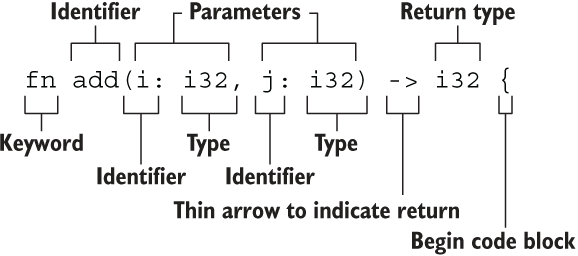

# 基础入门

## 2.1 变量绑定与解构

### 变量绑定

```rust
let a = "hello world";
```

这里就涉及 Rust 最核心的原则——所有权，简单来讲，任何内存对象都是有主人的，而且一般情况下完全属于它的主人，绑定就是把这个对象绑定给一个变量，让这个变量成为它的主人。


### 变量的可变性

Rust 语言中，变量可以是可变的也可以是不可变的。将本身无需改变的变量声明为不可变在运行期会避免一些多余的 runtime 检查，实现性能上的提升。

Rust 的变量在默认情况下是不可变的。前文提到，这是 Rust 团队为我们精心设计的语言特性之一，让我们编写的代码更安全，性能也更好。可以通过 mut 关键字让变量变为可变的，让设计更灵活。在 Rust 中，可变性很简单，只要在变量名前加一个 mut 即可。

```rust
fn main() {
    let x = 5;
    println!("x = {}", x);
    x = 6;                  // error!
    let mut y = 6;
    println!("y = {}", y);
    y = 7;
    println!("y = {}", y);
}
```

选择可变还是不可变，更多的还是取决于你的使用场景，例如不可变可以带来安全性，但是丧失了灵活性和性能（如果你要改变，就要重新创建一个新的变量，这里涉及到内存对象的再分配）。而可变变量最大的好处就是使用上的灵活性和性能上的提升。

例如，在使用大型数据结构或者热点代码路径（被大量频繁调用）的情形下，在同一内存位置更新实例可能比复制并返回新分配的实例要更快。使用较小的数据结构时，通常创建新的实例并以更具函数式的风格来编写程序，可能会更容易理解，所以值得以较低的性能开销来确保代码清晰。

### 用下划线开头忽略未使用的变量

```rust
let _x = 5;
```

这是告诉 Rust 这里的变量目前是不会使用的，让编译器不要警告。

也可以通过声明实现：

```rust
#[allow(unused_variables)]
fn main() {
    let x = 1; 
}
```

### 变量解构

let 表达式不仅仅用于变量的绑定，还能进行复杂变量的解构：从一个相对复杂的变量中，匹配出该变量的一部分内容。

```rust
fn main() {
    let (a, mut b): (bool,bool) = (true, false);
    // a = true,不可变; b = false，可变
    println!("a = {:?}, b = {:?}", a, b);

    b = true;
    assert_eq!(a, b);
}
```

#### 解构式赋值

```rust
struct Struct {
    e: i32
}

fn main() {
    let (a, b, c, d, e);

    (a, b) = (1, 2);
    [c, .., d, _] = [1, 2, 3, 4, 5];
    Struct { e, .. } = Struct { e: 5 };

    assert_eq!([1, 2, 1, 4, 5], [a, b, c, d, e]);
}
```

这段代码展示了 Rust 中 **解构赋值（destructuring assignment）** 的多种写法，包括：

* 元组解构
* 数组解构（带 `..`）
* 结构体解构（带 `..`）
* 占位符 `_` 的用法


1. 元组解构赋值

    ```rust
    (a, b) = (1, 2);
    ```

    这是元组解构：将 `(1, 2)` 赋值给 `a = 1`、`b = 2`。


2. 数组解构赋值（带 `..`）

    ```rust
    [c, .., d, _] = [1, 2, 3, 4, 5];
    ```

    这一句使用了数组模式匹配：

    * `[c, .., d, _]` 表示：

    * `c` 是第一个元素
    * `..` 忽略中间若干个元素
    * `d` 是倒数第二个
    * `_` 忽略最后一个（常用于忽略变量）

    对应赋值 `[1, 2, 3, 4, 5]`：


3. 结构体解构赋值（带 `..`）

    ```rust
    Struct { e, .. } = Struct { e: 5 };
    ```

    这是结构体解构的一种写法，表示：

    * 只取出字段 `e`，并赋值给变量 `e`；
    * `..` 表示**忽略其他字段**（尽管这里没别的字段，但 `..` 是必须的语法）。

    所以 `e = 5`


| 解构类型  | 写法                 | 含义                           |
| ----- | ------------------ | ---------------------------- |
| 元组解构  | `(a, b) = (1, 2)`  | 将元组元素分别赋值                    |
| 数组解构  | `[c, .., d, _]`    | 开头 `c`，结尾前一个 `d`，最后一个 `_` 忽略 |
| 结构体解构 | `Struct { e, .. }` | 提取字段 `e`，忽略其余字段              |
| `_`   | 占位符                | 忽略一个值不绑定变量                   |
| `..`  | 展开/忽略其余部分          | 适用于数组和结构体                    |


### 变量和常量之间的差异

- 常量不允许使用 mut。常量不仅仅默认不可变，而且自始至终不可变，因为常量在编译完成后，已经确定它的值。
- 常量使用 const 关键字而不是 let 关键字来声明，并且值的类型必须标注。

下面是一个常量声明的例子，其常量名为 MAX_POINTS，值设置为 100,000。（Rust 常量的命名约定是全部字母都使用大写，并使用下划线分隔单词，另外对数字字面量可插入下划线以提高可读性）：

```rust
const MAX_POINTS: u32 = 100_000;
```

常量可以在任意作用域内声明，包括全局作用域，在声明的作用域内，常量在程序运行的整个过程中都有效。对于需要在多处代码共享一个不可变的值时非常有用，例如游戏中允许玩家赚取的最大点数或光速。

!!! note
    在实际使用中，最好将程序中用到的硬编码值都声明为常量，对于代码后续的维护有莫大的帮助。如果将来需要更改硬编码的值，你也只需要在代码中更改一处即可。

### 变量遮蔽

Rust 允许声明相同的变量名，在后面声明的变量会遮蔽掉前面声明的。

```rust
fn main() {
    let x = 5;
    // 在main函数的作用域内对之前的x进行遮蔽
    let x = x + 1;

    {
        // 在当前的花括号作用域内，对之前的x进行遮蔽
        let x = x * 2;
        println!("The value of x in the inner scope is: {}", x);
    }

    println!("The value of x is: {}", x);
}
```

这和 mut 变量的使用是不同的，第二个 let 生成了完全不同的新变量，两个变量只是恰好拥有同样的名称，涉及一次**内存对象的再分配** ，而 mut 声明的变量，可以修改同一个内存地址上的值，并不会发生内存对象的再分配，性能要更好。

变量遮蔽的用处在于，如果你在某个作用域内无需再使用之前的变量（在被遮蔽后，无法再访问到之前的同名变量），就可以重复的使用变量名字，而不用绞尽脑汁去想更多的名字。

## 2.2 基本类型

Rust 每个值都有其确切的数据类型，总的来说可以分为两类：**基本类型**和**复合类型**。 基本类型意味着它们往往是一个最小化原子类型，无法解构为其它类型（一般意义上来说），由以下组成：

- 数值类型：有符号整数 (i8, i16, i32, i64, isize)、 无符号整数 (u8, u16, u32, u64, usize) 、浮点数 (f32, f64)、以及有理数、复数
- 字符串：字符串字面量和字符串切片 &str
- 布尔类型：true 和 false
- 字符类型：表示单个 Unicode 字符，存储为 4 个字节
- 单元类型：即 () ，其唯一的值也是 ()

#### 类型推导及标注

Rust 是一门静态类型语言，也就是编译器必须在编译期知道我们所有变量的类型，但这不意味着你需要为每个变量指定类型，因为 Rust 编译器很聪明，它可以**根据变量的值和上下文中的使用方式来自动推导出变量的类型**，同时编译器也不够聪明，在某些情况下，它无法推导出变量类型，需要手动去给予一个类型标注。

```rust
#![allow(unused)]
fn main() {
let guess = "42".parse().expect("Not a number!");
}
```

.parse() 是一个泛型方法，它的行为取决于你期望它解析成什么类型。虽然 "42" 是字符串（&str 类型），但 Rust 标准库中有许多类型（比如 i32、f64 等）都为 .parse() 提供了实现 —— 只要你告诉它“我要解析成什么”。

这段代码的目的是将字符串 "42" 进行解析，而编译器在这里无法推导出我们想要的类型：整数？浮点数？字符串？因此编译器会报错。

```rust
#![allow(unused)]
fn main() {
let guess: i32 = "42".parse().expect("Not a number!");
}
```

### 2.2.1 数值类型

#### 整数类型

| 长度         | 有符号类型 | 无符号类型 |
|--------------|------------|------------|
| 8 位         | `i8`       | `u8`       |
| 16 位        | `i16`      | `u16`      |
| 32 位        | `i32`      | `u32`      |
| 64 位        | `i64`      | `u64`      |
| 128 位       | `i128`     | `u128`     |
| 视架构而定    | `isize`    | `usize`    |


isize 和 usize 类型取决于程序运行的计算机 CPU 类型： 若 CPU 是 32 位的，则这两个类型是 32 位的，同理，若 CPU 是 64 位，那么它们则是 64 位。

整型字面量可以用下表的形式书写：

| 数字字面量	| 示例        |
|--------------|------------|
| 十进制         | 98_222       |
| 十六进制        | 0xff     |
| 八进制       | 0o77     |
| 二进制        | 0b1111_0000     |
| 字节 (仅限于 u8)  | b'A'     |


**整型溢出**

假设有一个 u8 ，它可以存放从 0 到 255 的值。那么当你将其修改为范围之外的值，比如 256，则会发生整型溢出。关于这一行为 Rust 有一些有趣的规则：当在 debug 模式编译时，Rust 会检查整型溢出，若存在这些问题，则使程序在编译时 panic(崩溃,Rust 使用这个术语来表明程序因错误而退出)。

在当使用 --release 参数进行 release 模式构建时，Rust 不检测溢出。相反，当检测到整型溢出时，Rust 会按照补码循环溢出（two’s complement wrapping）的规则处理。简而言之，大于该类型最大值的数值会被补码转换成该类型能够支持的对应数字的最小值。比如在 u8 的情况下，256 变成 0，257 变成 1，依此类推。程序不会 panic，但是该变量的值可能不是你期望的值。依赖这种默认行为的代码都应该被认为是错误的代码。
    
**注意，这里只适用于运行时溢出（runtime overflow），不适用于字面值溢出（literal overflow）！**
```rust
let a: u8 = 256; // 错误：256 是超出 u8 范围的字面值
```

**这是编译期字面量溢出，Rust 在编译阶段就能确定这个错误，因此它不管你是 debug 模式还是 release 模式，都会直接拒绝编译。**
```rust
    fn get_val() -> u8 {
        255
    }

    fn main() {
        let a = get_val();
        let b = a + 1;  // debug 模式下 panic，release 模式下 wrap
        println!("{}", b);
    }
```

要显式处理可能的溢出，可以使用标准库针对原始数字类型提供的这些方法：

- 使用 wrapping_* 方法在所有模式下都按照补码循环溢出规则处理，例如 wrapping_add
- 如果使用 checked_* 方法时发生溢出，则返回 None 值
- 使用 overflowing_* 方法返回该值和一个指示是否存在溢出的布尔值
- 使用 saturating_* 方法，可以限定计算后的结果不超过目标类型的最大值或低于最小值，例如:
    ```rust
        assert_eq!(100u8.saturating_add(1), 101);
        assert_eq!(u8::MAX.saturating_add(127), u8::MAX);
    ```

下面是一个演示wrapping_*方法的示例：


```rust
    fn main() {
        let a : u8 = 255;
        let b = a.wrapping_add(20);
        println!("{}", b);  // 19
    }
```

#### 浮点类型

Rust 中浮点类型数字也有两种基本类型： f32 和 f64，分别为 32 位和 64 位大小。默认浮点类型是 f64，在现代的 CPU 中它的速度与 f32 几乎相同，但精度更高。

浮点数根据 [IEEE-754 标准](https://note.xiu-zju.me/courses/jz/3/3/#35-floating-point-numbers)实现。f32 类型是单精度浮点型，f64 为双精度。


**浮点数陷阱**

浮点数由于底层格式的特殊性，导致了如果在使用浮点数时不够谨慎，就可能造成危险，有两个原因：

- **浮点数往往是你想要数字的近似表达** 浮点数类型是基于二进制实现的，但是我们想要计算的数字往往是基于十进制，例如 0.1 在二进制上并不存在精确的表达形式，但是在十进制上就存在。这种不匹配性导致一定的歧义性，更多的，虽然浮点数能代表真实的数值，但是由于底层格式问题，它往往受限于定长的浮点数精度，如果你想要表达完全精准的真实数字，只有使用无限精度的浮点数才行

- **浮点数在某些特性上是反直觉的** 例如大家都会觉得浮点数可以进行比较，对吧？是的，它们确实可以使用 >，>= 等进行比较，但是在某些场景下，这种直觉上的比较特性反而会害了你。因为 f32 ， f64 上的比较运算实现的是 std::cmp::PartialEq 特征(类似其他语言的接口)，但是并没有实现 std::cmp::Eq 特征，但是后者在其它数值类型上都有定义，说了这么多，可能大家还是云里雾里，用一个例子来举例：

!!! example "例子"
    Rust 的 HashMap 数据结构，是一个 KV 类型的 Hash Map 实现，它对于 K 没有特定类型的限制，但是要求能用作 K 的类型必须实现了 std::cmp::Eq 特征，因此这意味着你无法使用浮点数作为 HashMap 的 Key，来存储键值对，但是作为对比，Rust 的整数类型、字符串类型、布尔类型都实现了该特征，因此可以作为 HashMap 的 Key。

为了避免上面说的两个陷阱，你需要遵守以下准则：

- 避免在浮点数上测试相等性
- 当结果在数学上可能存在未定义时，需要格外的小心


#### NaN

对于数学上未定义的结果，例如对负数取平方根 -42.1.sqrt() ，会产生一个特殊的结果：Rust 的浮点数类型使用 NaN (not a number) 来处理这些情况。

所有跟 NaN 交互的操作，都会返回一个 NaN，而且 NaN 不能用来比较。出于防御性编程的考虑，可以使用 is_nan() 等方法，可以用来判断一个数值是否是 NaN 。

> 有点像数据库的空值？

#### 数字运算

符合直觉。

#### 位运算

符合直觉。

对于移位运算，Rust 会检查它是否超出该整型的位数范围，如果超出，则会报错 overflow。比如，一个 8 位的整型，如果试图移位 8 位，就会报错，但如果移位 7 位就不会。Rust 这样做的理由也很简单，如果移位太多，那么这个移位后的数字就是全 0 或者全 1，所以移位操作不如直接写 0 或者 -1，这很可能意味着这里的代码是有问题的。需要注意的是，不论 debug 模式还是 release 模式，Rust 都会检查溢出。

```rust
fn main() {
   let a: u8 = 255;
   let b = a>>7; // ok
   let b = a<<7; // ok
   let b = a>>8; // overflow
   let b = a<<8; // overflow
}
```

#### 序列（range）
Rust 提供了一个非常简洁的方式，用来生成连续的数值，例如 1..5，生成从 1 到 4 的连续数字，不包含 5 ；1..=5，生成从 1 到 5 的连续数字，包含 5，它的用途很简单，常常用于循环中：

```rust
for i in 1..=5 {
    println!("{}",i);
}
```

序列只允许用于数字或字符类型，原因是：它们可以连续，同时编译器在编译期可以检查该序列是否为空，字符和数字值是 Rust 中仅有的可以用于判断是否为空的类型。如下是一个使用字符类型序列的例子：

```rust
for i in 'a'..='z' {
    println!("{}",i);
}
```


```rust
use std::ops::{Range, RangeInclusive};
fn main() {
    assert_eq!((1..5), Range{ start: 1, end: 5 });
    assert_eq!((1..=5), RangeInclusive::new(1, 5));
}
```

#### 使用 As 完成类型转换
Rust 中可以使用 As 来完成一个类型到另一个类型的转换，其最常用于将原始类型转换为其他原始类型，但是它也可以完成诸如将指针转换为地址、地址转换为指针以及将指针转换为其他指针等功能。

#### 有理数和复数

Rust 的标准库相比其它语言，准入门槛较高，因此有理数和复数并未包含在标准库中：

- 有理数和复数
- 任意大小的整数和任意精度的浮点数
- 固定精度的十进制小数，常用于货币相关的场景

按照以下步骤来引入 `num` 库：

1. 创建新工程 `cargo new complex-num && cd complex-num`
2. 在 `Cargo.toml` 中的 `[dependencies]` 下添加一行 `num = "0.4.0"`
3. 将 `src/main.rs` 文件中的 `main` 函数替换为下面的代码
4. 运行 `cargo run`

```rust
use num::complex::Complex;

 fn main() {
   let a = Complex { re: 2.1, im: -1.2 };
   let b = Complex::new(11.1, 22.2);
   let result = a + b;

   println!("{} + {}i", result.re, result.im)
 }
```

#### 总结

之前提到了过 Rust 的数值类型和运算跟其他语言较为相似，但是实际上，除了语法上的不同之外，还是存在一些差异点：

- **Rust 拥有相当多的数值类型**. 因此你需要熟悉这些类型所占用的字节数，这样就知道该类型允许的大小范围以及你选择的类型是否能表达负数
- **类型转换必须是显式的**. Rust 永远也不会偷偷把你的 16bit 整数转换成 32bit 整数
- **Rust 的数值上可以使用方法**. 例如你可以用以下方法来将 `13.14` 取整：`13.14_f32.round()`，在这里我们使用了类型后缀，因为编译器需要知道 `13.14` 的具体类型

### 2.2.2 字符、布尔、单元类型

#### 字符类型

**所有的 Unicode 值**都可以作为 Rust 字符，包括单个的中文、日文、韩文、emoji 表情符号等等，都是合法的字符类型。Unicode 值的范围从 U+0000 ~ U+D7FF 和 U+E000 ~ U+10FFFF。由于 Unicode 都是 4 个字节编码，因此字符类型也是占用 4 个字节。Rust 的字符只能用 '' 来表示， "" 是留给字符串的。

#### 布尔类型

true 和 false。布尔值占用内存的大小为 1 个字节。

#### 单元类型

() 是 Rust 中“无返回值”的标志，它本身是一个合法的类型，叫“单元类型”，并且它只有一个值，那就是 () 本身。

Rust 是强类型语言，一切都有类型。就算你什么都不返回，编译器也要给它一个“类型”来标注：这时候用的就是 () 类型。

可以把它看作 Rust 中的“空值的显式表达”，不像 C/C++ 里直接忽略返回值，也不像 Java 用 void。

!!! note "应用"
    可以用 () 作为 map 的值，表示我们不关注具体的值，只关注 key。可以作为一个值用来占位，但是完全不占用任何内存。


### 2.2.3 语句与表达式

Rust 的函数体是由一系列语句组成，最后由一个表达式来返回值，例如：

```rust
fn add_with_extra(x: i32, y: i32) -> i32 {
    let x = x + 1; // 语句
    let y = y + 5; // 语句
    x + y // 表达式
}
```

语句会执行一些操作但是不会返回一个值，而表达式会在求值后返回一个值，因此在上述函数体的三行代码中，前两行是语句，最后一行是表达式。

#### 语句

语句完成了具体的操作，但是并没有返回值。例如 let 语句。

#### 表达式

表达式会进行求值，然后返回一个值。例如 5 + 6，在求值后，返回值 11，因此它就是一条表达式。

表达式可以成为语句的一部分，例如 let y = 6 中，6 就是一个表达式，它在求值后返回一个值 6（有些反直觉，但是确实是表达式）。

调用一个函数是表达式，因为会返回一个值，调用宏也是表达式，用花括号包裹最终返回一个值的语句块也是表达式，总之，能返回值，它就是表达式。

```rust
fn main() {
    let y = {
        let x = 3;
        x + 1
    };
    println!("The value of y is {}.", y);
}
```

表达式不能包含分号。这一点非常重要，一旦你在表达式后加上分号，它就会变成一条语句，再也不会返回一个值!

最后，表达式如果不返回任何值，会隐式地返回一个 () 。

### 2.2.4 函数



- 函数名和变量名使用蛇形命名法(snake case)，例如 fn add_two() {}
- 函数的位置可以随便放，Rust 不关心我们在哪里定义了函数，只要有定义即可
- 每个函数参数都需要标注类型

#### 永不返回的发散函数

当用 ! 作函数返回类型的时候，表示该函数永不返回( diverging functions )，特别的，这种语法往往用做会导致程序崩溃的函数。

- 这个函数永远不会返回正常的值
- 也就是说，它**要么 panic，要么无限循环，要么退出程序**

```rust
fn dead_end() -> ! {
    panic!("穷途末路！");
}
```

```rust
fn forever() -> ! {
    loop {
        println!("我永远在这！");
    }
}
```

!!! warning "关于 return"
    ```rust
    fn plus_or_minus(x: i32) -> i32 {
        if x > 5 {
            x - 5 //  这个是一个表达式，但 `if` 没有 else 分支
        }
        x + 5
    }
    ```
    这里编译器会报错，这是因为 if 是表达式而不是语句，需要有返回值。这里 if 没有写 else 分支，Rust 需要知道这个 if 的整体值是什么，但如果条件不成立，它该返回什么？没写 else，它就默认返回 ()（unit）。所以实际上代码会变成：
    ```rust
    let tmp = if x > 5 {
        x - 5   // i32
    } else {
        ()      // unit
    };
    ```
    就报错了：i32 和 () 不匹配。所以我们需要 return 来提前返回。


## 2.3 所有权与借用

### 2.3.1 所有权

Rust 通过所有权来管理内存，编译器在编译时会根据一系列规则进行检查。对于程序运行期，不会有任何性能上的损失。

#### 栈(Stack)与堆(Heap)

栈和堆的核心目标就是为程序在运行时提供可供使用的内存空间。

**栈**

后进先出。栈中的所有数据都必须占用已知且固定大小的内存空间，假设数据大小是未知的，那么在取出数据时，你将无法取到你想要的数据。

**堆**

与栈不同，对于大小未知或者可能变化的数据，我们需要将它存储在堆上。当向堆上放入数据时，需要请求一定大小的内存空间。操作系统在堆的某处找到一块足够大的空位，把它标记为已使用，并返回一个表示该位置地址的指针，该过程被称为在堆上分配内存，有时简称为 “分配”(allocating)。接着，该指针会被推入栈中，因为指针的大小是已知且固定的，在后续使用过程中，你将通过栈中的指针，来获取数据在堆上的实际内存位置，进而访问该数据。由上可知，堆是一种缺乏组织的数据结构。

**性能比较**

在栈上分配内存比在堆上分配内存要快，因为入栈时操作系统无需进行函数调用（或更慢的系统调用）来分配新的空间，只需要将新数据放入栈顶即可。相比之下，在堆上分配内存则需要更多的工作，这是因为操作系统必须首先找到一块足够存放数据的内存空间，接着做一些记录为下一次分配做准备，如果当前进程分配的内存页不足时，还需要进行系统调用来申请更多内存。 

**所有权与堆栈**

当你的代码调用一个函数时，传递给函数的参数（包括可能指向堆上数据的指针和函数的局部变量）依次被压入栈中，当函数调用结束时，这些值将被从栈中按照相反的顺序依次移除。

因为堆上的数据缺乏组织，因此跟踪这些数据何时分配和释放是非常重要的，否则堆上的数据将产生内存泄漏 —— 这些数据将永远无法被回收。这就是 Rust 所有权系统为我们提供的强大保障。

#### 所有权原则

- Rust 中每一个值都被一个变量所拥有，该变量被称为值的所有者
- 一个值同时只能被一个变量所拥有，或者说一个值只能拥有一个所有者
- 当所有者（变量）离开作用域范围时，这个值将被丢弃(drop)

#### 变量绑定背后的数据交互

**转移所有权**

先来看一段代码：

```rust
let x = 5;
let y = x;
```

这段代码**并没有发生所有权的转移**，原因很简单： 代码首先将 5 绑定到变量 x，接着拷贝 x 的值赋给 y，最终 x 和 y 都等于 5，因为整数是 Rust 基本数据类型，是固定大小的简单值，因此这两个值都是通过自动拷贝的方式来赋值的，都被存在栈中，完全无需在堆上分配内存。

整个过程中的赋值都是通过值拷贝的方式完成（发生在栈中），因此并不需要所有权转移。

!!! warning "疑问"
    可能有同学会有疑问：这种拷贝不消耗性能吗？实际上，这种栈上的数据足够简单，而且拷贝非常非常快，只需要复制一个整数大小（i32，4 个字节）的内存即可，因此在这种情况下，拷贝的速度远比在堆上创建内存来得快的多。实际上，上一章我们讲到的 Rust 基本类型都是通过自动拷贝的方式来赋值的，就像上面代码一样。

但是当涉及到非基本类型（不是储存在栈上）的时候，这里就不能自动拷贝，例如存放在堆上的 String。

实际上， String 类型是一个复杂类型，由存储在栈中的**堆指针**、**字符串长度**、**字符串容量**共同组成，其中堆指针是最重要的，它指向了真实存储字符串内容的堆内存。容量是堆内存分配空间的大小，长度是目前已经使用的大小。

```rust
let s1 = String::from("hello");
let s2 = s1;
```

Rust 这样解决问题：当 s1 被赋予 s2 后，Rust 认为 s1 **不再有效**，因此也无需在 s1 离开作用域后 drop 任何东西，这就是把所有权从 s1 转移给了 s2，**s1 在被赋予 s2 后就马上失效了**。

**clone 深拷贝**

Rust 永远也不会自动创建数据的 “深拷贝”。因此，任何自动的复制都不是深拷贝，可以被认为对运行时性能影响较小。

如果我们确实需要深度复制 String 中堆上的数据，而不仅仅是栈上的数据，可以使用一个叫做 clone 的方法。

```rust
let s1 = String::from("hello");
let s2 = s1.clone();

println!("s1 = {}, s2 = {}", s1, s2);
```

如果代码性能无关紧要，例如初始化程序时或者在某段时间只会执行寥寥数次时，你可以使用 clone 来简化编程。但是对于执行较为频繁的代码（热点路径），使用 clone 会极大的降低程序性能，需要小心使用！

!!! note "热点路径"
    热点路径 = 程序运行中频繁执行的核心代码段，影响整体性能的“热点”。
    在这些地方，clone 代价大、应谨慎使用；非热点路径中可以放心使用 clone 来提升代码可读性和开发效率。

**copy 浅拷贝**

浅拷贝只发生在栈上，因此性能很高，在日常编程中，浅拷贝无处不在。

像整型这样的基本类型在编译时是已知大小的，会被存储在**栈**上，所以拷贝其实际的值是快速的。这意味着没有理由在创建变量 y 后使 x 无效（x、y 都仍然有效）。换句话说，这里没有深浅拷贝的区别，因此这里调用 clone 并不会与通常的浅拷贝有什么不同，我们可以不用管它（可以理解成在栈上做了深拷贝）。

这里可以给出一个通用的规则：**任何基本类型的组合**可以 Copy ，**不需要分配内存或某种形式资源的类型**是可以 Copy 的。如下是一些 Copy 的类型：

- 所有整数类型，比如 u32
- 布尔类型，bool，它的值是 true 和 false
- 所有浮点数类型，比如 f64
- 字符类型，char
- 元组，当且仅当其包含的类型也都是 Copy 的时候。比如，(i32, i32) 是 Copy 的，但 (i32, String) 就不是
- 不可变引用 &T 。但是注意：**可变引用** &mut T 是不可以 Copy的

#### 函数的传值与返回

```rust
fn main() {
    let s = String::from("hello");  // s 进入作用域

    takes_ownership(s);             // s 的值移动到函数里 ...
                                    // ... 所以到这里不再有效
    println!("{}", s);              // error!

    let x = 5;                      // x 进入作用域

    makes_copy(x);                  // x 应该移动函数里，
                                    // 但 i32 是 Copy 的，所以在后面可继续使用 x

} // 这里, x 先移出了作用域，然后是 s。但因为 s 的值已被移走，
  // 所以不会有特殊操作

fn takes_ownership(some_string: String) { // some_string 进入作用域
    println!("{}", some_string);
} // 这里，some_string 移出作用域并调用 `drop` 方法。占用的内存被释放

fn makes_copy(some_integer: i32) { // some_integer 进入作用域
    println!("{}", some_integer);
} // 这里，some_integer 移出作用域。不会有特殊操作
```

所有权很强大，避免了内存的不安全性，但是也带来了一个新麻烦：**总是把一个值传来传去来使用它**。传入一个函数，很可能还要从该函数传出去，结果就是语言表达变得非常啰嗦，幸运的是，Rust 提供了新功能解决这个问题。
