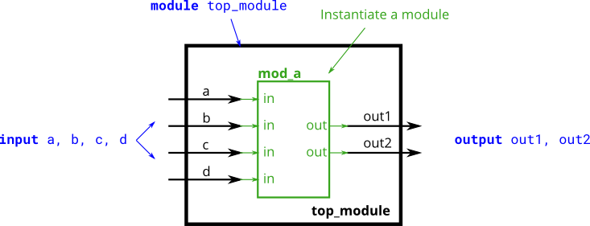
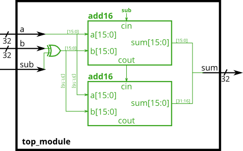

## Implicit nets
Implicit nets are often a source of hard-to-detect bugs. In Verilog, net-type signals can be implicitly created by an assign statement or by attaching something undeclared to a module port. Implicit nets are always one-bit wires and causes bugs if you had intended to use a vector. Disabling creation of implicit nets can be done using the `default_nettype none directive.

``` verilog
wire [2:0] a, c;   // Two vectors
assign a = 3'b101;  // a = 101
assign b = a;       // b =   1  implicitly-created wire
assign c = b;       // c = 001  <-- bug
my_module i1 (d,e); // d and e are implicitly one-bit wide if not declared.
                    // This could be a bug if the port was intended to be a vector.
```

Adding `default_nettype none would make the second line of code an error, which makes the bug more visible.

##Unpacked vs. Packed Arrays
You may have noticed that in declarations, the vector indices are written before the vector name. This declares the "packed" dimensions of the array, where the bits are "packed" together into a blob (this is relevant in a simulator, but not in hardware). The unpacked dimensions are declared after the name. They are generally used to declare memory arrays. Since ECE253 didn't cover memory arrays, we have not used packed arrays in this course. See http://www.asic-world.com/systemverilog/data_types10.html for more details.

```verilog
reg [7:0] mem [255:0];   // 256 unpacked elements, each of which is a 8-bit packed vector of reg.
reg mem2 [28:0];         // 29 unpacked elements, each of which is a 1-bit reg.
```

## | and ||

```verilog
module top_module(
	input [2:0] a, 
	input [2:0] b, 
	output [2:0] out_or_bitwise,
	output out_or_logical,
	output [5:0] out_not
);
	
	assign out_or_bitwise = a | b;
	assign out_or_logical = a || b;

	assign out_not[2:0] = ~a;	// Part-select on left side is o.
	assign out_not[5:3] = ~b;	//Assigning to [5:3] does not conflict with [2:0]
	
endmodule
```
## The concatenation operator
The concatenation operator allowed concatenating together vectors to form a larger vector. But sometimes you want the same thing concatenated together many times, and it is still tedious to do something like assign a = {b,b,b,b,b,b};. The replication operator allows repeating a vector and concatenating them together:

{num{vector}}
This replicates vector by num times. num must be a constant. Both sets of braces are required.

Examples:
```verilog
{5{1'b1}}           // 5'b11111 (or 5'd31 or 5'h1f)
{2{a,b,c}}          // The same as {a,b,c,a,b,c}
{3'd5, {2{3'd6}}}   // 9'b101_110_110. It's a concatenation of 101 with
                    // the second vector, which is two copies of 3'b110.
```
One common place to see a replication operator is when sign-extending a smaller number to a larger one, while preserving its signed value. This is done by replicating the sign bit (the most significant bit) of the smaller number to the left. For example, sign-extending 4'b0101 (5) to 8 bits results in 8'b00000101 (5), while sign-extending 4'b1101 (-3) to 8 bits results in 8'b11111101 (-3).

## Module pos & Module name

### pos

```verilog
module top_module ( 
    input a, 
    input b, 
    input c,
    input d,
    output out1,
    output out2
);
    mod_a mod_a(out1,out2,a,b,c,d);
endmodule
```

### name

```verilog
module top_module ( 
    input a, 
    input b, 
    input c,
    input d,
    output out1,
    output out2
);
    mod_a aaa (.out1(out1),.out2(out2),.in1(a),.in2(b),.in3(c),.in4(d));
endmodule
```
## Full Adder
```verilog
module full_adder(
    input a,    
    input b,    
    input cin,  // 输入进位
    output sum, 
    output cout // 输出进位
);
    assign sum = a ^ b ^ cin;      // 异或操作得到和
    assign cout = (a & b) | (cin & (a ^ b)); // 与或操作得到进位
endmodule
```
!!! note
    sum = a ^ b ^ cin       
    cout = a & b | a & cin | b & cin = (a & b) | (cin & (a ^ b))


## Substractor
An adder-subtractor can be built from an adder by optionally negating one of the inputs, which is equivalent to inverting the input then adding 1. The net result is a circuit that can do two operations: (a + b + 0) and (a + ~b + 1). See Wikipedia if you want a more detailed explanation of how this circuit works.

Use a 32-bit wide XOR gate to invert the b input whenever sub is 1.

```verilog
module top_module(
    input [31:0] a,
    input [31:0] b,
    input sub,
    output [31:0] sum
);
    wire c1;
    wire [31:0] b1;
    assign b1 = b ^ {32{sub}}; //Bitwise inversion
    add16 add1 (.a(a[15:0]),.b(b1[15:0]),.cin(sub),.sum(sum[15:0]),.cout(c1));
    add16 add2 (.a(a[31:16]),.b(b1[31:16]),.cin(c1),.sum(sum[31:16]));
endmodule
```
An XOR gate can also be viewed as a programmable inverter, where one input controls whether the other should be inverted. The following two circuits are both XOR gates: 

## wire and reg
A note on wire vs. reg: The left-hand-side of an assign statement must be a net type (e.g., wire), while the left-hand-side of a procedural assignment (in an always block) must be a variable type (e.g., reg). These types (wire vs. reg) have nothing to do with what hardware is synthesized, and is just syntax left over from Verilog's use as a hardware simulation language.

## Blocking vs. Non-Blocking Assignment
There are three types of assignments in Verilog:

- Continuous assignments (assign x = y;). Can only be used when not inside a procedure ("always block").
- Procedural blocking assignment: (x = y;). Can only be used inside a procedure.
- Procedural non-blocking assignment: (x <= y;). Can only be used inside a procedure.

In a **combinational** always block, use **blocking** assignments. In a **clocked** always block, use **non-blocking** assignments. A full understanding of why is not particularly useful for hardware design and requires a good understanding of how Verilog simulators keep track of events. Not following this rule results in extremely hard to find errors that are both non-deterministic and differ between simulation and synthesized hardware.

## Always if
An if statement usually creates a 2-to-1 multiplexer, selecting one input if the condition is true, and the other input if the condition is false.


```verilog
always @(*) begin
    if (condition) begin
        out = x;
    end
    else begin
        out = y;
    end
end
```
This is equivalent to using a continuous assignment with a conditional operator:
```verilog
assign out = (condition) ? x : y;
```
However, the procedural if statement provides a new way to make mistakes. The circuit is combinational only if out is always assigned a value.

## How to avoid making latches
Syntactically-correct code does not necessarily result in a reasonable circuit (combinational logic + flip-flops). The usual reason is: "What happens in the cases other than those you specified?". Verilog's answer is: Keep the outputs unchanged.

This behaviour of "keep outputs unchanged" means the current state needs to be remembered, and thus produces a latch. Combinational logic (e.g., logic gates) cannot remember any state. Watch out for Warning (10240): ... inferring latch(es)" messages. Unless the latch was intentional, it almost always indicates a bug. Combinational circuits must have a value assigned to all outputs under all conditions. This usually means you always need else clauses or a default value assigned to the outputs.

## Always case
Case statements in Verilog are nearly equivalent to a sequence of if-elseif-else that compares one expression to a list of others. Its syntax and functionality differs from the switch statement in C.
```verilog
always @(*) begin     // This is a combinational circuit
    case (in)
      1'b1: begin 
               out = 1'b1;  // begin-end if >1 statement
            end
      1'b0: out = 1'b0;
      default: out = 1'bx;
    endcase
end
```
- The case statement begins with case and each "case item" ends with a colon. There is no "switch".
- Each case item can execute exactly one statement. This makes the "break" used in C unnecessary. But this means that if you need more than one statement, you must use begin ... end.
- Duplicate (and partially overlapping) case items are permitted. The first one that matches is used. C does not allow duplicate case items.

## Always casez
```verilog
always @(*) begin
    casez (in[3:0])
        4'bzzz1: out = 0;   // in[3:1] can be anything
        4'bzz1z: out = 1;
        4'bz1zz: out = 2;
        4'b1zzz: out = 3;
        default: out = 0;
    endcase
end
```

## Reduction
You're already familiar with bitwise operations between two values, e.g., a & b or a ^ b. Sometimes, you want to create a wide gate that operates on all of the bits of one vector, like (a[0] & a[1] & a[2] & a[3] ... ), which gets tedious if the vector is long.

The reduction operators can do AND, OR, and XOR of the bits of a vector, producing one bit of output:

& a[3:0]     // AND: a[3]&a[2]&a[1]&a[0]. Equivalent to (a[3:0] == 4'hf)
| b[3:0]     // OR:  b[3]|b[2]|b[1]|b[0]. Equivalent to (b[3:0] != 4'h0)
^ c[2:0]     // XOR: c[2]^c[1]^c[0]
These are unary operators that have only one operand (similar to the NOT operators ! and ~). You can also invert the outputs of these to create NAND, NOR, and XNOR gates, e.g., (~& d[7:0]).

## Error-prone points
```verilog
module top_module( 
    input [254:0] in,
    output [7:0] out );
    integer i;
    always @(*) begin
        out = 0;
        for(i = 0; i < 255; i = i + 1) begin
            if(in[i] == 1) out=out+ 1;
        end
    end
endmodule
```
